# Rúnica · Documento integrado

Edición de referencia 4.1, ampliada por los checkpoints 4.2. Estado vigente en ESTADO_ACTUAL.md. Archivo generado: editar capítulos y JSON fuente y ejecutar `herramientas/generar.py`.

**Resultado vigente:** no hay un dispositivo M2/R1 completamente derivado. Los capítulos 20–21 derivan la interfaz y el límite capilar del mismo M2. El tubo libre continúa siendo longitudinalmente inestable; no hay un terminal físico ni una preparación completa demostrados. Empieza por [M2_RESULTADO.md](M2_RESULTADO.md) para conocer la evidencia y sus límites.

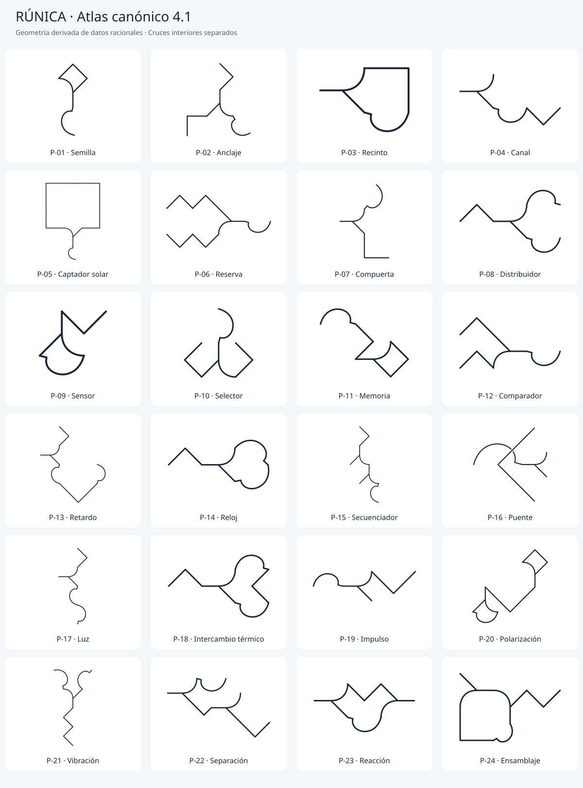

---

# Rúnica — Tratado técnico y especificación operacional

Base conceptual conservada de la edición 3.0.0; alcance revisado en M2 4.1.0.

La extensión M2, desarrollada en los capítulos de correspondencia y compleción escalar, añade un mediador real común y reemplaza el potencial sextico como descripción escalar principal; el sextico se conserva como aproximación M1 y referencia de ensayos. Los valores R1 son metas operacionales.

Este tratado reúne la runodinámica propuesta, las leyes operacionales y el repertorio de veinticuatro primordiales. Las afirmaciones se clasifican con la taxonomía del capítulo 22: definición, hipótesis, aproximación, resultado derivado, analítico, numérico, validación delimitada, objetivo de diseño o problema abierto. Los antiguos postulados son hipótesis constitutivas y una verificación reducida no demuestra un dispositivo. Los objetivos cuantitativos R1 definen una realización de referencia; no representan mediciones. La correspondencia completa entre esa realización y la acción microscópica no está demostrada. Los ensayos incluidos verifican geometría, ecuaciones reducidas y balances bajo sus hipótesis.

Como objetivo de interfaz, la operación común se plantea con una instrucción breve: trazar o llamar una receta, identificar el objetivo, elegir una consigna y activar. La instalación administra suministro, apoyo, información y evacuación. La potencia se amplía mediante infraestructura, paralelismo y recuperación.

**Autoridad de datos.** `datos/geometria.json` contiene las piezas y transformaciones racionales; `datos/parametros.json`, las magnitudes adoptadas; `datos/modelos.json`, los contratos dinámicos; `datos/recetas.json`, las secuencias. Los dibujos, tablas y tratado integrado se regeneran desde esos archivos y los capítulos fuente. Los suplementos precisan objetivos R1 sujetos a contraste. Θ escalar y el registro de evidencia vigente delimitan las afirmaciones físicas; un plano o contrato no demuestra una solución.

## Lectura del tratado

- 1. Qué es una runa
- 2. Leyes universales
- 3. Propiedades constitutivas adoptadas
- 4. Modelo microscópico de referencia
- 5. Régimen inactivo, iniciación y dominio de validez
- 6. Capa física de componentes y redes
- 7. Memoria, lógica y control desde la misma estructura
- 8. Escritura y facilidad de uso
- 9. Energía solar, despliegue y potencia
- 10. Reservas y energía aprovechable
- 11. Fuerza, apoyo, vuelo y movimiento
- 12. Calor, frío y transporte de entropía
- 13. Electromagnetismo, luz, sonido y percepción
- 14. Medición, comunicaciones e información
- 15. Materia ambiental, separación y química
- 16. Ensamblaje, materiales y permanencia
- 17. Procesos nucleares
- 18. Reparación biológica y continuidad funcional
- 19. Contrato común de las primordiales
- 20. Construcción y uso de una operación
- 21. Ejemplos de dimensionamiento bajo hipótesis
- 22. Potencia, eficiencia y escalamiento
- 23. Gravedad y regímenes extremos
- 24. Metrología, validación y aceptación
- 25. Fallos y cierre
- 26. Enseñanza, conocimiento y evolución de la disciplina
- 27. Alcance del cierre técnico

## 1. Qué es una runa

Una runa es una **configuración preparada del campo rúnico que establece condiciones reproducibles de interacción, transporte y control**. La inscripción determina su organización; su estado físico, su alimentación y sus conexiones determinan cómo opera. Un mismo contorno puede permanecer inactivo o sostener una operación según esas condiciones.

El campo posee energía, momento, tensiones y grados de libertad capaces de conservar información. Sus estructuras se acoplan localmente a materia y radiación. Las fuerzas, la iluminación, el calentamiento, la fabricación y la reparación resultan de organizar esas interacciones; no corresponden a campos independientes añadidos para cada aplicación.

La Rúnica estudia el conjunto de fenómenos. La **runodinámica** describe el campo y sus interacciones; la **runografía** describe la escritura y composición de configuraciones; la **ingeniería rúnica** construye dispositivos y procesos. La química, la biología y las demás ciencias intervienen allí donde el campo trabaja sobre sus sistemas.

El Sol es la fuente principal de energía de la civilización rúnica. El aire aporta gases y puede servir como medio de transporte, refrigeración o reacción mecánica. La materia de los productos procede del entorno o de depósitos. Las reservas y redes permiten utilizar energía captada previamente o en otro lugar.

El uso cotidiano se reduce a preparar o recuperar una Semilla, trazar una composición, señalar una referencia físicamente accesible y seleccionar una consigna. La complejidad queda en la estructura preparada, sus plantillas y sus controles locales. Aprender una receta no exige resolver sus ecuaciones; inventarla y mejorarla sí exige conocerlas.

## 2. Leyes universales

Se adoptan ocho principios. Las capacidades de una realización concreta se describen después como propiedades de ingeniería.

| Ley | Enunciado y consecuencia |
|---|---|
| 1. Unidad e interacción | Todas las operaciones utilizan el mismo sector rúnico y un conjunto fijo de interacciones. Todo efecto y toda medida requieren una interacción física local. |
| 2. Conservación | El conjunto de campo, materia, radiación y entorno conserva las cantidades que corresponden a sus simetrías. Las fuerzas y torques transfieren momento lineal y angular; la carga eléctrica y la carga rúnica se contabilizan por separado. |
| 3. Causalidad | Una nueva influencia se propaga dentro del cono causal. La preparación previa permite una respuesta local rápida; las órdenes nuevas conservan su tiempo de viaje. |
| 4. Termodinámica | Los procesos contabilizan energía y entropía. El trabajo aprovechable depende del estado y del entorno. Las pérdidas y la refrigeración tienen destinos físicos. |
| 5. Información física | Toda referencia procede de una señal, una memoria o una regularidad inferible. La información particular ausente de todas las fuentes disponibles no se recupera con una plantilla genérica. |
| 6. Consistencia cuántica | Las probabilidades, la incertidumbre, el ruido y la evolución cuántica siguen siendo aplicables. No existe clonación universal perfecta de un estado cuántico desconocido. |
| 7. Estado y estabilidad | Toda estructura ocupa espacio, contiene energía y responde dinámicamente. Una configuración funcional tiene un dominio de estabilidad, una resolución y una capacidad finitos. |
| 8. Correspondencia | En el régimen inactivo o desacoplado se recupera la física ordinaria con sus parámetros observados. Activar el campo introduce intercambios y modificaciones que deben incluirse explícitamente en el modelo. |

El principio 2, de conservación, se escribe localmente como \(\nabla_\mu T_{\rm total}^{\mu\nu}=0\). En un laboratorio aproximadamente inercial permite los balances habituales de energía y momento. En un espacio-tiempo general no se presupone una energía global única sin las simetrías y condiciones de frontera necesarias.

La reacción ya pertenece a conservación; la necesidad de recursos se deriva de estas leyes; la potencia admisible, el radio de curvatura y la duración de una reserva son propiedades de sus realizaciones. Esta distinción permite mejorar la ingeniería sin reescribir las leyes.

## 3. Propiedades constitutivas adoptadas

El sistema operativo se apoya en cuatro propiedades generales del campo:

1. **Preparabilidad.** Existen estados organizados accesibles mediante una excitación localizada y una secuencia física de preparación. Una primera configuración neutra puede iniciarse sin un artefacto rúnico previo.
2. **Persistencia y composición.** Existen familias de estados localizados y extendidos que conservan forma durante un tiempo útil, de manera pasiva, metaestable o con mantenimiento. Se pueden conectar dentro de dominios compatibles.
3. **Respuesta controlable.** Esos estados permiten guiar excitaciones, conservar estados distinguibles y modular sus interacciones con materia y electromagnetismo.
4. **Escalamiento distribuido.** Se pueden ampliar áreas de captación, volúmenes, terminales y redes. Su crecimiento necesita recursos y tiempo, pero no una cuota universal ligada al cuerpo de una persona.

Estas propiedades no establecen que cualquier curva sea estable, cualquier estado sea accesible o cualquier operación alcance cualquier potencia. Definen las familias de realizaciones admitidas por la especificación. Sus balances y modelos comunes se precisan a continuación.

## 4. Modelo microscópico efectivo M1 y extensión M2

La aproximación M1 utiliza un campo escalar complejo \(\Phi\), \(s=|\Phi|^2\), con firma métrica \((-+++)\). En todos los bloques de teoría microscópica de este tratado, incluidos los capítulos 5 y 10, \(c=\hbar=1\), \([\Phi]=1\) y \([s]=2\) en dimensiones de masa. La acción efectiva candidata es

\[
S=\int d^4x\sqrt{-g}\left[
\frac{M_{\rm Pl}^2}{2}R
-g^{\mu\nu}\partial_\mu\Phi^*\partial_\nu\Phi
-U(s)-\frac14 B(s)F_{\mu\nu}F^{\mu\nu}
-\xi(\mu)sR
\right]+S_m[\psi,A^2(s)g_{\mu\nu},\mathcal A_\mu]+S_{\rm ct}.
\]

\(S_m\) contiene la materia ordinaria y sus corrientes, excluyendo el término cinético electromagnético ya escrito. \(S_{\rm ct}\) reúne las correcciones efectivas compatibles con las simetrías. No constituye una lista de acoplamientos nuevos que puedan elegirse para cada poder.

Se mantienen dos interacciones principales: el acoplamiento conformal a materia, mediante \(A\), y el electromagnético, mediante \(B\). La gravedad recibe el tensor de energía-momento del sistema completo.

Para evitar que ambos acoplamientos deban seguir exactamente la misma curva, se adopta la siguiente parametrización candidata, fija para el modelo:

\[
A(s)=\exp\!\left(a\frac{s}{s+s_A}\right),\qquad
B(s)=\exp\!\left(b\frac{4ss_B}{(s+s_B)^2}\right),\qquad s_A,s_B>0.
\]

\(A(0)=B(0)=1\), y ambas funciones son positivas. La respuesta de \(B\) tiene una región de máxima variación y se reduce en otros regímenes; \(A\) tiene otra escala característica. Esto permite buscar ventanas mecánicas y electromagnéticas diferentes sin añadir una interacción por aplicación. **Los dos efectos siguen correlacionados por el mismo estado \(s\)**. Los diseños calculan ambos; no disponen de dos mandos universales independientes.

No demuestra por sí misma que exista un dominio que permita simultáneamente todas las prestaciones deseadas. Un diseño microscópico deberá exhibir ese dominio con un solo conjunto de parámetros, incluyendo los efectos sobre la materia.

El potencial de referencia es

\[
U(s)=m_r^2s-\lambda s^2+\frac{\kappa}{\Lambda^2}s^3,\qquad
\lambda,\kappa>0,\qquad 0<\lambda^2\Lambda^2<4\kappa m_r^2.
\]

Cada término tiene dimensión cuatro. El mínimo de \(U/s\) está en

\[
s_0=\frac{\lambda\Lambda^2}{2\kappa},\qquad
\omega_{\min}^2=m_r^2-\frac{\lambda^2\Lambda^2}{4\kappa}>0.
\]

Esta forma permite investigar condensados ligados con carga conservada. No convierte automáticamente una red de trazos en un solitón.

La simetría global \(\Phi\mapsto e^{i\alpha}\Phi\) proporciona, para el término cinético mostrado,

\[
j_r^\mu=i(\Phi^*\nabla^\mu\Phi-\Phi\nabla^\mu\Phi^*),
\quad \nabla_\mu j_r^\mu=0,\quad
Q_r=\int_{\mathbb R^3}j_r^0\,d^3x
\]

en coordenadas planas. En una hipersuperficie curva se usa su medida orientada. Los términos efectivos con derivadas, si se incorporan, aportan sus contribuciones a la corriente completa.

Las ecuaciones clásicas principales son

\[
\Box\Phi-
\left[
U'(s)+\frac14B'(s)F_{\mu\nu}F^{\mu\nu}
+\xi R-\alpha_m(s)T_m
\right]\Phi=0,\qquad \alpha_m=\frac{d\ln A}{ds},
\]

\[
\nabla_\mu(BF^{\mu\nu})=J^\nu,\quad
\nabla_\mu\widetilde F^{\mu\nu}=0,\quad
\nabla_\mu J^\mu=0.
\]

\(T_m=g_{\mu\nu}T_m^{\mu\nu}\) es la traza del tensor de materia; \(T_{m,\mu\nu}=-2(-g)^{-1/2}\,\delta S_m/\delta g^{\mu\nu}\), en el mismo marco empleado en la acción. Mezclar tensores de los dos marcos cambiaría indebidamente los factores de \(A\).

El campo no crea carga eléctrica neta al cambiar \(B\). Polariza, transporta o separa cargas existentes; la producción de pares requiere energía y conserva la carga total. Una modificación constante de \(B\) tampoco proporciona por sí sola un índice de refracción arbitrario en el vacío: la estructura de Maxwell, el medio y el estado temporal deben resolver la propagación.

## 5. Régimen inactivo, iniciación y dominio de validez

El estado ordinario se sitúa cerca de \(\Phi=0\). La masa efectiva de pequeñas perturbaciones depende del entorno:

\[
m_{\rm eff}^2=
m_r^2+\frac{b}{s_B}F_{\mu\nu}F^{\mu\nu}
+\xi R-\frac{a}{s_A}T_m,
\]

antes de otras correcciones efectivas. La respuesta débil alrededor del vacío, la producción térmica, los efectos virtuales y las fuerzas adicionales deben ser compatibles con el régimen ordinario. \(A(0)=B(0)=1\) es una condición necesaria de correspondencia, no una demostración de invisibilidad experimental.

La distinción entre reposo y actividad se basa en **preparación resonante, localización y barreras de configuración**. La energía ambiental dispersa no reproduce necesariamente la secuencia coherente que organiza un módulo. Se admiten perturbaciones naturales pequeñas y, cuando el entorno supera las condiciones de estabilidad, anomalías naturales; su frecuencia pertenece al modelo ambiental y no se fija en cero por conveniencia.

El arranque inicial prepara una excitación globalmente neutra, \(Q_r=0\). No necesita crear primero un objeto con carga neta. Una descripción de su envolvente en un volumen de preparación es

\[
\ddot q+2\gamma\dot q+
\bigl[\omega_0^2+\delta\omega^2(t)\bigr]q+
\beta q^3+\zeta_5 q^5=\eta(t).
\]

Los cambios del entorno electromagnético o material modulan \(\delta\omega^2(t)\); el bombeo puede amplificar fluctuaciones y después estabilizar una amplitud mediante no linealidad y pérdidas. \(\eta\) representa fluctuaciones físicas. Una solución clásica exactamente nula no comienza a oscilar por decreto.

Se adopta que existe una ventana de preparación manual accesible con contacto, movimiento y energía ambiental o corporal modesta. **La existencia de esa ventana es una propiedad nueva del campo**; la ecuación anterior explica qué mecanismo se requiere, sin fingir que ya se han calculado su umbral y sus tasas a partir de la acción.

La primera Semilla se mantiene mediante el bombeo ordinario mientras se completa. Una Semilla ya disponible facilita copiar y extender estados preparados. Esta segunda ruta es la enseñanza habitual y elimina la necesidad de repetir el arranque desde el vacío en cada uso. La copia recibe energía y conserva las cargas del sistema.

Si posteriormente se producen excitaciones de carga \(+Q_r\), debe aparecer o transferirse la compensación correspondiente. Los acoplamientos dependientes de \(s\) conservan la simetría; no seleccionan gratuitamente un signo. La carga global nula permite pares, excitaciones neutras y redistribución de cargas existentes.

La teoría efectiva se utiliza dentro de un dominio de frecuencias, gradientes y amplitudes controlado por sus escalas de corte. Las condiciones típicas son \(E_{\rm local}\ll\Lambda\), \(|\partial\Phi|\ll\Lambda^2\) y amplitudes donde la expansión utilizada sea válida. \(E_{\rm local}\) designa energías de las excitaciones o procesos elementales, no la suma de energía de una instalación gigantesca.

Las correcciones cuánticas modifican \(U,A,B\) y los demás coeficientes. La renormalización y el control de términos omitidos forman parte de la teoría. Un ajuste fino es una dificultad de explicación o robustez; no se equipara automáticamente a una violación de conservación. Elegir \(\xi(\mu_0)=0\) en una escala no garantiza \(\xi=0\) en todas. Se exige \(M_{\rm Pl}^2-2\xi s>0\) en el régimen adoptado, además de una cinética saludable del sistema completo.

## 6. Capa física de componentes y redes

La ingeniería describe estados colectivos del campo, materia auxiliar cuando exista y terminales. Una representación común es

\[
\dot z=(J-R_d)\nabla H(z)+G(z)u,\qquad
y=G^T(z)\nabla H(z),
\]

\[
J=-J^T,\qquad R_d\succeq0,\qquad
\dot H=u^Ty-\nabla H^TR_d\nabla H.
\]

\(H\) es la energía organizada del componente; \(u\) e \(y\) son variables conjugadas cuyo producto representa potencia. La parte antisimétrica transporta o intercambia energía; la parte disipativa la entrega a grados térmicos o radiativos que se contabilizan fuera de \(H\). La alimentación de cualquier amplificación aparece entre los puertos.

Esta formulación da una regla verificable de composición. Al conectar puertos adaptados, la potencia que sale de un componente entra en otro. Las capacidades nuevas proceden de cambiar geometría, estado, realimentación y conexiones. No necesitan una función energética independiente que ignore los balances.

El modelo es una descripción colectiva de banda limitada. Una conexión distante se representa como un medio distribuido o como un retardo, nunca como una acción instantánea. La aproximación de elementos concentrados se utiliza cuando el tiempo de propagación es pequeño frente al tiempo de la operación.

Un canal concreto admite como modelo de un modo colectivo \(q(x,t)\)

\[
\mathcal H_\ell=\frac12\left[
M_\ell\dot q^2+K_\ell(\partial_xq)^2+M_\ell\omega_c^2q^2
\right],
\]

\[
M_\ell\ddot q-K_\ell\partial_x^2q+
M_\ell\omega_c^2q+\gamma_\ell\dot q=f_\ell,
\qquad
P=-K_\ell\dot q\,\partial_xq.
\]

Con coeficientes positivos, su balance es
\(\partial_t\mathcal H_\ell+\partial_xP=f_\ell\dot q-\gamma_\ell\dot q^2\).
En el régimen uniforme sin pérdidas,
\(\omega^2=\omega_c^2+(K_\ell/M_\ell)k^2\).
Se exige \(K_\ell/M_\ell\leq c^2\). Si \(q\) es un desplazamiento, \(M_\ell\) se mide en kg/m y \(K_\ell\) en newton. En nodos se imponen compatibilidad de los estados conectados y balance de los esfuerzos conjugados; su energía propia permite transitorios y ramificaciones sin señales instantáneas. Este ejemplo proporciona una dinámica de canal comprobable, aunque no constituye una derivación de sus coeficientes desde \(\Phi\).

Para una coordenada mecánica o lógica acoplada a un baño clásico a temperatura \(T\),

\[
M\ddot q+\gamma\dot q+\partial_qV=f+\eta,\qquad
\langle\eta(t)\eta(t')\rangle=2\gamma k_BT\,\delta(t-t').
\]

La relación de fluctuación y disipación impide atribuir amortiguamiento sin ruido al mismo baño térmico. La aproximación blanca es local y de banda limitada; los regímenes cuánticos utilizan sus espectros y condiciones de balance detallado.

Un conjunto de coordenadas espaciales puede poseer energía de deformación

\[
H_{\rm forma}=\frac12\sum_{ij}k_{ij}
\bigl(|\mathbf r_i-\mathbf r_j|-\ell_{ij}\bigr)^2
+H_{\rm ángulos}+H_{\rm curvatura}+H_{\rm sección}.
\]

Las distancias, ángulos y secciones de referencia pertenecen al estado preparado o a una plantilla físicamente almacenada. La relajación hacia un mínimo corrige errores pequeños y expulsa energía. Un sistema cerrado puramente hamiltoniano no atrae por sí solo todas las configuraciones a un único estado disipativo.

La estabilidad de la forma y la fijación de posición son problemas diferentes. Una estructura puede conservar su geometría y desplazarse libremente. Anclaje proporciona una referencia material o dinámica cuando se requiere que permanezca junto a una mano, pared o punto del terreno.

Una red necesita estados de nodos, canales, extremos y bifurcaciones. No se supone que la existencia de Q-balls demuestre todas esas geometrías. La especificación operacional adopta familias preparables de redes con estabilización local; su descripción colectiva debe conservar energía, momento y causalidad. La derivación microscópica de cada familia es una cuestión de investigación identificada, no un resultado obtenido aquí.

En los cruces, la separación espacial tridimensional o modal limita el intercambio entre rutas. En las bifurcaciones, las condiciones de contorno contabilizan flujos, reflexión y radiación. La curvatura añade tensiones y puede producir pérdidas. Aumentar la sección, usar varias rutas o controlar los nodos amplía el dominio operativo.

## 7. Memoria, lógica y control desde la misma estructura

Una memoria elemental puede utilizar dos distribuciones colectivas distinguibles. Para una coordenada \(q\),

\[
V(q)=\Delta\left[\left(\frac q{q_0}\right)^2-1\right]^2.
\]

Los estados \(q=\pm q_0\) son mínimos, con curvatura \(8\Delta/q_0^2\). Representan distribuciones medibles, no dos fases globales físicamente indistinguibles de \(\Phi\). Una fuerza de control añade \(-u q\). La desaparición de uno de los mínimos ocurre, en este modelo, en

\[
|u_c|=\frac{8\Delta}{3\sqrt3\,q_0}.
\]

Como ejemplo de composición lógica, para entradas binarias \(s_1,s_2\in\{0,1\}\), el sesgo \(u=u_0[3-2(s_1+s_2)]\), con \(u_0>u_c\), estabiliza salida positiva salvo para \(s_1=s_2=1\). Interpretar positivo como 1 realiza la tabla NAND tras el tiempo de asentamiento. Los sumadores de señales, el sesgo, el restablecimiento y la disipación requieren puertos y energía reales.

El ejemplo demuestra la consistencia de una lógica colectiva alimentada. No demuestra que una curva aislada contenga por naturaleza una computadora universal ya programada. Memoria, Comparador, Compuerta y Secuenciador organizan estas respuestas.

La retención térmica puede aproximarse por \(\tau\simeq\tau_0e^{\Delta F/k_BT}\) en un régimen de activación sobre barreras. Túnel, defectos, ruido no térmico e interferencias requieren otros términos. Se puede elevar la fiabilidad aumentando barreras, redundancia y corrección; eso ocupa recursos.

El borrado lógico irreversible de un bit equiprobable, en el límite isotermo ideal, exige al menos \(k_BT\ln2\) de calor al baño. No es el coste de toda operación. El cómputo reversible y el paralelismo permiten alta eficiencia, mientras que velocidad, errores, espacio, comunicaciones y disipación conservan sus propios balances.

Un controlador mide \(z_m=h(x)+n\), lo compara con una referencia y actúa. El actuador puede saturarse; la medida puede perder validez; el retardo forma parte de la dinámica. Una orden simple del usuario equivale a elegir una referencia dentro de un controlador ya preparado.

Los módulos básicos también poseen respuesta constitutiva local: saturación, amortiguamiento y relajación. Esa respuesta no exige introducir submódulos Sensor y Secuenciador sin fin. El control programable se añade cuando se requieren decisiones y referencias que la constitución local no contiene.

## 8. Escritura y facilidad de uso

El repertorio utiliza tres piezas: **T, Tránsito; R, Repliegue; N, Nexo**. Las 24 primordiales se construyen con copias completas de ellas, mediante traslado, giro y escala uniforme. El registro conserva 99 instancias; P-20 incorpora la corrección de R₂ documentada en geometria.json. Los caracteres ∪, 〈 e Y son abreviaturas de lectura; el registro racional datos/geometria.json fija las plantillas; SVG y tablas se generan de él.

Las piezas elementales activadas por separado no son módulos autónomos de uso. Durante la escritura se sostienen como partes de una preparación conjunta. Al completar una combinación válida se establece su régimen. Esta diferencia es dinámica: un trazo incompleto puede mantenerse mientras se bombea sin convertirse por ello en una primordial adicional.

El dibujo selecciona una familia de configuraciones. La anchura activa, amplitud, fase relativa, sección y terminales se completan mediante el protocolo de preparación y, cuando se usa, una plantilla. Así, un trazo a mano contiene poca información visible y puede iniciar una estructura físicamente más detallada. Esos detalles proceden de regularidades reproducibles o de información existente.

Una cuenca de atracción tolera temblores pequeños. La escritura válida preserva la conectividad, las separaciones relevantes y el orden de magnitudes geométricas. Si una desviación atraviesa una frontera entre familias, puede cambiar el comportamiento o impedir el asentamiento. El sistema no interpreta intenciones para decidir qué quiso dibujar el usuario.

No se exige empezar siempre en una entrada y terminar en una salida. Una runa puede tener lazos, ramificaciones, interfaces distribuidas y varios trazos. El orden didáctico facilita la preparación; solo tiene significado físico cuando produce estados finales distintos.

Las runas pueden dibujarse pequeñas. Se distinguen tres tamaños: el de la **inscripción**, el del **componente activo** y el de la **instalación que controla**. Reducir una marca no comprime automáticamente un colector solar, una reserva o un radiador. Una marca en la mano puede gobernar una gran estructura desplegada y alimentada en otra región.

La piel y el aire pueden alojar la escritura porque el estado preparado conserva la estructura. Una marca visible es una emisión o una referencia; no se necesita plasma incandescente para mantener el dibujo. En uso ordinario no se exigen tintas raras, cristales especiales ni metales transportados. Los materiales auxiliares, cuando mejoran una instalación, pueden ser comunes o fabricados con procesos rúnicos.

La orientación gráfica no impone automáticamente la dirección del flujo. La unidireccionalidad exige una respuesta no recíproca, una modulación temporal, una polarización apropiada o control alimentado. Una figura asimétrica no basta para abolir la reciprocidad de su medio.

Los 24 módulos se distinguen por su responsabilidad e interfaz. Algunas composiciones pueden emular a otras, como en cualquier repertorio de ingeniería. Esa posibilidad no hace redundantes Reloj y Vibración: uno entrega una referencia temporal y el otro excita físicamente materia. Se eliminan nombres duplicados para apertura, cierre y regulación del paso, reunidos en Compuerta.

## 9. Energía solar, despliegue y potencia

El Captador prepara una región que intercepta radiación, la acopla a excitaciones del campo y entrega energía utilizable. La conversión necesita absorción o mezcla de modos con estados finales permitidos; no se deduce simplemente de escribir \(|\Phi|^2F^2\). En una onda plana ideal \(F_{\mu\nu}F^{\mu\nu}=0\), aunque su intensidad sea distinta de cero. La captación utiliza la respuesta de la configuración completa, sus gradientes, modos y terminales.

Las transiciones respetan energía, momento y carga rúnica. La conversión ordinaria alimenta excitaciones colectivas neutras o modifica un depósito con carga total fija. Si un proceso crea cuantos cargados, produce o recibe su compensación. La mezcla con un bombeo incluye la energía del bombeo y todas las salidas; un fotón no se convierte gratuitamente en una excitación de carga rúnica neta.

Para irradiancia \(I\), área efectiva proyectada \(A_{\rm ef}\) y eficiencia neta de conversión del captador \(\eta\),

\[
P_{\rm captada}=\eta I A_{\rm ef},\qquad
P_{\rm servicio}=P_{\rm captada}-P_{\rm mantenimiento}-P_{\rm control}.
\]

El área efectiva depende de orientación, sombras, espectro y estado del colector. Dos capas que interceptan los mismos fotones no cuentan dos veces la misma energía. La concentración redistribuye radiación; no aumenta gratuitamente su radiancia ni crea área solar.

El límite de trabajo depende de la exergía de la radiación. Para un modelo ideal de radiación térmica y entorno a \(T_0\), la fracción exergética de Petela es

\[
\psi=1-\frac43\frac{T_0}{T_\odot}
+\frac13\left(\frac{T_0}{T_\odot}\right)^4.
\]

Para \(T_\odot\approx5778\ {\rm K}\) y \(T_0=300\ {\rm K}\), \(\psi\approx0{,}931\). No es una eficiencia garantizada de un captador atmosférico ni describe por sí sola todas las restricciones espectrales y angulares. Una eficiencia del 80 % se conserva como objetivo avanzado bajo condiciones favorables, con salidas de entropía y pérdidas contabilizadas.

En un caso de diseño con \(I=1000\ {\rm W/m^2}\) y \(\eta=0{,}8\), veinte metros cuadrados entregan 16 kW y diez mil metros cuadrados entregan 8 MW antes de consumos externos al captador. Un minuto a 16 kW proporciona 960 kJ. Son balances de un captador que alcance esa eficiencia, no prestaciones universales de cualquier trazo.

La radiación también transporta momento. La absorción colimada de potencia \(P\) ejerce aproximadamente \(P/c\); la reflexión ideal normal puede duplicarlo. La estructura transmite esa reacción a su soporte o cambia su propio movimiento.

La expansión de una red requiere energía de preparación. Si \(e_A\) es el coste de desplegar un metro cuadrado y \(p_A\) su mantenimiento por área,

\[
e_A\frac{dA}{dt}\leq
\eta I A-p_AA-P_{\rm otros}.
\]

En un intervalo ideal con condiciones constantes y sin otros cuellos de botella, la captación reinvertida puede acelerar el crecimiento. La propagación, el espacio iluminado, la preparación y el calor impiden una expansión instantánea. El arranque es viable cuando el balance neto es positivo; la existencia de ese régimen se adopta, mientras sus cifras se caracterizan para cada realización.

## 10. Reservas y energía aprovechable

Una Reserva conserva un estado fuera del equilibrio desde el que puede entregarse trabajo. Su descripción incluye

\[
(E,\mathcal B,V,Q_r,P_{\max},\tau_{\rm fuga},
T,\text{estado estructural}).
\]

\(E\) es energía y \(\mathcal B\) exergía. Respecto de un entorno definido, una forma de exergía no fluyente es

\[
\mathcal B=(E-E_0)+p_0(V-V_0)-T_0(S-S_0)
-\sum_i\mu_{i,0}(N_i-N_{i,0}),
\]

con los términos cinéticos, gravitatorios y restricciones pertinentes incluidos coherentemente. La exergía destruida por irreversibilidad es \(T_0S_{\rm gen}\). Una masa a la misma temperatura que un único entorno no proporciona trabajo cíclico ilimitado por contener energía interna.

En una familia Q-ball candidata, \(\Phi=f(r)e^{i\omega t}\) satisface

\[
f''+\frac2r f'=[U'(f^2)-\omega^2]f,\qquad
f'(0)=0,\quad f(\infty)=0,
\]

con \(\omega_{\min}^2<\omega^2<m_r^2\) para las ramas pertinentes. Una estimación de volumen con interior casi uniforme es

\[
E(Q_r,V,s)\simeq\frac{Q_r^2}{4sV}+U(s)V+\gamma_{\rm sup}\mathcal A.
\]

La comparación \(E<m_r|Q_r|\) protege frente a la emisión completa de cuantos libres en el régimen considerado. La estabilidad frente a fragmentación, perturbaciones, interacciones externas y deformaciones se estudia por separado.

La reserva de uso ordinario mantiene su portador y almacena energía adicional en excitaciones colectivas, cargas redistribuidas y otras variables controladas:

\[
E=E_{\rm estructura}(Q_r,\text{geometría})
+\sum_k\hbar\omega_k n_k+E_{\rm interacción}.
\]

La carga eleva la energía recuperable de esos estados; el aislamiento reduce fugas; la descarga la transfiere mediante terminales adaptados; al terminar permanece la estructura de base. La energía mínima de un portador estable no se cuenta como combustible descargable mientras se exige que ese portador siga existiendo.

El ciclo cumple

\[
W_{\rm entregado}\leq\Delta\mathcal B_{\rm disponible},\qquad
\dot E=P_{\rm entrada}-P_{\rm salida}-P_{\rm pérdida}.
\]

Las configuraciones neutras mantenidas también pueden servir como depósitos; su estabilidad no se atribuye falsamente a una carga neta inexistente. El uso de portadores cargados es una opción de ingeniería, no una obligación del primer encendido.

La densidad admisible se obtiene de la estabilidad del estado y de sus tensiones. No se impone una capacidad universal baja ni se permite un depósito arbitrariamente energético y puntual. Más volumen, mejores barreras, menor fuga y terminales paralelos aumentan la capacidad. Energía almacenada y potencia de descarga siguen siendo magnitudes diferentes.

El deterioro puede aumentar pérdidas, abrir rutas de descarga o cambiar de fase. La segmentación y los terminales de alivio permiten descargas parciales. Que una reserva deba explotar al romper cualquier trazo no es una ley del sistema.

## 11. Fuerza, apoyo, vuelo y movimiento

En un régimen lento y débil del acoplamiento material,

\[
\mathbf a_r\simeq-c^2\nabla\ln A.
\]

Una aceleración del orden de \(g\) requiere un gradiente \(|\nabla\ln A|\sim g/c^2\approx1{,}09\times10^{-16}\ {\rm m^{-1}}\). Esta escala muestra que una gran fuerza sobre mucha masa no exige una gran variación local fraccionaria del acoplamiento. No calcula el coste de crear el gradiente ni permite ignorar la reacción y las alteraciones materiales asociadas.

El campo ejerce tensiones descritas por \(T_r^{\mu\nu}\). La fuerza sobre una región procede del flujo de momento y de la variación del momento contenido. Para la instalación completa,

\[
\Delta\mathbf P_{\rm objeto}
=-\Delta\mathbf P_{\rm campo+entorno},
\quad
\Delta\mathbf L_{\rm objeto}
=-\Delta\mathbf L_{\rm campo+entorno}.
\]

El movimiento del centro de energía de un sistema aislado no se acelera mediante fuerzas internas cíclicas. Anclaje transmite las reacciones a terreno, aire, agua, otra masa o radiación. Durante la propagación, el propio campo puede contener momento.

Sostener un objeto quieto puede tener potencia mecánica nula, aunque la estructura contenga energía y pierda parte por mantenimiento. En movimiento,

\[
P_{\rm mec}=\mathbf F\cdot\mathbf v+
\boldsymbol\tau\cdot\boldsymbol\omega.
\]

Levantar 100 kg dos metros en gravedad terrestre requiere al menos 1962 J de aumento gravitatorio, aparte de preparación, pérdidas y cambios cinéticos. Aplicar 1 MN a 100 m/s exige 100 MW cuando fuerza y velocidad son paralelas. El frenado puede devolver energía a reservas si sus terminales aceptan la potencia.

Una sección activa \(A_c\) transmite aproximadamente \(F=\sigma A_c\) cuando la tensión es uniforme. En una rama que cumpla \(|\sigma|\leq u\), un canal recto uniforme de longitud \(L\) requiere \(E\geq FL\). Esta desigualdad es una estimación condicionada de estructura, no un coste universal para cualquier geometría. Explica por qué sección, energía estructural y disposición importan incluso cuando no se realiza trabajo sobre una carga inmóvil.

El vuelo usa apoyo distribuido y control de orientación. Repartir la fuerza por un volumen adecuado reduce daños locales y esfuerzos sobre el usuario. Las aceleraciones de cada parte, los órganos internos y los fluidos también se controlan; una fuerza aplicada solo en una mano no protege al resto del cuerpo.

Los canales de reacción tienen propagación finita. Para cambios rápidos se utiliza control local, referencias previstas y margen de almacenamiento de momento. No existe un soporte absolutamente rígido que comunique una perturbación instantánea al planeta.

En fluidos se conservan masa, momento y energía. Una representación continua añade una fuerza de campo \(\mathbf f_r\) a la ecuación de momento:

\[
\partial_t\rho+\nabla\cdot(\rho\mathbf v)=0,\qquad
\rho\frac{D\mathbf v}{Dt}=-\nabla p+\nabla\cdot\boldsymbol\tau_v+\mathbf f_r.
\]

Desviar aire con anticipación puede reducir arrastre, ondas de choque y calentamiento cerca del viajero. El caudal interceptado escala como \(\dot m\sim\rho A v\), y el campo debe intercambiar el momento correspondiente. Un corredor amplio puede repartir el cambio entre más masa y distancia. El vuelo muy rápido y discreto requiere preparar ese corredor, no borrar sus intercambios.

La levitación y el transporte no modifican necesariamente la gravedad. Una aceleración producida por el campo puede oponerse al peso sin curvar intensamente el espacio-tiempo.

## 12. Calor, frío y transporte de entropía

Intercambio térmico acopla dos regiones y, cuando se necesita, recibe trabajo. El calor se transporta mediante grados de libertad capaces de llevar también su entropía. Una ruta de trabajo perfectamente coherente no absorbe por sí sola calor desordenado y lo vuelve íntegramente utilizable.

Para una máquina frigorífica cíclica entre \(T_c<T_h\),

\[
P_h=P_c+P_w,\qquad
{\rm COP}=\frac{P_c}{P_w}\leq\frac{T_c}{T_h-T_c}.
\]

Todas las temperaturas de esta relación se expresan en kelvin. Transferir 500 W desde 278 K hasta 298 K requiere al menos unos 36 W de trabajo y expulsa unos 536 W al lado caliente. La operación real necesita más trabajo o más infraestructura para acercarse al límite.

El calentamiento y los cambios de fase utilizan

\[
Q=m\int c_p(T)\,dT+mL_{\rm fase}.
\]

Calentar 1 kg de agua un grado cerca de temperatura ambiente requiere aproximadamente 4,184 kJ. A 100 W útiles y sin pérdidas tarda unos 41,8 s.

Congelar 1 kg de agua inicialmente a 20 °C hasta hielo a 0 °C extrae unos 417 kJ. Con un sumidero a 293,15 K, el trabajo reversible mínimo aproximado es

\[
W_{\min}=mc_p\left[T_h\ln\frac{T_h}{T_f}-(T_h-T_f)\right]
+mL_f\left(\frac{T_h}{T_f}-1\right)
\approx27{,}4\ {\rm kJ},
\]

para \(T_f=273{,}15\ {\rm K}\), \(c_p\approx4{,}184\ {\rm kJ/(kg\,K)}\) y \(L_f\approx333{,}5\ {\rm kJ/kg}\). Extraer calor y suministrar trabajo son balances distintos.

La terminal caliente tiene capacidad finita. En convección se utiliza, cuando procede, \(P\simeq hA\Delta T\); en conducción \(P\simeq kA\Delta T/L\); en radiación neta idealizada,

\[
P_{\rm rad}=\varepsilon\sigma A(T^4-T_{\rm entorno}^4).
\]

Se pueden desplegar terminales remotas, corrientes de agua, grandes superficies y depósitos térmicos. El almacenamiento térmico desplaza el momento del rechazo de calor; no suprime la necesidad de restaurar el depósito. En el vacío, la radiación o la expulsión de materia son rutas relevantes.

No hay una potencia térmica universal por mago. La limita la instalación: conductancia de terminales, temperatura admisible, flujo, superficie y sumidero.

## 13. Electromagnetismo, luz, sonido y percepción

Polarización redistribuye cargas y prepara corrientes y diferencias de potencial. En el régimen lineal de un depósito capacitivo,

\[
Q_{\rm el}=C_{\rm ef}V,\qquad E_{\rm el}=\frac12C_{\rm ef}V^2.
\]

Un equivalente de \(1\,\mu{\rm F}\) a 10 V almacena \(50\,\mu{\rm J}\). Carga eléctrica, carga rúnica y energía son magnitudes diferentes. El diseño incluye ruptura dieléctrica, ionización, radiación de cargas aceleradas, fuerzas electromagnéticas y, en extremos, producción de pares.

Luz convierte energía en emisión con espectro, dirección, polarización y ritmo especificados. Cada fotón tiene \(E=h\nu\) y momento \(p=E/c\). La potencia óptica útil más pérdidas y variación de energía interna iguala los aportes. La luz visible que muestra un glifo puede ser una salida de baja potencia; no determina por sí sola la potencia de su operación principal.

Las imágenes se producen mediante superficies emisoras o moduladoras, dispersión en materia disponible y control de frentes de onda. Una imagen volumétrica visible necesita que luz adecuada llegue a los ojos desde las direcciones previstas. No basta con asignar un color a un punto de aire perfectamente transparente.

La resolución considera longitud de onda, apertura, ruido y distancia. Para una apertura circular ideal en campo lejano, \(\theta\simeq1{,}22\lambda/D\) es una escala de difracción. No es un límite universal de toda modalidad de imagen, pero el uso de campo cercano u otras técnicas exige sus propias interacciones y geometrías.

El camuflaje activo mide la escena y reconstruye el campo luminoso adecuado en una frontera distribuida. La información crece con área, resolución angular y espacial, bandas espectrales y frecuencia de actualización. Observadores adicionales pueden compartir información del mismo campo luminoso, pero no eliminan su número de grados de libertad.

Se permiten ilusiones visualmente indistinguibles para observadores y bandas especificados. No se promete ocultamiento perfecto ante toda medición, desde cualquier ángulo y frecuencia y sin retraso. La observación desde dentro puede usar sensores externos y una reconstrucción interna, con alimentación, latencia y ruido contabilizados.

Vibración transmite fuerzas variables a materia. Para un modo lineal,

\[
x(\omega)=\chi(\omega)F(\omega),\qquad
P_{\rm media}=\langle F\dot x\rangle.
\]

La resonancia amplifica una respuesta dentro de su ancho de banda y amortiguamiento; no suministra energía nueva. El control del sonido en grandes regiones usa medición y actuación distribuidas en la frontera. La energía acústica se absorbe, devuelve, redirige o convierte. La cancelación local no elimina automáticamente todas las ondas de un recinto.

## 14. Medición, comunicaciones e información

Todo Sensor dispone de una cadena física entre objetivo y registro. Puede recibir emisiones, lanzar una sonda, detectar una perturbación del campo o medir una respuesta material. La penetración depende del acoplamiento, la geometría y la atenuación. Una pared no bloquea necesariamente todas las modalidades, pero tampoco se vuelve transparente a cualquier pregunta.

La salida \(z=h(x)+n\) conserva un sello temporal, resolución e incertidumbre. Promediar \(N\) medidas independientes reduce ciertas fluctuaciones como \(N^{-1/2}\); no elimina sesgos, errores correlacionados o estados no observables. Una medida altera o intercambia algo con el sistema; los métodos de medida débil o de no demolición tienen dominios concretos.

Una red se caracteriza por tasa útil, banda, latencia, ruido, pérdidas y corrección de errores. En un canal equivalente de ruido gaussiano aditivo,

\[
C=\mathcal W\log_2(1+S/N)
\]

es la capacidad bajo sus hipótesis de ancho de banda y potencia. No se aplica sin adaptación a cualquier canal rúnico. Un Retardo digital que conserve una tasa \(R_b\) durante \(\tau\) necesita al menos \(R_b\tau\) bits de carga útil, además de sincronización y redundancia.

La propagación alrededor del vacío canónico tiene

\[
\omega^2=c^2k^2+\frac{m_r^2c^4}{\hbar^2}.
\]

En medios y fondos preparados se calcula la dispersión de sus perturbaciones. La velocidad de fase puede diferir de la velocidad de grupo; la llegada de información nueva la determina el frente causal. Sincronizar relojes o compartir correlaciones previas no sustituye el envío de una orden nueva.

Las memorias conservan estados clásicos distinguibles. Se pueden copiar planos, medidas y patrones funcionales con una fidelidad especificada. Eso no requiere copiar el microestado cuántico exacto de todos los átomos. La prohibición de clonación universal tampoco prohíbe todo protocolo de transferencia cuántica: los que existen exigen recursos y comunicación causal.

Las regularidades permiten comprimir un plano. Los detalles individuales no se deducen por compresión si nunca fueron registrados. Una runa pequeña puede identificar un patrón en una memoria grande; esa memoria existe en algún lugar, requiere acceso y tiene capacidad finita.

## 15. Materia ambiental, separación y química

La fabricación distingue captación de materia, separación, reacción y ensamblaje. El aire proporciona sobre todo nitrógeno, oxígeno, argón, vapor de agua variable y pequeñas concentraciones de otras sustancias. Su dióxido de carbono es una fuente posible de carbono; la disponibilidad de metales en aire limpio suele ser muy baja. Suelo, agua, roca y depósitos ofrecen otras composiciones.

Para cada especie,

\[
\partial_t c_i+\nabla\cdot(c_i\mathbf v+\mathbf j_i)
=\sum_r\nu_{ir}r_r.
\]

La selección de un componente no lo desplaza por sí sola. Separación utiliza fuerzas, gradientes, membranas de campo o procesos electroquímicos que producen flujos y corrientes de resto. El caudal, la pureza y la recuperación se especifican por separado.

El potencial químico se expresa como \(\mu_i=\mu_i^\circ+RT\ln a_i\); para especies cargadas interviene \(\widetilde\mu_i=\mu_i+z_iF_{\!A}\varphi\), con \(F_{\!A}\) la constante de Faraday. El transporte puede depender de gradientes de potencial electroquímico, concentración, presión y temperatura. La difusión y la transferencia de masa condicionan la rapidez de alimentación.

El trabajo reversible de separación a temperatura y presión fijadas corresponde al aumento de Gibbs de **todas** las corrientes, entre los estados de entrada y salida especificados. \(RT\ln(1/x)\) es una escala de potencial químico de un componente ideal diluido; no sustituye el balance de una separación completa.

Extraer materiales muy diluidos es posible mediante grandes volúmenes y selectividad. Una mina o depósito concentrado puede resultar más eficaz que aire u océano para el mismo elemento. El sistema favorece el acceso a fuentes, transporte y reciclaje en vez de exigir que cada operador lleve los reactivos.

Para una reacción,

\[
\Delta_rG=\sum_i\nu_i\mu_i,\qquad
\frac{dn_i}{dt}=\sum_r\nu_{ir}\dot\xi_r+\dot n_{i,\rm entrada}-\dot n_{i,\rm salida}.
\]

Un catalizador modifica velocidades y rutas, manteniendo el equilibrio termodinámico de los mismos estados inicial y final. Si el campo cambia niveles energéticos, fuerza el transporte o mantiene una condición fuera del equilibrio, su trabajo entra en el balance. Al restablecer el campo también se contabiliza el ciclo.

Reacción combina preparación de reactivos, control de temperatura, presión, orientación, potenciales y separación de productos. Incluye electroneutralidad macroscópica cuando corresponda, equilibrio ácido-base, pH, oxidación-reducción, electroquímica, ósmosis y formación de fases. Las interfaces pueden contener dobles capas y separación local de carga sin violar la conservación global.

Como referencia a 298 K,

\[
CO_2(g)\rightarrow C(\text{grafito})+O_2(g)
\]

requiere aproximadamente \(394{,}4\ {\rm kJ/mol}\) de trabajo reversible no expansivo en condiciones estándar, unos \(32{,}8\ {\rm kJ}\) por gramo de carbono. A 420 ppm de \(CO_2\), 25 °C y una atmósfera, un gramo de carbono está contenido aproximadamente en \(4{,}85\ {\rm m^3}\) de aire seco ideal. La captación, separación, recuperación incompleta y fabricación posterior añaden sus propios costes.

Estas cifras no implican que toda forma de carbono tenga el mismo estado libre que el grafito ni que la reacción se complete rápidamente. Una operación de síntesis elige materiales y rutas concretas.

## 16. Ensamblaje, materiales y permanencia

Ensamblaje organiza componentes mediante posicionamiento, orientación, unión, verificación y corrección. Utiliza autoensamblaje cuando existe un paisaje energético y una cinética que conduzcan a la estructura buscada. En las regiones restantes realiza trabajo activo.

El plano combina forma macroscópica, composición, fases, microestructura, tolerancias e interfaces. En un metal importan granos, dislocaciones, inclusiones, tratamientos, tensiones residuales y posibles mecanismos de endurecimiento. Una geometría exterior perfecta puede ocultar una pieza frágil.

La caracterización incluye módulos elásticos, límite de fluencia, tenacidad, fatiga, fluencia lenta, corrosión, expansión térmica y diagramas de fase. Para una grieta idealizada,

\[
K_I=Y\sigma\sqrt{\pi a}
\]

se compara con la tenacidad correspondiente al régimen. El campo puede reducir defectos, distribuir tensiones y mantener refuerzos activos; no se supone que toda materia soporte esfuerzos arbitrarios al retirar ese apoyo.

Se distinguen productos **autosostenidos**, estables en sus condiciones ordinarias, y productos **asistidos**, cuyas prestaciones incluyen un estado activo del campo. El cierre de una fabricación identifica qué propiedades persisten, qué energía queda almacenada y qué apoyos deben mantenerse.

La fabricación en paralelo eleva el caudal. Su crecimiento requiere entradas materiales, accesos a las zonas de trabajo, información útil, terminales térmicos y coordinación. La estrategia más eficiente utiliza reglas y microestructuras repetidas en lugar de ordenar individualmente cada átomo cuando no hace falta.

## 17. Procesos nucleares

La intervención nuclear se realiza mediante preparación y control de rutas permitidas: confinamiento, energía relativa de partículas, distribución de haces, estados accesibles, detección, separación y reciclaje. No se añade un acoplamiento independiente que reescriba arbitrariamente la interacción fuerte.

La energía de reacción es

\[
Q_{\rm rxn}=(m_{\rm inicial}-m_{\rm final})c^2.
\]

Un \(Q_{\rm rxn}>0\) no garantiza rapidez. Para dos poblaciones en un régimen adecuado,

\[
\frac{R_{\rm rxn}}{V}=
\frac{n_an_b}{1+\delta_{ab}}\langle\sigma v_{\rm rel}\rangle.
\]

La sección eficaz depende del canal, energía y estados; los modelos incluyen barreras, resonancias y productos excitados. Cada evento conserva energía, momento, carga y los números cuánticos pertinentes a las interacciones implicadas.

Los procesos débiles pueden emitir neutrinos o antineutrinos. Las expresiones \(n\to p+e^-+\bar\nu_e\) y las conversiones beta permitidas en núcleos contabilizan esas partículas. Un protón libre no decae espontáneamente a un neutrón más un positrón y un neutrino: la viabilidad depende del balance energético y del sistema nuclear completo.

Los neutrinos llevan una fracción de energía que, para instalaciones ordinarias, se considera prácticamente no recuperable. Las partículas cargadas, neutrones, fotones, retrocesos y productos inestables tienen destinos distintos. Los materiales de la instalación pueden activarse.

La pureza se mejora preparando condiciones favorables y usando detección, separación y reciclaje. No se impone una selección perfecta de producto independiente de probabilidades. Tras cambiar la carga nuclear se ajustan electrones, estados excitados y química para entregar materia en el estado final previsto.

La operación nuclear avanzada se realiza en terminales preparadas y, cuando conviene, remotas. La marca que las gobierna puede estar en una mano; la región que maneja radiación, calor y productos pertenece a la instalación. Esto permite gran potencia sin convertir el cuerpo del usuario en su blindaje.

## 18. Reparación biológica y continuidad funcional

La medicina rúnica combina estabilización, soporte y reconstrucción. Ante una lesión grave, la prioridad funcional es sellar pérdidas, mantener perfusión y oxigenación, controlar contaminación y conservar el tejido viable. El campo puede sustituir temporalmente funciones vasculares o mecánicas mientras repara.

**Regeneración** guía procesos celulares existentes. **Reconstrucción** coloca o reorganiza directamente células, matriz y estructuras funcionales. Una intervención extremadamente rápida utiliza cada vez más reconstrucción y soporte temporal; no presupone que la proliferación natural se acelere sin consecuencias.

El balance material de una región es

\[
\frac{dm}{dt}=\dot m_{\rm entrada}-\dot m_{\rm salida}
\]

con las pequeñas correcciones masa-energía pertinentes. Reponer un kilogramo de tejido necesita aproximadamente un kilogramo de materia adecuada. El agua, carbono, nitrógeno, fósforo, sales y precursores proceden del paciente o de suministros externos. Convertir energía en un kilogramo de masa implicaría una escala \(mc^2\approx9\times10^{16}\ {\rm J}\), sin resolver por sí sola la producción de los componentes correctos.

Los tejidos gruesos necesitan transporte interno de oxígeno, nutrientes y residuos. La distancia viable por difusión depende del consumo y de las condiciones; las escalas de cientos de micrómetros son orientativas, no una ley universal para todo tejido. Una reconstrucción rápida prepara simultáneamente redes perfundibles, conexiones y soporte.

El estado funcional incluye microvasculatura, linfa, matriz, proporciones celulares, orientación de fibras, interfaces tendón-hueso, médula, células inmunes y microbiota cuando proceda. Incluye asimismo membranas, gradientes de \(Na^+\), \(K^+\) y \(Ca^{2+}\), pH, organelos, estado epigenético, proteoma, metaboloma y señales endocrinas.

La reparación verifica daño del ADN, coagulación, inflamación, respuesta inmune y riesgos de crecimiento descontrolado. Al aumentar la velocidad también aumenta la potencia de transporte y la necesidad de evacuar calor. Intercambio térmico trabaja sobre terminales externas para conservar temperaturas compatibles con la vida.

Reconstruir un nervio requiere destinos y conectividad funcional, no solo una forma cilíndrica. El campo puede construir directamente una ruta y comprobar respuestas sin esperar la velocidad natural de crecimiento axonal. La información para hacerlo procede de tejido conservado, referencias, medidas y registros disponibles.

El genoma no contiene los recuerdos particulares. La reparación cerebral conserva tanta estructura y dinámica funcional como pueda recuperar físicamente: conexiones, sinapsis, estados celulares y actividad relevante. Un conectoma aislado no se declara suficiente por principio.

Si la información personal desapareció de todas las fuentes disponibles, una reconstrucción anatómica no la recupera. Los registros previos y la redundancia biológica pueden aumentar la fidelidad, pero **no se conoce una especificación científica completa de qué registro bastaría para reconstruir íntegramente una persona**. El sistema permite respaldos médicos y restauración progresivamente más fiel; no presenta como resultado demostrado la continuidad perfecta de identidad ni la resurrección universal.

La rapidez máxima depende de materia, acceso, información, calor y soporte. No se impone un plazo arbitrario de días a un proceso de fabricación dirigida. Tampoco se garantiza curación en segundos sin una instalación capaz de cumplir simultáneamente esas condiciones.

## 19. Contrato común de las primordiales

Cada módulo se especifica mediante

\[
\mathcal M_i=
(\mathcal G_i,\mathcal P_i,\mathcal Z_i,H_i,f_i,h_i,
\mathcal D_i,\mathcal F_i).
\]

\(\mathcal G_i\) es la geometría; \(\mathcal P_i\), sus puertos; \(\mathcal Z_i\), sus zonas de interacción; \(H_i\), su energía colectiva; \(f_i\), su evolución; \(h_i\), sus salidas medibles; \(\mathcal D_i\), su dominio de operación; y \(\mathcal F_i\), su respuesta a fallos y cierre. Esta ficha separa lo que hace el módulo de lo que aporta la instalación.

Un puerto no es una fuente. Se declara qué transporta: potencia, señal, momento, materia o una combinación físicamente multiplexada. Se adaptan banda, impedancia, estado, referencia, dirección admitida y capacidad. Los puertos compartidos separan funciones por tiempo, frecuencia, modo u otra variable distinguible.

Una zona distribuida puede intercambiar con el entorno sin terminar en un extremo abierto del dibujo. Esa zona posee área, distancia, respuesta y balance propios. Esto permite un Captador que intercepta luz por su superficie y una Polarización alimentada mediante acoplamiento, sin añadir líneas a las plantillas.

Todos los módulos utilizan los modelos comunes de energía y propagación. La tabla siguiente fija su diferencia funcional; el anexo incorpora la ficha geométrica y operativa completa de cada uno.

| Código | Primordial | T / R / N | Variable o proceso principal | Diferencia operacional |
|---|---|---|---|---|
| P-01 | Semilla | 1 / 1 / 1 | Estado preparado y energía de iniciación | Establece condiciones para construir. |
| P-02 | Anclaje | 1 / 2 / 1 | Posición relativa, fuerza y torque de reacción | Vincula con una referencia física. |
| P-03 | Recinto | 1 / 1 / 1 | Frontera y permeabilidad | Controla intercambios a través de una región. |
| P-04 | Canal | 1 / 1 / 1 | Flujo, dispersión y propagación | Transporta entre terminales. |
| P-05 | Captador solar | 1 / 4 / 1 | Potencia solar, espectro y exergía | Incorpora energía incidente. |
| P-06 | Reserva | 1 / 4 / 1 | Estado energético recuperable | Desplaza su utilización en el tiempo. |
| P-07 | Compuerta | 1 / 1 / 1 | Transmisión controlada | Abre, cierra o gradúa una ruta. |
| P-08 | Distribuidor | 2 / 1 / 1 | Reparto entre rutas | Asigna flujos simultáneos. |
| P-09 | Sensor | 1 / 1 / 1 | Observación y ruido | Produce una medida de una interacción. |
| P-10 | Selector | 1 / 2 / 1 | Coincidencia con una referencia | Identifica un objetivo entre candidatos. |
| P-11 | Memoria | 1 / 2 / 1 | Estados distinguibles persistentes | Conserva datos y patrones. |
| P-12 | Comparador | 1 / 2 / 1 | Diferencia, umbral y validez | Evalúa relaciones entre señales. |
| P-13 | Retardo | 2 / 2 / 1 | Señal almacenada y tiempo de entrega | Conserva contenido hasta otro instante. |
| P-14 | Reloj | 2 / 1 / 1 | Fase y frecuencia | Genera una referencia periódica. |
| P-15 | Secuenciador | 1 / 1 / 2 | Estado de un procedimiento | Coordina etapas y condiciones. |
| P-16 | Puente | 1 / 1 / 1 | Transmisión y diafonía entre dos rutas | Mantiene tráficos separados en un cruce. |
| P-17 | Luz | 2 / 1 / 1 | Emisión electromagnética | Produce luz con una distribución especificada. |
| P-18 | Intercambio térmico | 2 / 2 / 1 | Flujos de calor, trabajo y entropía | Comunica regiones térmicas. |
| P-19 | Impulso | 1 / 1 / 1 | Fuerza y transferencia de momento | Actúa mecánicamente sobre un objetivo. |
| P-20 | Polarización | 1 / 2 / 2 | Carga eléctrica, corriente y potencial | Prepara una distribución eléctrica. |
| P-21 | Vibración | 2 / 2 / 1 | Excitación mecánica oscilante | Acopla oscilaciones a materia. |
| P-22 | Separación | 1 / 2 / 2 | Flujos de especies y composición | Produce corrientes materiales diferenciadas. |
| P-23 | Reacción | 1 / 1 / 2 | Avance químico y estados energéticos | Transforma sustancias por rutas definidas. |
| P-24 | Ensamblaje | 1 / 2 / 2 | Posiciones, uniones y estructura | Construye una organización material. |

Una misma cantidad de piezas puede formar módulos diferentes porque importan su disposición, conectividad y preparación. Las cantidades T/R/N no codifican por sí solas una función.

**Puente y Polarización.** P-16 conserva dos componentes geométricos separados. El campo de mantenimiento los sostiene conjuntamente; sus modos de tráfico se desacoplan hasta una diafonía caracterizada. La interacción de soporte no se declara simultáneamente inexistente y necesaria. P-20 conserva sus dos lazos y ningún extremo libre: recibe excitación mediante la zona D y actúa en Z+ y Z−. Su alimentación y retorno se contabilizan mediante ese acoplamiento.

**Emulación y minimalidad.** El catálogo tiene 24 responsabilidades distintas. No se afirma una independencia algebraica imposible de mantener en un sistema programable. Un conjunto de módulos puede emular otro y resultar más grande, lento o complejo. Eso se documenta como equivalencia funcional; no se multiplica el repertorio por cada sinónimo.

## 20. Construcción y uso de una operación

La preparación reutilizable reúne una Semilla, alimentación accesible, referencias locales y el control necesario para la receta. Puede conservarse en el campo, vincularse al usuario o recuperarse de una red. El operador realiza cuatro acciones: **trazar, referenciar, ajustar y activar**. Puede variar o terminar la operación mediante el mismo vínculo físico.

Referenciar significa contacto, apuntado acompañado de una medida, muestra, coordenadas en un marco definido o un identificador asociado a un objetivo detectable. Una orden como «calienta esto» se traduce mediante esas entradas. Las palabras y gestos pueden ser interfaces aprendidas si un sensor y una memoria las reconocen; no forman un acceso directo a información mental oculta.

La instalación resuelve antes de aumentar potencia:

- Suministro, estado de reservas y potencia de terminales.
- Objetivo y actualización de su referencia.
- Caminos de energía, reacción mecánica y materia.
- Calor, restos y demás salidas.
- Condición de terminación y funciones que deben continuar.

No todo dispositivo necesita mostrar al usuario cinco figuras diferentes. Varias funciones se integran en un módulo preparado o una composición heredada. La interfaz visible puede ser una sola marca de llamada, siempre que exista físicamente la instalación a la que llama.

Una ruta de materia sigue una trayectoria real. Un Selector distante puede describir un objeto; trasladarlo exige transporte material. Las instalaciones remotas ejecutan órdenes localmente y devuelven medidas con latencia. El paralelismo permite trabajar sobre muchas regiones sin exigir una orden central por cada interacción microscópica.

## 21. Ejemplos de dimensionamiento bajo hipótesis

Estos ejemplos calculan recursos bajo especificaciones elegidas. No constituyen prototipos físicos ni fijan constantes universales del campo.

**A. Unidad solar y luz.** Se elige \(I=1000\ {\rm W/m^2}\), \(A_{\rm ef}=0{,}25\ {\rm m^2}\), \(\eta=0{,}8\). La salida del captador es 200 W. Se asignan 10 W a mantenimiento y control; Luz recibe 10 W, entrega 5 W ópticos y rechaza 5 W como pérdidas en este ejemplo; los 180 W restantes entran en una Reserva. El conjunto contabiliza 250 W de radiación interceptada: 50 W de pérdidas de captación, 10 W de servicio, 5 W ópticos, 5 W de pérdidas del emisor y 180 W almacenados antes de las pérdidas propias de carga. Si la Reserva acepta 180 W y tiene rendimiento de carga \(\eta_c\), almacena \(180\eta_c\) W y rechaza el resto.

La energía inicial de despliegue procede de una reserva o preparación previa. El ejemplo no la hace desaparecer. La presión de radiación y el calor se transmiten a referencias y terminales.

**B. Agua con temperatura regulada.** Se utiliza la misma fuente de 200 W y se reserva potencia para servicios. El actuador entrega hasta 100 W térmicos al agua. Para 1 kg, capacidad \(C_T=4184\ {\rm J/K}\), ambiente a 20 °C y conductancia de pérdidas \(G_T=2\ {\rm W/K}\),

\[
C_T\dot T=P_h-G_T(T-T_a).
\]

Con \(P_h=100\ {\rm W}\), alcanzar 40 °C desde 20 °C tarda

\[
t=-\frac{C_T}{G_T}
\ln\left(1-\frac{G_T(40-20)}{100}\right)
\approx1069\ {\rm s}.
\]

El agua gana 83,68 kJ; durante el ascenso el actuador entrega aproximadamente 106,9 kJ, y unos 23,2 kJ salen al ambiente. A 40 °C se requieren 40 W para compensar esas pérdidas. La potencia restante se almacena, se deriva a otra carga o deja de captarse. La terminal y el recipiente también se incorporarían si su capacidad térmica fuese relevante.

Un control proporcional-integral ideal, sin saturación ni retardo, produce el polinomio \(C_Ts^2+(G_T+K_p)s+K_i\), estable para parámetros positivos. La realización incorpora retardos, límites y protección frente a integración excesiva. El usuario solo elige la temperatura.

**C. Elevación y recuperación.** Una estructura de apoyo previamente preparada eleva 100 kg dos metros. El incremento gravitatorio es 1962 J. La fuente y Reserva aportan también aceleración, pérdidas y cualquier variación de energía estructural. Un movimiento medio de 0,2 m/s contra 981 N requiere 196,2 W mecánicos mientras mantiene esa velocidad; por ello la unidad de 200 W no puede cumplir además consumos y pérdidas arbitrarios sin recurrir a Reserva o a una fuente mayor. Durante el descenso se puede recuperar parte de los 1962 J. El apoyo transmite el impulso al terreno y conserva estabilidad incluso cuando no hay trabajo mecánico.

**D. Carbono del aire.** Para entregar 1 g de carbono como grafito a partir de \(CO_2\) se presupuestan al menos unos 32,8 kJ químicos en las condiciones descritas, más separación y transporte. El proceso debe acceder a unos 4,85 m³ de aire ideal al 100 % de recuperación. Si se diseñara para un gramo por minuto, solo el término químico supondría unos 547 W; no bastaría la unidad solar de 200 W en régimen continuo. Una fuente mayor o una reserva permite la operación, y una fuente material más concentrada reduce el volumen de captación.

**E. Fabricación y reparación.** Un plano de una pieza repetitiva se descompone en reglas de geometría y microestructura. Memoria proporciona esas reglas; Sensor verifica; Separación y Reacción acondicionan materia; Ensamblaje trabaja en paralelo; Intercambio térmico evacua pérdidas. En tejido vivo se añade soporte continuo de perfusión y un registro funcional apropiado. No se asigna un tiempo universal a esta operación porque depende de una cantidad de información y de un estado material que el objetivo debe especificar.

Los ejemplos utilizan las mismas leyes y contratos. Compartir parámetros de ingeniería no equivale a haber obtenido sus realizaciones simultáneas de una acción microscópica; esa comprobación pertenece a la validación del modelo fundamental.

## 22. Potencia, eficiencia y escalamiento

El aumento de capacidad puede proceder de más captación, reservas mayores, terminales más extensas, estados de menor pérdida, paralelismo y mejores referencias. La recuperación de energía mecánica, eléctrica y térmica aprovechable reduce suministro neto. Los procesos locales evitan transmitir información innecesaria.

La optimización se plantea sobre una tarea concreta:

\[
\max \{\text{caudal, fuerza, rapidez o precisión útil}\}
\]

sujeta a balances, estabilidad, información disponible y dominio de validez. No se maximiza simultáneamente cada atributo sin costes: una reserva puede privilegiar densidad, otra potencia y otra retención.

Para una fase de trabajo, el tiempo debe cumplir al menos

\[
t\geq
\max\!\left(
\frac{E_{\rm requerido}}{P_{\rm util}},
\frac{m_{\rm entrada}}{\dot m_{\rm util}},
\frac{I_{\rm transferido}}{R_{\rm util}},
\tau_{\rm causal},
\tau_{\rm proceso}
\right)
\]

cuando numeradores y tasas representan recursos efectivamente necesarios y tasas constantes o capacidades superiores apropiadas. El máximo permite superposición temporal; las etapas dependientes añaden sus tiempos en el camino crítico. Con tasas variables se integran sus flujos. Es una cota de recursos, no una fórmula exacta de duración ni una afirmación de que siempre se puedan alcanzar todas sus cotas a la vez.

La operación conserva capacidad en entornos diferentes mediante preparación adecuada. En sombra o de noche usa reservas o enlaces a captación; en el vacío adapta refrigeración y reacción; bajo agua considera presión, corrosión y medios conductores; en entornos biológicos utiliza referencias y temperaturas compatibles.

## 23. Gravedad y regímenes extremos

La energía estructural y almacenada contribuye a la inercia y a la gravitación. El tensor total incluye flujos, presiones y tensiones, además de densidad energética. Para una energía localizada \(E\), \(E/c^2\) expresa su contribución equivalente a masa en un régimen apropiado.

La escala de Schwarzschild \(r_s=2GE/c^4\) orienta sobre compactación en un caso esférico aislado; no reemplaza la solución gravitatoria de una estructura arbitraria con tensiones. Cerca de regímenes de colapso deben resolverse geometría, estabilidad y evolución conjuntamente.

No se usa ese límite astronómico como una restricción cotidiana por practicante. Tampoco se extiende una EFT de laboratorio a densidades, curvaturas o energías elementales fuera de su dominio. Nuevas ramas de investigación pueden describir esos regímenes; una aplicación común no recibe permiso para ignorar los límites del modelo.

## 24. Metrología, validación y aceptación

Se utilizan unidades SI para resultados de ingeniería: joule, watt, newton, pascal, kelvin, metro, segundo, mol, coulomb y bit según corresponda. Las unidades naturales se reservan a las fórmulas que las declaran. La unidad gráfica \(u\) describe proporciones y no se confunde con densidad energética.

La calibración relaciona señales de Sensor con patrones físicos: temperatura, posición, fuerza, caudal, espectro, carga y tiempo. Se informa de incertidumbre, resolución, deriva, banda y ambiente. La propagación lineal de incertidumbres puede escribirse como \(C_y\simeq J_fC_xJ_f^T\); las no linealidades o distribuciones amplias exigen un tratamiento adecuado.

Una realización incluye un conjunto único de parámetros

\[
\Theta=(m_r,\lambda,\kappa,\Lambda,a,b,s_A,s_B,\xi,\ldots)
\]

y parámetros de diseño para geometría, preparación y entorno. \(\Theta\) no cambia para rescatar cada habilidad. Las constantes no determinadas se conservan como parámetros; no se sustituyen por cifras inventadas y llamadas mediciones.

| Nivel | Comprobación necesaria |
|---|---|
| Teoría | Hamiltoniano adecuado, cinética sin grados de libertad de energía negativa, simetrías, evolución unitaria en su dominio y causalidad. |
| Vacío y materia | Estabilidad, correspondencia ordinaria, producción espontánea y efectos virtuales. |
| Estado preparado | Solución, energía, espectro de perturbaciones y tiempo de persistencia. |
| Red | Curvas, extremos, cruces, bifurcaciones, propagación y estabilidad bajo cargas. |
| Interfaz | Respuesta, impedancia, reflexiones, potencia, ruido y sensibilidad cruzada. |
| Operación | Balances completos de energía, momento, entropía, materia e información. |
| Escala | Mismo conjunto de parámetros y aproximaciones válidas al cambiar tamaño o entorno. |

Un análisis lineal utiliza \(\delta\dot z=L\,\delta z\). Crecimientos exponenciales no deseados indican inestabilidad; modos neutrales pueden corresponder a traslaciones o simetrías legítimas. La estabilidad lineal no prueba por sí sola la estabilidad no lineal ni una vida útil arbitraria.

La validación numérica comprueba convergencia al refinar espacio y tiempo, residuos de las ecuaciones, conservación y sensibilidad a condiciones de frontera. Los cálculos analíticos o ejemplos de balance de este documento no se presentan como simulaciones completas ya ejecutadas.

## 25. Fallos y cierre

Los fallos se clasifican por causa: error geométrico, preparación incompleta, alimentación insuficiente, sobrecarga, referencia perdida, datos incorrectos, interferencia, daño de terminales o inestabilidad del estado. Un síntoma luminoso no identifica por sí solo la causa.

Las composiciones ordinarias comienzan con una excitación de prueba y aumentan potencia cuando la respuesta corresponde al dominio previsto. Las protecciones forman parte del diseño y pueden ser automáticas; el usuario no debe resolver cada balance para encender una lámpara.

El cierre detiene nuevos aportes a la tarea, conduce energía en tránsito y conserva las funciones esenciales hasta transferirlas a un estado estable. Una estructura que sostiene un edificio no simplemente desaparece; una intervención médica mantiene perfusión; una Reserva dirige su energía a estados y salidas definidos.

La segmentación, las rutas redundantes, el aislamiento de sectores y las reservas de servicio impiden que toda una red dependa de un único trazo. La pérdida de una orden externa no obliga a perder el control local. La reacción ante señales inválidas se distingue de la reacción ante una medida válida igual a cero.

## 26. Enseñanza, conocimiento y evolución de la disciplina

El aprendizaje empieza con Semilla preparada, Canal, Compuerta y Luz, seguidos de referencia y medida. El estudiante reproduce proporciones, reconoce asentamiento, comprueba una respuesta pequeña y aprende a terminarla. Después añade Anclaje, Reserva, control térmico y composiciones de información.

La dificultad crece con acoplamientos simultáneos, precisión, rapidez, estados materiales e información individual. Memorizar más dibujos ayuda, pero no sustituye comprender una instalación avanzada. La automatización permite usar dispositivos que pocos saben diseñar, como sucede con otras tecnologías.

La prueba y error funciona porque existen resultados observables y reproducibles. Una cultura puede comparar tiempos con agua que gotea, fuerzas con pesos, temperaturas con cambios de fase y materiales mediante muestras. Sus tablas conservan recetas fiables aunque sus explicaciones microscópicas sean incompletas.

Las distintas escrituras pueden preparar estados equivalentes o aproximados. Se demuestra equivalencia mediante respuesta, conexiones y dominio operativo, no por parecido visual. Las runas heredadas pueden seguir funcionando mediante procedimientos conservados mientras se investiga su modelo.

El descubrimiento de las interacciones pertenece a la naturaleza; los alfabetos y convenios de escritura poseen historia. El repertorio de 24 es el básico de esta tradición y no una prueba de que toda la Rúnica se haya agotado.

La investigación avanza desde balances y regularidades hacia modelos, instrumentos y realizaciones. La historia de los descubrimientos y la organización de la disciplina requieren documentación propia; no se deducen de sus ecuaciones.

## 27. Alcance del cierre técnico

Quedan fijados el repertorio, las responsabilidades, las geometrías, la operación sencilla, las rutas físicas, los modelos colectivos, los balances y los criterios de aceptación. Se incorporan el ruido, la exergía, la energía estructural, la causalidad de las redes, las fuentes de información y la permanencia de los productos.

La teoría microscópica candidata no se declara completa. Falta demostrar con un único conjunto de parámetros sus estados preparados manualmente, todas las redes y las prestaciones simultáneas, incluyendo correcciones cuánticas y efectos ambientales. Las funciones y metas operacionales deben someterse a la teoría: se corregirán, sustituirán o descartarán cuando una realización falle. No se exige a una alternativa microscópica reproducir los valores R1 ni se permite rescatarlos incumpliendo las leyes o añadiendo mecanismos sin justificación independiente.

Esta separación permite que el sistema funcione como referencia de ingeniería sin convertir una conjetura matemática en una prueba inexistente. El poder procede de la preparación, la eficiencia, el paralelismo y la infraestructura distribuida. Las restricciones restantes corresponden a intercambios físicos definidos, no a prohibiciones añadidas por conveniencia.

## Anexo A. Notación y magnitudes

| Símbolo | Significado |
|---|---|
| \(\Phi,s\) | Campo complejo y módulo al cuadrado. |
| \(Q_r,Q_{\rm el},Q_{\rm rxn}\) | Carga rúnica, carga eléctrica y energía de reacción nuclear; no son intercambiables. |
| \(H,E,\mathcal B\) | Energía del modelo colectivo, energía total pertinente y exergía. |
| \(S,S_{\rm gen}\) | Entropía y entropía producida; \(S\) también designa la acción o matriz de dispersión cuando su contexto lo indica. |
| \(T_{\rm total}^{\mu\nu}\) | Tensor de energía-momento total. |
| \(P,F,\tau\) | Potencia, fuerza y torque o tiempo característico según la definición local. |
| \(\Lambda,\mu\) | Escala de corte y escala de renormalización; \(\mu_i\) es potencial químico. |
| \(\mathcal W,R_b\) | Ancho de banda y tasa binaria. |
| \(\eta,A_{\rm ef},I\) | Eficiencia, área efectiva e irradiancia. |
| \(u\) gráfica | Unidad de proporción de la plantilla; no es una unidad física de potencia. |

## Anexo B. Trazabilidad de la revisión

La matriz de los cincuenta hallazgos y sus estados se conserva en el documento de evidencia y en datos/revision.json. El estado distingue especificación adoptada, cálculo verificado y correspondencia microscópica no demostrada.

## Anexo C. Fuentes científicas y uso

Las fuentes respaldan herramientas y fenómenos de la física establecida. Ninguna demuestra la existencia del campo rúnico ni valida sus glifos.

- C. P. Burgess, [Introduction to Effective Field Theory](https://arxiv.org/abs/hep-th/0701053). Marco de teorías efectivas, jerarquías y control de aproximaciones.
- J.-P. Uzan, [Varying Constants, Gravitation and Cosmology](https://arxiv.org/abs/1009.5514). Acoplamientos escalares y restricciones sobre constantes efectivas.
- J. Heeck y M. Sokhashvili, [Q-balls in polynomial potentials](https://arxiv.org/abs/2211.00021). Estados ligados con carga y potenciales polinómicos; no prueba redes rúnicas.
- N. Sakai, H. Ishihara y K. Nakao, [Q-tubes and Q-crusts](https://arxiv.org/abs/1011.4828). Q-tubes en teorías U(1) y Q-crusts en SO(3)×U(1); la segunda familia no pertenece automáticamente a la acción de un solo escalar complejo.
- G. Fodor, [A review on radiation of oscillons and oscillatons](https://arxiv.org/abs/1911.03340). Persistencia y radiación de configuraciones oscilantes.
- A. A. Clerk y colaboradores, [Introduction to Quantum Noise, Measurement and Amplification](https://arxiv.org/abs/0810.4729). Ruido, respuesta, medida y amplificación.
- C. H. Bennett, [Notes on Landauer’s principle, Reversible Computation and Maxwell’s Demon](https://arxiv.org/abs/physics/0210005). Borrado irreversible y computación reversible.
- C. E. Shannon, [A Mathematical Theory of Communication](https://people.math.harvard.edu/~ctm/home/text/others/shannon/entropy/entropy.pdf). Capacidad y comunicación bajo modelos de canal definidos.
- OpenStax, [Free Energy](https://openstax.org/books/chemistry-2e/pages/16-4-free-energy), [Catalysis](https://openstax.org/books/chemistry-2e/pages/12-7-catalysis) y [The Carnot Cycle](https://openstax.org/books/university-physics-volume-2/pages/4-5-the-carnot-cycle). Relaciones termodinámicas y su dominio.
- R. Petela, [Exergy of Solar Radiation](https://www.eolss.net/sample-Chapters/C08/E6-107-21.pdf). Exergía de radiación térmica y supuestos de conversión ideal.
- NIST, [Carbon dioxide — Chemistry WebBook](https://webbook.nist.gov/cgi/cbook.cgi?ID=C124389&Units=SI&Mask=1) y [tabla JANAF de \(CO_2\)](https://janaf.nist.gov/tables/C-095.html). Datos de sustancias y estados; las cifras del ejemplo se refieren a grafito, oxígeno gaseoso y dióxido de carbono gaseoso.
- IAEA, [EXFOR](https://www-nds.iaea.org/exfor/). Datos experimentales de reacciones nucleares dependientes de canal y energía.
- D. B. Kolesky y colaboradores, [Three-dimensional bioprinting of thick vascularized tissues](https://pubmed.ncbi.nlm.nih.gov/26951646/). Ingeniería de tejidos perfundidos; no demuestra regeneración instantánea.
- X. Liu y colaboradores, [Optogenetic stimulation of a hippocampal engram activates fear memory recall](https://pubmed.ncbi.nlm.nih.gov/22441246/). Relación física entre circuitos y memoria; no establece un plano completo suficiente de la identidad.
- H. Hashemi y colaboradores, [Delay-bandwidth and delay-loss limitations for cloaking of large objects](https://arxiv.org/abs/1003.5934). Restricciones en modelos de ocultamiento; el camuflaje activo de este sistema se caracteriza por sus propios recursos y errores.
- C. Caloz y colaboradores, [Electromagnetic Nonreciprocity](https://arxiv.org/abs/1804.00235). Distinción entre reciprocidad, asimetría y respuestas alimentadas o polarizadas.
- S. M. Carroll, [Lecture Notes on General Relativity](https://arxiv.org/abs/gr-qc/9712019). Tensor de energía-momento, causalidad y geometría gravitatoria.

---

# Modelo microscópico M1: ecuaciones, estabilidad y correspondencia

Este capítulo conserva las derivaciones de la aproximación M1. La extensión escalar principal M2 y las correspondencias posteriores se desarrollan en los capítulos 08–10 del proyecto.

## M.1. Convenciones y alcance

Se usa la signatura métrica \((-+++ )\), unidades \(c=\hbar=1\) en este capítulo y \(M_{\rm Pl}^{-2}=8\pi G\). En las especificaciones de ingeniería se emplea SI. El campo complejo tiene dimensión de masa, \(s=|\Phi|^2\) dimensión dos y \(U\) dimensión cuatro. La amplitud no es una densidad de energía: esa densidad se calcula con derivadas, potencial y acoplamientos. Una frecuencia angular se convierte mediante \(E=\hbar\omega\), nunca mediante \(h\omega\).

El conjunto común de parámetros es

\[
\Theta=(m_r,\lambda,\kappa,\Lambda,a,b,s_A,s_B,\xi(\mu),c_i(\mu)).
\]

Los \(c_i\) son coeficientes de operadores efectivos a un orden declarado. No se reajusta \(\Theta\) para cada primordial. Las funciones macroscópicas pertenecen a estados, geometrías, terminales y protocolos diferentes de una misma teoría candidata.

La acción del tratado determina ecuaciones de movimiento. No determina por sí sola el procedimiento de fabricación, el estado inicial ni las condiciones de contorno. La especificación R1 añade leyes constitutivas operacionales. La compatibilidad conjunta entre esas leyes y un único \(\Theta\) **no está demostrada**. Esta separación impide confundir una ecuación plausible con una realización física establecida.

## M.2. Variación y balances locales

Escribiendo \(F_g=M_{\rm Pl}^2-2\xi s\), la ecuación gravitatoria clásica es

\[
F_gG_{\mu\nu}=T^{\Phi,0}_{\mu\nu}+T^{\rm EM}_{\mu\nu}+T^m_{\mu\nu}
+\nabla_\mu\nabla_\nu F_g-g_{\mu\nu}\Box F_g+T^{\rm ct}_{\mu\nu},
\]

\[
T^{\Phi,0}_{\mu\nu}=\partial_\mu\Phi^*\partial_\nu\Phi+
\partial_\nu\Phi^*\partial_\mu\Phi-g_{\mu\nu}
(\partial_\rho\Phi^*\partial^\rho\Phi+U),
\]

\[
T^{\rm EM}_{\mu\nu}=B\left(F_{\mu\rho}F_\nu{}^\rho-
\tfrac14g_{\mu\nu}F_{\alpha\beta}F^{\alpha\beta}\right).
\]

\(T^{\rm ct}\) se incorpora de acuerdo con los operadores realmente retenidos; no representa una fuerza libre. Para \(\xi=0\), sin correcciones y en región plana, la densidad escalar positiva es

\[
u_\Phi=|\dot\Phi|^2+|\nabla\Phi|^2+U(s).
\]

Con \(\xi\ne0\), asignar energía entre sector escalar y geométrico depende de la convención; no se debe usar esta expresión aislada como tensor completo. La identidad de Bianchi y las ecuaciones de materia producen la conservación covariante conjunta. No hay una energía gravitatoria local tensorial única para una geometría arbitraria.

En laboratorio, sobre un volumen fijo que incluya estructura y terminales:

\[
\frac{dE_V}{dt}=-\oint_{\partial V}\mathbf S_{\rm tot}\cdot\mathbf n\,dA,
\quad
\frac{d\mathbf p_V}{dt}=-\oint_{\partial V}\boldsymbol\Pi_{\rm tot}\mathbf n\,dA.
\]

Las entradas eléctricas, mecánicas, químicas, luminosas y térmicas son contribuciones de ese flujo. Un soporte transmite reacción; la energía perdida por amortiguamiento pasa a calor. En un volumen móvil se incluyen el transporte debido al borde y su trabajo. El balance de entropía es independiente:

\[
\dot S_V=\sum_k\frac{\dot Q_k}{T_k}+\dot S_{\rm materia}+\dot S_i,
\qquad \dot S_i\ge0.
\]

La conservación de energía es el primer principio termodinámico; la restricción sobre \(\dot S_i\) pertenece al segundo.

## M.3. Acoplamientos y efectos simultáneos

Para las funciones adoptadas:

\[
\alpha_m(s)=\frac{a s_A}{(s+s_A)^2},\qquad
\frac{B'}B=\frac{4b s_B(s_B-s)}{(s+s_B)^3}.
\]

En una región aproximadamente homogénea, al normalizar el término cinético electromagnético, \(\alpha_{\rm EM,ef}\propto B^{-1}\) si la carga del lagrangiano se mantiene fija. Por tanto,

\[
\delta\ln\alpha_{\rm EM}=-\delta\ln B.
\]

Modificar \(B\) afecta espectros, enlaces, respuesta dieléctrica y química; no sólo la luz de un terminal. El extremo de \(B\) en \(s=s_B\) hace que \(B'=0\), pero no que \(B=1\). Una ventana con poca sensibilidad diferencial no garantiza una materia ordinaria intacta. Análogamente, \(A\) modifica la respuesta de las masas en el marco usado. Todo diseño debe calcular ambos efectos y los gradientes que ejercen fuerzas.

Para que una operación preserve un proceso químico, la condición pertinente es \(|\delta E_{\rm enlace}|\ll\Delta E_{\rm tolerada}\), con tolerancia específica del proceso. No se adopta un porcentaje universal válido para electrónica, organismos y reacciones nucleares. Un perfil que no proporcione esa evaluación no está habilitado para la aplicación correspondiente.

## M.4. Vacío, carga y estructuras neutras

La condición \(\lambda^2\Lambda^2<4\kappa m_r^2\) mantiene \(U(s)>0\) para \(s>0\). Una estructura estática, aislada y localizada, sustentada únicamente por gradiente escalar y este potencial en tres dimensiones no tiene un mínimo de energía por cambio de escala. Si \(\Phi_\ell(\mathbf x)=\Phi(\mathbf x/\ell)\), entonces \(E(\ell)=\ell E_\nabla+\ell^3E_U\); su derivada no puede anularse con ambos términos positivos.

Así, el dibujo cerrado no estabiliza por sí mismo una red neutra. Las realizaciones operacionales usan estados oscilantes mantenidos, confinamiento, terminales y realimentación con energía contabilizada. Al cortar alimentación dejan de estar garantizadas. Las configuraciones de carga no nula pueden admitir estabilidad a carga fija; desde un sistema inicialmente neutro, la carga opuesta debe quedar en otro lugar. Dos objetos de cargas opuestas no son automáticamente una memoria estable: pueden interactuar y aniquilarse.

Se distinguen tres pruebas: existencia de una solución, estabilidad frente a perturbaciones y accesibilidad mediante preparación. Ninguna sustituye a las otras.

## M.5. Ensayo radial reproducible

Para el sector aislado \(a=b=\xi=0\), se adopta

\[
\Phi=\frac{m_r}{\sqrt\lambda}f(x)e^{i\omega t},\quad
x=m_rr,\quad \hat\omega=\omega/m_r,
\quad \hat U=f^2-f^4+f^6.
\]

El coeficiente séxtico adimensional es \(g_6=\kappa m_r^2/(\lambda^2\Lambda^2)=1\). Se obtiene

\[
f''+\frac2x f'=(1-\hat\omega^2)f-2f^3+3f^5,
\qquad f'(0)=0,\quad f(\infty)=0.
\]

El intervalo de existencia candidato es \(\sqrt{3/4}<\hat\omega<1\). El solucionador utiliza dos dominios y dos tolerancias para comprobar que la frontera artificial no controla el resultado. Se registran amplitud central, residuo, energía, carga y perfil radial. Las integrales son

\[
I=4\pi\int x^2f^2dx,\ G=4\pi\int x^2(f')^2dx,\ V=4\pi\int x^2\hat U\,dx,
\]

\[
\hat Q=2\hat\omega I,\qquad \hat E=\hat\omega^2I+G+V,
\qquad G+3V-3\hat\omega^2 I=0.
\]

En unidades físicas \(E=(m_r/\lambda)\hat E\), \(Q=\hat Q/\lambda\); así \(E/(m_rQ)=\hat E/\hat Q\). El ensayo no fija \(m_r\) en eV, ni transforma sus resultados en julios de Reserva. La comprobación \(E<m_rQ\) compara con cuantos libres de la misma carga; no demuestra estabilidad espectral completa ni estabilidad de redes.

Los resultados efectivos están en `validacion/microscopia.json` y en la sección de resultados generada. El perfil permite repetir la integración con otra malla. Este ensayo es una comprobación del sector escalar, no de las veinticuatro funciones.

## M.6. Teoría efectiva y control del truncamiento

Un régimen perturbativo requiere \(k/\Lambda\ll1\), \(|\Phi|/\Lambda\ll1\), \(|\partial\Phi|/\Lambda^2\ll1\), coeficientes de Wilson controlados y ausencia de nuevos polos en la banda conservada. Los cocientes pequeños son necesarios; sin cotas de los coeficientes omitidos no proporcionan una cota completa del error.

En el ensayo, \(m_r/\Lambda=10^{-3}\), \(\lambda=10^{-3}\), \(\kappa=1\), de modo que \(|\Phi|/\Lambda=0.03162|f|\). Un operador \(c_8s^4/\Lambda^4\), con \(c_8\) de orden uno, está suprimido frente al séxtico por \((c_8/\kappa)s/\Lambda^2\); esta comparación no acota términos con coeficientes anormalmente grandes. La elección \(a=b=0\) hace el ensayo limpio, pero elimina precisamente el intercambio requerido para captación y preparación manual. No se extrapola su éxito a R1.

## M.7. Correspondencia microscópica y macroscópica

Una derivación operacional procede mediante proyección sobre modos de un estado preparado:

\[
\Phi(\mathbf x,t)=\Phi_0(\mathbf x,t;\lambda_a)
+\sum_nq_n(t)u_n(\mathbf x;\lambda_a)+\delta\Phi_\perp.
\]

Aquí \(\lambda_a\) son controles geométricos, distintos del acoplamiento \(\lambda\). Integrar la acción sobre el espacio produce masas modales, rigideces y acoplamientos como integrales de solapamiento. Integrar modos ambientales produce memoria, amortiguamiento y ruido; la aproximación markoviana sólo es válida si sus tiempos de correlación son suficientemente cortos.

La geometría define condiciones de contorno y conectividad, no el significado de una palabra. Para asociar una primordial a una función deben exhibirse: estado base, espectro, puertos observables, respuesta a estímulos, ganancias, saturaciones y protocolo de preparación. Dos dibujos isomorfos pueden comportarse de forma diferente si sus longitudes, curvaturas, terminales o estados difieren. La sola topología no identifica el dispositivo.

La controlabilidad local se estudia sobre \(\dot x=Ax+Bu\), por ejemplo mediante el rango de \([B,AB,\ldots,A^{n-1}B]\); la observabilidad usa \([C;CA;\ldots;CA^{n-1}]\). Rango completo no garantiza accesibilidad global bajo límites de energía o actuadores. El problema de preparación es un control óptimo restringido, con coste, tiempo y trayectorias físicamente admisibles.

## M.8. Estado de cierre

El sistema queda especificado como una arquitectura operacional condicionada a leyes constitutivas R1. Quedan formuladas las ecuaciones microscópicas, sus condiciones de validez y una prueba radial reproducible. Permanecen sin resolver: un conjunto \(\Theta\) que realice conjuntamente R1; soluciones tridimensionales de los módulos; su espectro completo; coeficientes de transporte obtenidos de esas soluciones; y el protocolo microscópico de primera preparación manual. Afirmar que estos puntos están demostrados sería atribuir a los cálculos un resultado que no contienen.

---

# Especificación operacional R1

## O.1. Arquitectura y uso

R1 separa cuatro funciones: obtener recursos, conservarlos, distribuirlos y aplicar una transformación. La interfaz de usuario presenta una tarea, su región y una consigna. El controlador resuelve conexiones, reservas, secuencias y límites. Una operación sencilla de solicitar puede requerir una instalación compleja.

El equipo portátil ordinario contiene una Semilla asentada, Reserva, Memoria de recetas, Sensor local, control y terminales de enlace. El usuario no reconstruye manualmente todo el grafo en cada uso. Las recetas se copian como información; las estructuras se preparan con energía. La copia no incluye materia, energía ni carga de forma gratuita.

No existe una cuota de potencia ligada a la persona. La potencia crece al ampliar captación, reserva, enlaces, terminales, soporte y evacuación térmica. El control distribuido permite instalaciones grandes sin que toda la información ni toda la energía atraviesen la mano del operador.

Los parámetros de `datos/parametros.json` son valores adoptados del perfil, no resultados experimentales. Permiten dimensionar y comparar diseños de manera inequívoca. Las propiedades que ese archivo no cuantifica no adquieren automáticamente valores favorables.

## O.2. Geometría, tamaño y cruces

La unidad gráfica \(u\) no es una longitud física. Para una plantilla de sobremesa se adopta \(\ell_u=10\,\mathrm{mm}\), radio de núcleo modal objetivo de \(0.1\,\mathrm{mm}\), radio mínimo de redondeo de \(0.5\,\mathrm{mm}\) y distancia entre capas en cruces de \(1\,\mathrm{mm}\). Son tolerancias y dimensiones del diseño R1; no se derivan de \(m_r\). Si una configuración no cabe respetándolas, se amplía uniformemente la plantilla o se modifica su ruta tridimensional conservando la conectividad.

Las esquinas de R y N describen ejes de encaminamiento. En la realización se redondean dentro de la tolerancia de trazado; una discontinuidad matemática no representa curvatura física infinita. Las uniones declaradas reúnen modos mediante una región de transición. Los cruces interiores se separan en altura siguiendo `crossing_lane`; las rampas se colocan fuera del núcleo de las uniones. El esquema 2D no constituye por sí mismo un plano tridimensional de fabricación ni demuestra aislamiento.

Cada canal debe cumplir una medida de transmisión parásita \(P_{ajeno}/P_{inc}\le10^{-6}\) dentro de la banda y cargas nominales. Se mide también la fase y el efecto acumulado de varios vecinos. La especificación geométrica de separación no reemplaza esa medición. En una matriz de dispersión pasiva, \(S^\dagger S\preceq I\); cualquier ganancia utiliza una alimentación explícita.

Polarización conserva sus cinco piezas. R₂ se sitúa mediante \((a,b,t_x,t_y)=(0,1,4,-4)\) y conecta R₂.b con N₂.2 y R₂.a con N₂.3. Así desaparece el tramo superpuesto. Las coordenadas racionales registradas son la autoridad de esta edición; los SVG se regeneran de ellas.

## O.3. Interfaces y composición

Cada puerto declara identificador, dirección, magnitud de esfuerzo, magnitud de flujo, unidad, banda, capacidad y referencia. La potencia positiva entra en el dispositivo. Se admiten:

| Dominio | Esfuerzo | Flujo | Potencia |
|---|---|---|---|
| Eléctrico | Tensión V | Corriente A | \(VI\) |
| Mecánico lineal | Fuerza N | Velocidad m/s | \(\mathbf F\cdot\mathbf v\) |
| Rotación | Torque N m | Velocidad angular rad/s | \(\boldsymbol\tau\cdot\boldsymbol\omega\) |
| Fluido | Presión Pa | Caudal m³/s | \(p\dot V\) |
| Térmico reversible | Temperatura K | Flujo de entropía W/K | \(T\dot S\) |
| Químico | Potencial químico J/mol | Flujo molar mol/s | \(\mu\dot n\) |

Una señal digital transporta información y consume una potencia de implementación; el número lógico no es una variable conjugada de potencia. Un puerto mixto tiene subcanales separados. Una conexión exige unidades compatibles, referencia común, direcciones compatibles y capacidad suficiente. Un enlace entre magnitudes distintas usa un transductor declarado. El integrador nunca convierte un dato de posición en un empuje por simple conexión.

Las regiones funcionales —superficie de Captador, volumen de Reserva, terminal luminoso o campo de aplicación— pertenecen al estado desplegado. No todos sus intercambios atraviesan un extremo dibujado. El modelo enumera tanto puertos de grafo como terminales de campo; un glifo sin extremos libres no está por ello aislado del entorno.

En una unión ideal, esfuerzos compatibles coinciden y los flujos orientados suman cero. La región real de unión puede almacenar energía y tener pérdidas. Para el conjunto portuario:

\[
\dot z=(J-R_d)\nabla_zH+Gu,\quad J=-J^T,\ R_d\succeq0,
\]

\[
\dot H=u^Ty-\nabla H^TR_d\nabla H+
\frac{\partial H}{\partial\lambda_a}\dot\lambda_a.
\]

El último término es trabajo de modulación. Cambiar una barrera, rigidez, frontera o filtro no es gratuito. Una bomba térmica o reacción no se reduce a este Hamiltoniano mecánico: se añaden estados de entropía, composición y sus balances.

## O.4. Fuente, reserva y red

Un captador de área iluminada \(A\) entrega al bus

\[
P_{bus}=\eta_\odot IA-p_AA.
\]

Con R1, son 798 W/m² a la irradiancia del caso. Los 200 W/m² no convertidos y los 2 W/m² de servicio terminan como calor, radiación o transporte expresamente asignado. La eficiencia del 80 % es una hipótesis de ingeniería; estar bajo un límite termodinámico no demuestra su realización espectral.

Una celda de Reserva separa energía estructural \(E_s\) y carga útil \(E\):

\[
\dot E=\eta_c P_c-P_d/\eta_d-kE-P_0,
\quad 0\le E\le\rho_E V.
\]

\(P_c\) es potencia recibida; \(P_d\), potencia entregada. Se impide carga y descarga simultáneas en una misma celda. Si \(E=0\), un suministro externo mantiene \(P_0\) o se inicia retirada; la ecuación no permite energía negativa. La potencia térmica es

\[
P_h=(1-\eta_c)P_c+(\eta_d^{-1}-1)P_d+kE+P_0.
\]

Para un litro: 1 MJ útil, 50 kJ estructurales y límite de terminal de 100 kW. La energía estructural no se cuenta otra vez como carga útil. El desmontaje ordenado recupera hasta 45 kJ según el perfil; una avería puede convertir la totalidad en energía térmica o cinética. Las celdas grandes se segmentan para limitar la energía involucrada en un fallo local.

En un Canal de longitud \(L\):

\[
P_{sal}(t)=e^{-\alpha L}P_{ent}(t-L/v),\quad
E_{viaje}=\int_0^L\frac{P(x,t)}v\,dx.
\]

Se añaden \(e_LL\) de estructura y \(p_LL\) de mantenimiento. El vaciado espera la energía en tránsito. La pérdida proporcional y el mantenimiento son conceptos distintos. La sección de referencia admite 100 kW; dividir el control no multiplica esa capacidad. En 1 km, el retardo es 0.1 ms y la transmisión de potencia, 90.48 %.

La cota de capacidad de información \(C=B\log_2(1+\mathrm{SNR})\) es 6.66 Mbit/s en el ensayo. Es una cota bajo el modelo de ruido correspondiente, no un caudal garantizado después de codificación y protocolos.

## O.5. Despliegue, alcance y crecimiento

Detectar una región, enviarle información y preparar allí una estructura son operaciones diferentes. La detección está limitada por señal, ruido y resolución; el mando por capacidad y retardo; la actuación por terminal, energía y camino de preparación.

Para un captador circular que crece desde \(A_0\), con toda la potencia neta destinada al crecimiento:

\[
\dot A=\min\left[\frac{(\eta I-p_A)A-P_{serv}}{e_A},
2v_f\sqrt{\pi A}\right],
\]

si la primera expresión es positiva; de otro modo no crece. Este modelo no sirve sin cambios para corredores, superficies discontinuas o territorios ocultos. Incluye una restricción energética y otra cinemática. El control de acceso y la verificación del borde deben terminar antes de activarlo. No se prepara una región ocupada sin evaluar sus interfaces.

El tiempo total se calcula en el grafo de dependencias: operaciones simultáneas usan el máximo de sus duraciones; operaciones consecutivas suman. Los límites \(E/P\), distancia/velocidad y ancho de banda son cotas, no una agenda completa. Las tasas variables se integran.

## O.6. Soporte y actuación

El soporte longitudinal R1 es un objetivo para una estructura inhomogénea o un lazo activo. No es una propiedad deducida del condensado homogéneo de M1 o M2, que no tiene rigidez cortante estática. Como modelo de ingeniería tiene

\[
k=YA/L,\quad F_{max}=Y\epsilon_{max}A,\quad
E_s=u_sAL,\quad E_{el}=F^2/(2k).
\]

Con los valores de referencia: \(k=10^4\,\mathrm{N/m}\), \(F_{max}=2000\,\mathrm N\), \(E_s=200\,\mathrm{kJ}\). Una masa de 100 kg produce 98.1 mm de extensión estática si no existe precarga ni corrección. Un objetivo de error de 1 mm requiere medida y corrección de la longitud de reposo; no se obtiene diciendo que el soporte es rígido.

Para la coordenada vertical, \(m\ddot x=F-mg\). Una ley \(F=mg+K_p(x_*-x)-K_d\dot x\), con saturación \(|F|\le F_{max}\), proporciona para 100 kg y \(\omega_n=10\,\mathrm{s^{-1}}\), \(\zeta=1\): \(K_p=10^4\,\mathrm{N/m}\), \(K_d=2000\,\mathrm{N\,s/m}\). Se muestrea a 1 ms, con sensor y terminal locales. Una perturbación constante de 10 N produce 1 mm sin integral. El seguimiento se acepta sólo si ruido, retardo y perturbaciones respetan ese presupuesto. La ganancia integral, si se añade, requiere antiacumulación y nueva comprobación de estabilidad.

Una presión terminal objetivo de 100 kPa exige al menos 98.1 cm² para 981 N. Este valor corresponde a un apoyo material común y no declara tolerancia de piel, vasos o tejidos. El suelo debe admitir el esfuerzo y el torque. El momento de carga, red, apoyo y entorno se contabiliza conjuntamente.

Usar \(\rho_{iner}=u_s/c^2\) como inercia efectiva mínima y la ley longitudinal da \(c_s=c\sqrt{Y/u_s}<c\) para R1. No es una derivación relativista completa del material; sirve como comprobación necesaria del perfil. Un enlace de potencia y un soporte mecánico tienen energías estructurales distintas.

Impulso es el nombre del actuador de fuerza; el impulso mecánico es \(\mathcal J=\int Fdt\). Volar requiere apoyo remoto, reacción aerodinámica, masa eyectada o radiación. Para un chorro ideal \(F=\dot m v_e\), \(P_{jet}=Fv_e/2\). Para fotones \(P=Fc\): sostener 100 kg requiere aproximadamente 294 GW, antes de ineficiencias. La selección del modo de reacción determina la viabilidad del vuelo.

## O.7. Calor y potencia sostenida

Una bomba que extrae \(\dot Q_c\) a \(T_c\) y rechaza a \(T_h>T_c\) cumple

\[
\dot W=\dot Q_c/\mathrm{COP},\quad
\dot Q_h=\dot Q_c+\dot W,\quad
\mathrm{COP}=\eta_C\frac{T_c}{T_h-T_c}.
\]

R1 adopta \(\eta_C=0.5\). Las temperaturas son las del ciclo, no automáticamente las del objeto y el ambiente: en un terminal finito \(\dot Q=G_{th}\Delta T\). Un radiador a 400 K frente a un entorno uniforme de 300 K emite netamente

\[
\dot Q=\epsilon\sigma A_r(400^4-300^4),
\]

unos 893 W por m² de superficie emisora con factor de vista efectivo uno. Ambas caras cuentan sólo si ambas ven el entorno adecuado. Si un captador produce 202 W térmicos/m² y evacúa por este radiador, necesita al menos 0.226 m² emisores por m² captador, además del transporte del calor. El radiador y su montaje deben prepararse y mantenerse; no están incluidos en el coste de la película captadora si no se declaran.

Los valores de energía almacenada y potencia máxima son independientes. Una reserva capaz de 100 kW no puede operar indefinidamente con un disipador de 10 W. Cada receta declara duración, energía, potencia de pico y disipación media.

## O.8. Medida, óptica y electromagnetismo

Sensor no proporciona conocimiento ilimitado. Cada modalidad declara observable, banda, distancia, resolución, incertidumbre y perturbación de medida. Un termómetro mide su terminal; una imagen requiere fotones que lleguen; un análisis químico necesita una señal ligada a especies. Las variables internas del controlador no sustituyen mediciones externas.

En óptica, una apertura circular de diámetro \(D\) tiene escala angular de difracción \(1.22\lambda/D\). Con 550 nm y 2 cm resulta 33.6 µrad; turbulencia, ruido y aberraciones pueden empeorarla. La potencia emitida es \(\eta_LP_{bus}\); el resto se evacua. El muestreo angular, el espectro, la coherencia y la apertura limitan la reproducción de un frente de onda.

El camuflaje por pantalla reproduce radiancia para un conjunto declarado de posiciones y bandas. No equivale a transparencia universal: observadores múltiples, sombras, calor, paralaje, retardo y escenas no medidas necesitan recursos adicionales. Un manto de dispersión completo requeriría un tensor constitutivo realizado y su balance causal; R1 no lo da por disponible.

Polarización conserva su nombre de catálogo y designa acondicionamiento electromagnético: distribución de carga, corrientes y respuesta material. Debe indicarse la modalidad concreta. Un campo magnético obedece Maxwell; \(\nabla\cdot\mathbf B=0\), las corrientes de retorno y la energía \(\int B^2/(2\mu_0)dV\) se incluyen. Cambiar un campo induce campos eléctricos; no se omite la energía de rampa ni las fuerzas sobre el entorno.

## O.9. Computación y control distribuido

Memoria utiliza estados metastables separados por una barrera libre. En el modelo térmico \(\tau\approx\tau_0e^{\Delta F/k_BT}\). R1 adopta 60 \(k_BT\) y \(\tau_0=10^{-12}\) s; ese tiempo caracteriza un bit aislado dentro del modelo, no la vida útil de todo el sistema. Para \(N\) bits independientes, la tasa total aproximada es \(N/\tau\). Radiación, fallos comunes, fabricación y pérdida de alimentación tienen tasas adicionales.

Un bloque (7,4) corrige un error aislado; dos errores dentro del intervalo de corrección pueden producir una palabra equivocada. La corrección consume lecturas, escrituras y energía. El borrado irreversible de un bit equiprobable requiere al menos \(k_BT\ln2\) en el límite cuasiestático; la conmutación R1 presupone \(10^{-17}\) J, por encima de ese límite a 300 K. Un millón de conmutaciones por segundo consume al menos el presupuesto correspondiente, además de sensores, reloj, bus y mantenimiento.

Compuerta, Comparador y Selector implementan umbrales con histéresis y regeneración alimentada. La salida debe mover las entradas siguientes dentro del margen de ruido; la ganancia de una etapa no surge de una figura pasiva. Retardo y Reloj producen tiempos locales. La fase del reloj evoluciona respecto del tiempo propio; sincronizar nodos separados necesita intercambio de señales y estimación del retardo. No existe un reloj global instantáneo.

Secuenciador ejecuta una máquina de estados finita. Cada instrucción incluye unidad, destino, precondición, límite y resultado observable. Los lazos rápidos permanecen junto al actuador; el operador envía consignas más lentas. El fallo de enlace no congela necesariamente el último empuje: cada receta declara la transición autónoma que conserva una situación controlable.

## O.10. Fallos, autoridad y aceptación

Un recurso tiene un controlador propietario y una concesión temporal identificada. Una orden incorpora emisor, número de secuencia, época de configuración y caducidad. Una orden antigua, incompatible en unidades o fuera del dominio se rechaza. Dos operadores no suman fuerzas inadvertidamente: arbitra el controlador del recurso. Las capacidades de actuación se separan del permiso para editar su receta. El formato de identificación no constituye por sí solo un protocolo criptográfico; una implementación expuesta debe añadir autenticación con primitivas establecidas.

Estados comunes: preparación, verificación, disponible, ejecución, degradación, retirada y avería. Una retirada normal descarga campos, transfiere cargas, iguala presiones y recupera energía. Una avería reserva energía local para la transición físicamente posible. Si desaparecen simultáneamente apoyo y toda fuente, no se promete suspensión indefinida. Un dispositivo declara qué fallos cubre y cuánto dura su reserva de emergencia.

La aceptación tiene tres niveles: comprobación de archivos y geometría; simulación bajo leyes constitutivas; ensayo de una realización. El paquete ejecuta los dos primeros sólo en los casos indicados. No etiqueta una prueba algebraica como medición experimental. El inventario de los 50 puntos registra qué se corrigió, qué se adoptó y qué sigue requiriendo una demostración microscópica.

---

# Procedimientos y casos de dimensionamiento

## C.1. De la preparación a la luz

La interfaz pide «iluminar esta región» y una potencia óptica. La receta enlaza Semilla, fuente o Reserva, Canal, Compuerta, Sensor, control y Luz. El controlador verifica destino luminoso, fuente y ruta térmica; prueba a baja potencia, aumenta hasta la consigna y registra la respuesta. Al terminar, cierra la entrada, vacía el canal y mantiene el control durante la retirada.

La primera preparación desde el régimen inactivo sigue siendo una propiedad constitutiva sin protocolo microscópico derivado. R1 especifica su presupuesto objetivo: 5 J incorporados, 2 W transferidos, 0.05 W de mantenimiento y 0.25 s posteriores de asentamiento. El tiempo ideal resultante es \(5/(2-0.05)+0.25=2.814\) s, si el acoplamiento supuesto alcanza esas tasas. No constituye una demostración de que un gesto concreto aporte la excitación requerida. El uso cotidiano parte de una Semilla ya asentada.

Para una lámpara de 6 W ópticos con rendimiento 0.6, el emisor recibe 10 W y disipa 4 W. A 10 m de distancia, el Canal recibe \(10e^{0.001}=10.010005\) W, pierde 0.010005 W y consume otros 0.1 W de mantenimiento. Se asignan 0.05 W a Semilla y 0.5 W al conjunto de control y terminales del ejemplo. La fuente debe entregar 10.660005 W, sin incluir el servicio propio de Reserva si ésta alimenta el sistema.

Un captador de 0.02 m² recibe 20 W solares. Convierte 16 W, consume 0.04 W y deja 15.96 W disponibles. De ellos, 10.660005 W alimentan la lámpara y sus servicios; 5.299995 W quedan disponibles para carga o exportación. El balance externo del conjunto es: 6 W de luz útil, 8.700005 W de calor local y 5.299995 W exportados. Su suma es 20 W. Si la luz termina absorbida dentro de la habitación, esos 6 W también se vuelven calor de la habitación; no se cuentan simultáneamente como salida del mismo volumen.

La energía de preparación del ejemplo se contabiliza aparte: 5 J de Semilla, 10 J de Canal, 4 J de película captadora y un presupuesto adoptado de 20 J para emisor, control y terminales: 39 J en total. Estos últimos 20 J son una asignación del ejemplo, no un coeficiente obtenido de la acción. Un soporte mecánico nuevo, un radiador desplegado o una Reserva nueva añaden sus propias energías. La mesa y los terminales térmicos preexistentes son condiciones de este montaje.

## C.2. Crecimiento de una instalación

El captador inicial de 25 cm² requiere 0.5 J de película y produce 1.995 W netos bajo el Sol del caso. Si 0.05 W mantienen Semilla y el resto se reinvierte, \(\dot A=(798A-0.05)/200\), mientras no domine el límite del frente. La solución es

\[
A(t)=A_*+(A_0-A_*)e^{3.99t},\qquad A_*=0.05/798.
\]

El área crítica \(A_*\) marca el punto donde este presupuesto sólo mantiene Semilla. La tasa exponencial es una consecuencia ideal de la ley adoptada, no un crecimiento ilimitado: sombra, calor, cableado, apoyo y velocidad de borde se vuelven dominantes. Este caso supone un sustrato, acceso óptico y evacuación preexistentes. Construir toda la infraestructura requiere programar sus consumos en paralelo o antes de cada expansión.

Una instalación de 100 m² entrega hasta 79.8 kW en esas condiciones y descarga 20.2 kW térmicos antes de las cargas. Los enlaces y el sumidero deben dimensionarse a ese nivel. La interrupción de irradiancia se atiende con reservas o reducción de servicio; el área no produce esa potencia de noche.

## C.3. Reserva, elevación y recuperación

Una celda de un litro contiene hasta 1 MJ útil y 50 kJ estructurales. Durante descarga constante \(P_d\), si no hay recarga:

\[
E(t)=\left(E_0+\frac{P_d/\eta_d+P_0}{k}\right)e^{-kt}
-\frac{P_d/\eta_d+P_0}{k}.
\]

La duración hasta \(E=0\) se calcula invirtiendo esta expresión. No se usa simplemente \(E_0/P_d\) cuando importan servicio, fuga o eficiencia.

Elevar 100 kg un metro aumenta la energía gravitatoria en 981 J. Con rendimiento mecánico 0.9 exige 1090 J en el actuador y disipa 109 J. Si esa energía viene de Reserva con \(\eta_d=0.98\), consume 1112.245 J de carga útil, además de mantenimiento, pérdidas de Canal y control. Al descender lentamente, una recuperación global del 80 % devuelve 784.8 J a la carga útil y disipa 196.2 J en la cadena de retorno. El ciclo consume 327.445 J netos antes de servicios; coincide con 109+22.245+196.2 J de pérdidas. La recuperación no vuelve rentable un ciclo cerrado de elevación.

El soporte de referencia añade 200 kJ de preparación y 2 W de mantenimiento. Una fuerza estática de 981 N almacena unos 48.118 J elásticos. Preparar el soporte cuesta mucho más que levantar esa carga un metro; reutilizarlo evita repetir el coste. La fuente de reacción y la región donde se distribuye su presión forman parte de la receta.

Para una bajada de emergencia de un metro a velocidad limitada, la energía potencial se disipa o recupera. Una asignación local de 50 J para control durante 10 s a 5 W cubre ese servicio, pero no demuestra capacidad de soportar la carga si se destruye el elemento mecánico. Se separan pérdida de comunicación, pérdida de fuente y rotura estructural.

## C.4. Calefacción, enfriamiento y congelación

Para un objeto homogéneo de capacidad \(C\) con pérdidas lineales \(G(T-T_a)\):

\[
C\dot T=P_h-G(T-T_a).
\]

Un kilogramo de agua con \(C=4184\) J/K, calentador de 100 W, entorno a 20 °C y \(G=2\) W/K alcanza 40 °C en unos 1068.65 s. La energía suministrada es 106.865 kJ: 83.68 kJ aumentan la energía térmica del agua y unos 23.185 kJ se transfieren al entorno. Se supone mezcla suficiente y no evaporación significativa. No se equipara la lectura de un punto con la temperatura de todo el volumen sin esa condición.

En régimen a 40 °C, el servicio necesita 40 W. Un sensor con incertidumbre de 0.05 K y controlador con histéresis de ±0.1 K, actualizado cada 1 ms, puede presupuestar una banda de ±0.2 K bajo este modelo: el cambio máximo por muestra es menor que \(2.4\times10^{-5}\) K. Gradientes, inercia del sensor y retardo del actuador deben quedar dentro del margen restante. Si no se verifica esa condición, el objetivo de precisión no está satisfecho.

Congelar un kilogramo de agua desde 20 °C hasta hielo a 0 °C exige extraer 417.18 kJ con los calores adoptados. Para rechazo reversible a 293.15 K, el trabajo mínimo es

\[
W_{min}=mc_p\left[T_h\ln\frac{T_i}{T_f}-(T_i-T_f)\right]
+mL_f\left(\frac{T_h}{T_f}-1\right),
\]

con \(T_i=T_h=293.15\) K y \(T_f=273.15\) K. Resulta aproximadamente 27.41 kJ. Con mitad del COP de Carnot y terminales ideales, son unos 54.82 kJ y se rechazan unos 472.00 kJ. Los terminales finitos incrementan el trabajo y alargan el proceso. Esta cifra no se mezcla con el radiador a 400 K de otro caso: elevar la temperatura de rechazo cambia el cálculo.

## C.5. Materia ambiental y ruta química

Separación modifica composición; Reacción cambia especies; Ensamblaje organiza las especies obtenidas. Una cadena completa identifica alimentación, productos, residuos, energía libre, calor y cinética. El flujo molar de cada elemento y la carga se conservan. Para una red de reacciones \(\dot{\mathbf n}=N\mathbf v+\mathbf f\), la matriz estequiométrica \(N\) satisface \(AN=0\), donde \(A\) cuenta átomos por especie. A temperatura y presión dadas, \(\Delta_rG=\sum_i\nu_i\mu_i\) y una reacción espontánea aislada cumple \(v\Delta_rG\le0\); un proceso impulsado incluye el trabajo suministrado.

Como caso de contabilidad, \(CO_2(g)\rightarrow C(\mathrm{grafito})+O_2(g)\) requiere aproximadamente 394.389 kJ/mol de trabajo reversible estándar a 298.15 K. Para un gramo de carbono, usando 12.011 g/mol, son unos 32.84 kJ y se producen aproximadamente 2.664 g de oxígeno. A 420 ppm, 25 °C y una atmósfera, el volumen ideal de aire que contiene ese carbono es unos 4.85 m³, suponiendo captura total. Si se captura una fracción \(f\), el volumen aumenta como \(1/f\).

Una ruta química posible de estudio convierte electroquímicamente \(CO_2\) a CO y después utiliza \(2CO\rightleftharpoons C+CO_2\), reciclando el dióxido de carbono. Los equilibrios de cada etapa, catalizador, selectividad, separación y temperatura se resuelven por separado. Esta ruta identifica transformaciones materiales; no fija una productividad industrial ni demuestra depósito de grafito con la microestructura deseada. El potencial reversible global equivalente es \(\Delta G/(4F)\), aproximadamente 1.022 V, sin sobretensiones ni separación. No se interpreta como tensión suficiente de una celda concreta.

El calor de reacción estándar y el trabajo reversible son distintos: para la descomposición indicada \(\Delta H\approx393.522\) kJ/mol. En el límite reversible isotermo, \(Q=T\Delta S=\Delta H-\Delta G\), ligeramente negativo con estos estados. Un proceso real puede liberar mucho más calor por pérdidas. Reducir la barrera de activación con catálisis cambia la velocidad, no elimina \(\Delta G\).

## C.6. Ensamblaje y permanencia

Un producto se describe mediante composición, geometría, estructura interna, estado de tensiones y tolerancias. La fabricación usa alimentación material, posicionamiento, unión y verificación. La resolución del plano no garantiza resolución del actuador ni de la medida.

Una cadena de ensamblaje define una región pequeña de deposición o unión, comprueba su posición y resistencia, avanza y revisa errores acumulados. Para procesos térmicos se incluye enfriamiento y contracción. Para enlaces químicos se incluyen productos secundarios y difusión. El tiempo queda acotado por caudal material, velocidad de reacción, transporte de calor y tasa de verificación. Un plano de mil millones de posiciones no se ejecuta en un paso por estar guardado en Memoria.

El producto permanece tras retirar el campo sólo si constituye un estado material estable o metaestable bajo las condiciones de servicio. Si la forma depende de tensiones del campo, debe conservar el soporte o transferirse a otra estructura. La aceptación distingue error geométrico, composición, porosidad, defectos y resistencia; no usa el parecido visual como prueba suficiente.

## C.7. Procesos biológicos y nucleares

Las aplicaciones biológicas requieren identificación de tejido, perfusión, transporte de oxígeno y nutrientes, eliminación de residuos, integridad de barreras y función. Mantener una geometría anatómica no demuestra viabilidad. La especificación de una intervención debe declarar variables medibles, incertidumbre y criterios de interrupción definidos para esa aplicación. R1 no proporciona una pauta clínica ni umbrales universales de tejido; no habilita intervenciones sobre personas mediante las cifras mecánicas o térmicas generales.

La restauración funcional necesita información individual conservada. Una plantilla anatómica no reconstruye por sí misma conexiones, estados moleculares o recuerdos perdidos. El programa de reparación usa mediciones y referencias disponibles; los datos ausentes se registran como incertidumbre y no se sustituyen silenciosamente por una persona genérica.

Una reacción nuclear se identifica por núcleo inicial, proyectil, energía y canal. La energía \(Q=(\sum m_{in}-\sum m_{out})c^2\) sólo da el balance; la tasa depende de flujo y sección eficaz, por ejemplo \(R=N_t\int\phi(E)\sigma(E)dE\) en un blanco delgado. Se conservan las cargas y números cuánticos aplicables y se contabilizan productos secundarios y radiación. El catálogo no asigna a Reacción una orden universal de transmutación. R1 no contiene un reactor validado ni un perfil nuclear habilitado: faltan un canal definido y su diseño específico.

## C.8. Uso ordinario y aceptación de recetas

El usuario selecciona tarea, región y consigna. El sistema muestra disponibilidad, progreso y resultado medido. Antes de ejecutar, el integrador debe resolver:

1. La receta existe, las unidades coinciden y su estado inicial es válido.
2. La fuente, la energía de reserva y la potencia satisfacen el programa temporal.
3. Los destinos de calor, materia, momento e información están identificados.
4. Los terminales y la referencia están verificados en la región efectiva.
5. La transición de retirada es posible con los recursos reservados.

El paso a ejecución depende de esas condiciones, no de una confirmación manual de cada ecuación. Si alguna falla, se informa la causa concreta —por ejemplo «sumidero térmico insuficiente»— y se mantiene el estado físicamente compatible. Una interfaz simple significa que estas comprobaciones están automatizadas y sus límites son comprensibles.

---

# Parámetros de referencia

Perfil R1. Los valores adoptados son objetivos de diseño. Las constantes conservan su clasificación propia; no se infiere calibración por tener muchas cifras.

## constants

| Parámetro | Valor | Unidad | Significado | Estado |
|---|---:|---|---|---|
| c | 2.99792e+08 | m/s | Velocidad de la luz | constante_SI_exacta |
| kB | 1.38065e-23 | J/K | Boltzmann | constante_SI_exacta |
| h | 6.62607e-34 | J s | Planck | constante_SI_exacta |
| sigmaSB | 5.67037e-08 | W/(m2 K4) | Stefan-Boltzmann | constante_derivada_SI |
| g | 9.81 | m/s2 | Gravedad del caso de laboratorio | hipotesis_del_caso |
| Rgas | 8.31446 | J/(mol K) | Constante molar de gases | constante_SI_redondeada |
| F | 96485.3 | C/mol | Faraday | constante_SI_redondeada |

## seed

| Parámetro | Valor | Unidad | Significado | Estado |
|---|---:|---|---|---|
| prep_energy | 5 | J | Energia incorporada al estado inicial | objetivo_de_diseno_R1 |
| input_power | 2 | W | Potencia fisicamente transferida en el arranque de referencia | objetivo_de_diseno_R1 |
| hold_power | 0.05 | W | Mantenimiento durante y despues de preparar | objetivo_de_diseno_R1 |
| settle_time | 0.25 | s | Asentamiento tras alcanzar la energia preparada | objetivo_de_diseno_R1 |
| idle_energy | 5 | J | Energia retenida en la estructura de Semilla | objetivo_de_diseno_R1 |
| idle_power | 0.05 | W | Mantenimiento en espera | objetivo_de_diseno_R1 |

## solar

| Parámetro | Valor | Unidad | Significado | Estado |
|---|---:|---|---|---|
| irradiance | 1000 | W/m2 | Iluminacion del ensayo | hipotesis_del_caso |
| efficiency | 0.8 | 1 | Conversion bruta de luz interceptada a bus antes de servicio local | objetivo_de_diseno_R1 |
| maintenance_area | 2 | W/m2 | Servicio propio del captador | objetivo_de_diseno_R1 |
| deployment_energy_area | 200 | J/m2 | Energia estructural de despliegue | objetivo_de_diseno_R1 |
| front_speed | 10 | m/s | Velocidad maxima de preparacion del borde | objetivo_de_diseno_R1 |
| starter_area | 0.0025 | m2 | Colector inicial de 5 cm por 5 cm | objetivo_de_diseno_R1 |

## power_channel

| Parámetro | Valor | Unidad | Significado | Estado |
|---|---:|---|---|---|
| signal_speed | 1e+07 | m/s | Velocidad de transporte en la banda del perfil | objetivo_de_diseno_R1 |
| attenuation | 0.0001 | 1/m | Atenuacion de potencia, exponencial | objetivo_de_diseno_R1 |
| cross_section | 0.0001 | m2 | Seccion fisica del enlace de referencia | objetivo_de_diseno_R1 |
| power_flux_max | 1e+09 | W/m2 | Flujo de potencia admisible | objetivo_de_diseno_R1 |
| structural_energy_length | 1 | J/m | Energia de estructura del canal de potencia; no del soporte mecanico | objetivo_de_diseno_R1 |
| hold_power_length | 0.01 | W/m | Mantenimiento por longitud | objetivo_de_diseno_R1 |
| signal_bandwidth | 1e+06 | Hz | Banda equivalente de datos | objetivo_de_diseno_R1 |
| snr | 100 | 1 | Relacion senal a ruido del ensayo | objetivo_de_diseno_R1 |

## reserve

| Parámetro | Valor | Unidad | Significado | Estado |
|---|---:|---|---|---|
| volume | 0.001 | m3 | Celda de un litro | objetivo_de_diseno_R1 |
| usable_density | 1e+09 | J/m3 | Energia coherente recuperable antes de perdidas de descarga | objetivo_de_diseno_R1 |
| structural_density | 5e+07 | J/m3 | Suelo estructural independiente de la carga util | objetivo_de_diseno_R1 |
| power_density | 1e+08 | W/m3 | Potencia maxima de cada sentido, no simultanea | objetivo_de_diseno_R1 |
| eta_charge | 0.98 | 1 | Rendimiento de carga desde terminal | objetivo_de_diseno_R1 |
| eta_discharge | 0.98 | 1 | Rendimiento a terminal | objetivo_de_diseno_R1 |
| leak_rate | 1e-07 | 1/s | Fuga proporcional de energia util | objetivo_de_diseno_R1 |
| idle_power | 0.2 | W | Servicio de celda no incluido en la fuga | objetivo_de_diseno_R1 |
| recover_structure | 0.9 | 1 | Fraccion de energia estructural recuperada en desmontaje ordenado | objetivo_de_diseno_R1 |

## mechanical

| Parámetro | Valor | Unidad | Significado | Estado |
|---|---:|---|---|---|
| structural_density | 1e+09 | J/m3 | Densidad energetica del soporte mecanico | objetivo_de_diseno_R1 |
| young_modulus | 2e+08 | Pa | Modulo longitudinal del estado de soporte | objetivo_de_diseno_R1 |
| max_strain | 0.1 | 1 | Deformacion elastica longitudinal maxima del perfil | objetivo_de_diseno_R1 |
| cross_section | 0.0001 | m2 | Seccion del elemento de referencia | objetivo_de_diseno_R1 |
| length | 2 | m | Longitud del elemento de referencia | objetivo_de_diseno_R1 |
| mechanical_efficiency | 0.9 | 1 | Conversion de bus a trabajo mecanico | objetivo_de_diseno_R1 |
| regen_efficiency | 0.8 | 1 | Trabajo mecanico a energia util de reserva, global | objetivo_de_diseno_R1 |
| hold_fraction | 1e-05 | 1/s | Perdida de energia estructural compensada | objetivo_de_diseno_R1 |
| surface_pressure_max | 100000 | Pa | Objetivo de presion en terminal material comun; no limite de tejido vivo | objetivo_de_diseno_R1 |

## thermal

| Parámetro | Valor | Unidad | Significado | Estado |
|---|---:|---|---|---|
| carnot_fraction | 0.5 | 1 | COP_real / COP_Carnot para el ciclo de referencia | objetivo_de_diseno_R1 |
| radiator_temperature | 400 | K | Temperatura del caso de radiador | objetivo_de_diseno_R1 |
| ambient_temperature | 300 | K | Entorno radiativo uniforme | objetivo_de_diseno_R1 |
| emissivity | 0.9 | 1 | Emisividad hemisferica del caso | objetivo_de_diseno_R1 |
| water_cp | 4184 | J/(kg K) | Aproximacion cerca del ambiente | aproximacion_material_del_caso |
| water_latent_fusion | 333500 | J/kg | Calor latente del caso | aproximacion_material_del_caso |
| interface_conductance | 100 | W/K | Conductancia por terminal del ejemplo | objetivo_de_diseno_R1 |

## logic

| Parámetro | Valor | Unidad | Significado | Estado |
|---|---:|---|---|---|
| temperature | 300 | K | Temperatura del baño de referencia | objetivo_de_diseno_R1 |
| barrier_kBT | 60 | 1 | Barrera libre en unidades kBT | objetivo_de_diseno_R1 |
| attempt_time | 1e-12 | s | Prefactor termico del ejemplo | objetivo_de_diseno_R1 |
| density_bits | 1e+15 | bit/m3 | Capacidad bruta de memoria | objetivo_de_diseno_R1 |
| switch_energy | 1e-17 | J | Presupuesto de conmutacion de referencia | objetivo_de_diseno_R1 |
| clock_frequency | 1e+06 | Hz | Reloj local de referencia | objetivo_de_diseno_R1 |
| control_period | 0.001 | s | Periodo del controlador de servicio | objetivo_de_diseno_R1 |
| ecc_block_bits | 7 | bit | Bloque ilustrativo de codigo (7,4) | objetivo_de_diseno_R1 |
| ecc_data_bits | 4 | bit | Datos utiles por bloque | objetivo_de_diseno_R1 |
| scrub_interval | 1 | s | Intervalo ilustrativo de lectura y correccion | objetivo_de_diseno_R1 |

## optical

| Parámetro | Valor | Unidad | Significado | Estado |
|---|---:|---|---|---|
| efficiency | 0.6 | 1 | Rendimiento en banda util del emisor | objetivo_de_diseno_R1 |
| wavelength | 5.5e-07 | m | Longitud de onda del ejemplo | objetivo_de_diseno_R1 |
| aperture_diameter | 0.02 | m | Apertura efectiva circular del ejemplo | objetivo_de_diseno_R1 |

## acceptance

| Parámetro | Valor | Unidad | Significado | Estado |
|---|---:|---|---|---|
| geometry_join_tolerance | 1e-09 | u | Tolerancia del verificador numerico tras datos racionales | objetivo_de_diseno_R1 |
| numerical_relative_tolerance | 1e-06 | 1 | Balance algebraico de ensayos simples | objetivo_de_diseno_R1 |
| deployed_position_tolerance | 0.001 | m | Error de seguimiento del caso macromecanico con control dimensionado | objetivo_de_diseno_R1 |
| nominal_temperature_error | 0.2 | K | Banda de servicio del termostato | objetivo_de_diseno_R1 |
| passive_crosstalk_power | 1e-06 | 1 | Potencia transferida a ruta ajena / potencia incidente, banda y carga nominales | objetivo_de_diseno_R1 |

## layout

| Parámetro | Valor | Unidad | Significado | Estado |
|---|---:|---|---|---|
| unit_length | 0.01 | m/u | Longitud de unidad gráfica | objetivo_de_diseno_R1 |
| core_radius | 0.0001 | m | Radio objetivo de núcleo modal | objetivo_de_diseno_R1 |
| bend_radius_min | 0.0005 | m | Radio mínimo de redondeo | objetivo_de_diseno_R1 |
| crossing_layer_gap | 0.001 | m | Separación de capas de cruce | objetivo_de_diseno_R1 |

## lamp_case

| Parámetro | Valor | Unidad | Significado | Estado |
|---|---:|---|---|---|
| optical_power | 6 | W | Consigna óptica | objetivo_de_diseno_R1 |
| channel_length | 10 | m | Longitud de Canal | objetivo_de_diseno_R1 |
| collector_area | 0.02 | m2 | Área de captación | objetivo_de_diseno_R1 |
| aux_power | 0.5 | W | Control y terminales del ejemplo | objetivo_de_diseno_R1 |
| aux_preparation_energy | 20 | J | Preparación de emisor, control y terminales sobre soporte existente | objetivo_de_diseno_R1 |

## control_case

| Parámetro | Valor | Unidad | Significado | Estado |
|---|---:|---|---|---|
| mass | 100 | kg | Carga de referencia | objetivo_de_diseno_R1 |
| height | 1 | m | Elevación de referencia | objetivo_de_diseno_R1 |
| natural_frequency | 10 | 1/s | Frecuencia natural angular de lazo | objetivo_de_diseno_R1 |
| damping_ratio | 1 | 1 | Amortiguamiento relativo | objetivo_de_diseno_R1 |
| sensor_time_constant | 0.01 | s | Transductor termométrico | objetivo_de_diseno_R1 |
| sensor_temperature_uncertainty | 0.05 | K | Incertidumbre del caso | objetivo_de_diseno_R1 |
| thermostat_hysteresis | 0.1 | K | Semiancho de histéresis | objetivo_de_diseno_R1 |
| heater_power | 100 | W | Potencia del calentador | objetivo_de_diseno_R1 |
| water_mass | 1 | kg | Masa de agua del caso | objetivo_de_diseno_R1 |
| thermal_loss_conductance | 2 | W/K | Pérdidas hacia entorno | objetivo_de_diseno_R1 |
| initial_temperature | 293.15 | K | Temperatura inicial | objetivo_de_diseno_R1 |
| target_temperature | 313.15 | K | Consigna térmica | objetivo_de_diseno_R1 |

## vibration_case

| Parámetro | Valor | Unidad | Significado | Estado |
|---|---:|---|---|---|
| mass | 0.01 | kg | Masa modal | objetivo_de_diseno_R1 |
| frequency | 100 | Hz | Frecuencia modal | objetivo_de_diseno_R1 |
| damping_ratio | 0.05 | 1 | Amortiguamiento relativo | objetivo_de_diseno_R1 |
| amplitude | 0.0001 | m | Amplitud máxima del ejemplo | objetivo_de_diseno_R1 |

## chemistry_case

| Parámetro | Valor | Unidad | Significado | Estado |
|---|---:|---|---|---|
| carbon_mass | 0.001 | kg | Carbono del balance | objetivo_de_diseno_R1 |
| carbon_molar_mass | 0.012011 | kg/mol | Masa molar adoptada | objetivo_de_diseno_R1 |
| oxygen_molar_mass | 0.031998 | kg/mol | Oxígeno molecular | objetivo_de_diseno_R1 |
| co2_fraction | 0.00042 | 1 | Fracción molar del aire del ejemplo | objetivo_de_diseno_R1 |
| temperature | 298.15 | K | Temperatura del caso | objetivo_de_diseno_R1 |
| pressure | 101325 | Pa | Presión del caso | objetivo_de_diseno_R1 |
| decomposition_gibbs | 394389 | J/mol | CO2 gas a grafito y O2 gas; JANAF 298.15 K | dato_termoquimico |
| decomposition_enthalpy | 393522 | J/mol | Mismos estados y temperatura | dato_termoquimico |

---

# Revisión de los 50 hallazgos

Orden de prioridad conservado desde la revisión. «Corregido» se refiere al documento; «verificado reducido» a un cálculo bajo sus hipótesis. Los estados abiertos no se convierten en resultados físicos por adoptar un parámetro.

| Prioridad | Hallazgo | Acción | Estado | Evidencia |
|---:|---|---|---|---|
| 1 | Prestaciones cuantitativas | R1 centraliza magnitudes y unidades; valores adoptados, no medidos. | especificado | O.4–O.9 |
| 2 | Correspondencia micro–macro | Correspondencia por operadores, modos y terminales para las 24 funciones; sectores numéricos comprobados. Identificación conjunta aún no establecida. | parcial | M.7–M.8; extensión MM/M2 y datos/correspondencia.json |
| 3 | Conjunto común de parámetros | Theta único definido; compatibilidad simultánea aún no demostrada. | abierto_microscopico | M.1, M.8; extensión MM/M2 y datos/correspondencia.json |
| 4 | Geometría y función | Se distinguen conectividad, estado, terminales y contrato; falta realización modal de cada glifo. | parcial | M.7 y fichas; extensión MM/M2 y datos/correspondencia.json |
| 5 | Primera preparación manual | Presupuesto objetivo y secuencia de aceptación; no se inventa un gesto eficaz. | abierto_microscopico | C.1; extensión MM/M2 y datos/correspondencia.json |
| 6 | Estabilidad de redes neutras | Argumento de escala excluye solitón estático simple; operación mantenida y retirada declaradas. | parcial | M.4; extensión MM/M2 y datos/correspondencia.json |
| 7 | Reposo ambiental y acceso manual | Se formula control y estabilidad del vacío; ventana conjunta no demostrada. | abierto_microscopico | cap. 5, M.7 |
| 8 | Efectos cruzados de A y B | Derivadas explícitas y variación de alpha; no se promete química intacta. | corregido | M.3 |
| 9 | Controlabilidad y accesibilidad | Pruebas locales separadas de control global restringido. | especificado | M.7; extensión MM/M2 y datos/correspondencia.json |
| 10 | Dominio efectivo | M2 genera el potencial efectivo mediante un mediador; se comprueba el error de eliminar su dinámica. Los portales y correcciones cuánticas permanecen como EFT. | especificado | M.6; extensión MM/M2 y datos/correspondencia.json |
| 11 | Tensor y balances locales | Tensor no mínimo, ecuación gravitatoria y flujos de energía y momento. | corregido | M.2; extensión MM/M2 y datos/correspondencia.json |
| 12 | Dimensiones y radios | Escala de plantilla, núcleo, redondeo y separación adoptados. | especificado | O.2 |
| 13 | Superposición en P-20 | R₂ reorientada y dos uniones intercambiadas conservando piezas y conectividad. | verificado_geometrico | geometria.json y SVG P-20 |
| 14 | Cruces y esquinas | Capas y redondeos definidos; no se confunde proyección con fabricación 3D validada. | parcial | O.2 |
| 15 | Gramática de conexión | Puertos tipados, conjugación de potencia y regiones funcionales. | especificado | O.3; extensión MM/M2 y datos/correspondencia.json |
| 16 | Interferencia | Cota de transmisión parásita y matriz de dispersión; aislamiento no demostrado. | parcial | O.2; extensión MM/M2 y datos/correspondencia.json |
| 17 | Varios operadores | Propiedad, secuencia, época y caducidad; autenticación de implementación separada. | especificado | O.10 |
| 18 | Detección, mando y despliegue | Tres alcances diferenciados con límites causales y energéticos. | corregido | O.5 |
| 19 | Equipo portátil | Semilla, Reserva, Memoria, Sensor, control y terminales definidos. | especificado | O.1 |
| 20 | Tiempo de infraestructura | Crecimiento por energía y frente; servicios e infraestructura previa explícitos. | verificado_reducido | C.2 |
| 21 | Captación solar | Rendimiento bruto, servicio y rechazo térmico; microconversión pendiente. | parcial | O.4, O.7; extensión MM/M2 y datos/correspondencia.json |
| 22 | Perfiles de reserva | Carga útil, estructura, eficiencia, fugas, calor y saturación separados. | verificado_reducido | O.4, C.3; extensión MM/M2 y datos/correspondencia.json |
| 23 | Soporte mecánico | Rigidez, esfuerzo, elasticidad, presión y controlador dimensionados. | verificado_reducido | O.6, C.3; extensión MM/M2 y datos/correspondencia.json |
| 24 | Vuelo | Reacción remota, aerodinámica, masa eyectada y fotones distinguidos. | corregido | O.6 |
| 25 | Presupuesto térmico | Sumideros finitos, COP y radiador incluidos. | verificado_reducido | O.7, C.4 |
| 26 | Modalidades sensoriales | Observable, transductor, incertidumbre y región; ejemplo termométrico. | especificado | O.8, P-09; extensión MM/M2 y datos/correspondencia.json |
| 27 | Óptica y camuflaje | Apertura, difracción, vista, banda, potencia y datos limitados. | especificado | O.8; extensión MM/M2 y datos/correspondencia.json |
| 28 | Magnetismo | Maxwell, retorno, energía e inducción explícitos. | corregido | O.8; extensión MM/M2 y datos/correspondencia.json |
| 29 | Computación | Barrera, tasa de errores, ECC, regeneración, memoria y potencia. | especificado | O.9; extensión MM/M2 y datos/correspondencia.json |
| 30 | Programa e interfaz | Recetas con estados, consignas, unidades, fallos y retirada; no software de hardware. | especificado | recetas.json |
| 31 | Ruta química | Ruta CO2–CO–carbono, estequiometría, energía libre y separación diferenciadas. | parcial | C.5; extensión MM/M2 y datos/correspondencia.json |
| 32 | Método de ensamblaje | Alimentación, unión, inspección, tolerancias y permanencia. | especificado | C.6; extensión MM/M2 y datos/correspondencia.json |
| 33 | Biología | Criterios funcionales y fuente de información; no se inventa una pauta clínica. | fuera_perfil_R1 | C.7 |
| 34 | Nuclear | Balance Q y tasa por sección eficaz; ninguna modalidad nuclear habilitada en R1. | fuera_perfil_R1 | C.7 |
| 35 | Avería frente a retirada | Estados distintos y reservas locales; límites de fallos cubiertos. | corregido | O.10, recetas |
| 36 | Montaje completo de lámpara | Cadena y contabilidad desde preparación hasta luz, calor y exportación. | verificado_reducido | C.1 |
| 37 | Sobreafirmación de balances | Se limita cada cálculo a su volumen y supuestos; no se llama prueba integral a un ejemplo. | corregido | C.1–C.7 |
| 38 | Aceptación reproducible | Tolerancias, pruebas automáticas y alcance del informe. | verificado_archivos | validacion |
| 39 | Trabajo de modulación | Término parcial_H/parcial_lambda por lambda_dot añadido. | corregido | O.3 |
| 40 | Tiempo mínimo | Tasas integradas y camino crítico; máximo sólo para recursos paralelos. | corregido | O.5 |
| 41 | Unidades naturales | Declaración extendida a todos los bloques microscópicos. | corregido | M.1 y cap. 4 |
| 42 | Traza y Planck | Marco, tensor por variación y Planck reducido definidos. | corregido | M.1–M.2 |
| 43 | Relojes | Tiempo propio separado de sincronización y coordenadas globales. | corregido | O.9 |
| 44 | Dependencia de JSON perdido | Nuevo registro racional autosuficiente con procedencia; no se afirma recuperación del original. | verificado_archivos | datos/procedencia.json |
| 45 | Atlas literal | Tres piezas, 24 glifos, planos técnicos y atlas desde una única fuente. | verificado_geometrico | graficos |
| 46 | Segunda ley | Conservación y producción de entropía distinguidas. | corregido | M.2 |
| 47 | Impulso y Polarización | Nombre del módulo separado de magnitud física; modalidad EM obligatoria. | corregido | O.6, O.8 |
| 48 | Notación | Dimensiones, significados locales y unidades en JSON; símbolos de carga diferenciados. | corregido | Anexo A, M.1 |
| 49 | Referencias de Q-tubes | Autores y simetrías U(1) frente a SO(3)xU(1) corregidos. | corregido | Anexo C |
| 50 | Redundancia y estados de cierre | Datos únicos, tablas generadas, revisión por evidencia; no se etiqueta todo como demostrado. | corregido | LEEME y revisión |

---

# Resultados de verificación

Validación de archivos, geometría exacta, algunos modelos reducidos y un sector radial. No valida realizaciones físicas, biología, un reactor ni correspondencia microscópica conjunta.

**Resultado:** 194/194 comprobaciones satisfactorias.

## Ensayo microscópico

| Magnitud | Resultado |
|---|---:|
| f0 | 0.74261594621 |
| Qhat | 2845.7469227 |
| Ehat | 2616.44350748 |
| E_over_Q | 0.919422414765 |
| virial_relative | 3.67153193298e-11 |
| solver_max_rms_residual | 9.90207583329e-09 |
| Cambio relativo de energía entre dominios | 1.30881052507e-07 |

No se fija una escala física m_r. No se ha probado estabilidad espectral completa.

## lamp

| Magnitud o supuesto | Resultado |
|---|---|
| incident_W | 20 |
| optical_W | 6 |
| heat_W | 8.70000500167 |
| export_W | 5.29999499833 |
| required_bus_W | 10.6600050017 |
| preparation_J | 39 |

## heater

| Magnitud o supuesto | Resultado |
|---|---|
| time_s | 1068.64720492 |
| input_J | 106864.720492 |
| stored_J | 83680 |
| loss_to_environment_J | 23184.7204918 |

## freezing

| Magnitud o supuesto | Resultado |
|---|---|
| heat_extracted_J | 417180 |
| minimum_work_J | 27410.1882566 |
| R1_work_ideal_terminals_J | 54820.3765132 |
| heat_rejected_J | 472000.376513 |
| entropy_generated_J_K | 93.5022625162 |

## reserve

| Magnitud o supuesto | Resultado |
|---|---|
| useful_J | 1000000 |
| structural_J | 50000 |
| max_power_W | 100000 |
| runtime_1kW_s | 979.759959594 |

## lifting

| Magnitud o supuesto | Resultado |
|---|---|
| gravity_J | 981 |
| actuator_input_J | 1090 |
| reserve_debit_J | 1112.24489796 |
| regenerated_J | 784.8 |
| net_cycle_loss_J | 327.444897959 |

## support

| Magnitud o supuesto | Resultado |
|---|---|
| stiffness_N_m | 10000 |
| max_force_N | 2000 |
| structural_J | 200000 |
| static_extension_m | 0.0981 |
| elastic_J | 48.11805 |
| hold_W | 2 |
| terminal_area_m2 | 0.00981 |
| conditional_wave_speed_m_s | 134071263.046 |

## controller

| Magnitud o supuesto | Resultado |
|---|---|
| duration_s | 1 |
| target_step_m | 0.05 |
| final_x_m | 0.0499750300386 |
| analytic_x_m | 0.0499750300386 |
| refinement_change_m | 1.72722947056e-13 |
| max_force_N | 1481 |
| scope | Sin ruido ni retardo de sensor mecánico; no prueba robustez ante todos los fallos. |

## solar_growth

| Magnitud o supuesto | Resultado |
|---|---|
| initial_area_m2 | 0.0025 |
| target_area_m2 | 1 |
| time_ideal_s | 1.50796590521 |
| assumption | Sustrato, soporte, sumidero y control salvo servicio Semilla preexistentes. |

## radiator

| Magnitud o supuesto | Resultado |
|---|---|
| net_W_m2 | 893.083970992 |
| area_per_collector_m2 | 0.226182538889 |

## channel

| Magnitud o supuesto | Resultado |
|---|---|
| delay_1km_s | 0.0001 |
| transmission_1km | 0.904837418036 |
| capacity_bound_bit_s | 6658211.48275 |

## logic

| Magnitud o supuesto | Resultado |
|---|---|
| landauer_J | 2.87097888508e-21 |
| single_bit_thermal_lifetime_s | 1.14200738982e+14 |

## photon_support_power_W

294096401298.0

## carbon

| Magnitud o supuesto | Resultado |
|---|---|
| amount_mol | 0.0832570144035 |
| air_m3_complete_capture | 4.84980111417 |
| minimum_work_J | 32835.6506536 |
| oxygen_kg | 0.00266405794688 |
| global_reversible_voltage_V | 1.0218884864 |

## Comprobaciones

| Prueba | Estado |
|---|---|
| 24 identidades únicas | Correcta |
| Contrato para cada glifo | Correcta |
| P-01 uniones racionales exactas | Correcta |
| P-01 extremos declarados | Correcta |
| P-01 puertos válidos | Correcta |
| P-01 sin superposición recta | Correcta |
| P-01 conectividad | Correcta |
| P-02 uniones racionales exactas | Correcta |
| P-02 extremos declarados | Correcta |
| P-02 puertos válidos | Correcta |
| P-02 sin superposición recta | Correcta |
| P-02 conectividad | Correcta |
| P-03 uniones racionales exactas | Correcta |
| P-03 extremos declarados | Correcta |
| P-03 puertos válidos | Correcta |
| P-03 sin superposición recta | Correcta |
| P-03 conectividad | Correcta |
| P-04 uniones racionales exactas | Correcta |
| P-04 extremos declarados | Correcta |
| P-04 puertos válidos | Correcta |
| P-04 sin superposición recta | Correcta |
| P-04 conectividad | Correcta |
| P-05 uniones racionales exactas | Correcta |
| P-05 extremos declarados | Correcta |
| P-05 puertos válidos | Correcta |
| P-05 sin superposición recta | Correcta |
| P-05 conectividad | Correcta |
| P-06 uniones racionales exactas | Correcta |
| P-06 extremos declarados | Correcta |
| P-06 puertos válidos | Correcta |
| P-06 sin superposición recta | Correcta |
| P-06 conectividad | Correcta |
| P-07 uniones racionales exactas | Correcta |
| P-07 extremos declarados | Correcta |
| P-07 puertos válidos | Correcta |
| P-07 sin superposición recta | Correcta |
| P-07 conectividad | Correcta |
| P-08 uniones racionales exactas | Correcta |
| P-08 extremos declarados | Correcta |
| P-08 puertos válidos | Correcta |
| P-08 sin superposición recta | Correcta |
| P-08 conectividad | Correcta |
| P-09 uniones racionales exactas | Correcta |
| P-09 extremos declarados | Correcta |
| P-09 puertos válidos | Correcta |
| P-09 sin superposición recta | Correcta |
| P-09 conectividad | Correcta |
| P-10 uniones racionales exactas | Correcta |
| P-10 extremos declarados | Correcta |
| P-10 puertos válidos | Correcta |
| P-10 sin superposición recta | Correcta |
| P-10 conectividad | Correcta |
| P-11 uniones racionales exactas | Correcta |
| P-11 extremos declarados | Correcta |
| P-11 puertos válidos | Correcta |
| P-11 sin superposición recta | Correcta |
| P-11 conectividad | Correcta |
| P-12 uniones racionales exactas | Correcta |
| P-12 extremos declarados | Correcta |
| P-12 puertos válidos | Correcta |
| P-12 sin superposición recta | Correcta |
| P-12 conectividad | Correcta |
| P-13 uniones racionales exactas | Correcta |
| P-13 extremos declarados | Correcta |
| P-13 puertos válidos | Correcta |
| P-13 sin superposición recta | Correcta |
| P-13 conectividad | Correcta |
| P-14 uniones racionales exactas | Correcta |
| P-14 extremos declarados | Correcta |
| P-14 puertos válidos | Correcta |
| P-14 sin superposición recta | Correcta |
| P-14 conectividad | Correcta |
| P-15 uniones racionales exactas | Correcta |
| P-15 extremos declarados | Correcta |
| P-15 puertos válidos | Correcta |
| P-15 sin superposición recta | Correcta |
| P-15 conectividad | Correcta |
| P-16 uniones racionales exactas | Correcta |
| P-16 extremos declarados | Correcta |
| P-16 puertos válidos | Correcta |
| P-16 sin superposición recta | Correcta |
| P-16 conectividad | Correcta |
| P-17 uniones racionales exactas | Correcta |
| P-17 extremos declarados | Correcta |
| P-17 puertos válidos | Correcta |
| P-17 sin superposición recta | Correcta |
| P-17 conectividad | Correcta |
| P-18 uniones racionales exactas | Correcta |
| P-18 extremos declarados | Correcta |
| P-18 puertos válidos | Correcta |
| P-18 sin superposición recta | Correcta |
| P-18 conectividad | Correcta |
| P-19 uniones racionales exactas | Correcta |
| P-19 extremos declarados | Correcta |
| P-19 puertos válidos | Correcta |
| P-19 sin superposición recta | Correcta |
| P-19 conectividad | Correcta |
| P-20 uniones racionales exactas | Correcta |
| P-20 extremos declarados | Correcta |
| P-20 puertos válidos | Correcta |
| P-20 sin superposición recta | Correcta |
| P-20 conectividad | Correcta |
| P-21 uniones racionales exactas | Correcta |
| P-21 extremos declarados | Correcta |
| P-21 puertos válidos | Correcta |
| P-21 sin superposición recta | Correcta |
| P-21 conectividad | Correcta |
| P-22 uniones racionales exactas | Correcta |
| P-22 extremos declarados | Correcta |
| P-22 puertos válidos | Correcta |
| P-22 sin superposición recta | Correcta |
| P-22 conectividad | Correcta |
| P-23 uniones racionales exactas | Correcta |
| P-23 extremos declarados | Correcta |
| P-23 puertos válidos | Correcta |
| P-23 sin superposición recta | Correcta |
| P-23 conectividad | Correcta |
| P-24 uniones racionales exactas | Correcta |
| P-24 extremos declarados | Correcta |
| P-24 puertos válidos | Correcta |
| P-24 sin superposición recta | Correcta |
| P-24 conectividad | Correcta |
| P-20 cinco piezas y dos ciclos | Correcta |
| Trazabilidad de 50 hallazgos | Correcta |
| Unidades y evidencia constants | Correcta |
| Unidades y evidencia seed | Correcta |
| Unidades y evidencia solar | Correcta |
| Unidades y evidencia power_channel | Correcta |
| Unidades y evidencia reserve | Correcta |
| Unidades y evidencia mechanical | Correcta |
| Unidades y evidencia thermal | Correcta |
| Unidades y evidencia logic | Correcta |
| Unidades y evidencia optical | Correcta |
| Unidades y evidencia acceptance | Correcta |
| Unidades y evidencia layout | Correcta |
| Unidades y evidencia lamp_case | Correcta |
| Unidades y evidencia control_case | Correcta |
| Unidades y evidencia vibration_case | Correcta |
| Unidades y evidencia chemistry_case | Correcta |
| P-01 referencias de parámetros | Correcta |
| P-02 referencias de parámetros | Correcta |
| P-03 referencias de parámetros | Correcta |
| P-04 referencias de parámetros | Correcta |
| P-05 referencias de parámetros | Correcta |
| P-06 referencias de parámetros | Correcta |
| P-07 referencias de parámetros | Correcta |
| P-08 referencias de parámetros | Correcta |
| P-09 referencias de parámetros | Correcta |
| P-10 referencias de parámetros | Correcta |
| P-11 referencias de parámetros | Correcta |
| P-12 referencias de parámetros | Correcta |
| P-13 referencias de parámetros | Correcta |
| P-14 referencias de parámetros | Correcta |
| P-15 referencias de parámetros | Correcta |
| P-16 referencias de parámetros | Correcta |
| P-17 referencias de parámetros | Correcta |
| P-18 referencias de parámetros | Correcta |
| P-19 referencias de parámetros | Correcta |
| P-20 referencias de parámetros | Correcta |
| P-21 referencias de parámetros | Correcta |
| P-22 referencias de parámetros | Correcta |
| P-23 referencias de parámetros | Correcta |
| P-24 referencias de parámetros | Correcta |
| R-LUZ autómata determinista | Correcta |
| R-LUZ módulos existentes | Correcta |
| R-LUZ recorrido normal | Correcta |
| R-LUZ recorrido de fallo | Correcta |
| R-SOPORTE autómata determinista | Correcta |
| R-SOPORTE módulos existentes | Correcta |
| R-SOPORTE recorrido normal | Correcta |
| R-SOPORTE recorrido de fallo | Correcta |
| R-TERMOSTATO autómata determinista | Correcta |
| R-TERMOSTATO módulos existentes | Correcta |
| R-TERMOSTATO recorrido normal | Correcta |
| R-TERMOSTATO recorrido de fallo | Correcta |
| R-CRECIMIENTO autómata determinista | Correcta |
| R-CRECIMIENTO módulos existentes | Correcta |
| R-CRECIMIENTO recorrido normal | Correcta |
| R-CRECIMIENTO recorrido de fallo | Correcta |
| Lámpara: balance externo energía | Correcta |
| Calefacción: energía y pérdidas integradas | Correcta |
| Congelación: primer y segundo principios | Correcta |
| Reserva: duración a 1 kW y no energía negativa | Correcta |
| Ciclo elevación: energía neta igual a pérdidas | Correcta |
| Soporte: carga y velocidad causal | Correcta |
| Control mecánico: convergencia y solución analítica | Correcta |
| Crecimiento a 1 m²: rama energética admisible | Correcta |
| Lógica: presupuesto de conmutación sobre Landauer | Correcta |
| Todos los JSON se pueden leer | Correcta |
| SVG XML íntegros | Correcta |
| Enlaces locales existentes | Correcta |
| Ensayo microscópico: dominio, residuo y virial | Correcta |
| Extensión microscópica: ensayos aprobados | Correcta |
| Correspondencia explícita de 24 primordiales | Correcta |

---

# Correspondencia microscópica y macroscópica

Edición 3.0.0. Este capítulo desarrolla la cadena de cálculo entre la acción del campo y los dispositivos. Se mantienen las geometrías canónicas. Se corrige la interpretación de sus prestaciones: una cifra de ingeniería no se transforma en una constante microscópica por insertarla en una tabla.

## MM.1. Qué constituye un cierre físico

Un dispositivo queda derivado cuando se proporcionan conjuntamente su acción, parámetros, estado preparado, condiciones de contorno, excitaciones accesibles, respuesta de los terminales y evolución frente a perturbaciones. La cadena es

\[
(S,\Theta,\text{entorno},\text{preparación})
\longrightarrow\Phi_0
\longrightarrow\mathcal L_{\rm fluctuaciones}
\longrightarrow\text{modos y acoplamientos}
\longrightarrow\text{respuesta y límites}.
\]

La última flecha no puede usarse a la inversa como demostración de las anteriores. Es posible resolver un problema inverso para buscar parámetros; la solución debe regresar después a las ecuaciones originales y satisfacerlas.

En esta edición se desarrollan las ecuaciones de esa cadena, se resuelven sectores concretos y se asigna a cada primordial un mecanismo. La geometría por sí sola sigue sin imponer una función semántica. El nombre «Memoria» no añade estados metastables al Hamiltoniano; el nombre «Captador» no crea absorción.

Se emplean cuatro estados de evidencia: **derivación analítica**, **verificación numérica de un sector**, **realización condicional** y **no establecido**. Una realización condicional contiene un mecanismo y condiciones precisas, pero no equivale a un dispositivo completo obtenido de la acción en tres dimensiones. La física microscópica conjunta de las veinticuatro primordiales todavía no está cerrada. El objetivo de rigor impide sustituir ese resultado por una declaración de completitud.

## MM.2. Problema microscópico bien definido

Se conserva la acción escalar compleja del capítulo 4, con el mismo potencial sextico y las mismas funciones \(A(s),B(s)\). En el régimen de laboratorio de este capítulo se toma \(\xi=0\), fondo aproximadamente plano y orden clásico; las correcciones de teoría efectiva se separan. Se usan \(c=\hbar=1\) salvo conversiones expresas a SI.

La especificación de un experimento requiere \(\Phi(t_0,\mathbf x)\), \(\dot\Phi(t_0,\mathbf x)\), campos electromagnéticos que satisfagan Gauss y ausencia de monopolos, estado de materia, condiciones de frontera y fuentes físicas. Una orden del controlador no reemplaza estas condiciones.

La energía escalar es

\[
H_\Phi=\int d^3x\,[|\dot\Phi|^2+|\nabla\Phi|^2+U(|\Phi|^2)].
\]

El potencial adoptado es positivo fuera del vacío para la desigualdad del capítulo 4. La energía electromagnética, expresada mediante \(\mathbf D\) y \(\mathbf B_{em}\), es

\[
H_{em}=\int d^3x\left[\frac{\mathbf D^2}{2\epsilon_0 B(s)}+
\frac{B(s)\mathbf B_{em}^2}{2\mu_0}\right].
\]

Se utiliza \(\mathbf B_{em}\) para distinguir inducción magnética de la función de acoplamiento \(B(s)\). La positividad de \(B\) asegura energía electromagnética positiva en este sector. No prueba estabilidad del estado acoplado: las derivadas de \(A,B\), la materia y el bombeo pueden alterar el espectro.

La versión cuántica se define por cuantización de los campos y un regulador a una escala declarada. Como la acción contiene operadores no renormalizables y funciones no polinómicas, es una teoría efectiva. Una solución clásica no suministra automáticamente una teoría válida a todas las energías ni una estimación de los coeficientes de todos los operadores omitidos. La escala de corte física no puede ser mayor que una escala de interacción fuerte que aparezca antes.

## MM.3. Del potencial a un fluido de campo

Escribamos \(\Phi=\sqrt s\,e^{i\theta}\). La lagrangiana escalar es

\[
\mathcal L=-\frac{(\partial s)^2}{4s}+sX-U(s),\qquad
X=-\partial_\mu\theta\partial^\mu\theta.
\]

Si las variaciones son lentas frente al modo radial, se desprecia el primer término sólo en esa aproximación. Entonces \(U'(s)=X\) y

\[
P(X)=s(X)X-U(s(X)),\qquad P_X=s,\qquad P_{XX}=\frac1{U''(s)}.
\]

La presión y densidad de energía del fondo homogéneo son

\[
p=sU'-U,\qquad \rho=sU'+U,
\]

\[
\frac{c_s^2}{c^2}=\frac{sU''}{sU''+2U'},\qquad
K_{bulk}=(\rho+p)\frac{c_s^2}{c^2}.
\]

\(K_{bulk}\) es módulo de compresibilidad, no módulo de Young. Este estado homogéneo tiene módulo cortante estático nulo: es un fluido de campo. Obtener un soporte que conserve una forma requiere confinamiento, estructura inhomogénea o control activo; no basta asignarle un valor de Young.

Para \(\hat U(\hat s)=\hat s-\hat s^2+\hat s^3\), el estado homogéneo no vacío con presión cero está en \(\hat s=1/2\). Allí

\[
\hat\omega^2=3/4,\quad \hat\rho=3/4,\quad
c_s=c/2,\quad K_{bulk}=\rho/4.
\]

Estos resultados se derivan del mismo potencial usado en el ensayo radial. La velocidad de 10⁷ m/s de R1 no es la velocidad de sonido de este estado. Si se intenta obtenerla cambiando únicamente \(s\) en la rama homogénea, resulta \(\hat s\simeq0.3340743\), con \(p/\rho\simeq-0.0767643\). Ese estado necesita sostener tensión y no sustituye al estado libre de presión cero. Un canal con menor velocidad efectiva podría usar dispersión, periodicidad o almacenamiento temporal; debe calcularse su banda y sus pérdidas.

## MM.4. Escalas físicas: qué se puede ajustar y qué no

Con \(g_6=\kappa m_r^2/(\lambda^2\Lambda^2)=1\), el cambio de unidades da

\[
\ell_0=\frac{\hbar c}{m_r},\quad E_0=\frac{m_r}{\lambda},\quad
\rho_0=\frac{m_r^4}{\lambda(\hbar c)^3}.
\]

Aquí \(m_r\) se expresa como energía; \(E_0\) y \(\rho_0\) se convierten después a julios. Como ejemplo de ajuste de una sola propiedad, \(m_r=1\) eV y \(\lambda\simeq1.56391\times10^{-8}\) sitúan el estado de presión cero en \(10^9\) J/m³. Si \(\Lambda=10^6\) eV, corresponde \(\kappa\simeq2.44582\times10^{-4}\). La longitud elemental es 0.197327 µm y \(|\Phi|/\Lambda\simeq0.0056543\) en ese fondo.

Esta elección no es el conjunto \(\Theta\) completo de R1. No fija los portales, la disipación, el vacío en presencia de materia, el arranque ni las tasas de conversión. Además, cambiar \(\lambda\) respecto del ensayo adimensional cambia las cargas y energías físicas aunque conserve la forma adimensional. El ejemplo demuestra cómo conectar unidades; no demuestra simultáneamente todas las prestaciones.

Una densidad de energía total tampoco es densidad de trabajo extraíble. La energía de un estado mínimo a carga fija está ligada a esa carga. Para reservar trabajo debe definirse un estado de referencia accesible, una ruta de descarga y el destino de la carga conservada. La exergía restringida compara estados bajo las mismas leyes de conservación; descargar no consiste en borrar \(Q_r\).

## MM.5. Fluctuaciones: amplitud, fase y estabilidad

Alrededor de \(\Phi_0=f(\mathbf x)e^{i\omega t}\), tomamos

\[
\Phi=e^{i\omega t}\left[f+\frac{u+iv}{\sqrt2}\right].
\]

En el sector aislado, la linealización produce

\[
\ddot u-2\omega\dot v+L_+u=0,\qquad
\ddot v+2\omega\dot u+L_-v=0,
\]

\[
L_-=-\nabla^2+U'(f^2)-\omega^2,\qquad
L_+=L_-+2f^2U''(f^2).
\]

La estabilidad depende del sistema acoplado y de la restricción de carga, no del signo de un operador aislado. La invariancia de fase implica \(L_-f=0\). La invariancia de traslación produce modos neutros cuando no hay frontera o anclaje que la rompa.

En un fondo homogéneo, con \(D=sU''+2\omega^2\), las dos ramas son

\[
\Omega_\pm^2=k^2+D\pm\sqrt{D^2+4\omega^2k^2}.
\]

La rama inferior reproduce el sonido de MM.3 para \(k\to0\); la superior conserva una brecha. Las frecuencias numéricas de la matriz de primer orden coinciden con esta expresión en los puntos ensayados. La velocidad de grupo de una banda y la velocidad causal del frente no deben confundirse.

Para el estado radial de \(\hat\omega=0.9\), la edición anterior verificaba energía y virial. Ahora se añaden estados vecinos y dos mallas del Hessiano radial. Se obtiene \(d\hat E/d\hat Q\simeq0.8999623\), compatible con \(dE/dQ=\omega\), y \(d\hat Q/d\hat\omega\simeq-2.32934\times10^5\). El autovalor inferior de \(L_-\) se acerca a cero al refinar la malla. El autovalor negativo de \(L_+\) no se etiqueta como fallo ni como prueba suficiente de estabilidad: debe tratarse con carga fija y mezcla de fase y amplitud.

Faltan para una prueba espectral completa los sectores angulares, el espectro acoplado completo, perturbaciones finitas y el entorno del dispositivo. Los modos de una esfera no son los modos de una red con cruces.

## MM.6. Proyección modal y coeficientes calculables

Para un estado preparado conocido se expande \(\eta=(u,v)=\sum_iq_i(t)e_i(\mathbf x)+\eta_\perp\). Integrar la acción produce

\[
L_{red}=\tfrac12\dot q^TM\dot q+\dot q^TCq-V(q),
\]

\[
V=\tfrac12q^TKq+\frac{C_{ijk}^{(3)}}{3!}q_iq_jq_k+
\frac{C_{ijkl}^{(4)}}{4!}q_iq_jq_kq_l+\cdots.
\]

\(M\) y \(K\) son integrales de la métrica cinética y del Hessiano sobre los modos; \(C-C^T\) es el acoplamiento giroscópico de fase y amplitud. Los coeficientes de tercer y cuarto orden son integrales de las derivadas funcionales de la energía evaluadas en \(\Phi_0\), no coeficientes escogidos por el nombre del módulo. El Hamiltoniano es

\[
H_{red}=\tfrac12(p-Cq)^TM^{-1}(p-Cq)+V(q).
\]

Un truncamiento a cuarto orden puede perder la estabilidad a gran amplitud del potencial sextico original. Se utiliza únicamente dentro del rango comprobado. Para eliminar modos de alta frecuencia se requiere separación espectral; cerca de una resonancia se incluyen como variables explícitas.

Con una coordenada normalizada a masa uno, potencial \(\omega_c^2q^2/2+c_3q^3/3!+c_4q^4/4!\) y no linealidad débil, la frecuencia dependiente de ocupación tiene, al orden perturbativo indicado,

\[
K_{Kerr}=\hbar\left(\frac{c_4}{8\omega_c^2}-\frac{5c_3^2}{24\omega_c^4}\right).
\]

Así se obtiene un coeficiente de cavidad a partir de un potencial modal. Una derivada cuártica positiva no garantiza \(K_{Kerr}>0\): la corrección cúbica también contribuye. Los modos eliminados pueden añadir otras correcciones.

Para coordenadas geométricas \(\lambda_a\), la fuerza generalizada es \(-\partial H/\partial\lambda_a\). Si las cambia un controlador, el trabajo es \((\partial H/\partial\lambda_a)\dot\lambda_a\). Esta identidad conecta preparación, deformación y energía sin introducir operaciones gratuitas.

## MM.7. Del campo a Tránsito, Repliegue y Nexo

Una guía necesita un modo transversal ligado. En un sector desacoplado, el problema transversal tiene la forma

\[
[-c^2\nabla_\perp^2+V_\perp(\mathbf r_\perp;\Phi_0)]\psi_n
=\Omega_{\perp n}^2\psi_n.
\]

Una banda aislada permite escribir \(\eta\simeq q(\ell,t)\psi_0\), con masa por longitud y rigidez obtenidas por integración transversal. Curvatura, cambios de sección y proximidad de otras guías mezclan modos. En un fondo que rota, se resuelve el problema matricial de MM.5; un único potencial escalar es una aproximación, no la ecuación universal.

Bajo la hipótesis explícita de guías preparadas, se obtiene un grafo métrico:

- **Tránsito:** tramo de guía; su longitud y dispersión producen fase y retardo.
- **Repliegue:** tramo curvado o retorno; modifica longitud y, fuera del límite ideal, mezcla modal y reflexión. No es un rectificador por tener forma angular.
- **Nexo:** región de unión; conserva flujos y tiene una matriz de dispersión determinada por los modos y la impedancia.

En una unión ideal con \(d\) ramas de igual impedancia, continuidad del campo y suma de derivadas salientes nula dan

\[
S_{ij}=\frac2d-\delta_{ij}.
\]

Para tres ramas, una entrada refleja \(1/9\) de la potencia y transmite \(4/9\) a cada salida. No es un divisor perfectamente adaptado. Eliminar la reflexión exige cambiar impedancias, geometría, resonancias o control; se calcula de nuevo la matriz.

El grafo de cada primordial se obtiene de las longitudes Bézier y de las uniones racionales. Sólo se fusionan las uniones declaradas; un cruce dibujado no añade un nodo. En cada arista se propaga la fase \(e^{ikL}\). Las matrices calculadas conservan flujo en el modelo ideal. Los dos componentes de Puente permanecen desacoplados porque así se define el grafo; esto no demuestra que sus campos físicos próximos tengan diafonía nula.

Un glifo de un solo puerto y sin pérdidas devuelve toda la potencia en régimen estacionario. Para que Semilla, Sensor o Memoria absorban, almacenen o midan hay que añadir sus modos internos, pérdidas y terminales. La forma de un lazo no basta. Polarización, sin extremos libres, necesita sus regiones de acoplamiento D, Z₊ y Z₋; no se le inventan puertos geométricos.

## MM.8. Fuerza sobre materia y reacción

Para una partícula ordinaria de masa de referencia \(m\), el acoplamiento conformal da

\[
S_p=-mc\int A(s)\,ds_g.
\]

En un entorno lentamente variable y a velocidad pequeña, la energía de interacción es \(V_m=mc^2[A(s)-1]\) y

\[
\mathbf F=-mc^2\nabla A(s),\qquad
\mathbf a\simeq-c^2\nabla\ln A(s).
\]

La segunda expresión utiliza la inercia local \(mA\) y omite correcciones de velocidad y variación temporal. Para una distribución extendida se integra la densidad material y se resuelve su deformación. El campo siente la retroacción correspondiente a través de la traza de materia.

Una demostración numérica comprueba la fuerza como derivada de energía para un perfil impuesto. Esa comprobación no demuestra que el perfil pueda prepararse. El problema completo debe resolver a la vez campo, materia y fuentes que fijan el perfil. La reacción puede ir a un soporte, otra región de campo, un flujo material o radiación; no desaparece en el controlador.

**Anclaje** aplica realimentación sobre una fuerza de esta clase o sobre un terminal electromagnético. **Impulso** modula su historia temporal. **Vibración** usa una consigna oscilante y el acoplamiento a un medio. Los tres comparten el mecanismo de fuerza; difieren en estado, terminales y ley de control. Para Anclaje, la rigidez activa \(K_{act}\) es producto de ganancia de medida, control y actuación dentro de su banda; no debe confundirse con un módulo de Young del condensado homogéneo.

Un campo que ofrece a una especie una barrera \(\Delta V\) puede participar en Recinto o Separación. El paso depende de distribución térmica, dinámica de colisiones y túnel. En una aproximación térmica clásica, factores del tipo \(e^{-\Delta V/k_BT}\) describen supresión activada; no garantizan impermeabilidad exacta.

## MM.9. Electromagnetismo, radiación y conversión

Con \(s\) constante y sin materia polarizable adicional:

\[
\epsilon=\epsilon_0B(s),\quad\mu=\mu_0/B(s),\quad
n=\sqrt{\epsilon\mu/(\epsilon_0\mu_0)}=1,\quad Z=Z_0/B(s).
\]

El portal modifica impedancia, no una velocidad óptica arbitraria en vacío homogéneo. Una interfaz puede reflejar por cambio de impedancia. Si \(B\) es real, estático y no hay canales inelásticos, esa reflexión y transmisión conservan energía; no existe absorción neta por decreto.

La expansión \(B(s)=B(s_0)+B'(s_0)\delta s+\cdots\) acopla fluctuaciones escalares a \(F^2\). Un campo electromagnético de fondo permite términos bilineales entre una perturbación electromagnética y una escalar; sus acoplamientos son integrales de solapamiento. Sin ese fondo, el término puede representar procesos de varios cuantos y necesita el análisis cinemático correspondiente. Una onda plana electromagnética ideal tiene \(F_{\mu\nu}F^{\mu\nu}=0\); reemplazar la radiación solar por un valor estático arbitrario de \(F^2\) no describe su captación.

Para dos modos resonantes acoplados, uno luminoso \(a\) y uno receptor \(b\), la aproximación de banda estrecha da

\[
\dot a=-\frac\kappa2a-igb+\sqrt{\kappa_e}\,a_{in},\qquad
\dot b=-\frac\gamma2b-iga,
\]

\[
\eta_{transferencia}=\frac{4\mathcal C}{(1+\mathcal C)^2}
\frac{\kappa_e}{\kappa}\frac{\gamma_e}{\gamma},\qquad
\mathcal C=\frac{4g^2}{\kappa\gamma}.
\]

Las tasas totales incluyen salidas útiles y pérdidas. En el ensayo \(\mathcal C=1\), \(\kappa_e/\kappa=0.95\) y \(\gamma_e/\gamma=0.85\), resultando 80.75 % de transferencia de energía. Reflexión, salida y ambas pérdidas suman la entrada. Este resultado tiene condiciones concretas y no deriva el valor de \(g\) desde un glifo.

**Captador solar** necesita además banda espectral, distribución angular y un mecanismo de conversión a trabajo. La transferencia de radiación térmica a otro modo no crea automáticamente una reserva de trabajo coherente. La ergotropía,

\[
\mathcal W(\rho,H)=\operatorname{Tr}(\rho H)-\min_U\operatorname{Tr}(U\rho U^\dagger H),
\]

separa energía y trabajo unitariamente extraíble. La conversión solar completa utiliza el desequilibrio entre fuente, dispositivo y sumidero y debe respetar su entropía. El 80 % de R1 sigue siendo un objetivo de sistema; no se declara demostrado por el 80.75 % de este convertidor monocromático.

**Luz** utiliza el intercambio inverso con modos radiativos y terminales. **Polarización** establece cargas, corrientes o respuesta dieléctrica mediante materia y campos; Maxwell, continuidad de carga y energía de los campos siguen vigentes. La reciprocidad de un acoplamiento pasivo implica que también existe la ruta inversa; una válvula direccional necesita polarización apropiada, modulación o disipación explícitas.

## MM.10. Disipación y temperatura desde grados microscópicos

Un baño armónico explícito puede escribirse

\[
H=\frac{p^2}{2M}+V(q)+\sum_j\left[\frac{p_j^2}{2m_j}+
\frac{m_j\omega_j^2}{2}\left(x_j-\frac{c_jq}{m_j\omega_j^2}\right)^2\right].
\]

La forma cuadrada incluye el contratermino que evita alterar silenciosamente el potencial. Eliminando los osciladores y usando un baño inicialmente térmico condicionado a \(q(0)\), se obtiene

\[
M\ddot q+V'(q)+\int_0^t\Gamma(t-t')\dot q(t')dt'=\xi(t),
\]

\[
\Gamma(t)=\sum_j\frac{c_j^2}{m_j\omega_j^2}\cos\omega_jt,\qquad
\langle\xi(t)\xi(t')\rangle=k_BT\Gamma(|t-t'|)
\]

en el límite clásico del baño. Un baño finito puede devolver energía; la irreversibilidad duradera requiere muchas escalas y el límite temporal apropiado. La fricción instantánea sólo aproxima una memoria de correlación corta. La formulación cuántica usa el espectro de ruido y balance detallado, no ruido blanco clásico a toda frecuencia.

Para una ecuación maestra térmica consistente, las tasas de subir y bajar una energía \(\hbar\omega\) satisfacen \(\gamma_\uparrow/\gamma_\downarrow=e^{-\hbar\omega/k_BT}\). Con los supuestos de acoplamiento débil y generador térmico apropiado, la producción de entropía es no negativa. Asignar tasas locales arbitrarias en un sistema fuertemente acoplado puede violar esa propiedad.

**Intercambio térmico** se realiza conectando modos a dos baños y, si se bombea calor contra gradiente, a trabajo de control. El COP procede del ciclo y de las tasas, no de una propiedad verbal de la runa. R1 proporciona una meta para dicho COP; la teoría anterior no identifica aún un ciclo microscópico único que alcance esa meta en todas sus condiciones.

## MM.11. Medición, lógica y memoria

Un Sensor acopla un observable \(O\) a una coordenada de lectura: \(H_{int}=-gqO\). Su respuesta lineal se calcula con el correlador retardado; el mismo acoplamiento introduce retroacción. La fuerza de señal, la susceptibilidad, el ruido y la disipación no son magnitudes independientes que se puedan optimizar sin restricciones.

Una cavidad no lineal alimentada puede ofrecer dos estados de amplitud. En unidades de su tasa de relajación, el ensayo usa

\[
\dot a=[i(\Delta-K|a|^2)-1/2]a+F,
\qquad F^2=n[(1/2)^2+(\Delta-Kn)^2].
\]

Con \(\Delta=2\), \(K=1\), \(F^2=0.9\), aparecen \(n\simeq0.280735,1.357278,2.361988\). Las ramas inferior y superior son linealmente estables en este modelo; la intermedia es inestable. Los pulsos de escritura llevan de una rama a otra. Se ha integrado la conmutación y comprobado el balance de ocupación.

Este dispositivo es una **memoria alimentada**, diferente de una memoria pasiva con barrera de 60 \(k_BT\). La estabilidad determinista no da una tasa de error bajo ruido. Para esa tasa se necesita el problema de escape estocástico o cuántico en el modelo abierto. La barrera térmica y el presupuesto de R1 no se transfieren automáticamente al ensayo de cavidad.

Una lectura regenerada y un umbral con histéresis dan Comparador y Compuerta. Distribuidor transporta señales y potencia según su matriz. Retardo añade propagación o almacenamiento. Reloj necesita un ciclo límite alimentado o un oscilador con duración y ruido de fase declarados: un lazo pasivo no produce pulsos indefinidamente sin energía inicial o alimentación.

Secuenciador se construye con memoria, comparación y transiciones temporizadas. Selector aplica un criterio de identificación a datos físicos disponibles; no es un filtro de sustancias. La relación con las demás ciencias se mantiene: ninguna puerta lógica sabe algo que sus entradas, su memoria y su programa no contienen.

## MM.12. Química y ensamblaje

En un medio local aproximadamente homogéneo, el Hamiltoniano electrónico no relativista contiene masas \(m_eA\), interacción de Coulomb modificada por \(B\), campos externos y posiciones nucleares. La aproximación de Born–Oppenheimer usa sus autovalores para obtener superficies de energía potencial nuclear.

En el modelo hidrogenoide y en unidades del marco fijado,

\[
a_0\propto B/A,\qquad E_{Ry}\propto A/B^2,
\qquad\delta\ln E_{Ry}=\delta\ln A-2\delta\ln B.
\]

La escala común de masa \(A\) se cancela en ciertas razones locales medidas con materia igualmente acoplada; la constante adimensional electromagnética conserva la variación \(\alpha_{ef}\propto B^{-1}\). No debe confundirse un cambio de unidades del marco con una predicción observable. Gradientes y comparaciones entre regiones requieren el cálculo de transporte y referencia.

Una modificación grande de \(B\) dentro de una molécula altera su química. Para preservar un enlace se exige una tolerancia en la energía y estructura correspondientes; el campo intenso puede necesitar regiones de operación separadas del producto. Las dos funciones de portal dependen del mismo \(s\), de modo que esa separación se debe resolver, no suponer.

Las tasas de una reacción se calculan a partir de superficies, barreras, estados y acoplamientos. La aproximación de estado de transición tiene la forma

\[
k\simeq\kappa_{tr}\frac{k_BT}{h}e^{-\Delta G^\ddagger/(k_BT)},
\]

con factor de transmisión y supuestos definidos. Para un par de estados con el mismo estado de transición y prefactores compatibles, \(k_+/k_-=e^{-\Delta G/(k_BT)}\). El ejemplo numérico incluido verifica esa relación para dos estados abstractos. No pretende ser una cinética del dióxido de carbono.

Separación utiliza diferencias de movilidad, barrera, afinidad o respuesta espectral; Reacción modifica rutas permitidas; Ensamblaje controla posiciones, orientaciones y uniones. Un potencial de control puede cambiar barreras y efectuar trabajo, pero no exime del balance de energía libre ni de los residuos. La velocidad de fabricación requiere tasas y transportes específicos. El producto permanente debe ser estable tras retirar el control.

La biología añade organización funcional e información individual; una teoría de fuerzas no proporciona por sí sola esa información. Los procesos nucleares requieren interacciones y datos nucleares adecuados; el Hamiltoniano electrónico de este capítulo no los deriva.

## MM.13. Preparación, autonomía y control

La ecuación escalar conserva \(\Phi=0\) como solución clásica exacta bajo modulaciones multiplicativas. El inicio necesita fluctuaciones o un estado no nulo. Un bombeo paramétrico puede amplificarlas, pero su tasa debe calcularse con las amplitudes y frecuencias realmente disponibles. La existencia de energía metabólica no demuestra acoplamiento resonante útil.

La preparación de una forma se formula como un problema restringido:

\[
\min_{u(t),\Phi(t)}\int_0^{t_f}P_{fuente}(t)dt,
\]

sujeto a las ecuaciones de campo, límites de actuadores, conservación, región accesible y distancia del estado final a un dominio funcional. El error se mide en energía, geometría y respuesta; no sólo en el dibujo.

Una Semilla preparada puede controlar fuentes locales y copiar estados mediante ondas y realimentación. Para que la receta sea autónoma, la estructura que la sostiene y el controlador deben incluirse en la misma contabilidad. Un perfil impuesto por una función externa representa un ensayo con aparato de preparación, no una demostración de un estado autosostenido.

El primer arranque manual de R1 permanece sin derivación. Completarlo requiere un protocolo físico concreto y verificar que el mismo conjunto de parámetros mantiene estable el entorno ordinario. Añadir un término fuente arbitrario que dibuje cualquier \(\Phi_0\) resolvería formalmente un problema distinto y dejaría sin justificar el mecanismo de ese término.

## MM.14. Cambios operacionales que se desprenden

1. Anclaje usa soporte estructurado o control activo; el condensado homogéneo no recibe un módulo de Young sin derivación.
2. Las tres piezas representan geometría y condiciones modales. La función de cada primordial incluye un estado y terminales declarados.
3. Los nodos incluyen reflexiones e impedancias. La adaptación y la diafonía se calculan.
4. La energía de Reserva se divide entre estructura, carga conservada y exergía accesible. No toda energía ligada es combustible útil.
5. Captación requiere absorción o transferencia inelástica y un ciclo de trabajo; el cambio de impedancia por sí solo no basta.
6. Memoria pasiva y memoria alimentada son realizaciones diferentes, con ruido y consumo diferentes.
7. Los valores R1 se conservan como objetivos de diseño. Se publican por separado los valores deducidos de cada ensayo.
8. La potencia sigue pudiendo ampliarse con infraestructura y paralelismo, pero cada ampliación satisface las propiedades derivadas del mecanismo utilizado.

El resultado es una conexión más precisa entre teoría y catálogo. No es una demostración del conjunto completo: siguen faltando las soluciones tridimensionales preparables de las guías y nodos, los acoplamientos de todos sus terminales, la compatibilidad ambiental y una calibración común que alcance R1.

---

# Extensión microscópica M2: mediador, preparación y motor

## M2.1. Cambio de teoría y alcance

La versión M1 utilizaba un potencial sextico efectivo. M2 introduce **un único mediador escalar real \(\chi\)**, común a todos los dispositivos, para obtener ese potencial mediante eliminación de un grado de libertad. No se añade un campo distinto para cada función. La simetría global U(1) de \(\Phi\) se conserva; \(\chi\) es neutro bajo ella.

La extensión resuelve un problema preciso: el origen clásico de la atracción cuártica y la estabilización del potencial. No resuelve por sí misma los portales a materia, el arranque manual ni el diseño de todos los estados tridimensionales. «Compleción» en este capítulo se refiere al **sector potencial escalar**, no a una teoría cuántica completa de todos los sectores.

Los resultados de MM.3–MM.5 basados en \(\hat U=\hat s-\hat s^2+\hat s^3\) corresponden a M1. En M2 se sustituye ese potencial por el que sigue y se incluye la dinámica del mediador. Las identidades generales de conservación, proyección, fuerza y respuesta permanecen aplicables con el Hamiltoniano correspondiente.

## M2.2. Acción y potencial comunes

En laboratorio plano, la parte escalar de M2 es

\[
\mathcal L_{M2}=-\partial_\mu\Phi^*\partial^\mu\Phi
-\tfrac12\partial_\mu\chi\partial^\mu\chi-V(s,\chi),
\]

\[
V=m_r^2s+\lambda_0s^2+\tfrac12M_\chi^2\chi^2
+g_\chi\chi s+\tfrac12h_\chi\chi^2s.
\]

\(g_\chi\) tiene dimensión de masa; \(\lambda_0,h_\chi\) son adimensionales. Se toman \(\lambda_0>0\), \(h_\chi>0\), \(M_\chi^2>0\). Los términos \(-B(s)F^2/4\) y \(S_m[A^2(s)g,\psi]\) se mantienen como portales efectivos de M1. Sus parámetros todavía necesitan una identificación conjunta; la ampliación del potencial no los determina.

Las ecuaciones escalares, antes de añadir los términos de portal, son

\[
\Box\Phi-[m_r^2+2\lambda_0s+g_\chi\chi+\tfrac12h_\chi\chi^2]\Phi=0,
\]

\[
\Box\chi-M_\chi^2\chi-g_\chi s-h_\chi\chi s=0.
\]

El tensor total añade el término canónico de \(\chi\) y el potencial compartido se cuenta una sola vez. El intercambio de energía entre los dos campos es interno. La carga U(1) procede de \(\Phi\); el mediador no permite destruirla.

Este potencial tiene operadores de dimensión no mayor que cuatro. Para un tratamiento cuántico renormalizado hay que incluir todos los contraterminos permitidos, incluidos términos de \(\chi\) que no estén protegidos por una simetría. El ensayo fija a cero los coeficientes adicionales en la aproximación clásica; no demuestra que permanezcan nulos al cambiar de escala. Los portales no polinómicos continúan limitando el carácter efectivo del modelo completo.

## M2.3. Eliminación exacta del mediador estático

A \(s\) fijo, el mínimo respecto de \(\chi\) es

\[
\chi_*(s)=-\frac{g_\chi s}{M_\chi^2+h_\chi s}.
\]

El potencial se puede escribir como una suma positiva más el potencial reducido:

\[
V=\tfrac12(M_\chi^2+h_\chi s)[\chi-\chi_*(s)]^2+U_{ef}(s),
\]

\[
U_{ef}=m_r^2s+\lambda_0s^2-
\frac{g_\chi^2s^2}{2(M_\chi^2+h_\chi s)}.
\]

Al expandir para \(h_\chi s/M_\chi^2\ll1\):

\[
U_{ef}=m_r^2s-\lambda s^2+
\frac{g_\chi^2h_\chi}{2M_\chi^4}s^3+O(s^4),
\quad \lambda=\frac{g_\chi^2}{2M_\chi^2}-\lambda_0.
\]

Así, el signo negativo del término cuártico y el positivo del sextico tienen un origen común. El coeficiente sextico no se elige después de forma independiente.

Se adopta para el ensayo

\[
\lambda_0=99\lambda,\quad M_\chi=100m_r,\quad
 g_\chi=M_\chi\sqrt{200\lambda},\quad
 h_\chi=\frac{\lambda M_\chi^2}{100m_r^2}.
\]

Con \(\hat s=\lambda s/m_r^2\), resulta exactamente

\[
\hat U_{ef}=\hat s-\hat s^2+
\frac{\hat s^3}{1+\hat s/100}.
\]

El mínimo de \(\hat U_{ef}/\hat s\) es aproximadamente 0.74874213, situado en \(\hat s\simeq0.50378153\). Es positivo. La descomposición cuadrática anterior demuestra entonces que el potencial completo no toma valores menores que el vacío. También proporciona una ventana candidata de frecuencias para estados cargados ligados.

La coincidencia con el sextico es controlada en amplitud por \(\hat s/100\). La eliminación dinámica añade términos derivados de \(\chi_*(s)\), por ejemplo \(-\tfrac12[\chi_*'(s)]^2(\partial s)^2\). Una masa grande no autoriza a descartar esos términos sin evaluar su coeficiente. Este punto se comprueba con el modelo de dos campos completo.

## M2.4. Solución radial de ambos campos

Definimos \(f=\sqrt\lambda\,\Phi_{amplitud}/m_r\), \(z=\sqrt\lambda\,\chi/m_r\), \(x=m_rr\), \(\hat M=100\), \(\hat g=100\sqrt{200}\), \(\hat h=100\). Para \(\Phi\propto e^{i\omega t}\), el sistema radial es

\[
f''+\frac2x f'=\left[1-\hat\omega^2+198f^2+
\hat g z+\tfrac12\hat h z^2\right]f,
\]

\[
z''+\frac2x z'=\hat M^2z+\hat g f^2+\hat h zf^2,
\]

con derivadas nulas en el origen y campos que decaen en el borde remoto. La integración incluye los gradientes de ambos campos.

Para \(\hat\omega=0.9\), se obtienen

| Magnitud adimensional | Resultado aproximado |
|---|---:|
| Amplitud central \(f(0)\) | 0.74601921 |
| Mediador central \(z(0)\) | −0.07827167 |
| Energía \(\hat E\) | 2525.65891 |
| Carga \(\hat Q\) | 2745.77392 |
| \(\hat E/\hat Q\) | 0.91983498 |
| Residuo virial relativo | \(1.1\times10^{-11}\) |
| Cambio relativo de energía entre dominios | \(2.0\times10^{-9}\) |

Los dominios usados tienen radios 50 y 60 en unidades \(1/m_r\). La solución reducida que conserva sólo \(U_{ef}\) y omite la cinética inducida del mediador difiere en energía alrededor de 0.943 % **a la misma frecuencia**, y tiene otra carga. Esa diferencia no compara energías a carga fija; mide el error de esa simplificación para el problema resuelto.

El resultado verifica existencia numérica, balances y convergencia de esta familia radial. No demuestra estabilidad espectral completa, estabilidad de uniones ni que un dibujo pueda prepararla. Los perfiles y el código permiten repetir y ampliar la comprobación.

### Operador de perturbaciones de M2

Para \(\Phi=e^{i\omega t}[f+(u+iv)/\sqrt2]\) y \(\chi=\chi_0+\zeta\), el sistema lineal aislado es

\[
\ddot u-2\omega\dot v+L_u u+C_{u\chi}\zeta=0,\quad
\ddot v+2\omega\dot u+L_vv=0,\quad
\ddot\zeta+L_\chi\zeta+C_{u\chi}u=0,
\]

\[
L_v=-\nabla^2+m_r^2+2\lambda_0f^2+g_\chi\chi_0+
\tfrac12h_\chi\chi_0^2-\omega^2,\quad L_u=L_v+4\lambda_0f^2,
\]

\[
L_\chi=-\nabla^2+M_\chi^2+h_\chi f^2,\qquad
C_{u\chi}=\sqrt2f(g_\chi+h_\chi\chi_0).
\]

La notación \(L_vv\) significa \(L_v\,v\). Para un sector angular de índice \(\ell\), el operador radial incluye \(\ell(\ell+1)/r^2\). Éste es el problema que debe resolver una prueba espectral de M2; no se reemplaza por el Hessiano de M1. El mediador pesado puede eliminarse de forma aproximada sólo si las frecuencias y gradientes lo permiten; su eliminación produce una respuesta dependiente de frecuencia.

## M2.5. Preparación paramétrica: umbral comprobable

Para un modo neutro de amplitud \(q\), una modulación obtenida de los portales puede reducirse, cerca del inicio y bajo sus hipótesis, a

\[
\ddot q+2\gamma\dot q+\omega_0^2[1+h_p\cos(2\omega_0t)]q=0.
\]

El exponente de crecimiento aproximado en resonancia es \(\mu\simeq h_p\omega_0/4-\gamma\), con modulación pequeña. La versión con desintonía necesita el problema de Floquet correspondiente. El paquete integra la matriz fundamental durante un periodo, sin inferir crecimiento sólo del aspecto de una curva.

Con \(\omega_0=1\), \(\gamma=0.02\), el caso \(h_p=0.04\) decae y el caso \(h_p=0.12\) crece. La no linealidad debe saturar ese crecimiento dentro de un dominio estable antes de convertirlo en preparación útil. El ensayo es lineal y no demuestra dicha saturación.

El bombeo preserva la simetría del campo si procede de una modulación multiplicativa de masa. Una solución exactamente nula sigue siendo nula; fluctuaciones físicas proporcionan la semilla de amplitud. Nada de esto establece que el cuerpo produzca \(h_p\) y \(\omega_0\) adecuados: ése sigue siendo el cálculo específico que falta para el primer arranque manual.

## M2.6. Motor microscópico para convertir calor radiativo en trabajo

Para precisar qué requiere Captador solar, se añade un **modelo de ciclo**, sin afirmar todavía que sus niveles hayan sido obtenidos de M2. Un centro tiene energías \(0,E_c,E_h\). La transición \(0\leftrightarrow E_h\) se acopla al reservorio luminoso; \(0\leftrightarrow E_c\), al sumidero; \(E_h\leftrightarrow E_c\), a un campo coherente de trabajo con energía de cuanto \(E_w=E_h-E_c\).

Con reservorios térmicos ideales, \(n_j=[\exp(E_j/k_BT_j)-1]^{-1}\). Las tasas térmicas de subida y bajada son \(\gamma_j n_j\) y \(\gamma_j(n_j+1)\), respetando balance detallado. Tras eliminar coherencias bajo una aproximación declarada, la transición inducida coherentemente puede representarse por tasas estimuladas simétricas \(k_w\). Se conserva su interpretación como intercambio con el campo de trabajo; un baño caliente añadido con tasas simétricas no sería automáticamente trabajo.

La comprobación también resuelve la ecuación de Lindblad estacionaria completa para la matriz de densidad de tres niveles, con Hamiltoniano de trabajo \(H_w/\hbar=\Omega(|1\rangle\langle2|+|2\rangle\langle1|)\) en el marco resonante. Sin desfasaje puro adicional,

\[
\Gamma_{12}=\tfrac12[\gamma_h(n_h+1)+\gamma_c(n_c+1)],\qquad
k_w=2\Omega^2/\Gamma_{12}.
\]

Eliminar la coherencia en el estado estacionario da exactamente las ecuaciones de poblaciones usadas para este modelo. Usar esa eliminación durante un transitorio requiere además una separación de tiempos. La prueba compara poblaciones, positividad de la matriz de densidad y potencia extraída del Hamiltoniano coherente, evitando identificar una pérdida térmica arbitraria con trabajo.

Si \(p_0,p_1,p_2\) son las poblaciones, las corrientes son

\[
J_h=\gamma_h[n_hp_0-(n_h+1)p_2],\qquad
J_c=\gamma_c[(n_c+1)p_1-n_cp_0],
\]

\[
J_w=k_w(p_2-p_1).
\]

En estado estacionario \(J_h=J_c=J_w=J\), por lo que

\[
\dot Q_h=E_hJ,\quad \dot Q_c=E_cJ,\quad
P_w=(E_h-E_c)J,\quad \eta_{ciclo}=1-E_c/E_h.
\]

La producción de entropía es \(J(E_c/T_c-E_h/T_h)\). El régimen motor exige la desigualdad compatible con Carnot.

El ensayo toma \(E_h=2\) eV, \(E_c=0.4\) eV, \(T_h=5778\) K y \(T_c=300\) K. Al resolver las poblaciones obtiene corriente motora positiva, conservación de energía y entropía positiva; la eficiencia del ciclo es 80 %. Las tasas se expresan en una unidad temporal común adoptada, por lo que no se deduce una potencia por metro cuadrado.

Este 80 % es consecuencia del cociente de niveles elegido. No es el 80 % de todo el captador R1: aún faltan la realización de los niveles, la absorción angular y espectral, el campo coherente, los canales de pérdida y los servicios. La radiación solar no se sustituye sin más por un baño isotrópico que llene todos los modos. La temperatura utilizada es una idealización de brillo del ejemplo, no un balance completo de radiación incidente.

## M2.7. Lo establecido y lo que permanece abierto

M2 proporciona un origen explícito del potencial efectivo y una solución numérica del sistema que lo origina. La correspondencia añade respuesta de grafos, memoria alimentada, umbral paramétrico, fuerzas de portal, balance cinético y un motor microscópico condicionado. Estos resultados sustituyen varios supuestos verbales por cálculos verificables.

Todavía no existe en el paquete un conjunto único de parámetros y estados que realice simultáneamente las 24 funciones y todas las metas R1. En particular, no se han resuelto las guías y uniones tridimensionales con sus terminales, su preparación autónoma y su comportamiento ambiental. Declarar cerrados esos puntos exigiría cálculos y resultados adicionales, no un cambio de redacción.

---

# Correspondencia de las 24 primordiales

Cada fila enlaza una responsabilidad del catálogo con grados físicos y coeficientes. La última columna impide confundir una verificación parcial con la construcción completa.

| Primordial | Mecanismo | Sector comprobado | Requisito pendiente de realización |
|---|---|---|---|
| P-01 Semilla | Preparación paramétrica y selección de modos | Umbral lineal de bombeo | Derivar modulación manual, saturación, forma y autonomía. |
| P-02 Anclaje | Gradiente de portal con referencia y realimentación | Fuerza como derivada de energía; controlador R1 reducido | Resolver perfil con retroacción y límites de fuerza; el fluido homogéneo no es un sólido. |
| P-03 Recinto | Barrera y superficie controlada | Balances y mecanismo de barrera | Calcular perfiles de frontera, tasas de fuga y estabilidad ante presión. |
| P-04 Canal | Modo transversal ligado y propagación longitudinal | Matriz de dispersión del grafo ideal P-04 | Derivar confinamiento 3D, coeficientes y diafonía desde M2. |
| P-05 Captador solar | Transducción radiativa y motor de trabajo | Convertidor resonante; ciclo de tres niveles | Obtener niveles y tasas de M2; integrar todo el espectro, ángulos y pérdidas. |
| P-06 Reserva | Estado fuera de equilibrio y descarga permitida | Familia radial y dE/dQ; balance R1 | Demostrar densidad útil y ciclo de descarga; no equiparar energía ligada y energía utilizable. |
| P-07 Compuerta | Desintonía o barrera modulada | Grafo ideal y mecanismo de umbral modal | Calcular modulación y margen de cierre para el glifo real. |
| P-08 Distribuidor | Dispersión de unión adaptada | Nexo: reflexión 1/9 y salidas 4/9; grafo P-08 | Realizar la adaptación física y su banda. |
| P-09 Sensor | Acoplamiento de observable a modo de lectura | Contrato de medida y relación respuesta–ruido | Derivar modalidad concreta, sensibilidad y calibración espacial. |
| P-10 Selector | Identificación a partir de medidas y memoria | Contrato de identificación; base modal lógica condicional | Implementar cálculo completo y tasa de identificación errónea. |
| P-11 Memoria | Biestabilidad alimentada o barrera pasiva | Dos atractores, autovalores y escritura/borrado numéricos | Derivar K y pérdidas del glifo; calcular fallos bajo ruido. Las dos realizaciones no se mezclan. |
| P-12 Comparador | No linealidad regenerativa con entradas diferenciales | Biestabilidad modal como mecanismo | Resolver suma diferencial, fan-out y margen de ruido. |
| P-13 Retardo | Propagación dispersiva o registro y reproducción | Fase de grafo y contrato causal | Calcular ancho de banda, distorsión y error temporal. |
| P-14 Reloj | Oscilación sostenida con saturación | Mecanismo formulado; no ciclo límite específico calculado | Derivar ganancia, saturación y ruido del glifo. |
| P-15 Secuenciador | Red física de estados lógicos | Máquinas de estados R1; soporte modal parcial | Construir la red física completa y probar tiempos, ruido y recuperación. |
| P-16 Puente | Dos familias modales con solapamiento pequeño | Dos componentes en grafo ideal | Calcular acoplamiento real 3D; el cero topológico no prueba diafonía cero. |
| P-17 Luz | Transferencia de energía a modos radiativos | Conversión de dos modos reversible bajo condiciones | Derivar terminal, niveles y eficiencia espectral. |
| P-18 Intercambio térmico | Máquina térmica de modos y baños | Motor de tres niveles y balances R1 | Realizar ciclo refrigerador específico y conductancias desde M2. |
| P-19 Impulso | Gradiente de energía modulado | Derivada analítica frente a numérica | Resolver actuación y reacción simultáneas bajo carga. |
| P-20 Polarización | Distribución de carga y respuesta electromagnética | Relación epsilon, mu, impedancia y química | Resolver terminales reales y estados de materia; los lazos no fijan una tensión. |
| P-21 Vibración | Actuación periódica sobre un modo mecánico | Mecanismo de fuerza y oscilador reducido | Derivar acoplamiento acústico, carga y amplitud estable. |
| P-22 Separación | Diferencias microscópicas de transporte | Balance detallado de dos estados abstractos | Calcular selectividad y recuperación de una mezcla concreta. |
| P-23 Reacción | Modificación de superficies y barreras químicas | Relación entre portales y escalas atómicas; balance detallado | Resolver una reacción real con su cinética y selectividad. |
| P-24 Ensamblaje | Control de transporte, colocación y unión | Cadena física formulada y balances de material | Calcular proceso material específico y errores; el plano no garantiza fabricación. |

## Regla común de reducción

Para variables accesibles a y modos internos b, el operador dinámico linealizado se particiona como \(D(\omega)\). La eliminación exacta lineal produce

\[D_{ef}(\omega)=D_{aa}-D_{ab}D_{bb}^{-1}D_{ba}.\]

La inversa debe ser retardada. Sus polos introducen resonancias, memoria y pérdidas cuando se acopla a un continuo. Una ley macroscópica constante sólo aproxima esta respuesta en una banda. Las mismas integrales que fijan ganancia y transporte afectan ruido, reflexión y retroacción.

## Composición y uso sencillo

La interfaz de usuario conserva tarea, región y consigna. La implementación elige un estado y una receta cuyos terminales estén identificados. La automatización administra el mecanismo microscópico y sus recursos; no reemplaza el mecanismo por el significado de una orden.

---

# Resultados de la correspondencia microscópica

Se superaron 34/34 comprobaciones de correspondencia, además de los ensayos de compleción escalar y preparación/motor. Cada prueba tiene un dominio; su suma no demuestra la realización conjunta de las 24 runas.

## Dos campos y potencial efectivo

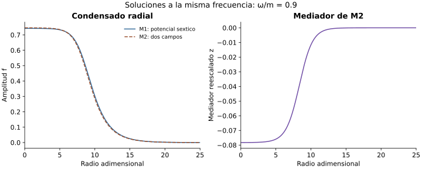

| Magnitud M2 | Valor |
|---|---:|
| f0 | 0.746019205344 |
| mediator0_rescaled | -0.0782716722348 |
| Ehat | 2525.6589095 |
| Qhat | 2745.77392021 |
| E_over_Q | 0.91983498383 |
| virial_relative | 1.09067679027e-11 |
| max_residual | 9.77619216078e-09 |
| Cambio de energía entre dominios | 1.98020909291e-09 |

Comparación a la misma frecuencia, no a la misma carga. El perfil radial no representa los glifos del atlas.

## Modos del condensado

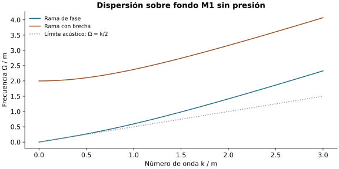

En M1 sin presión, la velocidad acústica es c/2 y el módulo cortante estático es cero. Las curvas son las ramas exactas de la linealización homogénea, no las velocidades asignadas en R1.

| Comprobación radial M1 | Resultado |
|---|---:|
| dQ_domega | -232934.050889 |
| dE_dQ | 0.899962253434 |

## Dispersión en las 24 geometrías

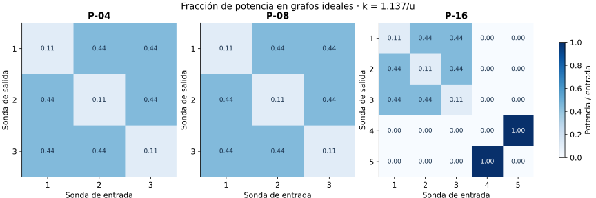

Las sondas numeran todos los extremos libres del grafo en el orden registrado en JSON. No son una asignación automática de terminales físicos de energía o control. Las guías y uniones ideales son hipótesis del cálculo.

| Glifo | Longitud del eje (u) | Vértices | Sondas | Máximo residuo unitario |
|---|---:|---:|---:|---:|
| P-01 | 9.7743071 | 7 | 1 | 2.22e-16 |
| P-02 | 12.533676 | 10 | 3 | 1.59e-15 |
| P-03 | 10.942215 | 7 | 1 | 1.11e-15 |
| P-04 | 9.7706417 | 8 | 3 | 1.05e-15 |
| P-05 | 26.252258 | 13 | 1 | 5.55e-16 |
| P-06 | 18.255923 | 14 | 3 | 2.35e-15 |
| P-07 | 11.288544 | 8 | 3 | 1.09e-15 |
| P-08 | 12.704792 | 10 | 3 | 1.46e-15 |
| P-09 | 9.7706417 | 7 | 1 | 1.22e-15 |
| P-10 | 12.599069 | 10 | 3 | 3.31e-15 |
| P-11 | 12.599069 | 9 | 1 | 3.33e-16 |
| P-12 | 12.599069 | 10 | 3 | 2.04e-15 |
| P-13 | 18.361646 | 12 | 3 | 3.44e-15 |
| P-14 | 13.397451 | 9 | 1 | 4.44e-16 |
| P-15 | 13.778706 | 11 | 4 | 1.64e-15 |
| P-16 | 18.361646 | 9 | 5 | 1.79e-15 |
| P-17 | 12.704792 | 10 | 3 | 3.87e-15 |
| P-18 | 15.533219 | 11 | 1 | 1.33e-15 |
| P-19 | 11.184855 | 8 | 3 | 1.74e-15 |
| P-20 | 19.43556 | 11 | 0 | 0 |
| P-21 | 16.225878 | 12 | 3 | 1.28e-15 |
| P-22 | 15.19292 | 13 | 4 | 1.09e-15 |
| P-23 | 13.778706 | 10 | 2 | 1.13e-15 |
| P-24 | 16.919313 | 12 | 2 | 7.83e-16 |

P-20 tiene cero sondas de extremos: se calcula el espectro del grafo cerrado mediante elementos finitos. Su matriz vacía de dispersión no cuenta como prueba de funcionamiento. Los terminales funcionales requieren otro problema de acoplamiento. P-04 y P-08 presentan las mismas fracciones de potencia en este ensayo ideal; la diferencia entre sus responsabilidades requiere estados, modos y controles adicionales.

## Memoria modal alimentada

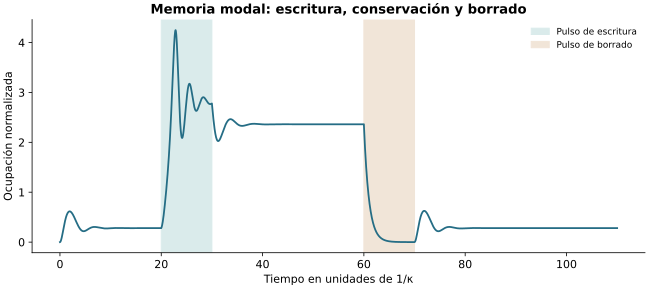

| Estado | Ocupación | Estabilidad lineal |
|---|---:|---|
| 1 | 0.28073477 | Estable |
| 2 | 1.357277629 | Inestable |
| 3 | 2.361987601 | Estable |

Residuo del balance de ocupación: 3.65e-09. No se ha calculado una tasa de error estocástica ni se afirma memoria pasiva.

## Preparación y motor

| Modulación h | Exponente de Floquet | Estimación resonante |
|---|---:|---:|
| 0.04 | -0.01000096889 | -0.01 |
| 0.12 | 0.009991185718 | 0.01 |

El bombeo está prescrito; no se deduce del movimiento de una mano.

| Motor de tres niveles | Resultado |
|---|---:|
| heat_hot_eV_per_time_unit | 0.0118644888942 |
| heat_cold_eV_per_time_unit | 0.00237289777883 |
| work_eV_per_time_unit | 0.00949159111534 |
| cycle_efficiency | 0.8 |
| entropy_production_eV_K_per_time_unit | 5.85626900765e-06 |
| energy_residual | -8.67361737988e-18 |
| Diferencia de poblaciones: tasas frente a Lindblad | 1.11e-16 |
| Autovalor mínimo de la matriz de densidad | 0.00377666387804 |
| Potencia desde el Hamiltoniano coherente | 0.00949159111534 |

La eficiencia es del ciclo idealizado y las tasas utilizan una unidad temporal adoptada. No mide rendimiento solar por área ni prueba que M2 tenga los niveles elegidos.

## Comprobaciones adicionales

| Prueba | Resultado | Alcance |
|---|---|---|
| Dispersión: matriz de perturbación frente a fórmula exacta | Correcta | Fondo homogéneo aislado, orden clásico. |
| Estado sin presión: velocidad c/2 y ausencia de rigidez cortante | Correcta | Propiedades de fluido; no certifica un sólido ni toda perturbación no lineal. |
| Rama radial: dE/dQ coincide con omega | Correcta | Diferencia centrada local; no prueba todas las ramas. |
| Modo de fase: autovalor de L- converge a cero | Correcta | Hessiano radial discretizado; no es análisis 3D completo. |
| P-01 dispersión conserva flujo | Correcta | Grafo ideal sin pérdidas y un modo escalar por arista; no valida la función completa. |
| P-02 dispersión conserva flujo | Correcta | Grafo ideal sin pérdidas y un modo escalar por arista; no valida la función completa. |
| P-03 dispersión conserva flujo | Correcta | Grafo ideal sin pérdidas y un modo escalar por arista; no valida la función completa. |
| P-04 dispersión conserva flujo | Correcta | Grafo ideal sin pérdidas y un modo escalar por arista; no valida la función completa. |
| P-05 dispersión conserva flujo | Correcta | Grafo ideal sin pérdidas y un modo escalar por arista; no valida la función completa. |
| P-06 dispersión conserva flujo | Correcta | Grafo ideal sin pérdidas y un modo escalar por arista; no valida la función completa. |
| P-07 dispersión conserva flujo | Correcta | Grafo ideal sin pérdidas y un modo escalar por arista; no valida la función completa. |
| P-08 dispersión conserva flujo | Correcta | Grafo ideal sin pérdidas y un modo escalar por arista; no valida la función completa. |
| P-09 dispersión conserva flujo | Correcta | Grafo ideal sin pérdidas y un modo escalar por arista; no valida la función completa. |
| P-10 dispersión conserva flujo | Correcta | Grafo ideal sin pérdidas y un modo escalar por arista; no valida la función completa. |
| P-11 dispersión conserva flujo | Correcta | Grafo ideal sin pérdidas y un modo escalar por arista; no valida la función completa. |
| P-12 dispersión conserva flujo | Correcta | Grafo ideal sin pérdidas y un modo escalar por arista; no valida la función completa. |
| P-13 dispersión conserva flujo | Correcta | Grafo ideal sin pérdidas y un modo escalar por arista; no valida la función completa. |
| P-14 dispersión conserva flujo | Correcta | Grafo ideal sin pérdidas y un modo escalar por arista; no valida la función completa. |
| P-15 dispersión conserva flujo | Correcta | Grafo ideal sin pérdidas y un modo escalar por arista; no valida la función completa. |
| P-16 dispersión conserva flujo | Correcta | Grafo ideal sin pérdidas y un modo escalar por arista; no valida la función completa. |
| P-17 dispersión conserva flujo | Correcta | Grafo ideal sin pérdidas y un modo escalar por arista; no valida la función completa. |
| P-18 dispersión conserva flujo | Correcta | Grafo ideal sin pérdidas y un modo escalar por arista; no valida la función completa. |
| P-19 dispersión conserva flujo | Correcta | Grafo ideal sin pérdidas y un modo escalar por arista; no valida la función completa. |
| P-20 grafo cerrado: modo constante y espectro no negativo | Correcta | Laplaciano sobre grafo cerrado; no prueba sus terminales funcionales. |
| P-21 dispersión conserva flujo | Correcta | Grafo ideal sin pérdidas y un modo escalar por arista; no valida la función completa. |
| P-22 dispersión conserva flujo | Correcta | Grafo ideal sin pérdidas y un modo escalar por arista; no valida la función completa. |
| P-23 dispersión conserva flujo | Correcta | Grafo ideal sin pérdidas y un modo escalar por arista; no valida la función completa. |
| P-24 dispersión conserva flujo | Correcta | Grafo ideal sin pérdidas y un modo escalar por arista; no valida la función completa. |
| Nexo: potencia 1/9+4/9+4/9 | Correcta | Tres impedancias iguales; una adaptación adicional cambia el reparto. |
| Convertidor: reflexión+salida+pérdidas=entrada | Correcta | Respuesta de dos modos resonantes con acoplamientos elegidos. |
| Memoria: dos ramas estables y conmutación por pulsos | Correcta | Biestabilidad clásica determinista de una cavidad reducida. |
| Memoria: balance temporal de ocupación | Correcta | Ocupación normalizada; energía aproximadamente hbar*omega_carrier*N en banda estrecha. |
| Química: cociente cinético satisface balance detallado | Correcta | Dos estados con igual prefactor y misma transición; ejemplo explícito, no reacción CO2 real. |
| Fuerza de portal: gradiente de energía y reacción | Correcta | Perfil impuesto y prueba diferencial; no incluye solución de retroacción. |

## Datos completos

Los JSON de `validacion/` incluyen matrices, frecuencias, coeficientes, resultados y alcances. Los CSV conservan perfiles y trayectorias. La biblioteca científica utilizada y las pruebas de formato se registran en `validacion/informe.json`.

---

# Fuentes de la extensión y límites de las inferencias

Las fuentes siguientes respaldan métodos y resultados de sus respectivos modelos. No validan los nuevos campos, las geometrías rúnicas ni sus prestaciones. Las ecuaciones del proyecto, las elecciones de parámetros y los cálculos incluidos se distinguen de los resultados publicados.

| Fuente primaria | Uso en esta edición | Lo que no autoriza a concluir |
|---|---|---|
| J. Heeck y M. Sokhashvili, [Q-balls in polynomial potentials](https://arxiv.org/abs/2211.00021) | Estados cargados, potenciales efectivos y modelos con escalares adicionales | Que una solución radial forme una red de 24 dispositivos |
| N. Sakai, H. Ishihara y K. Nakao, [Q-tubes and Q-crusts](https://arxiv.org/abs/1011.4828) | Geometrías extendidas en teorías de campos con simetrías especificadas | Que una Q-crust del modelo SO(3)×U(1) exista en el modelo de un solo complejo |
| S. Gnutzmann y U. Smilansky, [A trace formula for metric graphs with piecewise constant potentials and multi-mode graphs](https://arxiv.org/abs/2201.06963) | Propagación, dispersión y espectros en grafos métricos | Que la acción microscópica produzca automáticamente las guías usadas como hipótesis |
| M. Aspelmeyer, T. J. Kippenberg y F. Marquardt, [Cavity Optomechanics](https://arxiv.org/abs/1303.0733) | Modos acoplados, transducción, fuerza y retroacción | Que los coeficientes de una cavidad puedan asignarse sin calcular su realización |
| A. A. Clerk y colaboradores, [Introduction to Quantum Noise, Measurement and Amplification](https://arxiv.org/abs/0810.4729) | Respuesta, ruido y límites de amplificación | Que un sensor tenga precisión ilimitada o disipación sin ruido |
| [Generalized Langevin Equation with a Non-Linear Potential of Mean Force and Non-Linear Memory Friction From a Hybrid Projection Scheme](https://arxiv.org/abs/2202.01922) | Reducción de grados de libertad y memoria | Que la dinámica reducida sea siempre markoviana |
| E. Boukobza y D. J. Tannor, [Thermodynamic analysis of quantum light amplification](https://arxiv.org/abs/quant-ph/0611175) | Máquina de tres niveles e intercambio entre calor y campo de salida | Que toda energía emitida en un régimen cuántico sea trabajo sin considerar su estado |
| W. Niedenzu, M. Huber y E. Boukobza, [Concepts of work in autonomous quantum heat engines](https://arxiv.org/abs/1907.01353) | Distinción entre energía, ergotropía y trabajo utilizable | Que transferir radiación térmica a Reserva produzca íntegramente trabajo |

## Límites de los cálculos incluidos

- Los cálculos de campo son clásicos y de sectores aislados o aproximados. No incorporan una renormalización cuantitativa de los portales ni restricciones experimentales completas.
- Los ensayos originales de este capítulo eran radiales. Los capítulos 14 y 18 añaden modos no radiales de la Q-ball y perturbaciones longitudinales del tubo completo de dos campos; no prueban redes operacionales ni todos los estados lejos del equilibrio.
- Los grafos suponen confinamiento y condiciones de unión. Verificar su conservación de flujo no verifica la construcción física de esas condiciones.
- Los modelos de cavidad, bombeo y motor tienen parámetros explícitos, pero no todos están calculados como integrales sobre un mismo estado de M2.
- No se ha demostrado la ventana de preparación manual compatible con el entorno ordinario.
- Las simulaciones químicas verifican relaciones de un ejemplo abstracto; no sustituyen cálculos moleculares de una reacción concreta.

La consistencia interna de una hipótesis nueva y su compatibilidad con observaciones son requisitos diferentes. Comparar portales con espectroscopia, fuerzas adicionales, producción de partículas, procesos térmicos y entornos astrofísicos exige predicciones cuantitativas y datos apropiados. Esta edición no declara superadas esas comparaciones.

## Fuentes para la edición 4

- G. H. Derrick, [Comments on Nonlinear Wave Equations as Models for Elementary Particles](https://doi.org/10.1063/1.1704233), 1964. Antecedente del argumento de escala, derivado explícitamente aquí para M2; no se aplica sin más a campos en rotación interna.
- A. Azatov, Q. T. Ho y M. M. Khalil, [Q-ball perturbations with more details: linear analysis vs lattice](https://arxiv.org/abs/2412.13885). Referencia sobre bandas laterales y límites de perturbaciones; sus cifras no son los resultados del proyecto.
- Q. Chen, L. Andersson y L. Li, [Stability analysis for Q-balls with spectral method](https://arxiv.org/abs/2509.18656). Distingue el análisis de ramas fundamentales y excitadas; no convierte el signo de dQ/dω en una prueba universal.
- Q. Chen, [Hydrodynamic and Rayleigh-Plateau instabilities of Q-strings](https://arxiv.org/abs/2412.09815). Antecedente de inestabilidad longitudinal en otro potencial; el capítulo 18 conserva y calcula el mediador de M2.
- L. G. C. Rego y G. Kirczenow, [Quantized thermal conductance of dielectric quantum wires](https://arxiv.org/abs/cond-mat/9801238). Conductancia cuántica del transporte balístico; las cotas aplicadas en el capítulo 16 declaran sus hipótesis de canal y reservorios.

Estas fuentes fundamentan métodos y comparaciones. Ninguna demuestra la existencia física experimental de los campos rúnicos ni la realización de una primordial. Las pruebas algebraicas y los cálculos nuevos se identifican como resultados del modelo M2 especificado.

---

# M2 común: definición matemática y alcance demostrado

## 13.1. Resultado y regla de aceptación

**M2 no ha producido todavía un dispositivo P-04, P-11 o P-18 completamente derivado.** Esta edición obtiene nuevos resultados del mismo sistema de dos campos, demuestra propiedades de su problema de Cauchy y ensaya su dinámica. También identifica obstrucciones exactas y contrastes con R1. No convierte los antiguos modelos de grafos, Kerr o tres niveles en realizaciones de M2.

El criterio de aceptación es la conjunción, no la suma, de diez condiciones:

\[
\mathcal A_d=G_d\land\Theta\land C_d\land S_d\land E_d
\land D_d\land N_d\land P_d\land R_d\land V_d.
\]

Aquí figuran geometría física, parámetros comunes identificados, coeficientes derivados, solución, estabilidad, dinámica, pérdidas y ruido, preparación, función R1 y dominio de validez. Un cálculo radial correcto no sustituye a una solución de Canal. Una transmisión unitaria de un grafo no demuestra sus paredes. Un campo inicialmente impuesto no demuestra Semilla. `datos/aceptacion_m2.json` registra el resultado por primordial.

La conclusión negativa tiene un alcance preciso: **la cadena presentada no satisface el criterio**. No es un teorema de inexistencia de todos los dispositivos posibles en cualquier extensión de M2. Las exclusiones matemáticas de este capítulo sí declaran las hipótesis bajo las que se aplican.

## 13.2. Un solo conjunto fundamental

En unidades \(c=\hbar=1\), espacio de Minkowski y signatura \((-+++)\), se fija

\[
\mathcal L_s=-|\partial\Phi|^2-\tfrac12(\partial\chi)^2-V,
\quad s=|\Phi|^2,
\]

\[
V=m^2s+\lambda_0s^2+\tfrac12M^2\chi^2+g\chi s+\tfrac12h\chi^2s.
\tag{13.1}
\]

\(\Phi\) tiene dos componentes reales; \(\chi\) una. No hay un mediador por primordial. El conjunto del sector escalar es

\[
\Theta_s=(m,M,\lambda_0,g,h),\qquad
\lambda\equiv\frac{g^2}{2M^2}-\lambda_0>0.
\]

\(\lambda\) es una combinación derivada; no se cuenta como sexto parámetro independiente. Se conserva el benchmark anterior:

\[
\lambda_0=99\lambda,\quad M=100m,\quad
g=100m\sqrt{200\lambda},\quad h=100\lambda.
\tag{13.2}
\]

Las ecuaciones adimensionales dependen de las mismas razones en todos los ensayos. Para expresar una sola escala ilustrativa en SI se fija \(mc^2=1\) eV y \(\lambda=10^{-3}\), sin ajustar R1. Resulta \(\lambda_0=0.099\), \(Mc^2=100\) eV, \(g=44.72135955\) eV y \(h=0.1\). Esta elección **no** es el ajuste de densidad de M1 del capítulo 08; los dos ejemplos no se pueden mezclar.

El conjunto de la teoría que interactúa con materia tendría que ser

\[
\Theta_{\rm total}=\{\Theta_s,a,b,s_A,s_B,\Theta_{\rm materia},
\Lambda_{\rm EFT},c_i(\mu_0),\text{condiciones de renormalización}\},
\tag{13.3}
\]

con los portales ya definidos

\[
A(s)=\exp\!\left(\frac{as}{s+s_A}\right),\qquad
B(s)=\exp\!\left(\frac{4bss_B}{(s+s_B)^2}\right),
\]

\[
\mathcal L_{\rm EM}=-\tfrac14 B(s)F_{\mu\nu}F^{\mu\nu},\qquad
S_m=S_m[\psi,A^2(s)\eta_{\mu\nu},A_\mu].
\]

Las constantes de materia incluyen las masas y acoplamientos del sector material elegido. La composición, temperatura, presión, orientación cristalina y población de sus estados son datos de configuración; no nuevas leyes fundamentales. Los \(c_i\) describen operadores efectivos omitidos y su orden de truncación. **El proyecto no identifica un valor común de los portales ni una completación EFT con error controlado.** Darles números arbitrarios produciría un candidato adicional, no la demostración solicitada. En el benchmark aislado \(a=b=0\), por lo que la conversión directa con materia y electromagnetismo es exactamente cero.

| Clase | Ejemplos | Regla |
|---|---|---|
| Fundamental común | \(m,M,\lambda_0,g,h,a,b,s_A,s_B\) | La misma definición para todos los dispositivos |
| Geometría | Dimensiones, sección, curvas, material y disposición de contactos | Puede cambiar entre dispositivos; debe entrar en el problema físico |
| Estado | \(Q,E,T\), perfil inicial, fase, frecuencia de rotación \(\omega\) | No se confunde con una constante fundamental |
| Terminales | Fuente y carga, impedancia, temperatura de reservorios | Se especifican con su realización y balance |
| Control | Consigna y forma temporal del bombeo | Su energía y reacción se contabilizan |
| Coeficiente efectivo | \(v_g,K,\kappa,G_{th},D,\Delta E\) | Se calcula; no se usa como entrada para declarar derivación |
| Objetivo | Valores R1 de velocidad, potencia, fidelidad y conductancia | Sirve para aceptar o rechazar el resultado |

La frecuencia \(\hat\omega=0.9\) identifica el estado radial ensayado. No pertenece a \(\Theta_s\). Tampoco pertenecen a \(\Theta_s\) el paso de malla, la tolerancia ni el radio del dominio numérico.

## 13.3. Ecuaciones, conservación y unidades

\[
\ddot\Phi-\nabla^2\Phi+
(m^2+2\lambda_0|\Phi|^2+g\chi+\tfrac12h\chi^2)\Phi=0,
\]

\[
\ddot\chi-\nabla^2\chi+(M^2+h|\Phi|^2)\chi+g|\Phi|^2=0.
\tag{13.4}
\]

Para datos de energía finita en \(\mathbb R^3\), sin flujo por el infinito,

\[
E=\int\!\left(|\dot\Phi|^2+|\nabla\Phi|^2+
\tfrac12\dot\chi^2+\tfrac12|\nabla\chi|^2+V\right)d^3x,
\quad Q=2\int\!\operatorname{Im}(\Phi^*\dot\Phi)d^3x
\tag{13.5}
\]

se conservan. Hay asimismo conservación del momento total. En un subdominio, las variaciones de energía y carga son flujos por su frontera: abrir terminales cambia los balances del subsistema, no la conservación global.

Con \(x=mr\), \(\tau=mt\), \(f=\sqrt\lambda\,|\Phi|/m\), \(z=\sqrt\lambda\chi/m\),

\[
E=\frac{mc^2}{\lambda}\hat E,\quad Q=\frac{\hat Q}{\lambda},\quad
\ell_0=\frac{\hbar c}{mc^2},\quad t_0=\frac{\hbar}{mc^2},\quad
u_0=\frac{(mc^2)^4}{\lambda(\hbar c)^3}.
\tag{13.6}
\]

La escala SI ilustrativa da \(\ell_0=1.97327\times10^{-7}\) m, \(t_0=6.58212\times10^{-16}\) s y \(u_0=2.08522\times10^4\) J/m³. Estas conversiones no son mediciones del campo.

## 13.4. Vacío: demostración clásica global

Completando el cuadrado,

\[
V=\tfrac12(M^2+hs)(\chi-\chi_*(s))^2+U_{ef}(s),
\quad\chi_*=-\frac{gs}{M^2+hs},
\]

\[
U_{ef}=m^2s+\lambda_0s^2-\frac{g^2s^2}{2(M^2+hs)}.
\tag{13.7}
\]

En variables adimensionales, \(\sigma=|f|^2\),

\[
\hat U_{ef}(\sigma)=\sigma-\sigma^2+
\frac{\sigma^3}{1+\sigma/100},\quad
\min_{\sigma\ge0}\frac{\hat U_{ef}}{\sigma}
=1-100(10-\sqrt{99})^2\equiv v_*=0.7487421324>0.
\tag{13.8}
\]

Por tanto \(\hat V\ge v_*|f|^2+5000(z-z_*)^2\), con igualdad cero solamente en \(f=z=0\). No hay vacío de menor energía ni dirección de escape con potencial negativo. Además,

\[
z_*^2\le\frac{\hat g^2}{4\hat M^2\hat h}|f|^2
=\tfrac12|f|^2,
\]

\[
|f|^2\le\hat V/v_*,\qquad
z^2\le\left(4/\hat M^2+1/v_*\right)\hat V.
\tag{13.9}
\]

Así, la energía controla las normas \(H^1\) de los tres campos reales y las normas \(L^2\) de sus velocidades. La conservación de energía demuestra estabilidad de Lyapunov del vacío en esa norma: una energía inicial suficientemente pequeña mantiene pequeña la norma energética para todo tiempo. No implica una cota puntual de amplitud derivada sólo de \(H^1\), ni relajación asintótica.

En el vacío, los modos de Fourier cumplen exactamente

\[
\Omega_\Phi^2=k^2+m^2,\qquad \Omega_\chi^2=k^2+M^2.
\tag{13.10}
\]

No hay masas taquiónicas ni modos de energía cinética negativa en este sector. Esta demostración es clásica. Los lazos cuánticos, los contraterminos y un medio material no están incluidos en ella.

## 13.5. Existencia global del problema de Cauchy escalar

Se toman datos \((\sqrt2\Re\Phi,\sqrt2\Im\Phi,\chi)\in H^1(\mathbb R^3)^3\) y velocidades en \(L^2(\mathbb R^3)^3\). Los términos no lineales de (13.4) son polinomios de grados dos y tres. En tres dimensiones, \(H^1\hookrightarrow L^p\) para \(2\le p\le6\). Por Hölder, los productos cúbicos son \(L^2\) y son localmente Lipschitz de \(H^1\) a \(L^2\); los cuadráticos se controlan con \(L^4\).

La fórmula integral de la ecuación de onda y la estimación de energía construyen una solución local única mediante contracción en \(C_tH^1\cap C_t^1L^2\). El tiempo de existencia local depende de una cota de esa norma. Las desigualdades (13.9) y la conservación de \(E\) dan una cota uniforme, de modo que el argumento local se puede reiterar para todo tiempo finito. Se obtiene una solución global de energía, única en esta clase, con dependencia continua de los datos. La conservación se justifica primero para aproximaciones suaves y después por continuidad.

Esto cierra el problema de Cauchy **del sector escalar clásico aislado con los parámetros (13.2)**. No prueba existencia de cada estado operacional, estabilidad de cada solución, ni validez empírica o cuántica de la teoría. Un problema con paredes, materia o control necesita declarar esas ecuaciones y condiciones de frontera para heredar un resultado análogo.

## 13.6. Causalidad e hiperbolicidad

En los tres campos reales canónicos, el símbolo principal es

\[
P(\xi)=(-\xi_t^2+|\boldsymbol\xi|^2)I_3.
\tag{13.11}
\]

La reducción de primer orden es simétrica hiperbólica, y sus características son el cono de luz. El potencial sólo introduce términos de orden inferior. Por localidad y la estimación de energía en conos, los datos externos al cono pasado no afectan la solución: la velocidad de frente es \(c\), independientemente de una velocidad de grupo menor o de una dispersión anómala local.

Para el portal electromagnético sin operadores de derivadas superiores, \(B>0\) conserva el signo cinético y, tras fijar calibre, el mismo cono principal. Una métrica material conforme con \(A>0\) comparte el cono nulo. No se ha demostrado aquí la hiperbolicidad de una teoría material arbitraria, una completación de derivadas superiores o una teoría gravitatoria no mínima. El laboratorio de estos cálculos fija \(\xi=0\) y métrica plana.

## 13.7. Obstrucción estática y alcance de la geometría

Para campos estrictamente independientes del tiempo, localizados y con vacío en el infinito, defínase \(\Phi_L(\mathbf x)=\Phi(\mathbf x/L)\), \(\chi_L(\mathbf x)=\chi(\mathbf x/L)\). Si \(T\) es la energía de gradientes y \(U\) la de potencial,

\[
E(L)=LT+L^3U,\qquad E'(1)=T+3U>0
\tag{13.12}
\]

para toda configuración no nula. Una solución estática de energía finita debe ser crítica frente a esta variación; por tanto no existe una solución estática no trivial en ese sector. Ésta es la aplicación directa del argumento de escala de Derrick. La ecuación y sus hipótesis bastan para comprobarla.

**No se aplica a un estado cargado en rotación interna.** A carga fija,

\[
E_Q[f,\chi]=\frac{Q^2}{4I}+T+U,\qquad I=\int f^2d^3x,
\]

\[
E_Q(L)=L^{-3}\frac{Q^2}{4I}+LT+L^3U.
\tag{13.13}
\]

El término \(L^{-3}\) permite un mínimo: ése es el mecanismo de la solución cargada resuelta en el capítulo 14. Ni este mínimo ni su simetría radial fijan por sí mismos un recorrido con bifurcaciones y curvas.

Un trazo puede especificar una región deseada o datos iniciales. Para ser confinamiento debe aparecer como un perfil material calculado, una fuente, una condición física de frontera o un estado autosostenido que satisfaga las ecuaciones. Las tres posibilidades cambian el problema que se resuelve. No existe un término «reconocer P-04» en (13.4).

## 13.8. Preparación y simetría de carga

Con los portales \(A(s),B(s)\), toda ecuación clásica de \(\Phi\) sigue siendo homogénea en \(\Phi\) y \(\Phi^*\). Para campos externos regulares, \(\Phi=\dot\Phi=0\) es una solución; por unicidad, un estado exactamente nulo no abandona esa solución por una modulación multiplicativa. Una masa efectiva negativa puede amplificar una perturbación, pero no crea una perturbación clásica desde cero.

La simetría U(1) tampoco cambia con un bombeo que sólo dependa de \(s\). En un sistema cerrado \(Q(t)=Q(0)\), aunque el bombeo aporte energía. Partir de \(Q=0\) no permite acabar con una única carga positiva y nada más: hace falta una carga compensatoria, un flujo por terminales o una modificación explícita de la simetría. Pares de cargas opuestas y producción cuántica no están excluidos.

Un estado cuántico de vacío tiene fluctuaciones; no se identifica con datos clásicos exactamente nulos. Calcular su crecimiento, selección espacial y saturación exige el estado inicial, las correlaciones y el acoplamiento de la fuente. El ensayo Floquet anterior sólo verificaba el crecimiento lineal de una perturbación ya disponible. No es un protocolo completo de P-01.

---

# Solución, espectro y dinámica del mismo M2

## 14.1. Qué se ha resuelto

Se resuelve \(\Phi=f(r)e^{i\omega t}\), \(\chi=z(r)\), con \(\hat\omega=0.9\), derivadas nulas en el origen y campos nulos en una frontera remota. Se incluyen ambos campos y sus gradientes. Las unidades son las de (13.6); en este capítulo las variables son adimensionales.

\[
f''+\frac2r f'=(1-\omega^2+198f^2+\hat g z+50z^2)f,
\]

\[
z''+\frac2r z'=10000z+\hat g f^2+100zf^2,
\quad\hat g=100\sqrt{200}.
\tag{14.1}
\]

El método de colocación usa un Jacobiano analítico. La condición en el origen se implementa mediante el término singular regular de `solve_bvp`, no dividiendo por cero. El perfil inicial sirve para elegir la rama no nula; los residuos y la identidad virial comprueban que no se ha confundido con la solución trivial.

| Radio de caja | Tolerancia solicitada | Nodos adaptados | \(\hat E\) | \(\hat Q\) | Residuo virial relativo |
|---:|---:|---:|---:|---:|---:|
| 40 | \(10^{-6}\) | 1068 | 2525.6589035 | 2745.7739135 | \(1.17\times10^{-10}\) |
| 50 | \(10^{-8}\) | 1319 | 2525.6589096 | 2745.7739203 | \(9.95\times10^{-12}\) |
| 60 | \(10^{-9}\) | 2402 | 2525.6589099 | 2745.7739207 | \(8.85\times10^{-13}\) |

La energía cambia \(1.34\times10^{-10}\) relativamente entre las últimas filas. \(f(0)=0.74601920535\), \(z(0)=-0.07827167224\) y \(E/Q=0.91983498383<1\). El último cociente impide la desintegración completa en cuantos libres de la misma carga por balance energético; no excluye todas las fragmentaciones, estados colectivos o inestabilidades.

Se cumple \(T+3U-3\omega^2I=0\). Las diferencias centradas con \(\delta\omega=0.0004\) y 0.0002 dan respectivamente \(dQ/d\omega=-219274.44\) y \(-219206.13\); \(dE/dQ=0.89999409\) y 0.89999852, convergiendo al valor termodinámico \(\omega=0.9\). Estos cálculos son de M2, no los de M1 reutilizados.

Los residuos son verificaciones numéricas ordinarias; no son intervalos rigurosos de existencia y unicidad para una solución exacta del continuo. Los perfiles completos están en `validacion/m2_perfil_convergente.csv`.

## 14.2. Operador lineal completo de dos campos

Con \(\Phi=e^{i\omega t}[f+(u+iv)/\sqrt2]\), \(\chi=z+\zeta\),

\[
\ddot u-2\omega\dot v+L_u u+C\zeta=0,\qquad
\ddot v+2\omega\dot u+L_vv=0,
\]

\[
\ddot\zeta+L_\chi\zeta+Cu=0,
\tag{14.2}
\]

\[
L_v=-\nabla^2+1+198f^2+\hat g z+50z^2-\omega^2,
\quad L_u=L_v+396f^2,
\]

\[
L_\chi=-\nabla^2+10000+100f^2,\qquad
C=\sqrt2f(\hat g+100z).
\tag{14.3}
\]

En (14.2), \(L_vv\) es \(L_v\,v\). La expansión en armónicos esféricos \(Y_{\ell m}\) desacopla los índices \(\ell\) y da degeneración \(2\ell+1\). Al transformar una amplitud radial \(q\) en \(rq\), cada diagonal contiene

\[
-\frac{d^2}{dr^2}+\frac{\ell(\ell+1)}{r^2}.
\]

Las condiciones regulares son amplitudes \(q=O(r^\ell)\) en el origen, y decaimiento o radiación saliente según se estudien estados ligados o dispersión. La caja numérica impone Dirichlet; sus modos extendidos no se confunden con modos ligados del espacio infinito.

## 14.3. Energía a carga fija: por qué un autovalor negativo no basta

El Hessiano de amplitud es

\[
H_\ell=\begin{pmatrix}L_{u,\ell}&C\\C&L_{\chi,\ell}\end{pmatrix}.
\]

En el sector radial, la segunda variación de (13.13), con coordenadas canónicas \((u,\zeta)\), contiene el operador

\[
K_0=H_0+\frac{4\omega^2}{I}|(f,0)\rangle\langle(f,0)|.
\tag{14.4}
\]

El producto interior de esta fórmula usa \(d^3x\). La transformación radial introduce el vector \((rf,0)\) y el factor \(4\pi\) se cancela en el cociente. Se verifica el término de rango uno mediante inversión de Sherman–Morrison, sin sustituirlo por un cambio local de potencial.

Un \(H_0\) con una dirección negativa puede coexistir con \(K_0>0\): la dirección no está libre a carga fija. La pendiente \(dQ/d\omega<0\), por sí sola, no prueba estabilidad de una rama arbitraria con varios modos negativos.

| \(R,N\) | \(\lambda_{min}(H_0)\) | \(\lambda_{min}(K_0)\) | \(\lambda_{min}(H_1)\) | \(\lambda_{min}(H_2)\) |
|---|---:|---:|---:|---:|
| 40, 500 | −0.02284472 | 0.20057676 | −0.000038849 | 0.04491860 |
| 40, 1000 | −0.02281501 | 0.20057713 | −0.000009729 | 0.04494643 |
| 40, 2000 | −0.02280757 | 0.20057722 | −0.000002435 | 0.04495340 |
| 60, 3000 | −0.02280757 | 0.19387455 | −0.000002435 | 0.04495340 |

Los cambios de \(K_0\) al aumentar el dominio son compatibles con aproximarse al borde esencial 0.19; no significan una pérdida de estabilidad. Las cuatro primeras raíces de cada Hessiano se calculan mediante desplazamiento por debajo de una cota inferior puntual del potencial matricial. Así se evitan confusiones entre «más próximos a cero» y «más bajos».

## 14.4. Todos los sectores angulares: reducción analítica

Para un perfil exacto positivo y monótono, se tienen identidades que no requieren cortar la suma en \(\ell=3\).

Primero, \(L_{v,0}f=0\). La transformación de estado fundamental da

\[
\langle v,L_{v,0}v\rangle=
\int f^2\left|\nabla(v/f)\right|^2d^3x\ge0.
\tag{14.5}
\]

El modo nulo es la fase global. Para \(\ell\ge1\), la barrera centrífuga añade una contribución positiva.

Segundo, las traslaciones satisfacen \(H_1(\sqrt2f',z')^T=0\). Si \(f'<0\), \(z'>0\), \(C>0\), se cambia el signo de la primera componente y se obtiene un operador con acoplamiento \(-C\) y estado nulo positivo \((a,b)=(-\sqrt2rf',rz')\). Para funciones de prueba radiales \((p,q)\),

\[
\langle(p,q),\widetilde H_1(p,q)\rangle=
\int_0^\infty\!\left[
a^2((p/a)')^2+b^2((q/b)')^2+
Cab(p/a-q/b)^2\right]dr\ge0.
\tag{14.6}
\]

La identidad se obtiene integrando por partes y usando las dos ecuaciones del estado nulo. Para todo \(\ell\ge2\),

\[
H_\ell=H_1+\frac{\ell(\ell+1)-2}{r^2}I_2,
\tag{14.7}
\]

de modo que no aparece una nueva dirección negativa a alto \(\ell\). Los términos giroscópicos \(\pm2\omega\dot q\) no realizan trabajo; un Hessiano positivo produce energía cuadrática conservada y excluye crecimiento exponencial de norma finita.

Estas identidades cubren todos los índices angulares **si se cumplen sus hipótesis para la solución exacta**. El perfil calculado es positivo y monótono en el intervalo con amplitud resoluble; sus colas decaen. Aun así, una inspección numérica de monotonicidad y los autovalores flotantes de \(K_0\) no constituyen una certificación del continuo. No se declara completada una prueba espectral rigurosa de esta Q-ball, y mucho menos de una guía tridimensional que aún no se ha resuelto.

## 14.5. Frecuencias, continuo y ceros de simetría

Se discretiza también el generador de primer orden

\[
\partial_t\binom{q}{\dot q}=
\begin{pmatrix}0&I\\-\mathcal H&-\mathcal G\end{pmatrix}
\binom{q}{\dot q},\quad q=(u,v,\zeta)^T,
\]

con \(\mathcal G\) antisimétrica. Se conservan en JSON los 18 autovalores encontrados alrededor de \(0.055i\) para \(\ell=0,1,2\); no se describe esta selección como un barrido de todo el generador.

En el exterior de la Q-ball, el espectro esencial es

\[
\sigma=\pm i(\sqrt{k^2+1}\pm\omega),\qquad
\sigma=\pm i\sqrt{k^2+10000},\quad k\ge0.
\tag{14.8}
\]

El umbral inferior es \(|\operatorname{Im}\sigma|=0.1\). El modo cuadrupolar \(\ell=2\) sí está ligado:

| \(R,N\) | Frecuencia \(\Omega_{\ell=2}\) |
|---|---:|
| 40, 500 | 0.04376526611 |
| 40, 1000 | 0.04377915147 |
| 40, 2000 | 0.04378262919 |
| 60, 3000 | 0.04378262869 |

El cambio al aumentar el dominio es \(4.94\times10^{-10}\). La convergencia espacial es de segundo orden; la extrapolación orientativa da aproximadamente 0.04378379. No se asignan a la última cifra más garantías que las del método.

El modo de fase, exactamente nulo en el continuo, aparece como \(\pm i\,0.00024634\), \(\pm i\,0.00012320\), \(\pm i\,0.00006162\) al refinar. La traslación aparece como un pequeño par **real** \(\pm0.00091524\), \(\pm0.00045803\), \(\pm0.00022912\). No se oculta ese par: tiende a cero como el paso de malla y corresponde a la ruptura numérica de la identidad de traslación. Leerlo como inestabilidad física sin estudiar convergencia sería incorrecto; borrarlo del informe también lo sería.

Los valores superiores a 0.1 cambian con el tamaño de caja y son discretizaciones del continuo. Los modos de fase y traslación, junto con sus posibles compañeros generalizados, permiten cambios de fase o posición; estabilidad orbital significa controlar la perturbación después de descontar esas simetrías, no exigir una posición absoluta fija.

## 14.6. Evolución no lineal de ambos campos

Se integran las ecuaciones originales en coordenadas radiales mediante volúmenes finitos conservativos y Verlet. Las variables son \(\Re\Phi,\Im\Phi,\chi\), sin eliminar el mediador. Se impone una perturbación de amplitud \(10^{-3}e^{-r^2/25}\) a \(f\); la velocidad de fase se ajusta para mantener la carga inicial discretizada. Este ajuste define datos iniciales, no una fuente ni preparación desde materia.

| Celdas | Paso temporal | Duración \(\tau\) | Máxima deriva relativa de energía | Máxima deriva relativa de carga |
|---:|---:|---:|---:|---:|
| 800 | 0.002 | 24 | \(1.12\times10^{-7}\) | \(1.33\times10^{-15}\) |
| 1600 | 0.001 | 24 | \(2.82\times10^{-8}\) | \(2.89\times10^{-15}\) |

La desviación relativa ponderada de amplitud permanece por debajo de \(3.33\times10^{-4}\). Se comprueba un transitorio radial pequeño y la conservación de ambos invariantes, con mejora de aproximadamente cuatro veces en la deriva energética. No es una prueba de todas las perturbaciones ni de retención durante segundos.

En la escala SI ilustrativa, \(24t_0=1.58\times10^{-14}\) s. Presentar este ensayo como demostración de funcionamiento macroscópico prolongado sería una extrapolación sin justificar. La caja es cerrada y no añade absorción artificial: sus resultados no estiman las pérdidas de un dispositivo abierto.

## 14.7. Estado exacto de la evidencia espectral

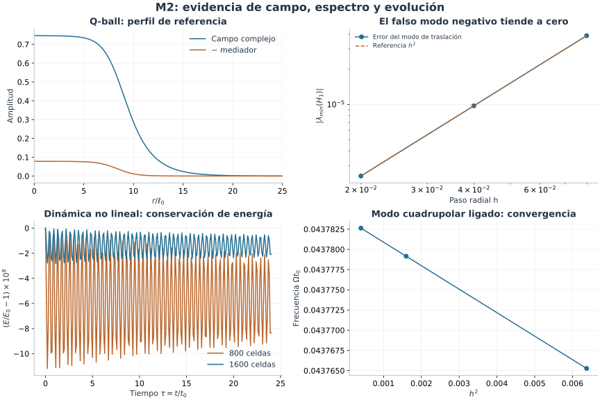

Quedan demostradas analíticamente la estabilidad clásica del vacío, la hiperbolicidad del sector escalar y las identidades que reducen el problema angular de perfiles monótonos. Se obtienen soluciones y autovalores convergentes, un modo no radial ligado y dinámica radial conservativa. La positividad radial restringida es evidencia numérica fuerte, con margen positivo, pero no una certificación de operadores continuos por cotas de error rigurosas.

**No se ha obtenido estabilidad espectral completa de un dispositivo rúnico.** La solución aquí analizada es esférica. No tiene la geometría, terminales ni función de P-04; asignarle ese nombre no completaría la demostración.

---

# Regímenes de validez y derivación de coeficientes

## 15.1. Cuatro afirmaciones que no son equivalentes

La existencia global de una solución de las ecuaciones clásicas, la precisión de una aproximación, la precisión de un cálculo numérico y la adecuación física a materia real son problemas distintos. M2 puede ser matemáticamente definido a cualquier amplitud finita y, aun así, su truncación efectiva puede fallar a cierta escala. La validez de R1 requiere resolver las cuatro cuestiones para el dispositivo concreto.

No existe actualmente una tabla justificada que garantice todas las funciones entre determinados voltajes, temperaturas, energías y tiempos SI. Se pueden dar dominios explícitos para las aproximaciones identificadas, y éstos son los que siguen. Donde falta un corte físico o un error demostrado, se declara indeterminado: no se sustituye por el corte de 1 MeV usado antes en un ejemplo M1.

## 15.2. Amplitud y reducción del mediador

Se usa \(\sigma=\lambda|\Phi|^2/m^2\). El potencial racional exacto y el sextico difieren en

\[
\hat U_{ef}-\hat U_6=-\frac{\sigma^4}{100(1+\sigma/100)},
\quad\hat U_6=\sigma-\sigma^2+\sigma^3.
\tag{15.1}
\]

Respecto del **término sextico** \(\sigma^3\), el error es \(\sigma/(100+\sigma)\). El criterio de 1 % exige \(\sigma\le100/99=1.010101\), o \(|f|\le1.005038\). No garantiza 1 % en la fuerza, presión, autovalores o una diferencia pequeña entre grandes contribuciones que se cancelan.

Eliminar \(\chi\) también induce el término de gradientes

\[
-\tfrac12[\chi_*'(s)]^2(\partial s)^2.
\]

En la coordenada de amplitud \(f\), la corrección del coeficiente cinético es

\[
\delta Z(\sigma)=2\sigma\left[
\frac{\hat g\hat M^2}{(\hat M^2+\hat h\sigma)^2}\right]^2.
\tag{15.2}
\]

En la rama próxima al vacío, exigir \(\delta Z\le0.01\) da \(\sigma\le0.25253493\). En el centro de la solución radial, \(\sigma=0.55654465\) y \(\delta Z=0.0217730\). Por tanto la reducción que conserva sólo el potencial y elimina también la cinética inducida **no alcanza 1 % en ese coeficiente** para el estado ensayado. M2 de dos campos no incurre en esta omisión. A amplitudes enormes, \(\delta Z\) vuelve a disminuir; eso no restaura la expansión sextica, que ya ha fallado.

Alrededor de un fondo homogéneo, la respuesta lineal exacta del mediador es

\[
\delta\chi(\Omega,k)=-
\frac{g+h\chi_0}{M^2+hs_0+k^2-\Omega^2}\,\delta s.
\tag{15.3}
\]

La aproximación algebraica sustituye el denominador por \(D=M^2+hs_0\). Fuera del polo, el error relativo a la respuesta exacta es \(|k^2-\Omega^2|/D\). Una condición suficiente de 1 % es

\[
\Omega^2+k^2\le0.01(M^2+hs_0).
\tag{15.4}
\]

En el vacío del benchmark, \(\hat\Omega^2+\hat k^2\le100\). Si sólo hay variación espacial, \(L_{grad}=1/k\ge0.1\ell_0\); si sólo hay variación temporal, \(|\hat\Omega|\le10\). La frecuencia ordinaria es \(\nu=\hat\Omega/(2\pi t_0)\). Estas condiciones se refieren a la **respuesta incremental de \(\chi\)**, no a la validez de una guía, ni a campos inhomogéneos arbitrarios. Cerca de \(\Omega^2=k^2+M^2+hs_0\), la eliminación algebraica fracasa y se debe mantener el mediador dinámico.

## 15.3. Modos homogéneos, estabilidad y velocidad

Para \(\Phi=\sqrt{s_0}e^{i\omega t}\), \(\chi=\chi_*(s_0)\), se exige \(\omega^2=U_{ef}'(s_0)\). El fondo tiene

\[
p=s_0U_{ef}'-U_{ef},\qquad
\rho=s_0U_{ef}'+U_{ef},\qquad
\frac{c_s^2}{c^2}=\frac{s_0U_{ef}''}{s_0U_{ef}''+2U_{ef}'}.
\tag{15.5}
\]

Se deriva la última expresión del determinante completo de tres perturbaciones, no de una velocidad asignada. En unidades adimensionales, con \(x=\Omega^2\),

\[
\{(a-x)(k^2-x)-4\omega^2x\}(b-x)-C^2(k^2-x)=0,
\]

\[
a=k^2+396\sigma,\quad b=k^2+10000+100\sigma,
\quad C^2=2\sigma(\hat g+100z_0)^2.
\tag{15.6}
\]

El archivo de resultados conserva las tres ramas. El límite de la raíz sin brecha cuando \(k\to0\) da (15.5); a altas frecuencias, el sistema completo conserva el cono causal de (13.11).

| Estado | \(\sigma\) | \(\hat\omega\) | \(p/\rho\) | \(c_s\) |
|---|---:|---:|---:|---:|
| Presión nula | 0.503781526 | 0.865298869 | 0 | \(1.49990238\times10^8\) m/s |
| Ajuste sólo de la velocidad R1 | 0.336317264 | 0.815584530 | −0.0771611225 | \(1.00000000\times10^7\) m/s |

La frontera de inestabilidad compresional de esta rama homogénea es \(U_{ef}''=0\), en \(\sigma=0.335572985\). Justo por encima, la velocidad acústica es pequeña, pero la presión es negativa: el medio precisa tracción/confinamiento para mantener esa configuración uniforme. En la región donde (15.5) es negativa hay modos largos exponencialmente crecientes. No se reemplaza ese diagnóstico por una velocidad imaginaria de uso operacional.

La presión nula es una referencia de volumen homogéneo; una gota finita tiene contribuciones de superficie. El estado homogéneo no representa las paredes y curvas de Canal. Tampoco es un sólido: una fase escalar isotrópica no proporciona por sí sola el módulo de corte estático ni el módulo de Young adoptado en R1.

## 15.4. Linealización y amplitudes de señal

No existe una cota universal «perturbación menor de 1 %» que garantice error de 1 % en cualquier observable. Una norma relativa puede hacerse singular en los modos de fase, traslación o cerca de un umbral.

Se incluye un test explícito y reproducible. En el estado homogéneo de presión nula se usan coordenadas canónicas \(y=(\sqrt2f,z)\). Se toma el autovector unitario \(v_{min}\) del Hessiano de amplitud de menor autovalor y se perturba en línea recta \(\delta y=\epsilon\sqrt2f_0v_{min}\). Se compara la fuerza no lineal del marco rotante con su Jacobiano:

\[
\eta_F(\epsilon)=
\frac{\|F(y_0+\delta y)-F(y_0)-DF(y_0)\delta y\|}
{\|DF(y_0)\delta y\|}.
\tag{15.7}
\]

Para este sentido y esta norma, \(\eta_F=0.01\) a \(\epsilon=1.4296\times10^{-5}\). La dirección lineal sale de un valle curvo con un mediador rígido; de ahí que el error relativo de fuerza pueda crecer antes que la perturbación geométrica parezca grande. No es un umbral de destrucción ni la amplitud máxima de una primordial. Una reducción no lineal que siga el valle y conserve su cinética tiene otros errores.

## 15.5. Tiempo, energía, ruido y corte físico

| Nivel de descripción | Dominio establecido | Dónde no se debe extrapolar |
|---|---|---|
| M2 escalar clásico exacto | Datos de energía finita; solución global en la clase del capítulo 13 | No demuestra materia real ni completación cuántica |
| Solución numérica estacionaria | Rama \(\hat\omega=0.9\), radios 40–60 y tolerancias declaradas | No demuestra toda la familia ni una red 3D |
| Espectro calculado | Hessianos de \(\ell=0,1,2,3\), generador próximo a cero en \(\ell=0,1,2\) | No certifica por intervalos el continuo |
| Identidades angulares | Todo \(\ell\) para un fondo exacto positivo, monótono y regular | No se transfieren a nodos, vórtices o geometrías arbitrarias |
| Transitorio no lineal | Perturbación radial prescrita \(10^{-3}\), \(0\le\tau\le24\) | No valida segundos, fatiga, escritura ni envejecimiento |
| Sextico y mediador algebraico | Cotas (15.1)–(15.4), según el observable | Falla cerca del polo pesado, gradientes rápidos o grandes amplitudes |
| EFT completa con materia | Corte y errores sin identificar | No hay intervalo SI global defendible para R1 |

Una frecuencia aproximada \(\Omega+\delta\Omega\) acumula error de fase \(|\delta\varphi|\simeq|\delta\Omega|t\). Para una tolerancia \(\varphi_{max}\), se requiere \(t\le\varphi_{max}/|\delta\Omega|\), además del control de deriva del estado y del ruido. Una aproximación precisa en un instante no implica retención arbitrariamente larga.

En la escala SI común ilustrativa, la Q-ball tiene \(E=4.04655\times10^{-13}\) J y \(Q=2.74577\times10^6\). La densidad homogénea de presión nula es \(1.57310\times10^4\) J/m³, no los \(10^9\) J/m³ de determinadas metas R1. Cambiar \(m,\lambda\) para alcanzar una meta alteraría simultáneamente todas las escalas y todos los dispositivos; tendría que ser un nuevo benchmark global, no un ajuste oculto de Reserva.

Para usar M2 como EFT cuántica haría falta controlar cocientes \(\hbar\Omega/\Lambda_{EFT}\), \(\hbar ck/\Lambda_{EFT}\), los invariantes de fondo y los términos omitidos, además de ocupaciones que justifiquen una aproximación clásica. El mediador de 100 eV está resuelto en M2 y **no es automáticamente su corte UV**. El carácter polinómico del potencial tampoco demuestra estabilidad radiativa de todos sus coeficientes ni determina los portales no polinómicos.

## 15.6. Cómo deben salir los coeficientes de un dispositivo

Una geometría física \(\mathcal G_d\) y su configuración \(\mathcal C_d\) deben definir el dominio, los materiales, las fuentes y terminales. Primero se resuelve \(X_0=(\Phi_0,\chi_0,A_\mu,\psi)\). Después se obtiene el operador de respuesta \(D_d(\Omega,k;X_0,\Theta)\). Para un modo simple,

\[
v_g=-\frac{\langle u_L,\partial_kD_d\,u_R\rangle}
{\langle u_L,\partial_\Omega D_d\,u_R\rangle}.
\tag{15.8}
\]

La normalización y el flujo de energía fijan su impedancia. Los solapamientos de las derivadas tercera y cuarta de la acción fijan las interacciones modales. No se infiere igualdad de impedancias porque tres líneas tengan el mismo grosor en SVG.

Separar modos observados \(P\) y grados de libertad eliminados \(Q\) produce, con condición retardada,

\[
D_{ef}^R=D_{PP}-D_{PQ}(D_{QQ}^R)^{-1}D_{QP}.
\tag{15.9}
\]

Su parte imaginaria describe escape o disipación cuando existen canales abiertos. En un modo débilmente amortiguado \(\Omega=\Omega_r-i\gamma\), la atenuación de potencia espacial es

\[
\alpha_P=2\gamma/v_g.
\tag{15.10}
\]

Las metas \(\alpha_P=10^{-4}\,\mathrm{m^{-1}}\), \(v_g=10^7\) m/s requieren \(\gamma=500\,\mathrm{s^{-1}}\). Es una condición inversa de diseño; M2 todavía no ha producido ese valor para P-04.

Para una coordenada con ecuación

\[
M_{ef}\ddot q+K_{ef}q+\int_{-\infty}^t\Gamma(t-t')\dot q(t')dt'
=F_{ext}+\xi,
\]

el espectro simetrizado bilateral de fuerza en equilibrio satisface, con esta convención,

\[
S_{\xi\xi}^{sym}(\Omega)=\hbar\Omega
\coth\!\left(\frac{\hbar\Omega}{2k_BT}\right)\Re\widetilde\Gamma(\Omega).
\tag{15.11}
\]

En el límite clásico da \(2k_BT\Re\widetilde\Gamma\). Este vínculo impide elegir pérdidas y ruido de equilibrio como parámetros independientes. Fuera del equilibrio se calculan las correlaciones del estado de los reservorios; no se aplica automáticamente una única temperatura. Una reducción markoviana necesita un tiempo de correlación de baño corto frente a los tiempos del sistema y acoplamiento suficientemente débil, condiciones todavía no cuantificadas para los terminales rúnicos.

---

# Canal, Memoria, Intercambio térmico y Semilla: resultado de aceptación

## 16.1. P-04 Canal: geometría y respuesta que sí se pueden calcular

El trazado canónico consta de N₁, T₁ y R₁, con puertos A, B y U. Sus longitudes se integran a partir de los segmentos y curvas Bézier racionales de `datos/geometria.json`. El recorrido plano A–B mide 8.176790797 unidades gráficas y la rama de control desde la bifurcación mide 1.593850866. Con la escala geométrica adoptada de 10 mm por unidad, son \(L=0.081767908\) m y \(L_U=0.015938509\) m. Un levantamiento tridimensional con rampas modificaría esas longitudes.

Esto fija una geometría de ejes. No fija la solución transversal de los campos, el perfil material que la confina ni los terminales físicos. En el vacío homogéneo, el operador transversal libre no tiene un modo localizado sobre ese eje: un modo guiado requiere un fondo o una frontera adicional calculada.

La solución radial del capítulo 14 prueba que M2 puede sostener un estado cargado localizado. No lo transforma en una guía curva. El capítulo 18 da el paso adicional: resuelve un tubo recto autosostenido de M2 y encuentra una inestabilidad longitudinal, por lo que rechaza esa realización como guía operacional. La alternativa homogénea de presión nula da \(c_s=1.4999\times10^8\) m/s. La densidad que ajusta sólo \(10^7\) m/s tiene \(p/\rho=-0.0771611\), por lo que incorpora una exigencia de confinamiento mecánico que el grafo no resuelve.

### Respuesta exacta del grafo condicionado

El anterior modelo de tres terminales abiertos con continuidad, conservación de derivadas salientes e igual impedancia tiene matriz de unión

\[
S_J=\tfrac23\mathbf1\mathbf1^T-I_3.
\tag{16.1}
\]

Los tramos sin bifurcaciones añaden fases. Para excitación desde A, \(|S_{BA}|^2=4/9\), \(|S_{UA}|^2=4/9\), \(|S_{AA}|^2=1/9\). La potencia que sale por U no es absorción; confundirla con pérdida material sería incorrecto. El valor \(4/9\) tampoco es una limitación universal de Canal: depende de cómo se termina U.

Si U se cierra con una terminación Neumann ideal, de reflexión unitaria, la fase de retorno a la bifurcación es \(\rho=e^{2ikL_U}\). Eliminar U da

\[
r=\frac{\rho-1}{\rho+3},\qquad
t=\frac{2(1+\rho)}{3+\rho},\qquad
\mathcal T=\frac{4\cos^2(kL_U)}{1+3\cos^2(kL_U)}.
\tag{16.2}
\]

En \(kL_U=n\pi\), \(\mathcal T=1\). En \(kL_U=(n+1/2)\pi\), \(\mathcal T=0\). Se ha derivado así una condición de funcionamiento y una de fallo **del grafo** sin inventar otra constante fundamental. El terminal es una configuración permitida, pero su realización todavía no está deducida de M2.

Con la velocidad R1 impuesta, pérdida intrínseca nula y una resonancia central, el límite de reflexión igual a \(1-e^{-\alpha L}=8.17676\times10^{-6}\) permite una semibanda de 571070.9 Hz. A ±500 kHz la reflexión es \(6.26815\times10^{-6}\). Esto podría satisfacer esa tolerancia de reflexión en el modelo ideal. Si además existe absorción, ésta consume parte del presupuesto; no se cuenta dos veces como si la reflexión fuera gratuita.

El retardo de grupo en la resonancia es

\[
\tau_g=(L+L_U/2)/v,
\tag{16.3}
\]

que da 8.973716 ns con \(v=10^7\) m/s, frente a 8.176791 ns de recorrido directo. El almacenamiento en la rama auxiliar modifica la respuesta aun cuando la transmisión central sea perfecta.

### Resultado completo de P-04

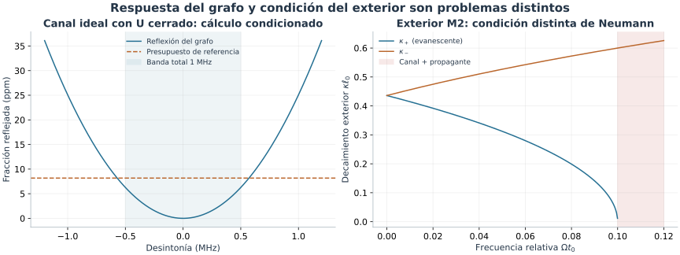

| Eslabón | Resultado |
|---|---|
| Geometría | Ejes y longitudes calculados; confinamiento físico sin solución |
| M2 y \(\Theta_s\) común | Ecuaciones fijadas, sin parámetros nuevos de Canal |
| Campo de Canal | No se dispone de una solución 3D con los tres terminales |
| Modos y coeficientes | Hay modos de Q-ball y del Q-tubo libre; el tubo tiene una banda creciente. Los del grafo presuponen una guía estable |
| Propagación | Respuesta exacta del grafo condicionada a velocidad, paredes y terminales |
| Pérdidas, saturación y ruido | No derivadas para la guía; \(\alpha\), potencia máxima y SNR siguen siendo metas |
| Preparación | No se ha generado ese estado desde una fuente física |
| Función R1 | **No aceptada como derivada** |

La potencia de 100 kW que resulta de multiplicar área por flujo máximo R1 es una especificación, no un límite de ruptura deducido. Sin el campo transversal y su respuesta no lineal no se puede asignar un umbral de saturación, radio de curvatura seguro, calentamiento, fuga o probabilidad de error.

## 16.2. P-11 Memoria: derivación permitida y exclusión de una codificación

P-11 tiene un ciclo y un puerto externo. Un ciclo geométrico puede producir resonancias, pero no implica dos estados estables, una barrera energética ni operaciones de escritura y lectura. En un sistema lineal conservativo con un único canal abierto y sin otros sumideros, la dispersión estacionaria es unitaria y \(|S|=1\); la energía almacenada transitoriamente y la fase de reflexión no constituyen por sí mismas una memoria digital estable.

### El coeficiente de Kerr debe salir del campo

Para ilustrar la reducción correcta, supóngase que ya existe un modo espacial \(u\) de frecuencia \(\Omega_0\), normalizado por \(\int|u|^2d^3x=1\). En régimen débil, la eliminación estática del mediador a orden cuártico produce

\[
C_4=\lambda_0\int|u|^4d^3x-
\frac{g^2}{2}\langle |u|^2,(-\nabla^2+M^2)^{-1}|u|^2\rangle.
\tag{16.4}
\]

Las condiciones de frontera del inverso son las del mediador real del dispositivo. Con la convención de un modo de carga \(\Phi=a u/\sqrt{2\Omega_0}\), \(n=|a|^2\), el término clásico \((K/2)n^2\) tiene

\[
K=C_4/(2\Omega_0^2).
\tag{16.5}
\]

Esta expresión es una reducción débil y estática; un fondo cargado intenso necesita la proyección completa de sus modos y el mediador dinámico. No identifica los parámetros del ensayo Kerr previo.

Para un dominio cuyo operador \(-\nabla^2\) sea no negativo,

\[
-\lambda\int|u|^4\le C_4\le\lambda_0\int|u|^4.
\tag{16.6}
\]

El núcleo cuártico de una componente de densidad de número de onda \(k\) es \(\lambda_0-g^2/[2(M^2+k^2)]\). En el benchmark cambia de signo en \(k/m=100/\sqrt{99}=10.050378\). El tamaño y el perfil del modo importan; no se puede fijar \(K=1\) para Memoria y declarar que M2 lo predice. Al no existir aún el modo de P-11, (16.4) no se puede convertir en un número propio de esa geometría.

### Dos fases globales no proporcionan la barrera R1

En el sistema aislado U(1), los estados \(\Phi_\theta=e^{i\theta}\Phi_0\) tienen exactamente la misma energía para todo \(\theta\). La trayectoria entre \(\theta=0\) y \(\theta=\pi\) tiene barrera cero. Los portales que dependen sólo de \(s\) tampoco distinguen su fase global sin una referencia adicional.

Por tanto, esa codificación concreta **no produce** la barrera R1 de \(60k_BT\): a 300 K, \(60k_BT=2.48517\times10^{-19}\) J = 1.55112 eV. Esto no excluye memoria por amplitud, carga, geometría, interferencia con una referencia o alimentación externa; esas realizaciones requieren demostrar otros estados y operaciones.

El oscilador Kerr alimentado anterior tenía dos atractores para coeficientes elegidos. M2 aislado es hamiltoniano; en una truncación cerrada, el flujo conserva volumen de fase y no genera dos atractores asintóticos disipativos con cuencas abiertas. Un subsistema sí puede perder energía hacia radiación o un baño: sus tasas deben salir de (15.9), con el ruido correspondiente. Una excitación aditiva de un modo cargado requiere contabilizar la fuente de carga; no se obtiene automáticamente de una modulación neutra de \(|\Phi|^2\).

Para un proceso térmico de equilibrio con barrera conocida, el modelo de Arrhenius daría \(\tau=\tau_0e^{\Delta E/k_BT}\). Los valores R1 \(\tau_0=10^{-12}\) s y \(\Delta E=60k_BT\) arrojan \(1.14201\times10^{14}\) s, pero ni esa barrera ni el prefactor han sido derivados. En una memoria alimentada fuera del equilibrio, la tasa de escape necesita la dinámica estocástica o el espectro del generador abierto; no basta insertar una barrera térmica.

El límite \(k_BT\ln2=2.87098\times10^{-21}\) J para un borrado lógico irreversible ideal a 300 K es una cota termodinámica, no una predicción de consumo, rapidez o fidelidad. **P-11 no satisface el criterio completo**, y no se publican como resultados su retención, densidad de bits, tasa de error, tolerancia a ruido o tiempo de escritura.

## 16.3. P-18 Intercambio térmico: transporte y trabajo

Se requiere distinguir tres cosas: conducción pasiva entre dos contactos térmicos, refrigeración con trabajo externo y conversión de calor en trabajo. Un ciclo de tres niveles con energías y tasas escogidas no demuestra ninguna realización concreta de P-18 mediante M2.

La geometría de P-18 tiene un puerto de trabajo/control y un ciclo. Los contactos caliente y frío pueden ser superficies del cuerpo del dispositivo, pero sus Hamiltonianos y acoplamientos deben especificarse: no nacen de etiquetar el puerto como «térmico». En el benchmark escalar desacoplado, la conductancia **rúnica hacia materia ordinaria** es cero. Una materia que conduzca calor por sus interacciones ordinarias no convierte ese cero en un efecto rúnico derivado.

### Conductancia derivable de una transmisión

Para transporte bosónico pasivo, balístico y lineal entre reservorios térmicos,

\[
\dot Q=\sum_n\int_{\Omega_{n,min}}^\infty
\frac{d\Omega}{2\pi}\hbar\Omega\,
\mathcal T_n(\Omega)[n_B(\Omega,T_h)-n_B(\Omega,T_c)].
\tag{16.7}
\]

\(\mathcal T_n\) debe calcularse del problema de campos y contactos. Un canal independiente sin brecha y con transmisión unitaria tiene

\[
G_Q=\pi^2k_B^2T/(3h_P),
\tag{16.8}
\]

donde \(h_P\) es la constante de Planck, para distinguirla del acoplamiento escalar \(h\). A 300 K, \(G_Q=2.83929\times10^{-10}\) W/K. Una conductancia pasiva de 100 W/K requiere al menos \(3.52200\times10^{11}\) canales ideales equivalentes en este marco. No se trata de la capacidad de un solo modo del grafo.

Como contraste, si cada canal tiene la brecha de vacío ilustrativa de 1 eV y transmisión perfecta por encima de ella,

\[
G_{gap}=\frac{k_B^2T}{h_P}
\int_{\Delta/(k_BT)}^\infty
\frac{x^2e^{-x}}{(1-e^{-x})^2}dx.
\tag{16.9}
\]

Para \(\Delta/(k_BT)=38.681727\), se obtiene \(G_{gap}=2.15888\times10^{-24}\) W/K por canal. Alcanzar 100 W/K requeriría \(4.63204\times10^{25}\) de esos canales ideales. Una fase condensada puede tener modos colectivos sin brecha; materia real aporta otros modos; una bomba activa tiene otro balance. Por eso este contraste no es una exclusión universal de P-18, pero sí impide atribuir la conductancia R1 a un único modo masivo de vacío.

### Pérdidas, ruido y umbrales

La respuesta térmica cerca del equilibrio también puede expresarse como

\[
G=\frac1{k_BT^2}\int_0^\infty
\langle J_Q(t)J_Q(0)\rangle_{eq}\,dt,
\tag{16.10}
\]

en el límite clásico y con la corriente, proyección de equilibrio y contactos apropiados; el caso cuántico requiere su correlación de Kubo. Sin el Hamiltoniano y el estado de ambos contactos no se conoce esa correlación. Elegir \(G=100\) W/K y luego calcular calor transferido no deriva \(G\).

Para refrigeración entre \(T_c<T_h\), el balance da \(P=\dot Q_h-\dot Q_c\), y la segunda ley exige \(\mathrm{COP}=\dot Q_c/P\le T_c/(T_h-T_c)\) bajo las hipótesis térmicas usuales. La igualdad es reversible, con potencia finita no garantizada. El valor «mitad de Carnot» de R1 es una meta; no una consecuencia de \(\Theta_s\).

Sin contactos derivados no se obtienen potencia máxima, temperaturas de fallo, irreversibilidad, fluctuaciones térmicas ni tiempo de llegada a consigna. **P-18 no queda aceptada**. Sus balances son consistentes como contratos; no constituyen el dispositivo solicitado.

## 16.4. P-01 Semilla: de datos iniciales a operación

La evolución de la Q-ball del capítulo 14 empieza con un campo y una carga ya presentes. El arranque físico necesita especificar una fuente, el estado inicial de todos los sectores, el flujo de carga, el trabajo entregado, el criterio de selección espacial y la saturación. Ninguno de esos elementos se reemplaza por usar el perfil final como dato inicial del solucionador.

La unicidad de la solución clásica conserva el estado \(\Phi=0\) bajo bombeo multiplicativo si también \(\dot\Phi=0\); la simetría U(1) conserva la carga total. Un esquema paramétrico lineal con modulación prescrita puede amplificar perturbaciones. Su umbral no demuestra que un gesto material genere esa modulación ni que seleccione la forma de Canal.

La cota energética del caso R1 es

\[
t_{carga}\ge\frac{5\,\mathrm J}{2\,\mathrm W-0.05\,\mathrm W}
=2.56410\,\mathrm s.
\tag{16.11}
\]

Sumar los 0.25 s adoptados de asentamiento da 2.81410 s. Sólo tiene sentido si los 2 W están realmente transferidos al sector rúnico. Con portales nulos la potencia transferida desde materia es cero y la cota no proporciona un arranque. Con portales no nulos hay que calcularla. La energía almacenada y el flujo de carga deben ser compatibles simultáneamente; aportar julios no garantiza preparar la carga y la geometría deseadas.

Los fallos demostrados son el arranque clásico desde cero por una fuerza exclusivamente multiplicativa y la creación de carga neta aislada mediante una fuente U(1)-invariante. La preparación cuántica, térmica o por terminales cargados no está descartada, pero **no ha sido derivada en el dispositivo**. P-01 no queda aceptada.

## 16.5. Qué decisión se sigue del criterio solicitado

Ninguna de las cuatro pruebas satisface todos los eslabones. En consecuencia, no se extrapola éxito a las otras primordiales. El capítulo 17 aplica la misma regla al catálogo y marca qué dependencias bloquean cada función. Es un resultado de evaluación, no una promesa de que añadir una ficha resolverá el problema.

El objetivo «M2 común → geometría → estado → comportamiento → R1» continúa sin demostración. Esta edición aporta teoremas, soluciones, espectros, dinámica y contrastes reproducibles que permiten identificar exactamente qué parte está establecida y qué inferencia no se puede hacer. No presenta esa diferencia como un cierre obtenido.

---

# Aplicación del criterio al catálogo

## 17.1. Decisión de extensión

Se evalúan las 24 funciones bajo el mismo criterio físico. **Ninguna tiene todavía una realización completa demostrada.** El inventario localiza la primera obstrucción identificada; los capítulos 20 y 21 añaden una interfaz y leyes capilares comunes, y revisan la corriente axial y los recursos compartidos. No se introducen coeficientes propios de una función para obtener su aceptación.

Los valores R1 permanecen como objetivos de diseño revisables; las funciones se someten a la teoría y pueden corregirse, sustituirse o descartarse. Las casillas falsas significan falta de demostración, y los resultados negativos se registran aparte. Ninguna fila habilita un intervalo operativo, umbral de daño, tasa de error o capacidad no calculados. Cero aceptaciones no significa que las ecuaciones prohíban todas las funciones; significa que ninguna satisface la cadena exigida con la evidencia disponible.

## 17.2. Familias y resultado por primordial

### transporte

| Primordial | Primer eslabón sin demostración de dispositivo | Resultado o razón | Evidencia |
|---|---|---|---|
| P-04 Canal | Estabilidad de la guia | El Q-tubo libre de dos campos tiene una banda longitudinal creciente; el extremo fisico no se ha derivado. | 18; 16.1; 20.6; 21.1 |
| P-08 Distribuidor | Guias y uniones | La matriz de grafo presupone modos transversales e impedancias; no hay solucion M2 de la union. | 16.1 |
| P-13 Retardo | Dispersion y almacenamiento | El retardo depende de dispersion y resonancias; longitud/v no demuestra ruido, ancho de banda ni perdidas M2. | 16.1 |
| P-16 Puente | Aislamiento espacial | Dos componentes desconectados del grafo no prueban diafonia nula en los campos 3D. | 13.7; 15.6 |

### informacion / control

| Primordial | Primer eslabón sin demostración de dispositivo | Resultado o razón | Evidencia |
|---|---|---|---|
| P-07 Compuerta | Control fisico | No se ha obtenido de M2 un estado de compuerta con contraste, trabajo de control y ruido calculados. | 15.6 |
| P-09 Sensor | Acoplamiento de medida | Ganancia, retroaccion y correlaciones de ruido no estan determinadas por el trazo. | 15.6 |
| P-10 Selector | Observable del objetivo | El selector necesita un acoplamiento material que distinga objetivos y cuantifique falsos positivos. | 13.2; 15.6 |
| P-11 Memoria | Estados y barrera | La fase U(1) tiene barrera cero; Kerr, disipacion y escritura del ensayo anterior no fueron derivados de esta geometria. | 16.2 |
| P-12 Comparador | No linealidad y lectura | No se ha derivado el umbral de decision, su transductor ni su distribucion de error. | 15.6 |
| P-14 Reloj | Oscilacion y referencia | Una frecuencia modal no demuestra un reloj alimentado con estabilidad, arranque y difusion de fase calculados. | 14.5; 15.6 |
| P-15 Secuenciador | Estados y transiciones | La maquina de estados operacional no especifica estados microscopicos ni tasas de transicion. | 13.1; 15.6 |

### mecanica

| Primordial | Primer eslabón sin demostración de dispositivo | Resultado o razón | Evidencia |
|---|---|---|---|
| P-02 Anclaje | Fuerza y referencia | No hay perfil material con retroaccion que derive fuerza, rigidez y reaccion del anclaje. | 13.3; 15.6 |
| P-03 Recinto | Frontera y especies | La curva no fija barreras de cada especie, presion soportada ni tasas de fuga. | 13.7; 15.6 |
| P-19 Impulso | Momento y actuador | No hay solucion campo-materia que derive impulso, potencia, reaccion y saturacion. | 13.3; 15.6 |
| P-21 Vibración | Elasticidad y perdida | El modo cuadrupolar calculado no es un actuador material; falta acoplamiento, amortiguamiento y esfuerzo maximo. | 14.5; 15.3; 20.6 |

### energia / termica

| Primordial | Primer eslabón sin demostración de dispositivo | Resultado o razón | Evidencia |
|---|---|---|---|
| P-01 Semilla | Preparacion | El cero clasico es invariante; el bombeo neutro no crea carga neta aislada. | 13.8; 16.4 |
| P-05 Captador solar | Conversion y fuente | El ciclo de tres niveles usa niveles y tasas no derivados; el benchmark desacoplado no absorbe potencia runica de luz. | 13.2; 16.3 |
| P-06 Reserva | Estado, carga y acceso | La Q-ball almacena energia, pero no se ha realizado la geometria de Reserva ni carga/descarga, eficiencia o capacidad R1. | 14.1; 15.5; 20.5 |
| P-17 Luz | Emision electromagnetica | Falta el acoplamiento modal que convierta energia en fotones; b=0 implica conversion directa nula. | 13.2; 15.6 |
| P-18 Intercambio térmico | Contactos termicos | No estan definidos los acoplamientos y correlaciones de ambos contactos; se cuantifica el contraste de canales termicos. | 16.3 |
| P-20 Polarización | Respuesta electromagnetica | B escalar uniforme no introduce birrefringencia local; una respuesta anisotropa por geometria exige resolver Maxwell y materia. | 17.3 |

### materia / quimica

| Primordial | Primer eslabón sin demostración de dispositivo | Resultado o razón | Evidencia |
|---|---|---|---|
| P-22 Separación | Selectividad y transporte | Evaluada: faltan Hamiltoniano material, potenciales quimicos de especies y transporte; el benchmark desacoplado no produce separacion runica. | 17.4; 21.3 |
| P-23 Reacción | Cinética y balance | Evaluada: faltan superficies de energia, contactos y tasas derivadas de un Hamiltoniano quimico comun. | 17.4; 21.3 |
| P-24 Ensamblaje | Transporte y estructura | Evaluada: faltan seleccion de estructura, cinetica y propagacion de errores; depende del mismo contacto material de P-22 y P-23. | 17.4; 21.3 |

## 17.3. Precisiones transversales

La mecánica necesita un tensor de tensiones y una referencia que reciba la reacción. Un fluido escalar isotrópico carece de módulo de corte estático; un entramado podría adquirir rigidez por su estructura, pero esa estructura debe ser una solución estable y no un módulo de Young asignado después.

En una región homogénea con el portal electromagnético escalar y sin materia polarizable adicional, la lagrangiana es proporcional a B(E²−B_magnético²). En unidades de vacío, ε=B y μ=1/B: su producto vale uno y la velocidad de frente sigue siendo c. El factor escalar cambia la impedancia y el acoplamiento, pero no introduce por sí solo birrefringencia ni distingue las dos polarizaciones. Interfaces y geometrías pueden generar respuesta selectiva; necesitan su solución vectorial y no quedan excluidas por este resultado local.

Los balances de energía, información y entropía son restricciones necesarias compartidas. Cumplirlos no demuestra la existencia de estados de control, actuadores o contactos. De igual modo, un error numérico pequeño en una ecuación reducida no mide el error físico de sustituir un dispositivo por esa ecuación.

## 17.4. P-22, P-23 y P-24

Separación, Reacción y Ensamblaje se incluyen ahora en la revisión de dependencias físicas. El aplazamiento anterior se conserva en la fuente archivada, pero no es una instrucción vigente. El benchmark desacoplado no realiza esas funciones mediante M2; faltan el Hamiltoniano material y los procesos indicados en 21.3. Las fichas siguen siendo especificaciones, sin parámetros de operación validados. El ejemplo abstracto de dos estados no demuestra química ni ensamblaje.

## 17.5. Resultado final de esta evaluación

Se ha establecido un sector M2 escalar común con problema de Cauchy controlado, vacío estable, propagación causal y evidencia numérica reproducible de un estado cargado con modos radiales y no radiales. La prueba directa de guía autosostenida del capítulo 18 obtiene una banda longitudinal inestable. No se han derivado un extremo estable, preparación operacional ni acoplamiento térmico/material común que realicen R1. El catálogo registra 0 dispositivos completamente derivados, 24 evaluados respecto de sus dependencias y ninguno excluido por la antigua instrucción. Ningún resultado condicional se contabiliza como una primordial terminada.

---

# Prueba directa de la guía autosostenida y del terminal

## 18.1. Resultado de la prueba

**M2 produce una solución tubular autosostenida de dos campos, pero esa solución es longitudinalmente inestable. No proporciona la guía operacional estable exigida para Canal.** El extremo tampoco queda descrito automáticamente por el terminal Neumann usado en el grafo: el exterior de vacío impone una respuesta dependiente de frecuencia, y falta la solución del extremo que la acople a los modos internos.

Este resultado ya no depende de atribuir al trazo una ecuación de guía. Se han resuelto las ecuaciones completas de M2 para un tubo recto sin paredes materiales, con los mismos parámetros de la Q-ball. Se han calculado los modos longitudinales crecientes, su convergencia y un argumento analítico que explica la inestabilidad. La prueba rechaza esta realización autosostenida concreta; no excluye todas las guías que pudieran sostenerse con materia, corrientes, topología adicional o control activo.

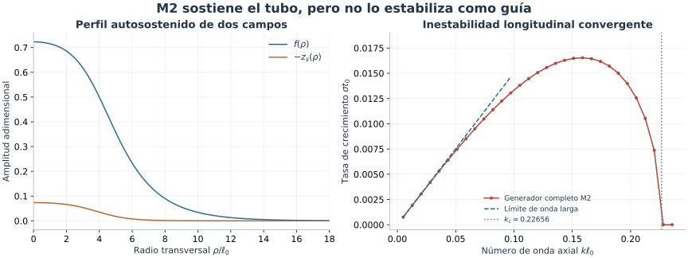

## 18.2. Geometría mínima y ecuaciones transversales

En coordenadas cilíndricas \((\rho,\varphi,z)\), se busca

\[
\Phi=f(\rho)e^{i\omega t},\qquad \chi=z_s(\rho),
\quad \partial_z f=\partial_z z_s=0.
\tag{18.1}
\]

\(z_s\) nombra al mediador para no confundirlo con la coordenada axial. El tubo tiene energía finita **por unidad de longitud**; un tubo infinito no es un objeto de energía total finita. No hay paredes, potencial de atrapamiento externo ni parámetros fundamentales específicos de Canal.

Con las unidades comunes,

\[
f''+\rho^{-1}f'=
(1-\omega^2+198f^2+\hat g z_s+50z_s^2)f,
\]

\[
z_s''+\rho^{-1}z_s'=10000z_s+\hat g f^2+100z_sf^2.
\tag{18.2}
\]

Se exige regularidad \(f'(0)=z_s'(0)=0\), positividad de \(f\) y decaimiento al vacío. El potencial reducido se utiliza únicamente para construir una aproximación inicial de Newton; el resultado final satisface ambas ecuaciones completas y conserva el gradiente del mediador. Cambiar un inicializador no cambia \(\Theta_s\).

Defínanse

\[
I_\perp=2\pi\int_0^\infty\rho f^2d\rho,\quad
T_\perp=2\pi\int_0^\infty\rho[(f')^2+\tfrac12(z_s')^2]d\rho,
\]

\[
U_\perp=2\pi\int_0^\infty\rho V(f,z_s)d\rho,
\quad q=2\omega I_\perp,\quad
\varepsilon=\omega^2I_\perp+T_\perp+U_\perp.
\tag{18.3}
\]

La identidad virial transversal es \(U_\perp=\omega^2I_\perp\). Para \(\omega=0.9\):

| Radio de caja | Nodos adaptados | Energía por longitud \(\hat\varepsilon\) | Carga por longitud \(\hat q\) | Residuo virial relativo |
|---:|---:|---:|---:|---:|
| 30 | 700 | 51.6294936874 | 55.0393671660 | \(3.08\times10^{-10}\) |
| 40 | 1349 | 51.6294938485 | 55.0393673482 | \(4.84\times10^{-12}\) |
| 50 | 2277 | 51.6294938554 | 55.0393673559 | \(3.57\times10^{-13}\) |

Se obtiene \(f(0)=0.72314289818\), \(z_s(0)=-0.07356896013\). El radio donde \(f^2\) cae a la mitad de su valor central es \(\rho_{1/2}=3.91602354\). Los cambios entre las dos últimas energías son del orden de \(10^{-10}\) relativamente. Esto demuestra convergencia numérica del perfil; no implica su estabilidad.

## 18.3. Perturbaciones que el modelo de grafo no contenía

Se perturban los tres campos reales con dependencia axial \(e^{\sigma t+ikz}\). En el sector axisimétrico, los operadores son los del capítulo 14 con laplaciano transversal \(\partial_\rho^2+\rho^{-1}\partial_\rho\), y cada diagonal recibe \(+k^2\):

\[
(\sigma^2+L_u+k^2)u-2\omega\sigma v+C\zeta=0,
\]

\[
(\sigma^2+L_v+k^2)v+2\omega\sigma u=0,
\]

\[
(\sigma^2+L_\chi+k^2)\zeta+Cu=0.
\tag{18.4}
\]

Una raíz real \(\sigma>0\) amplifica la perturbación. Basta **un** sector inestable para rechazar estabilidad espectral completa; no hace falta suponer que los demás sectores también lo sean.

Se discretiza el laplaciano por volúmenes finitos cilíndricos. La transformación con la raíz del peso de cada celda produce matrices simétricas de los Hessianos, conservando la regularidad en el eje. No se reemplaza el mediador por su mínimo algebraico en el espectro.

| Radio, celdas | Mínimo del Hessiano de amplitud \(H_0\) | \(\sigma(k=0.075)\) | \(\sigma(k=0.15)\) |
|---|---:|---:|---:|
| 30, 400 | −0.0513554135 | 0.0105724010 | 0.0164651525 |
| 30, 800 | −0.0513343980 | 0.0105729820 | 0.0164599559 |
| 30, 1600 | −0.0513291458 | 0.0105731270 | 0.0164586567 |
| 40, 2133 | −0.0513291463 | 0.0105731269 | 0.0164586568 |

El autovalor negativo del Hessiano converge con segundo orden. La tasa positiva persiste al refinar y ampliar el dominio. No es el pequeño error de simetría que tendía a cero en la traslación de la Q-ball.

## 18.4. Demostración de la inestabilidad de tubos de esta clase

La razón no depende de un ajuste de pérdida ni de atribuir un signo a una curva. Sean \(y=(\sqrt2f,z_s)\) y

\[
\mathcal S_\omega[y]=\int_{\mathbb R^2}
\left[\tfrac12|\nabla_\perp y|^2+W_\omega(y)\right]d^2x,
\quad W_\omega=V-\omega^2f^2.
\tag{18.5}
\]

Un perfil exacto es un punto crítico de \(\mathcal S_\omega\). Al dilatar transversalmente \(y_L(x)=y(x/L)\),

\[
\mathcal S_\omega[y_L]=T_\perp+L^2(U_\perp-\omega^2I_\perp).
\]

El virial hace nulo el segundo término. Para \(w=\partial_Ly_L|_{L=1}=-x\cdot\nabla y\), la segunda variación cumple

\[
\langle w,H_0w\rangle=0,\qquad H_0w=2\Delta_\perp y\ne0.
\tag{18.6}
\]

La última desigualdad se sigue de que un perfil armónico regular, localizado y no nulo no puede decaer al vacío. Si \(H_0\) fuese no negativo, \(\langle w,H_0w\rangle=0\) implicaría \(H_0w=0\), contradicción. **Todo perfil no trivial de esta clase tiene una dirección negativa de amplitud a frecuencia fija.** Se supone la regularidad y el decaimiento necesarios para las integraciones y para que \(w\) pertenezca al dominio de la forma cuadrática.

En un perfil sin nodos, \(L_v f=0\) y la transformación de estado fundamental da \(L_v\ge0\). También \(L_\chi\ge M^2>0\). Sea \(-\mu^2<0\) el autovalor más bajo de \(H_0\). Para \(0<k<\mu\), \(H_0+k^2I\) sigue teniendo una dirección negativa.

Eliminando \(v\) y \(\zeta\) de (18.4), para \(\sigma\) real se obtiene el operador autoadjunto

\[
\mathcal A(\sigma)=L_u+k^2+\sigma^2
-C(L_\chi+k^2+\sigma^2)^{-1}C
+4\omega^2\sigma^2(L_v+k^2+\sigma^2)^{-1}.
\tag{18.7}
\]

En \(\sigma=0\), es el complemento de Schur de \(H_0+k^2I\); tiene un autovalor negativo. Para \(\sigma\) suficientemente grande, el término \(\sigma^2\) domina y todos los términos restantes están acotados inferiormente, por lo que es positivo. Los inversos son regulares para \(k>0\), y el espectro esencial permanece separado de cero en este problema localizado. Por continuidad, un autovalor de \(\mathcal A\) cruza cero para algún \(\sigma>0\). Al reconstruir \(v,\zeta\), se obtiene un modo longitudinal creciente de las ecuaciones completas.

La perturbación puede tener promedio axial cero en una longitud periódica; entonces no cambia la carga total a primer orden. La conservación de \(Q\) no la elimina. El argumento cubre los tubos rectos localizados, sin nodos, con rotación temporal uniforme, cinética canónica y sin soportes externos de este modelo. No se transfiere sin análisis a corrientes axiales, vórtices, paredes materiales, gravedad o realimentación.

## 18.5. Umbral y tiempo de crecimiento

Del espectro transversal,

\[
k_c=\sqrt{-\lambda_{min}(H_0)}\simeq0.22656,
\quad 0<k<k_c\ \Longrightarrow\ \text{inestabilidad},
\]

\[
\lambda_{axial}>\lambda_c=2\pi/k_c\simeq27.7331\,\ell_0.
\tag{18.8}
\]

En un segmento ideal de longitud \(L\) que admita perturbaciones de Neumann \(\cos(n\pi z/L)\), existe al menos un modo de esta banda si \(L>\pi/k_c\simeq13.8665\ell_0\). Es una observación importante: incluso **imponer** terminales Neumann no estabiliza por sí solo una guía suficientemente larga. Para periodicidad axial, el umbral de longitud del primer modo es \(2\pi/k_c\).

La mayor tasa entre los 31 puntos muestreados es \(\sigma=0.0165338\), cerca de \(k=0.158748\). Se denomina máximo muestreado, no máximo continuo certificado. El tiempo de un factor \(e\) es \(t_e\simeq60.4823t_0\). En la escala común ilustrativa de 1 eV, \(t_e=3.9810\times10^{-14}\) s y \(\lambda_c=5.47248\) μm. Una estimación lineal entre amplitudes \(\delta_0\) y \(\delta_1\) sería \(t\simeq\sigma^{-1}\ln(\delta_1/\delta_0)\); no demuestra la forma ni el tiempo final de fragmentación no lineal.

Como comprobación independiente de la pendiente a larga longitud de onda, la carga lineal de la familia da

\[
\frac{c_L^2}{c^2}=\frac{q}{\omega\,dq/d\omega}\simeq-0.0226604.
\tag{18.9}
\]

Se obtiene al reducir lentamente la fase axial: \(\mathcal L_{linea}(\omega)\) tiene derivada \(q\), y la ecuación de fase linealizada es \((dq/d\omega)\ddot\theta-(q/\omega)\theta''=0\). Por tanto \(\sigma/k\to\sqrt{-c_L^2/c^2}\simeq0.15053\) cuando \(k\to0\). Ésta es la compresibilidad de la **línea completa con su superficie**, distinta de la velocidad acústica positiva del volumen homogéneo del capítulo 15. No hay contradicción entre ambos resultados.

## 18.6. El exterior del terminal desde las ecuaciones

Un extremo de una guía no puede definirse añadiendo \(\partial_z q=0\) sin resolver la transición o justificar esa condición. En el exterior donde el fondo se aproxima al vacío, las perturbaciones complejas tienen bandas laterales de frecuencia \(\omega+\Omega\) y \(\omega-\Omega\); el mediador tiene frecuencia \(\Omega\).

Para un semiespacio de vacío lineal, transformado en las coordenadas tangenciales de momento \(p\), el mapa de Dirichlet a Neumann es

\[
\partial_n\eta_\pm=-\kappa_\pm\eta_\pm,\quad
\kappa_\pm^2=p^2+1-(\omega\pm\Omega)^2,
\]

\[
\partial_n\zeta=-\kappa_\chi\zeta,\quad
\kappa_\chi^2=p^2+10000-\Omega^2.
\tag{18.10}
\]

Se elige decaimiento cuando \(\kappa^2>0\) y la rama saliente retardada cuando hay propagación. El resultado es exacto para el exterior lineal de vacío; aplicarlo a una superficie dentro de la cola del fondo introduce el error de haber despreciado esa cola. En una superficie curva el mapa es un operador espacial no local, no un escalar constante.

En \(p=0\), \(\omega=0.9\), \(\Omega=0.05\),

\[
\kappa_+=0.31224990,\quad
\kappa_-=0.52678269,\quad
\kappa_\chi=\sqrt{9999.9975}.
\tag{18.11}
\]

Ninguno es cero. En \(\Omega=0.1\), sólo la primera banda toca su umbral; las otras siguen siendo evanescentes. Por encima, esa banda puede radiar. Así, el exterior no proporciona una condición Neumann común y constante para todos los componentes sobre una banda.

Para un solo canal y una transición abrupta ideal de demostración, empalmar \(e^{ikz}+r e^{-ikz}\) a un exterior evanescente da

\[
r(\Omega)=\frac{ik+\kappa(\Omega)}{ik-\kappa(\Omega)},
\qquad |r|=1.
\tag{18.12}
\]

La reflexión puede ser total con fase diferente de cero. Neumann correspondería a \(r=+1\); una barrera evanescente finita no se identifica automáticamente con ese valor. Una región de transición resonante podría producir una fase efectiva equivalente en frecuencias seleccionadas: para demostrarlo hay que calcular esa región. La fórmula escalar (18.12) ilustra el empalme; **no es** el coeficiente de reflexión del extremo completo del Q-tubo, que mezcla modos y necesita su fondo axial.

## 18.7. Decisión física

La cadena directa conseguida es

\[
\Theta_s\ \longrightarrow\ \text{ecuaciones de un tubo recto libre}
\ \longrightarrow\ \text{perfil convergente}
\ \longrightarrow\ \text{banda longitudinal creciente}
\ \longrightarrow\ \text{rechazo como guía operacional estable}.
\]

Además se deriva la condición del exterior de vacío y se demuestra por qué no equivale al terminal ideal supuesto anteriormente. No se ha resuelto un extremo estable completo ni el trazado de P-04 con sus curvas y bifurcación, y no se presenta la fórmula de un semiespacio como si lo fuera.

Por tanto, **no puede sostenerse que se haya demostrado la guía y el terminal físicos requeridos**. La realización libre ensayada falla el criterio de estabilidad por una razón estructural, no por falta de precisión del dibujo ni por un parámetro de pérdida mal ajustado. La petición de una demostración positiva no cambia el signo de ese resultado.

## 18.8. Relación con resultados publicados

Q. Chen, [Hydrodynamic and Rayleigh-Plateau instabilities of Q-strings](https://arxiv.org/abs/2412.09815), estudia la inestabilidad longitudinal de cuerdas Q en un modelo de un campo complejo. Es un antecedente pertinente, no una verificación del M2 de dos campos de este proyecto. Aquí se conserva explícitamente el mediador y se calculan sus operadores acoplados. Las cifras, la demostración adaptada y el código de este capítulo pertenecen al análisis del proyecto.

Los datos completos están en `validacion/guia_m2.json` y `validacion/m2_guia_perfil.csv`; se reproducen con `herramientas/guia_m2.py`.

---

# 19 · Resultados y verificaciones de la base M2 4.0

El resultado físico del ensayo de guía es negativo: el Q-tubo autosostenido presenta una banda longitudinal creciente. Un verificador correcto puede, por tanto, confirmar un fallo de diseño; «pruebas correctas» no significa «dispositivo aceptado».

| Verificación | Resultado | Alcance |
|---|---:|---|
| Geometría, contratos y balances anteriores | 194 comprobaciones correctas | Geometría y modelos R1 condicionados |
| Nueva evaluación M2 | 38 comprobaciones correctas | Convergencia, balances, resultados negativos y coherencia de su clasificación |
| Dispositivos completamente derivados | 0 | Conjunción de los eslabones exigidos |

Esta tabla describe la base de entrada, cuyos bytes se conservan en `trazabilidad/fuente_M2_4_0.zip`. Los registros actualizados están en `validacion/informe.json`, `validacion/verificacion_m2.json` y `validacion/capilaridad/verificacion.json`; sus contadores pueden variar al incorporar nuevos archivos. Los 52 controles capilares se interpretan con el alcance del capítulo 22. Las soluciones, espectros, transitorios y contraste térmico están en archivos JSON/CSV separados para evitar ocultar precisión tras el redondeo de las tablas.

La estabilidad del vacío y las propiedades del problema de Cauchy corresponden al sector clásico definido. La prueba analítica de inestabilidad del tubo declara sus hipótesis. La estabilidad espectral completa de una primordial no está demostrada. Las verificaciones en coma flotante no se renombran como certificaciones por intervalos.

Para repetir las pruebas de esta edición se usan las instrucciones de `M2_RESULTADO.md`. Las versiones de dependencias están en `requirements.txt`; el código no necesita conexión de red para ejecutar los cálculos una vez instaladas. El manifiesto SHA-256 identifica el contenido de la entrega, no prueba la corrección física de las ecuaciones.

---

# 20 · De los campos a la interfaz y al régimen capilar

## 20.1. Alcance y clasificación

Se mantiene el sector escalar clásico aislado de M2, con el mismo conjunto Θ de `datos/theta_comun.json`. No se añaden paredes materiales, disipación, fuerzas externas ni parámetros propios de una primordial. La existencia física del sector interactuante completo sigue siendo una **hipótesis**; las identidades siguientes son **resultados analíticos condicionados a la acción M2**. Los perfiles y espectros son **resultados numéricos**. Las leyes capilares son **aproximaciones asintóticas**, contrastadas con esos perfiles y espectros. No constituyen una validación experimental ni un dispositivo preparado y controlable.

Esta derivación conecta explícitamente potencial, ecuación de estado, tensión superficial, equilibrio de objetos finitos y modos. La interfaz es una solución de los campos; su tensión no es un valor asignado para sostener una geometría.

## 20.2. Variables y coexistencia

Se usan las unidades adimensionales del capítulo 13, con \(\Phi=e^{i\mu t}f\), \(\chi=z\), \(s=f^2\). En este capítulo \(\mu\) designa la frecuencia del estado y \(\varpi\) una frecuencia de perturbación. El potencial común es

\[
 V=f^2+99f^4+5000z^2+Gzf^2+50z^2f^2,
 \qquad G=100\sqrt{200}.
\]

Minimizarlo respecto de un mediador **homogéneo** da exactamente

\[
 z_*(s)=-\frac{Gs}{10000+100s},\qquad
 U(s)=s-s^2+\frac{s^3}{1+s/100}.
\]

Esta eliminación es exacta para el potencial homogéneo. Sustituirla en una interfaz con gradientes es una aproximación distinta. La coexistencia con vacío satisface

\[
 U'(s_0)=\mu_0^2=\frac{U(s_0)}{s_0},\qquad
 s_0=0.5037815259212,\quad\mu_0=0.8652988688304.
\]

Para este benchmark se verifica la factorización

\[
 W_{\rm eff}(s)=U(s)-\mu_0^2s
 =\frac{0.99\,s(s-s_0)^2}{1+s/100}\geq0.
\]

Además,

\[
 V(f,z)-\mu_0^2f^2=W_{\rm eff}(f^2)
 +\frac{10000+100f^2}{2}[z-z_*(f^2)]^2.
\]

Por tanto, los dos extremos de la interfaz son mínimos degenerados del potencial a frecuencia fija. No son dos vacíos estáticos de la teoría: uno contiene un campo complejo rotante y carga.

## 20.3. Ecuación de estado e inercia derivadas

Convenciones corregidas en E01: signatura (−+++), fase e^{+iμt}, carga positiva para μ>0. La expresión histórica con signos de otra signatura permanece en el ZIP 4.1 archivado. Esta corrección no cambia las ecuaciones ni las cifras de los solucionadores. Véase el capítulo 23.

Escribiendo \(\Phi=\sqrt{s}\,e^{i\theta}\), el límite de gradientes lentos tiene

\[
 X=-\partial_\alpha\theta\partial^\alpha\theta,\qquad
 P(X)=Xs(X)-U(s(X)),\qquad U'(s)=X.
\]

La derivación requiere la rama local con \(U''>0\) y que los modos de amplitud puedan eliminarse a esas escalas. No vale dentro de toda la interfaz ni cerca de una pérdida de estabilidad de la rama. De la acción se obtienen

\[
 j^\alpha=-2s\partial^\alpha\theta,\quad
 T^{\alpha\beta}=2s\partial^\alpha\theta\partial^\beta\theta+g^{\alpha\beta}P,
\]
\[
 n=2\mu s,\quad p=\mu^2s-U(s),\quad
 \epsilon=\mu^2s+U(s),\quad
 w_b\equiv\epsilon+p=2\mu^2s,
\]
\[
 c_s^2=\frac{sU''}{sU''+2\mu^2}.
\]

En coexistencia, \(n_0=0.8718431690345\), \(w_{b0}=0.7544049079630\) y \(c_s^2=0.2503136782638\). La densidad de inercia de un flujo lento es **la entalpía \(w_b\)** en unidades \(c=1\), porque \(T^{0i}=w_b v^i+O(v^3)\). No se sustituye por la densidad de carga ni se introduce un factor de ajuste. En SI la densidad de masa inercial es \(w_b/c^2\).

## 20.4. Pared plana de ambos campos

La interfaz plana en coexistencia satisface

\[
 f''=(1-\mu_0^2+198f^2+Gz+50z^2)f,
 \qquad z''=10000z+Gf^2+100zf^2,
\]

con \((f,z)\to(\sqrt{s_0},z_*(s_0))\) a la izquierda y \((0,0)\) a la derecha. Multiplicar por las derivadas y sumar da la primera integral

\[
 f'^2+\tfrac12z'^2=V-\mu_0^2f^2\equiv W.
\]

La tensión superficial es el exceso de energía **a potencial químico fijo**, o exceso de \(E-\mu_0 Q\) por área:

\[
 \tau=\int_{-\infty}^{\infty}(f'^2+\tfrac12z'^2+W)\,dx
 =\int_{-\infty}^{\infty}(2f'^2+z'^2)\,dx.
\]

El segundo integrando es la diferencia entre tensiones normal y tangencial. Así, \(\tau\) conecta un perfil microscópico con una fuerza macroscópica. El cálculo completo da

\[
 \boxed{\tau\simeq0.1265742605132}.
\]

La diferencia relativa entre las dos últimas resoluciones es aproximadamente \(3\times10^{-12}\); no es una cota certificada del error total. El residuo máximo de la primera integral de la última solución es \(1.1\times10^{-13}\).

Hay además un control variacional independiente. Descartar el término no negativo del mediador y su gradiente da una cota inferior al ínfimo de la tensión. Restringir las curvas a \(z=z_*(f^2)\) da una cota superior de prueba:

\[
 2\int_0^{\sqrt{s_0}}\sqrt{W_{\rm eff}(f^2)}\,df
 \leq\tau_{\min}\leq
 2\int_0^{\sqrt{s_0}}\sqrt{Z(f)W_{\rm eff}(f^2)}\,df,
\]
\[
 Z(f)=1+\tfrac12\left(\frac{dz_*}{df}\right)^2
 =1+\frac{2f^2G^2M^4}{(M^2+Hf^2)^4},\qquad H=100.
\]

Los valores son 0.1261560149751 y 0.1265742687755. El perfil completo queda entre ambos. La coincidencia casi completa con la cota de prueba explica por qué la aproximación adiabática con cinética inducida funciona bien aquí. No demuestra unicidad ni certifica que la solución numérica sea el mínimo global. Descartar también la cinética inducida subestima la tensión en aproximadamente 0.33 %.

## 20.5. Equilibrio curvo sin presión impuesta

Sea \(d=3\) para una esfera y \(d=2\) para la sección de un tubo recto, con \(S_2=4\pi\), \(S_1=2\pi\). La energía y carga del segundo caso son por longitud. Definimos

\[
 I=S_{d-1}\int r^{d-1}f^2\,dr,\quad Q=2\mu I,
\]
\[
 E=\mu^2 I+S_{d-1}\int r^{d-1}
 [f'^2+\tfrac12z'^2+V]dr.
\]

La virial exacta es \((d-2)T+d(U_{\rm int}-\mu^2 I)=0\), donde \(T\) es la energía de gradientes y \(U_{\rm int}\) la integral de \(V\). La conservación del tensor de tensiones da, también exactamente,

\[
 T_{rr}=f'^2+\tfrac12z'^2-(V-\mu^2f^2),\qquad
 \frac{dT_{rr}}{dr}=-\frac{d-1}{r}(2f'^2+z'^2),
\]
\[
 T_{rr}(0)-T_{rr}(L)
 =(d-1)\int_0^L\frac{2f'^2+z'^2}{r}\,dr.
\]

El integrando es regular en el origen. En el límite de interfaz delgada, \(T_{rr}(0)\to p\), \(T_{rr}(\infty)=0\), y se obtiene la ley de Laplace, sin agregar una fuerza:

\[
 p\simeq\frac{(d-1)\tau}{R}.
\]

Para comparar objetos finitos se usa el radio equimolar **definido** por

\[
 U'(s_b)=\mu^2,\qquad R_e=\left(\frac{dI}{S_{d-1}s_b}\right)^{1/d}.
\]

No se identifica exactamente con el radio de tensión superficial; su diferencia produce correcciones de curvatura. A carga grande,

\[
 R_Q=\left(\frac{dQ}{S_{d-1}n_0}\right)^{1/d},\qquad
 E=\mu_0Q+S_{d-1}\tau R_Q^{d-1}+O(R_Q^{d-2}).
\]

Una sola tensión predice ambas familias. Se verifican diez estados, con radios de norma \(R_N=8,16,32,64,128\) en ambas dimensiones. \(R_N\) parametriza \(I=S_{d-1}s_0R_N^d/d\); es una condición de estado, no un nuevo parámetro fundamental. Los residuos de virial, norma y balance de tensiones se conservan en JSON. La derivada de estados próximos verifica además \(dE/dQ=\mu\).

## 20.6. Modos capilares

A velocidades pequeñas, longitudes de onda grandes respecto del espesor de interfaz y frecuencias suficientemente menores que \(c_s/R\), el flujo interior es casi incompresible. Con \(\mathbf v=\nabla\psi\), se tienen \(\nabla^2\psi=0\), \(w_{b0}\partial_t\psi=-\delta p\) y la condición cinemática \(\partial_t\eta=\partial_r\psi\). Las condiciones de interfaz proceden de la conservación del tensor anterior.

Para una esfera, \(\psi\propto r^\ell Y_{\ell m}\) y
\(\delta p=\tau(\ell-1)(\ell+2)\eta/R^2\). Resulta

\[
 \boxed{\varpi_\ell^2\simeq
 \frac{\tau}{w_{b0}R^3}\ell(\ell-1)(\ell+2)},\qquad\ell\geq2.
\]

\(\ell=1\) es la traslación, no un oscilador de restitución. \(\ell=0\) necesita compresibilidad y la restricción de carga. No queda cubierto por esta fórmula.

Para un tubo axisimétrico, \(\psi\propto I_0(kr)e^{ikz+\sigma t}\),
\(\delta p=\tau(k^2-R^{-2})\eta\). Por tanto,

\[
 \boxed{\sigma^2\simeq\frac{\tau}{w_{b0}R^3}
 x(1-x^2)\frac{I_1(x)}{I_0(x)}},\qquad x=kR.
\]

Hay crecimiento para \(0<x<1\). El umbral tiende a \(k_cR=1\); cuando \(x\ll1\),

\[
 \sigma^2\simeq\frac{\tau k^2}{2w_{b0}R},\qquad
 c_L^2\simeq-\frac{\tau}{2w_{b0}R}.
\]

La velocidad de sonido del interior homogéneo tiene cuadrado positivo, mientras que la respuesta longitudinal del **tubo con sección libre** tiene cuadrado negativo. Son perturbaciones diferentes: la segunda permite redistribuir carga y cambiar el área de la interfaz. No hay contradicción entre ambos resultados. La derivada \(q/(\mu\,dq/d\mu)\) contrasta independientemente ese signo y su escala.

## 20.7. Contraste con el espectro microscópico

Se diagonaliza el generador completo de las tres perturbaciones reales, incluyendo el mediador y los términos giroscópicos del capítulo 14. No se inserta la fórmula capilar en ese operador. Para esferas se estudia \(\ell=2\); para tubos, \(kR_e=0.6\). Se usan cinco pasos entre 0.1 y 0.00625 y extrapolación de los autovalores cuadrados en \(h^2\). Se publican también las muestras gruesas.

| \(R_N\) | Error de frecuencia esférica respecto de la predicción | Error de crecimiento tubular | \(k_cR_e\) tubular |
|---:|---:|---:|---:|
| 16 | −1.2823 % | −4.1932 % | 0.951094 |
| 32 | −0.6109 % | −2.4392 % | 0.972355 |
| 64 | −0.3076 % | −1.3092 % | 0.985302 |
| 128 | −0.1540 % | −0.6778 % | 0.992419 |

Los errores disminuyen al aumentar el radio, como requiere la aproximación. Para \(R_N=128\), la frecuencia cuadrupolar extrapolada es aproximadamente 0.000801901 y la tasa tubular 0.0000935785. Sus diferencias entre dos extrapolaciones sucesivas son inferiores a \(2\times10^{-7}\) y \(5\times10^{-6}\), respectivamente, en términos relativos. Son estimaciones de discretización, no intervalos rigurosos.

A ese radio, una malla \(h\simeq0.1\) reduce la frecuencia esférica calculada a 0.000708698 e infla el crecimiento tubular a 0.000143501. Un residuo algebraico pequeño de un autovector no detecta este error espacial. La coincidencia aislada entre una muestra y la fórmula tampoco demuestra convergencia.

La comparación de dominio se realiza a \(R_N=64\), extendiendo el margen de vacío de 30 a 40 y refinando la solución de fondo. El cambio espectral es menor que \(2\times10^{-7}\) relativo. En esferas se informa por separado el pequeño cambio de \(h=L/(N+1)\) entre las dos cajas. No se afirma una cota uniforme del error de dominio para todos los radios ni una clasificación de todo el espectro.

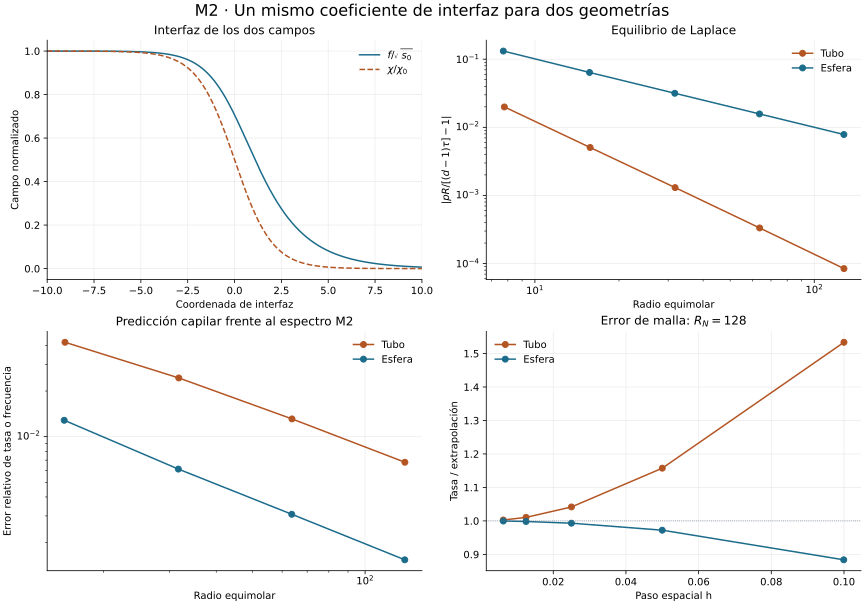

## 20.8. Reproducción, unidades y límites

`herramientas/capilaridad_m2.py` lee Θ común y `datos/ensayo_capilaridad.json`. Guarda perfiles, resultados y configuración en `validacion/capilaridad/`. Para la pared se fija la libertad de traslación mediante una condición integral de fase; la frecuencia es una incógnita auxiliar de la caja finita que converge a \(\mu_0\). Esa condición selecciona el origen de coordenadas; no añade una pared física ni una fuerza. Los valores de extremo son los estados asintóticos, aproximados en una caja cuyo tamaño se refina.

Para esferas y tubos se fija la norma y se resuelve \(\mu\) como incógnita. La solución adiabática inicializa Newton, pero las soluciones publicadas satisfacen **ambas ecuaciones**. Ni el inicializador capilar ni el radio de norma determinan de antemano la presión, energía o frecuencia obtenidas.

Con \(E_0=mc^2/\lambda\), \(\ell_0=\hbar c/(mc^2)\), \(t_0=\hbar/(mc^2)\), se recuperan:

| Magnitud | Factor físico multiplicativo |
|---|---|
| Radio | \(\ell_0\) |
| Frecuencia o tasa | \(t_0^{-1}\) |
| Energía esférica | \(E_0\) |
| Energía tubular por longitud | \(E_0/\ell_0\) |
| Tensión superficial | \(E_0/\ell_0^2\) |
| Presión y entalpía volumétrica | \(E_0/\ell_0^3\) |
| Carga esférica | \(1/\lambda\) |
| Carga tubular por longitud | \(1/(\lambda\ell_0)\) |

La variación de carga prueba sensibilidad al **estado**, no robustez frente a todas las constantes de Θ. La variación de \(m\) y \(\lambda\) en esta familia cambia las escalas anteriores; no representa un barrido independiente de \(g,h,M,\lambda_0\). Permanecen abiertos ese barrido, la interfaz a temperatura finita, correcciones cuánticas, curvatura de orden superior, modos no axisimétricos de tubos, dinámica no lineal de fragmentación y estabilidad orbital de las gotas. La fórmula capilar no debe extrapolarse a longitud de onda arbitrariamente corta ni usarse para inferir una velocidad de frente: fuera de su régimen manda M2.

El mecanismo capilar explica y extiende el resultado negativo de P-04; no lo revoca. El resultado es un puente microscópico–macroscópico dentro del sector común. Preparación, contactos materiales, pérdidas, control y transducción medible continúan siendo eslabones diferentes.

## 20.9. Referencias y procedencia de las fórmulas

Qian Chen, [Hydrodynamic and Rayleigh–Plateau instabilities of Q-strings](https://arxiv.org/html/2412.09815v2), estudia la analogía capilar en un modelo de campo complejo con potencial séxtico. Ese trabajo sirve como contraste primario del mecanismo y del umbral, no como dato numérico del M2 de dos campos. Aquí la tensión se calcula con ambos gradientes y la inercia se obtiene de su tensor de energía–momento, sin ajuste.

J. Heeck, A. Rajaraman, R. Riley y C. B. Verhaaren, [Understanding Q-Balls Beyond the Thin-Wall Limit](https://arxiv.org/abs/2009.08462), aporta contexto para distinguir la aproximación de pared delgada de los perfiles completos. Las identidades, los valores y los contrastes de este capítulo se derivan y reproducen en el paquete.

---

# 21 · Corriente, clasificación física y condiciones de avance

## 21.1. Una corriente axial uniforme no estabiliza este tubo libre

**Resultado analítico, bajo hipótesis explícitas.** Considérese un tubo recto sin nodos, aislado, sin materia ni fuentes, con amplitudes independientes de tiempo y coordenada axial:

\[
 \Phi=f(\rho)e^{i(\omega t-Kz)},\qquad\chi=z_\chi(\rho),
 \qquad\mu^2=\omega^2-K^2.
\]

El subíndice distingue el mediador de la coordenada axial. Las ecuaciones transversales dependen de \(\omega,K\) sólo por \(\mu^2\). Escalar el radio transversal en \(E-\omega Q\) —o en la acción transversal— da

\[
 \int d^2x\,V=\mu^2\int d^2x\,f^2.
\]

Como \(V>0\) para todo campo no nulo del benchmark, no existe un perfil no trivial localizado de esta clase con \(\mu^2\leq0\). Si \(\mu^2>0\), hay un marco inercial con \(K'=0\), frecuencia \(\mu\) y el mismo perfil. La corriente uniforme es un estado en movimiento de ese tubo; no añade una presión de soporte independiente ni un parámetro fundamental.

La conclusión sobre crecimiento de onda larga se restringe a ramas con \(c_L^2<0\), comprobadas para el tubo del capítulo 18 y en el límite capilar del capítulo 20. No se ha demostrado aquí ese signo para toda rama posible de frecuencia. La simple frase «es un boost» no basta para trasladar sin cuidado un espectro con número de onda real: un modo con frecuencia compleja puede tener número de onda complejo en otro marco. Se comprueba por separado la banda de onda larga. Si en reposo \(\Omega'^2=-a^2k'^2\), \(a>0\), la transformación de Lorentz da

\[
 (\Omega-vk)^2=-a^2(k-v\Omega)^2.
\]

Para \(k\) real y \(|v|<1\),

\[
 \frac{\Omega}{k}=\frac{v(1+a^2)\pm i a(1-v^2)}{1+a^2v^2}.
\]

Usando perturbaciones \(e^{i(kz-\Omega t)}\), siempre existe una rama creciente. El coeficiente imaginario sólo tiende a cero en el límite singular \(|v|\to1\). El benchmark del capítulo 18 tiene \(a^2\simeq0.0226604\); el capítulo 20 da su origen capilar para tubos grandes.

Esta conclusión concierne a perturbaciones temporales de onda larga en tubos infinitos o suficientemente largos y al régimen de la ley efectiva. No clasifica inestabilidades absolutas frente a convectivas de paquetes localizados, ni impone condiciones en un dispositivo finito. Tampoco excluye flujos no uniformes, campos con momento angular, materia, contactos o realimentación. Esas alternativas requieren ecuaciones y estados propios; no heredan estabilidad de este cálculo. La rotación azimutal no es la corriente axial aquí estudiada.

## 21.2. Qué puede reutilizarse entre funciones

Una primordial es una función o especificación; una familia de soluciones es una estructura física. El mismo conjunto de campos puede producir distintas funciones según estado, geometría y acoplamiento. Conviene reutilizar soluciones demostradas sin confundir equivalencia funcional con equivalencia física.

| Recurso común | Resultado disponible | Funciones relacionadas | Eslabón pendiente |
|---|---|---|---|
| Estado cargado localizado | Perfil y evidencia espectral/dinámica condicionada | Reserva, referencias y resonadores | Preparación, acceso a carga y transducción |
| Interfaz y tensión superficial | Perfil de ambos campos, balance mecánico y límite capilar | Reserva, Recinto, modos de Vibración | Barreras de especies y contacto mecánico material |
| Modos y respuesta espectral | Modos ligados y dispersión en sectores calculados | Sensor, Retardo, Reloj, Vibración | Excitación, lectura, pérdidas y ruido derivados |
| Grafo de puertos | Modelo reducido condicionado | Canal, Distribuidor, Puente | Guías y uniones físicas estables |
| Control de estados | Contratos operacionales | Compuerta, Selector, Memoria, Comparador, Secuenciador | Estados distinguibles, barreras, trabajo y error |
| Contactos y portales materiales | Forma candidata; benchmark desacoplado | Captador solar, Luz, Intercambio térmico, Impulso, Polarización | Hamiltoniano material común y coeficientes medibles |
| Transporte y transformación de especies | Restricciones de conservación | Separación, Reacción, Ensamblaje | Identidades de especies, potenciales químicos, cinética y errores |

No se fusionan Reserva y Memoria: un depósito de energía no demuestra dos estados legibles con retención. Tampoco se fusionan Canal y Retardo: incluso compartiendo una estructura, el segundo requiere dispersión o almacenamiento temporal controlado. Ni Recinto y Anclaje: una barrera de transporte no constituye una referencia mecánica que reciba reacción. La evidencia disponible no determina aún una clasificación física mínima superior a las 24 funciones históricas. Mantener sus identificadores permite trazar contratos; no protege su número ni sus geometrías frente a resultados futuros.

Surgen recursos que la lista funcional no representa como primordiales independientes: **reservorio de carga, contacto de transducción, interfaz de fase y preparación de estado**. Se registran como requisitos de construcción comunes, sin asignarles una nueva ley ni convertirlos automáticamente en cuatro primordiales. Un futuro componente puede reunir varios si se demuestra su funcionamiento conjunto.

## 21.3. Revisión de Separación, Reacción y Ensamblaje

Las tres se incluyen en la evaluación actual. La instrucción de aplazarlas pertenecía a una etapa anterior y ya no delimita el alcance vigente.

En el benchmark \(A=B=1\), la dinámica material y electromagnética no recibe un acoplamiento rúnico directo. Por tanto, ese sector no predice separación selectiva, cambio de tasas químicas ni ensamblaje dirigido por los campos M2. La física material ordinaria puede realizar procesos por sí misma, pero no establece estas funciones rúnicas.

Una extensión justificable debe fijar un Hamiltoniano material común, observables de especies, estados ambientales y portales antes de calcular prestaciones. P-22 requiere diferencias de potencial químico o respuesta de especies y un mecanismo de transporte. P-23 requiere superficies de energía y tasas con balance detallado cuando corresponda; una fuente puede sacar al sistema del equilibrio, con su trabajo explícito. P-24 añade transporte, selección de estructura, cinética y acumulación de errores. Compartir un transductor sería una simplificación física real; asignar constantes de eficacia a cada función no lo demuestra. No se publican parámetros de operación ni instrucciones de fabricación material sin esa base.

## 21.4. Ciencia, ingeniería e interfaz

La interfaz «intención → configuración → control → resultado» sigue siendo un **objetivo de diseño**. Su arquitectura puede especificarse antes de disponer de un dispositivo, pero debe rechazar una tarea si no existe una realización admitida dentro del dominio verificado.

La ciencia debe aportar soluciones, incertidumbre, estabilidad y balances. La ingeniería debe aportar preparación, contactos, calibración, sensores, márgenes y retirada controlada. La interfaz debe seleccionar configuraciones ya caracterizadas; no debe pedir al operador que resuelva las ecuaciones ni ocultar la falta de una solución aceptada. Con el catálogo actual, ninguna receta R1 equivale a una operación física habilitada.

Las puertas de aceptación indican si existe evidencia de cada eslabón. Un valor `false` significa **demostración no disponible**; el resultado negativo de una realización concreta se codifica aparte. La función física se evalúa por medidas y límites derivados. Los números R1 pueden revisarse o abandonarse: no son condiciones que la teoría deba satisfacer a cualquier precio.

## 21.5. Programa siguiente con condiciones de parada

| Trabajo | Evidencia exigida para avanzar | Resultado que obliga a revisar o abandonar la vía |
|---|---|---|
| Preparación de una gota | Fuente o reservorio con energía y carga contabilizadas; transitorio que alcanza el estado objetivo | Creación neta de carga sin contrapartida; asumir una semilla sin explicar su origen |
| Primer componente de almacenamiento | Entrada/salida derivadas, accesibilidad del estado y balances de carga/energía | Usar la energía de equilibrio como capacidad extraíble sin calcular el proceso |
| Contacto material común | Hamiltoniano, escalas y respuesta que sirvan a varias funciones; límites de validez | Pérdida, fuerza o ruido asignados sólo para lograr una prestación |
| Alternativa a Canal libre | Estado completo y espectro con fronteras físicas | Reutilizar el tubo inestable o imponer un extremo ideal como prueba de estabilidad |
| Memoria | Estados distinguibles, barrera derivada, lectura/escritura y ruido | Codificar bits sólo en fases U(1) globales con barrera nula |
| Modelo capilar ampliado | Barrido de Θ, curvatura y dinámica no lineal contrastados con M2 | Extrapolar fuera del régimen o atribuir errores de malla a física |

El paquete no contiene los datos materiales ni una preparación que permitan cerrar los tres primeros renglones. Inventarlos no constituye desarrollo. El avance actual llega a soluciones comunes y coeficientes efectivos contrastados; la cadena hasta dispositivo y uso sigue abierta en los eslabones identificados.

---

# 22 · Estado de evidencia y metodología de continuidad

## 22.1. Auditoría de entrada

La fuente única de estado inicial de esta iteración es `Proyecto_Runas_M2_4_0(1).zip`, conservada íntegra en `trazabilidad/fuente_M2_4_0.zip`. Se revisaron sus 156 archivos antes de modificar el proyecto. El inventario con tamaños y SHA-256 se conserva en `trazabilidad/auditoria_entrada.json`.

Se leyeron teoría, derivaciones, fichas, JSON y código, se contrastó el integrado con sus fuentes, se analizaron los datos brutos y la estructura SVG y se verificó la integridad del manifiesto original. La reproducción de los cálculos originales terminó correctamente: los siete CSV previos coinciden exactamente en sus valores numéricos. Esa coincidencia es una prueba de reproducibilidad de este entorno, no una demostración independiente de que todas las ecuaciones describan un dispositivo.

El archivo de origen preserva tanto las conclusiones negativas como las instrucciones de alcance que fueron sustituidas. Los documentos de trabajo vigentes y `datos/estado_evidencia.json` fijan el estado actual; no se importa información de otras conversaciones o versiones no incluidas.

## 22.2. Taxonomía

| Categoría | Qué permite afirmar | Qué no permite inferir |
|---|---|---|
| Definición | Significado de variable, observable o criterio | Existencia física |
| Hipótesis | Acción, acoplamiento o estado postulado con consecuencias contrastables | Confirmación por conveniencia |
| Aproximación | Relación dentro de una jerarquía de escalas declarada | Validez fuera de ese régimen |
| Resultado derivado | Consecuencia de premisas y operaciones explícitas | Verdad de las premisas en todo contexto |
| Resultado analítico | Demostración simbólica bajo hipótesis indicadas | Certificación de entradas numéricas no demostradas |
| Resultado numérico | Solución o estimación producida por un algoritmo concreto | Exactitud del continuo o del sistema material |
| Resultado validado | Contraste especificado, con objeto, método y rango de validez | Validación universal o experimental si sólo fue interna |
| Objetivo de diseño | Prestación que se desea obtener y se puede revisar | Parámetro medido o coeficiente derivado |
| Problema abierto | Eslabón sin evidencia suficiente y su condición de resolución | Imposibilidad demostrada |

«Derivado» puede coexistir con «analítico» o «numérico»: el primero indica procedencia, los otros el método. «Validado» exige decir **qué** se contrastó y **cómo**. En esta entrega la validación nueva es numérica interna, mediante balances, refinamiento y comparación con un límite analítico; no se declara validación experimental.

## 22.3. Qué estaba establecido y qué cambia

| Sector | Estado de entrada | Avance o conservación en 4.1 |
|---|---|---|
| Geometría y contratos | Construcción exacta de plantillas; R1 son metas | Geometría conservada; metas sometidas expresamente a la teoría |
| Acción M2 | Hipótesis escalar común; Θ total interactuante no identificado | Sin nuevos términos ni constantes fundamentales |
| Vacío, causalidad y Cauchy | Resultados analíticos del sector clásico con hipótesis | Se conservan con su alcance; no se extienden al sector cuántico/material |
| Gota cargada | Perfil convergente, sectores espectrales y transitorio | Familia de escalas, presión, energía y modo de superficie |
| Tubo libre P-04 | Perfil convergente y prueba de inestabilidad longitudinal | Resultado negativo preservado y explicación capilar; corriente axial uniforme no elimina la banda de onda larga |
| Memoria de fase | Barrera U(1) nula; no realiza la retención R1 | Se conserva; no se identifica carga almacenada con memoria legible |
| Preparación | Cero clásico invariante y carga conservada | Sigue faltando un proceso completo de preparación |
| Contactos y térmica | Contrastes condicionales; benchmark desacoplado | Sigue faltando Hamiltoniano material y ruido derivados |
| Interfaz micro–macro | Ecuación de estado y límites locales | Pared de dos campos, tensión, balance curvo, Laplace, energía y modos |
| Catálogo | 21 funciones evaluadas y 3 aplazadas | 24 evaluadas, 0 dispositivos completos; nuevas dependencias registradas |

La correspondencia funcional por sí sola sigue siendo provisional. Una ficha con ecuaciones y puertos no establece una realización. La inestabilidad de un tubo específico tampoco demuestra que todas las implementaciones posibles de Canal sean imposibles.

## 22.4. Cobertura de la cadena física

| Eslabón | Evidencia actual | Límite pendiente |
|---|---|---|
| Leyes y parámetros comunes | Acción escalar y benchmark único | Calibración, EFT cuántica y Θ material total |
| Soluciones físicas | Gota, tubo e interfaz de ambos campos | Estructuras conectadas y terminales completos |
| Modos y estabilidad | Teoremas condicionados, espectros y resultado negativo tubular | Certificación continua y dinámica no lineal general |
| Coeficientes efectivos | Ecuación de estado, tensión y respuesta capilar | Disipación, ruido y acoplamientos materiales |
| Preparación | Restricciones de conservación | Fuente/reservorio y transitorio que lleguen al estado |
| Comportamiento medible | Predicciones de energía, presión y frecuencias de campos | Transductor y protocolo de medición realizados |
| Componentes y dispositivos | Candidatos y contratos revisables | Primer dispositivo de extremo a extremo |
| Operación sencilla | Arquitectura objetivo e interfaces tipadas | Selección automática de realizaciones caracterizadas |

El inventario de evidencia enlaza premisas, resultados y bloqueos en `datos/estado_evidencia.json`. El catálogo de aceptación se refiere a **dispositivos**; no invalida los resultados de sectores que sí están derivados.

## 22.5. Reproducibilidad y criterios de detención

`herramientas/reproducir.py` ejecuta la cadena en orden, conserva un registro de cada salida y se detiene ante cualquier código de fallo. `--solo-verificar` comprueba los resultados incluidos sin repetir los solucionadores. Las versiones probadas están en `requirements.txt`; se limitan los hilos BLAS para evitar diferencias innecesarias de ejecución. Las semillas deterministas de los solucionadores espectrales quedan en el código.

Los criterios capilares se fijan en `datos/ensayo_capilaridad.json`. Son tolerancias del contraste numérico, no contratos R1. Incluyen dominio, paso, norma, virial, balance de tensiones, primera ley, cotas de la interfaz, comparación microscópica–macroscópica y persistencia del resultado negativo. Se guardan las mallas gruesas que fallan como aproximación: no se borran por obtener una gráfica menos favorable.

La convergencia se ha estudiado en el conjunto de estados indicado. No se publican intervalos certificados ni probabilidades de estabilidad. La sensibilidad a la carga está calculada; la robustez respecto de todos los parámetros independientes del modelo sigue abierta. El comportamiento no lineal general no se deduce de autovalores muestreados. No se agregan ensayos redundantes sólo para aumentar un contador.

## 22.6. Regla de autoridad y cambios

`datos/theta_comun.json` fija el benchmark escalar. `datos/estado_evidencia.json` y `datos/aceptacion_m2.json` fijan el alcance de afirmaciones y realizaciones. Los capítulos fuente contienen las derivaciones; los JSON/CSV de validación contienen los resultados. `Runica_Tratado_integrado.md`, fichas y tablas son vistas regenerables. Los textos redondeados del capítulo 20 corresponden al benchmark incluido; cualquier cambio en Θ obliga a revisar sus cifras y dominio, aunque un script termine correctamente.

El manifiesto identifica los bytes de entrega. La verificación de hashes comprueba integridad, no ciencia. La fuente archivada y el registro de cambios permiten reconstruir qué afirmaciones se conservaron, corrigieron o añadieron. Las directrices de continuidad están en `DIRECTRICES_DESARROLLO.md`.

---

# 23 · Convenciones y espacio fundamental de M2

## 23.1. Resultado de E01

La acción escalar de 13.1 se conserva. La signatura es (−+++), Φ=f exp(+iωt), Q positivo para ω>0. Se corrigen en 20.3 tres signos covariantes que no concordaban con esa signatura. Los operadores radiales y sus resultados no requieren un cambio físico. M2 sigue siendo M2; 4.2 es una versión del proyecto.

La autoridad de parámetros es `datos/theta_comun.json`. `modelo_m2.ScalarModel` admite cinco coordenadas independientes; los solucionadores generales están en `soluciones_m2.py`. Los scripts históricos contienen reducciones propias del benchmark y ahora rechazan explícitamente cambios de sus constantes. Sus vistas numéricas históricas no son fuentes alternativas para variar Θ.

## 23.2. Noether, tensor y flujos

Para δΦ=iαΦ,

\[
j^\mu=i(\Phi^*\partial^\mu\Phi-\Phi\partial^\mu\Phi^*)
=-2\operatorname{Im}(\Phi^*\partial^\mu\Phi),\quad
j^0=2\operatorname{Im}(\Phi^*\dot\Phi).
\]

La ecuación de Φ implica ∂μjμ=0: las dos contribuciones de V_s se cancelan. El tensor de Hilbert es

\[
T^{\mu\nu}=2\operatorname{Re}(\partial^\mu\Phi^*\partial^\nu\Phi)
+\partial^\mu\chi\partial^\nu\chi+\eta^{\mu\nu}\mathcal L.
\]

T⁰⁰ es exactamente la densidad positiva de 13.5. Su flujo es

\[
T^{0i}=-2\operatorname{Re}(\dot\Phi^*\partial_i\Phi)-\dot\chi\partial_i\chi.
\]

Al escribir Φ=√s exp(iθ), X=−∂θ·∂θ y L≈P(X), resulta jμ=−2s∂μθ y Tμν=2s∂μθ∂νθ+ημνP. Para θ=μt, j⁰=2μs y T⁰⁰=2μ²s−P=μ²s+U. Esto comprueba conjuntamente corriente y tensor: no basta cambiar X aislado.

Con θ=ωt−Kz+nφ se obtiene Pz=KQ y Jz=−nQ. El signo angular cambia si se escribe −nφ. Q,n,J no son controles independientes dentro de ese ansatz. Los ensembles a Q, P, J fijos deben incluir sus restricciones en la segunda variación. Para el Hessiano radial a Q fija se conserva el término de rango uno de 14.4.

## 23.3. Dimensiones y coordenadas

| Magnitud | Dimensión de masa |
|---|---:|
| Φ, χ, m, M, g | 1 |
| λ₀, h, λ | 0 |
| V, L, Tμν | 4 |
| jμ | 3 |
| Q | 0 |
| tensión superficial | 3 |

Θ=(m,M,λ₀,g,h); λ=g²/(2M²)−λ₀ es derivada. La familia original λ₀=99λ, M=100m, g=M√(200λ), h=100λ es una restricción voluntaria, no una identidad de la teoría.

Para comparar parámetros sin ocultar cambios por reescalado se fijan las unidades m_ref=1 eV y λ_ref=10⁻³, y se usan f=√λ_ref Φ/m_ref, z=√λ_ref χ/m_ref. Entonces el potencial adimensional tiene coeficientes (m/m_ref)², λ₀/λ_ref, (M/m_ref)², g/(m_ref√λ_ref), h/λ_ref. λ_ref es una unidad de amplitud, no un sexto acoplamiento. Coincide con λ del benchmark hasta redondeo; no se impone esa igualdad al barrer Θ.

La variación de m, M, λ₀, g o h puede ahora mantener las otras cuatro constantes fijas. Cada benchmark candidato debe evaluarse globalmente; no se autoriza un conjunto por primordial. El estado, los terminales, las fuentes y las mallas permanecen clases de entradas diferentes.

## 23.4. Dominio suficiente para vacío y Cauchy

Considérese m,M,λ₀,h>0 y g real. Completando el cuadrado del mediador se obtiene el U de 13.7. Si g²≤2λ₀M², U(s)/s≥m². Si g²>2λ₀M², el mínimo está en

\[
s_*={|g|M/\sqrt{2\lambda_0}-M^2\over h},\qquad
\beta=\min U(s)/s=m^2-{(|g|-\sqrt{2\lambda_0}M)^2\over2h}.
\]

La condición estricta β>0 da un vacío único y coercividad. Para ver que se controlan ambos campos, separar una fracción δM²χ²/2, con δ>0 suficientemente pequeña, y aplicar el mismo cálculo al resto con M²→(1−δ)M². Por continuidad βδ>0; por tanto V≥βδs+δM²χ²/2. La energía controla H¹ de los tres campos reales y L² de sus velocidades.

En tres dimensiones, la fuerza polinómica de grados dos y tres es localmente Lipschitz H¹→L² por Sobolev y Hölder. La estimación de onda da existencia y unicidad local en C_tH¹∩C_t¹L²; la cota coerciva permite iterar a todo tiempo finito. Conservación se extiende por aproximación suave. No se afirman cotas puntuales desde H¹, dispersión asintótica ni estabilidad de cada estado.

El símbolo principal sigue siendo (−ξ_t²+|ξ|²)I₃. No hay fantasmas cinéticos; el frente causal es c. El argumento vale en R³ para energía finita y en dominios con condiciones que justifiquen el balance correspondiente. No se traslada automáticamente a materia, gravedad, portales con derivadas ni frontera controlada.

Si β≤0, esta prueba de coercividad no admite esa región; no se sigue automáticamente que no exista una solución de Cauchy de otro tipo. Si β<0, el origen no es el mínimo global del potencial. Los límites de la teoría cuántica son una pregunta distinta de E02.

## 23.5. Comprobación y alcance

`identidades_m2.py` compara derivadas de la acción y Jacobianos por paso complejo, equivalencia dimensional, cancelación local de Noether, cambios separados de las cinco coordenadas y solución del benchmark mediante la interfaz general. `validacion/identidades/resultados.json` conserva valores y tolerancias. E,Q coinciden con la base con diferencias relativas del orden de 10⁻¹⁴.

La regresión del programa original después de la refactorización comprueba los observables afectados. Ni los controles ni esta auditoría prueban identificabilidad experimental de Θ, estabilidad cuántica o un dispositivo completo. Los resultados y la redacción anteriores permanecen en el archivo de referencia.

---

# 24 · Exclusiones tubulares y búsqueda de Canal

## 24.1. Resultado y contrato

**Resultado analítico condicionado:** el argumento de dilatación y Schur se extiende a tubos estacionarios con cualquier arrollamiento entero finito y amplitud sin nodos radiales. También se extiende a fondos axiales periódicos de amplitud positiva y fase espacial constante, o de arrollamiento azimutal fijo, frente a perturbaciones Bloch de periodo mayor. No demuestra imposibilidad general de Canal ni agotamiento de M2.

El contrato de investigación está registrado antes de estas campañas en `datos/campana_4_2.json`: longitud 100ℓ₀, misión 500t₀, banda relativa 0.01–0.08/t₀, señal de amplitud relativa ≤0.01, energía recibida ≥0.8, distorsión ≤0.05 y residuo de balance ≤10⁻⁴. Son objetivos para candidatos nuevos, no propiedades alcanzadas. El R1 histórico permanece intacto. Preparación, fuente, receptor, ruido y apagado deben resolverse para admitir un candidato.

La fuente de las 22 comprobaciones sigue siendo B.2 de la hoja original. `datos/P04_busqueda.json` copia literalmente cada requisito y registra resultados o falta de estudio. Una exclusión temprana no aprueba las pruebas posteriores.

## 24.2. Tubos con arrollamiento

Considérese, en el marco sin corriente axial,

\[
\Phi=f(\rho)e^{i(\omega t+n\varphi)},\quad \chi=z(\rho),\quad n\in\mathbb Z,
\]

con 0<ω²<m², f>0 para ρ>0, regularidad f=O(ρ^{|n|}) en el eje, mediador regular y decaimiento exponencial. Se exige energía finita por longitud y suficiente regularidad para que la variación de escala esté en el dominio del Hessiano. No hay pared, fuente, fijación local de carga ni términos cinéticos adicionales. Para n=0 no se exige monotonía: una amplitud hueca pero positiva también está incluida.

La acción transversal a frecuencia fija contiene

\[
S_\omega=2\pi\int_0^\infty\rho\,[f'^2+n^2f^2/\rho^2+z'^2/2+V-\omega^2f^2]d\rho.
\]

Al cambiar f(ρ)→f(ρ/L), z(ρ)→z(ρ/L), **también el término angular es invariante de escala**. Por estacionariedad, U−ω²I=0. Para y=(√2f,z), w=−ρy′,

\[
\langle w,H_nw\rangle=0,\quad
H_nw=2\Delta_{\perp,n}y\ne0,
\]

con Δ⊥,n actuando con −n²/ρ² en la primera componente y sin ese término en la segunda. Si ambas componentes fueran armónicas, regularidad y decaimiento obligarían a y=0. Un operador autoadjunto no negativo anularía w cuando su forma cuadrática es cero. La contradicción implica una dirección negativa. El gap exterior sitúa esa dirección en espectro discreto negativo.

En perturbaciones con el mismo arrollamiento y amplitudes axisimétricas, el operador de fase satisface Lᵥ,n f=0 y

\[
\langle v,L_{v,n}v\rangle=2\pi\int_0^\infty \rho f^2 |(v/f)'|^2d\rho\ge0.
\]

Los términos de borde se anulan en el dominio regular. Lχ≥M²>0, pues h≥0. Si λmin(Hn)=−κ²<0, para 0<k<κ se aplica el mismo complemento de Schur que en 18.7:

\[
A(\sigma)=L_u+k^2+\sigma^2-C(L_\chi+k^2+\sigma^2)^{-1}C
+4\omega^2\sigma^2(L_v+k^2+\sigma^2)^{-1}.
\]

A(0) tiene una dirección negativa; A(σ) es positivo para σ grande. Los inversos son regulares para k>0, el espectro esencial está separado de cero y la continuidad da un cruce A(σ)u=0 con σ>0. Al reconstruir fase y mediador se obtiene un modo creciente de ambos campos. La perturbación axial de promedio cero conserva Q y J a primer orden; en esta convención J=−nQ.

**Consecuencia:** añadir arrollamiento rígido a un tubo positivo, sin cambiar las restantes hipótesis, no elimina la inestabilidad longitudinal. La prueba cubre cada n finito, no sólo n=1,2. No afirma existencia para todo n ni caracteriza los modos azimutales: un sector creciente ya basta para rechazar estabilidad. No existe protección topológica inferible de la fase en el vacío Φ=0.

## 24.3. Extensión a modulación axial periódica

Sean f(ρ,z),χ(ρ,z) periódicos de periodo a, localizados transversalmente, positivos f>0 fuera del eje y con la misma fase temporal uniforme y, opcionalmente, e^{inφ}. La amplitud no depende del tiempo. Se estudia primero el funcional por celda, con periodo a fijo y **sin imponer carga fija en cada celda**. Fijarla artificialmente impediría la transferencia que el modelo sí permite.

Separar gradientes transversales y axiales da

\[
S_\omega[y_L]=T_\perp+L^2(T_z+U-\omega^2I).
\]

La estacionariedad implica Tz+U−ω²I=0. Otra vez ⟨w,H(0)w⟩=0 y H(0)w=2Δ⊥,n y≠0. Por tanto H(0) tiene una dirección negativa, que persiste para cuasimomento q suficientemente pequeño por continuidad de las formas H(q).

Para el operador de fase con derivada axial ∂z+iq,

\[
\langle v,L_v(q)v\rangle=
\int_{\rm celda}f^2\{ |\partial_\rho(v/f)|^2+
|(\partial_z+iq)(v/f)|^2\}\,dV\ge0.
\]

La igualdad exigiría v/f proporcional a e^{−iqz}; para una función periódica en la celda esto es imposible cuando q no es un múltiplo de 2π/a. Para cada q no nulo suficientemente pequeño, el gap exterior y la ausencia de kernel dan Lᵥ(q)>0. Lχ(q)≥M². Reemplazar los tres operadores del complemento de Schur por sus versiones Bloch vuelve a producir una raíz σ>0. Aunque las amplitudes Bloch sean complejas, los operadores son autoadjuntos; combinar q y −q da una perturbación física real.

La prueba usa un cuasimomento arbitrariamente pequeño, accesible en superceldas suficientemente largas. **Una celda o una simulación de pocas celdas puede no contenerlo.** No se obtiene de esta prueba un límite uniforme de la tasa de crecimiento, del número mínimo de celdas ni de la vida práctica al aumentar la separación entre gotas.

Queda descartada como guía infinita estable la clase periódica estacionaria positiva descrita, incluyendo modulación de sección y cadenas periódicas en fase. No se precisa una campaña de Newton/Bloch para refutar su estabilidad general. Si interesa un enlace finito de vida limitada, todavía hay que resolver su existencia, extremos, tasas, recepción y misión bajo otro contrato.

## 24.4. Mediador, capas y corriente

A f fijo, (−Δ+M²+h f²)χ=−g f² tiene solución localizada única: la diferencia de dos soluciones tiene energía cuadrática estrictamente positiva, salvo cero. Para g>0, el principio del máximo da χ≤0. No es posible elegir una pared estática independiente de χ y omitir su ecuación. Con Φ=0, el único mediador estático localizado es χ=0. Capas sin nodos siguen bajo la exclusión; nodos o dinámica real cambian las hipótesis y se mantienen abiertos.

Para fase ωt−Kz+nφ y amplitudes axiales uniformes, la identidad virial es U=(ω²−K²)I. V>0 excluye ω²−K²≤0. Para corriente temporal hay un marco de reposo. El paso a inestabilidad temporal con k real en un marco distinto requiere el análisis del capítulo 21; se conserva su condición cL²<0. No se extrapola automáticamente ese signo a cada rama con arrollamiento, ni se confunde inestabilidad temporal con absoluta/convectiva.

## 24.5. Comprobación numérica y alternativas abiertas

`P04_exclusiones.py` verifica el límite de onda larga del tubo de referencia mediante elementos finitos independientes, refinamiento espacial y extrapolación k→0. Da σ/k≈0.1505389, frente a √(−q/(ωq′))≈0.1505336: diferencia relativa 3.54×10⁻⁵. También calcula modos permitidos en una longitud periódica 100. Esa periodicidad es un diagnóstico; no representa extremos físicos.

| Rama original | Decisión delimitada | Pregunta que permanece abierta |
|---|---|---|
| C1 | Tubos positivos libres excluidos | Perfiles con nodos y otras ramas fuera de las hipótesis |
| C2 | Caso uniforme con cL²<0 conserva crecimiento | Corrientes no uniformes; respuesta convectiva y conjunto finito |
| C3 | Arrollamiento rígido sin nodos excluido para todo n finito | Rotación no rígida o dependencia temporal genuina |
| C4 | Capas positivas estacionarias y pared χ independiente no salvan la clase | Nodos, fuentes o mediador dinámico |
| C5 | Fondos periódicos positivos de fase axial uniforme excluidos frente a superceldas | Fase axial no uniforme, nodos, estados dinámicos y enlaces limitados |
| C6 | Sin exclusión general nueva | Gotas finitas, superficies, lazos y extremos reales |
| C7 | Cadenas infinitas estacionarias en fase bajo 24.3 | Contactos transitorios, cadenas de fase alternada, soporte y conjuntos finitos |
| C8 | Abierta | Fuente, observación y actuación con energía y retardos derivados |
| C9–C10 | Dependientes de un candidato superviviente | No se ha aprobado cuerpo de guía que permita cerrar terminales y operación |

**C0 está resuelta; C1–C8 no están agotadas en conjunto.** Las familias excluidas no se vuelven a simular como supuesta estabilización sin cambiar una hipótesis. La prioridad siguiente de Canal es C6/C7 y las variantes con flujo/fase no cubiertas; preparar contactos de Reserva comparte parte de ese trabajo. No se activa M3.

## 24.6. Procedencia y revisión

La extensión de dilatación/Schur y la demostración Bloch son derivaciones de esta entrega, con las hipótesis publicadas aquí. No se atribuyen a un artículo externo ni a una revisión científica independiente. Deben reabrirse si se identifica un error en el dominio, el argumento espectral o una solución que viole la conclusión bajo todas las hipótesis.

Como contraste metodológico, [Sakai, Ishihara y Nakao, Q-tubes and Q-crusts](https://arxiv.org/html/1011.4828v2) estudian perfiles con arrollamiento en otra teoría; su análisis energético no certifica todos los modos dinámicos. [Chen, Hydrodynamic and Rayleigh–Plateau instabilities of Q-strings](https://arxiv.org/html/2412.09815v2) estudia inestabilidad longitudinal y el límite capilar en otro potencial. Ninguno valida numéricamente M2 ni un dispositivo rúnico.

---

# 25 · Carta provisional de validez y rama de Reserva

## 25.1. Puertas y autoridad

E02, E03 y RES0 permanecen **PARCIALES**. El éxito de una campaña numérica no completa sus puertas. Los resultados siguientes delimitan subproblemas del M2 clásico y autorizan ensayos radiales exploratorios, sin admitir una primordial ni superar la puerta general de preparación. Las fuentes son `validacion/validez/resultados.json`, `validacion/P06/rama/resultados.json` y `validacion/verificacion_CP03.json`.

Se conservan los intentos de continuación fallidos. El último punto pendiente, M aumentado en 10⁻⁴ relativos, se recuperó mediante una ruta de continuación en dos tramos. Sus estados intermedios cambian g y M; **el punto final cambia únicamente M**. Esto es un método de resolución, no un nuevo parámetro físico. El refinamiento final conserva las tolerancias exigidas. `partial_sensitivity.json` es una instantánea anterior, sustituida como resultado vigente por `resultados.json`; no se elimina.

## 25.2. Cinco coordenadas y sensibilidad

Las unidades de comparación permanecen fijas al variar m, M, λ₀, g o h. La cantidad λ=g²/(2M²)−λ₀ es derivada. En el benchmark es pequeña por cancelación; variar las cinco coordenadas preservando esta cancelación habría ocultado la sensibilidad real.

Se calcularon diez estados a ω=0.9: ±0.01 % por coordenada, dejando las otras cuatro constantes. Cada uno tiene refinamiento de caja de 60 a 75 y de tolerancia de 2×10⁻⁹ a 5×10⁻¹⁰. La discrepancia relativa máxima de E,Q es 2.98×10⁻¹¹; no incluye error del modelo ni incertidumbre experimental. Los cocientes secantes Δln Q/Δln p son:

| Coordenada | Variación negativa | Variación positiva |
|---|---:|---:|
| m | 89.76 | 90.10 |
| M | 3488.73 | 4157.87 |
| λ₀ | 1814.56 | 1980.32 |
| g | −4179.50 | −3504.28 |
| h | 9.032 | 9.036 |

Son secantes finitas, no derivadas convergidas. Su asimetría es evidencia de no linealidad del barrido. En particular, Q pasa de 2745.77 a 4161.31 al aumentar sólo M un 0.01 %. Esta muestra no autoriza una región robusta continua ni una tolerancia de fabricación. Falta propagar una covarianza identificada y comprobar estabilidad fuera del benchmark.

El mapa analítico registra 55 muestras. Dentro del sector atractivo λ₀,h,M>0, el mínimo exacto β=min U(s)/s del capítulo 23 controla el vacío. β>0 y β<ω²<m² son condiciones de admisibilidad y localización, no un teorema de existencia o estabilidad de cada perfil. Cuando una condición falla, se registra cuál: no se identifica una iteración de Newton fallida con inexistencia física.

## 25.3. Aproximaciones y error

| Descripción | Alcance disponible | Límite actual |
|---|---|---|
| Dos campos clásicos | Acción común, coercividad condicionada, perfiles y mallas publicados | Sin identificación experimental, ruido ni garantía de error para cualquier transitorio |
| Mediador eliminado | Ecuación estática exacta elíptica; eliminación algebraica sólo si sus gradientes y frecuencias son pequeños frente a su masa efectiva | No sustituirlo en una interfaz o choque sin contrastar ambos campos |
| Expansión séxtica | Expansión local del potencial racional para h s/M² pequeño | No hay carta global nueva del error dinámico de la truncación |
| Hidrodinámica | Rama homogénea y gradientes lentos, coeficientes derivados | No describe por sí sola la pared ni todos los modos de amplitud |
| Capilaridad | 18 puntos espectrales adicionales y tres mallas por punto | Los niveles de error se aplican a esas muestras, no al espacio entre ellas |
| Reducción modal | Modos seleccionados por debajo del continuo exterior | No se ha cerrado acceso, fuga no lineal ni error de fase a largo plazo |
| Teoría cuántica | Auditoría de operadores a un lazo | Potencial de cinco términos no cerrado; sin condiciones de renormalización ni corte identificado |

La anchura plana 10–90 % de la pared es 4.41072ℓ₀. Las campañas emplean radios de norma 16,32,64; éstos no se confunden con el radio equimolar utilizado en las fórmulas. Para tubos se ensayan kR=0.2,0.6,0.9; para esferas ℓ=2,3,4. Las mallas son 0.025,0.0125,0.00625. La diferencia máxima entre extrapolaciones sucesivas es 4.50×10⁻⁶ relativa, estimación numérica y no cota certificada.

En tubos con kR=0.9 el error capilar es 26.99 %, 14.07 % y 7.18 % al aumentar el radio. Los dos primeros puntos no pasan siquiera el nivel del 10 %. En las nueve muestras esféricas el error está entre 0.31 % y 1.29 %. No se ajusta la tensión para mejorar estos valores. La fórmula capilar no se aplica al modo radial ℓ=0 de una gota.

Si una aproximación tiene error de frecuencia ΔΩ, un límite necesario de uso para error de fase εφ es t≤εφ/|ΔΩ|, antes de considerar no linealidad y ruido. El hecho de reproducir una frecuencia a 1 % no garantiza una misión larga. La carta JSON guarda límites de fase derivados para las muestras oscilatorias, no para tasas de crecimiento como si fueran fases.

En campos canónicos, a Φ=0, el polinomio que multiplica la divergencia del potencial efectivo a un lazo es proporcional a

\[
\operatorname{Tr}{\cal M}^4=2(m^2+g\chi+h\chi^2/2)^2+M^4.
\]

Contiene χ, χ³, χ⁴ y una constante ausentes del potencial declarado. Una condición de tadpole puede fijar el vacío; no proporciona por sí sola los coeficientes finitos de todos los operadores restantes. El sector clásico sigue definido, pero no se lo presenta como una teoría cuántica renormalizada completa. No se adoptan nuevos términos ni un corte arbitrario, y esto no activa M3.

## 25.4. Rama, estabilidad y controles negativos

Se continuaron 23 soluciones entre ω=0.885 y 0.995. Las integrales de sus CSV, recalculadas por Simpson, difieren de las publicadas en menos de 2.25×10⁻¹³ relativos. Las soluciones a 0.9,0.94,0.985 tienen refinamientos adicionales de caja y malla; se conserva el control con Hessiano restringido negativo a 0.985.

El cambio de signo de dQ/dω está entre 0.980 y 0.985. La estimación ω≈0.9823, Q≈162.10 no es una frontera certificada: la derivada residual cambia al reducir su paso. No se asignan todos los dígitos del solucionador a una incertidumbre física.

El mínimo radial del Hessiano a carga fija es positivo en las muestras hasta 0.980 y negativo a 0.985,0.990,0.995. El argumento angular condicionado requiere un fondo exactamente positivo y monótono; las comprobaciones muestreadas no son una prueba por intervalos de esas hipótesis. Se han calculado raíces dinámicas seleccionadas, no todo el generador, ni una campaña no lineal 3D de la rama. E03 no se cierra.

Los modos cuadrupolares seleccionados están bajo el umbral exterior 1−ω sólo en las muestras 0.885–0.920. Una raíz de caja por encima de ese umbral no se acepta como modo ligado. Cerca del giro E/Q>1, aunque algunas mallas aún tengan Hessiano restringido positivo: estabilidad local y resistencia energética a dispersarse en carga libre son preguntas distintas.

## 25.5. Energía ligada, energía accesible y fragmentación

Para un estado esférico estacionario, la identidad virial da T+3(U−ω²I)=0 y

\[
E-\omega Q=\frac23T>0,\qquad
\frac{dE}{dQ}=\omega,\qquad
\frac{d(E/Q)}{dQ}=-\frac{2T}{3Q^2}<0.
\]

La última identidad vale en una rama suave parametrizable por Q. Implica que dividir una solución en estados menores de **esa misma rama**, cuando todos existen y las interacciones son despreciables, cuesta energía. No prueba minimalidad global frente a cualquier configuración, cambio de rama o fragmentación con radiación. La primera ley se contrasta en las 23 muestras con error absoluto máximo 1.46×10⁻⁶.

En el estado de referencia E=2525.65891 y Q=2745.77392. Ondas libres diluidas de carga neta Q obedecen E≥m|Q|. Liberar toda esa carga requiere aportar al menos mQ−E=220.11501 unidades, si no queda otro recurso ligado. Incrementalmente, m−ω=0.1 por unidad de carga. Un receptor capaz de ligar carga cambia el problema y debe incluirse en el balance.

La energía de equilibrio a Q fija no equivale a energía recuperable. Una reserva debe especificar la excitación o el cambio de Q, fuente y receptor, balance, retención y ciclo. RES0 conserva pendientes la estabilidad suficiente de su dominio y la separación cuantitativa entre almacenamiento por carga y excitaciones accesibles.

## 25.6. Próximo cálculo autorizado como exploración

La simulación radial de preparación parte de un paquete gaussiano ya cargado y de su mediador relajado. Es una investigación condicional de dinámica de dos campos, no una fuente primordial resuelta. Su procedencia inicial, estabilidad no radial, apagado y ciclo siguen pendientes aunque conserve E,Q o deje una gota. Sus resultados deben archivarse antes de pasar a contactos. No se cambia ninguna puerta original para admitirla.

---

# 26 · Asentamiento radial desde un paquete cargado

## 26.1. Resultado y puerta

**SIMULADO, condicionado y finito:** una gaussiana cargada de anchura 7.2 evoluciona hacia un perfil cercano a una Q-ball en el ensayo radial a t=1200. Las dos mallas conservan aproximadamente el 90.13 % de la carga dentro de r=40 y muestran una desviación de perfil de alrededor del 1.12 % frente al equilibrio de igual carga media. No demuestra una preparación primordial, estabilidad 3D, retención indefinida ni una Reserva funcional. E04 y RES1 permanecen **PARCIALES**; sus dependencias generales tampoco están cerradas.

El protocolo y sus criterios quedaron fijados en `datos/ensayo_preparacion_4_2.json` antes del ensayo base. La prolongación se decidió tras el fallo de asentamiento a t=240. Se conservan ambas ventanas, todos los intentos y todos los resultados negativos. La duración mayor no convierte el resultado corto en un éxito retroactivo.

## 26.2. Datos iniciales y contabilidad

Se toma Φ(0,r)=A exp[−r²/(2b²)], ∂tΦ(0,r)=i0.9Φ(0,r), con A elegido para Q=2745.7739207. El mediador inicial resuelve su ecuación elíptica para ese paquete y ∂tχ=0. Su energía está incluida. No se inicializa el perfil final de una Q-ball ni se introduce amortiguamiento.

El paquete ya tiene carga y energía. Su origen físico es un recurso pendiente; llamarlo dato inicial no lo produce desde el vacío. El ensayo sólo examina la evolución posterior. El mediador preparado constituye también parte de ese dato inicial, no una pared gratuita.

Se evolucionan los dos campos completos por volúmenes finitos radiales y Verlet. Los pesos son Δ(r³)/3; los flujos usan las caras r². La energía de gradiente se obtiene de esa misma acción discreta. Se cuentan E,Q del dominio entero y del núcleo r<40, incluyendo media energía de la cara que lo separa del exterior. E exterior=E total−E núcleo y Q exterior=Q total−Q núcleo son inventarios, no una medición de entrega a un receptor.

Las cajas son 260 hasta t=240 y 1300 hasta t=1200. El radio grande y las colas comprobadas impiden atribuir el asentamiento a una reflexión que regrese al núcleo durante la ventana. Los estados completos se guardan periódicamente en NPZ; el mismo comando puede continuar desde el último paso válido. Si ya existe el resultado final, se reutiliza.

## 26.3. Criterios y resultados negativos

Se exigieron deriva energética muestreada <2×10⁻⁴, deriva de carga <10⁻⁹, discrepancia de observables medios del núcleo <2 % entre refinamientos, desviación tardía de perfil <5 % y carga tardía retenida ≥90 %. Los dos últimos definen asentamiento en este ensayo; no sustituyen la puerta original de RES1.

| Anchura | Tiempo final | Malla | Carga tardía retenida | Máxima desviación tardía del perfil | Decisión de asentamiento |
|---|---:|---:|---:|---:|---|
| 7.2 | 240 | 0.2 | 92.780 % | 10.900 % | No supera |
| 7.2 | 240 | 0.1 | 92.783 % | 10.886 % | No supera |
| 8.0 | 240 | 0.2 | 88.141 % | 19.785 % | No supera |
| 8.0 | 240 | 0.1 | 88.141 % | 19.764 % | No supera |
| 8.8 | 240 | 0.2 | 85.530 % | 30.693 % | No supera |
| 7.2 | 1200 | 0.2 | 90.124 % | 1.120 % | Supera el ensayo radial |
| 7.2 | 1200 | 0.1 | 90.132 % | 1.124 % | Supera el ensayo radial |

La octava ejecución es el control temporal a anchura 8, h=0.2 y Δt=0.002. En el caso base Δt=0.004; el caso fino usa h=0.1 y Δt=0.002. Reducir sólo Δt divide la deriva de energía por 4.00001. Las diferencias espaciales de los observables medios del núcleo son menores que 4.22×10⁻⁶ relativos a t=240. En la prolongación la diferencia combinada de espacio y tiempo queda por debajo de 9.79×10⁻⁵. No hay una tercera malla larga que certifique un orden asintótico para cada observable.

La mayor deriva energética muestreada entre las ocho ejecuciones es 1.92×10⁻⁷; la mayor deriva de carga es 7.00×10⁻¹⁵. El núcleo pierde carga de forma física mientras la carga total se conserva. La ventana tardía abarca el último 20 % del tiempo, y el error de perfil es una norma radial ponderada hasta r=30. No es una cota puntual ni una prueba fuera de la simetría radial.

## 26.4. Reanudación y fallo conservado

La primera guarda de transferencia, un anillo exterior de anchura 40, rechazó la ampliación porque contenía 1.37×10⁻⁹ de la energía frente al umbral 10⁻¹². El lanzador inició por error el comando siguiente desde t=0. Ese cálculo terminó y se conserva como control directo de caja grande; no se presenta como reanudado. El registro `intento_01_extension.json` documenta ambos hechos.

Se distinguió la energía de un pulso dentro de ese anillo de los valores efectivos en la frontera. El anillo de anchura 20 estaba vacío al nivel requerido y la modificación exacta de la energía discreta por sustituir la cara exterior era despreciable. El refinamiento fino sí se prolongó desde t=240: conserva los valores, velocidades y malla interior, añade el exterior nulo y no repite sus 120000 pasos previos. Su anillo exterior representa 2.93×10⁻²³ de la energía y el cambio de energía de cara es 4.57×10⁻⁴⁰ relativo. Los criterios de balance y asentamiento permanecieron iguales.

La auditoría final detectó además una marca antigua «diagnóstico pendiente» en el control grueso, aunque sus campos, resultado y diagnóstico estaban terminados. Se conservó la marca y la verificación fallida, se comprobaron paso final, configuración y finitud, y se sincronizó únicamente el estado de progreso. No se volvió a evolucionar ese caso. La recuperación está documentada en `recuperacion_marca_progreso.json`.

## 26.5. Equilibrio de igual carga y energía de excitación

La interpolación inicial de ω(Q) dejaba una discrepancia de carga del orden de 0.1 %. Se conserva como diagnóstico preliminar. El diagnóstico final resuelve la ecuación estacionaria a la carga media realmente retenida: la discrepancia es menor que 3×10⁻¹¹ relativa en los casos largos. Esto evita llamar excitación a la energía debida a comparar cargas diferentes.

Aun así, restar una energía de equilibrio continua a una energía de evolución discreta introducía un sesgo: los excesos eran 0.11932 y 0.14823 en las dos mallas. Para resolver esa diferencia se calculó también el equilibrio a carga fija de **la misma acción de volúmenes finitos**, con Newton sobre ambos campos y ω. Se publican residuos y el contraste de cajas 60 y 80, cuya diferencia energética es menor que 4.6×10⁻¹³.

El exceso medio del núcleo sobre ese equilibrio discreto es 0.15914 y 0.15818; la discrepancia relativa entre mallas es 0.611 %. El valor fino contrasta con E núcleo≈2281.78. Es una estimación de excitación radial por encima de una solución estacionaria, no una prueba de mínimo global ni de energía extraíble: no se ha resuelto receptor, descarga o ciclo. Tampoco se interpreta la radiación de carga expulsada como trabajo útil recuperado.

## 26.6. Pendientes que impiden el cierre

Faltan una región de datos iniciales que pase a largo plazo, la fuente y preparación de esos datos con sus recursos, perturbaciones no radiales, apagado y destinos finales, acceso y receptor. La anchura 7.2 ofrece un candidato condicional; no justifica extrapolar a las otras anchuras ni a toda una cuenca de atracción. Los estados finales y sus velocidades están disponibles para estudiar estos puntos sin reiniciar desde la gaussiana.

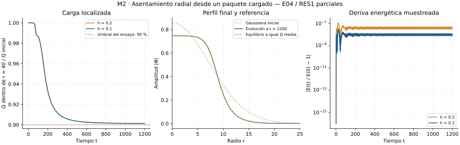

---

# 27 · Simetría de los estados positivos y cadenas finitas

## 27.1. Pregunta resuelta y alcance

**Resultado analítico condicionado, con demostración explícita:** en la clase siguiente, todo estado estacionario localizado de fase espacial común es esférico y ambos perfiles decrecen estrictamente desde un mismo centro. Una cadena finita de varios centros, un cilindro finito o un anillo sin arrollamiento no son soluciones estacionarias positivas de esa clase. Esto no refuta contactos dinámicos, nodos, fase espacial variable, rotación, soportes ni un dispositivo de duración limitada. **La subpregunta de CP04 queda resuelta; C7 permanece PARCIAL.**

Se suponen Φ(t,x)=f(x)e^{iωt}, χ(x)=−u(x), en todo R³; f>0; f,u clásicos C², acotados, en H¹ y con límite uniforme cero al infinito; λ₀≥0, g,h,M>0 y a=m²−ω²>0. No hay fronteras internas, fuentes, potenciales externos ni carga fijada artificialmente por celda. Son hipótesis del resultado, no afirmaciones de existencia, unicidad o estabilidad. Se usan las constantes dimensionales; un cambio de unidades positivo preserva cada signo.

La prueba que sigue es propia de esta entrega. Se inspira en el método clásico de planos móviles, pero no atribuye el resultado específico M2 a Busca–Sirakov ni presupone un teorema suyo que no se haya leído. La referencia metodológica original es [Gidas, Ni y Nirenberg, 1979](https://doi.org/10.1007/BF01221125). No se afirma una revisión matemática externa ni una certificación formal por ordenador.

## 27.2. Mediador y ecuaciones cooperativas

Las ecuaciones son

\[
-\Delta f=F(f,u)=-af-2\lambda_0f^3+guf-\tfrac h2u^2f,
\qquad
-\Delta u=G(f,u)=-M^2u+gf^2-hf^2u.
\]

En la ecuación (−Δ+M²+hf²)u=gf², cero es subsolución y g/h es supersolución estricta. El decaimiento y el principio fuerte del máximo dan 0<u<g/h. Por tanto Fᵤ=f(g−hu)>0 y Gf=2f(g−hu)>0. La cota también vale en todos los segmentos que unen valores reflejados, porque el intervalo (0,g/h) es convexo.

## 27.3. Comparación que inicia el plano desde el exterior

Para Σλ={x₁<λ}, reflejar x en xλ=(2λ−x₁,x₂,x₃), y escribir fλ=f(xλ), uλ=u(xλ), U=fλ−f y V=uλ−u. En la frontera plana U=V=0. Las diferencias satisfacen **exactamente**

\[
-\Delta U=A U+B V,\qquad -\Delta V=C U+D V,
\]

\[
\begin{aligned}
A&=-a-2\lambda_0(f_\lambda^2+f_\lambda f+f^2)+gu-\tfrac h2u^2,\\
B&=f_\lambda[g-\tfrac h2(u_\lambda+u)]>0,\\
C&=(g-hu_\lambda)(f_\lambda+f)>0,\\
D&=-M^2-hf^2<0.
\end{aligned}
\]

Esta descomposición es relevante: el coeficiente A usa u(x), aunque el punto reflejado esté dentro del núcleo. No basta decir que todos los valores reflejados son pequeños cuando el plano está lejos.

Sean p=max(−U,0), q=max(−V,0). Extenderlos por cero al otro semiespacio. Pertenecen a H¹; se pueden probar las identidades con cortes compactos y llevar el radio a infinito usando H¹ y los coeficientes acotados. Multiplicar las ecuaciones por −p y −q e integrar da

\[
\int(|\nabla p|^2+|\nabla q|^2)
\le\int A p^2+D q^2+3g f\,p q.
\tag{27.1}
\]

En efecto, donde p>0 se tiene fλ<f, de modo que B≤gf; donde p q>0 también C≤2gf. Los términos con U o V positivos tienen signo favorable y se descartan en la desigualdad. No se necesita que los dos valores reflejados estén pequeños fuera del soporte de las partes negativas.

Elegir R de forma que, para |x|>R,

\[
u\le\frac{a}{2g},\qquad f\le\frac{M\sqrt a}{6g}.
\]

Esto es posible por el decaimiento uniforme. Allí A≤−a/2, D≤−M² y, por Young,

\[
3gfpq\le\frac a4p^2+\frac{9g^2f^2}{a}q^2
\le\frac a4p^2+\frac{M^2}{4}q^2.
\]

Si λ<−R, todo Σλ es exterior. (27.1) obliga a ∫(|∇p|²+|∇q|²+a p²/4+3M²q²/4)≤0; luego p=q=0. Queda establecido el arranque del plano sin una suposición no probada sobre los puntos reflejados.

## 27.4. Posición límite y continuación

Mover el plano mientras U,V≥0 para todas sus posiciones anteriores. La posición límite λ* es finita: si se reflejara un punto donde f alcanza su máximo hacia puntos cada vez más lejanos, el decaimiento violaría la desigualdad. Por continuidad U,V≥0 en Σλ*.

El principio fuerte del máximo aplicado al sistema cooperativo implica una alternativa: ambas diferencias son idénticamente cero, o ambas son estrictamente positivas. Para usar el principio escalar puede añadirse un coeficiente diagonal no negativo suficientemente grande; B,C son positivos y acotados. Si una diferencia se anula idénticamente, su ecuación obliga a anular la otra.

Supóngase la alternativa estricta. Fijar el mismo R exterior. Elegir un compacto K dentro de Σλ*∩B_R, alejado del plano y del borde de la bola, con diferencias uniformemente positivas. El conjunto restante dentro de B_R puede tener volumen tan pequeño como se quiera. Al mover el plano una cantidad suficientemente pequeña se conserva la positividad en K; las partes negativas quedan confinadas a ese pequeño conjunto interior D y al exterior.

En el exterior, el lado derecho de (27.1) es no positivo por las cotas anteriores. En D, todos los coeficientes están uniformemente acotados, por lo que

\[
\int(|\nabla p|^2+|\nabla q|^2)
\le C\int_D(p^2+q^2)
\le C C_S |D|^{2/3}\int(|\nabla p|^2+|\nabla q|^2).
\]

La segunda desigualdad es Hölder y Sobolev en R³ para las extensiones por cero. Elegir D tan pequeño que el factor sea menor que uno fuerza p=q=0, contradiciendo que λ* fuera la última posición. Por tanto ambas diferencias son cero en el plano límite: los dos campos comparten ese plano de simetría.

## 27.5. Monotonía y centro común

Para todo plano anterior al límite, las diferencias son estrictamente positivas. No pueden ser simétricas respecto de dos planos paralelos distintos: la composición de esas reflexiones impondría periodicidad a un perfil positivo que decae. El lema de Hopf sobre cada plano anterior da ∂₁f>0 y ∂₁u>0 en su lado izquierdo.

El argumento vale para cualquier dirección espacial e. El máximo de f existe por positividad, continuidad y decaimiento. Sea x₀ un punto donde se alcanza. La monotonía estricta obliga a que cada plano crítico perpendicular a e pase por x₀. Como ambos campos comparten esos planos, son invariantes bajo todas las reflexiones que pasan por x₀; de ahí la simetría radial de ambos respecto del mismo centro. Hopf da f′(r)<0 y u′(r)<0 para r>0, o χ′(r)>0.

No se demuestra unicidad de la solución radial a una carga o frecuencia, ni que toda solución radial minimice la energía. La monotonía exacta sólo se refiere a soluciones que cumplen las hipótesis, no convierte un perfil aproximado en una solución exacta.

## 27.6. Decisiones y verificación

| Clase | Decisión de esta entrega |
|---|---|
| Cadena finita estacionaria, f>0, fase común, libre y localizada | Descartada como estado multicentro bajo las hipótesis |
| Cilindro finito o anillo estacionario de amplitud positiva sin arrollamiento | Descartado como geometría no esférica en esa clase |
| Una gota esférica estacionaria | Permitida por la simetría; existencia y estabilidad son preguntas distintas |
| Nodos, vorticidad, gradientes de fase, frecuencias diferentes o dinámica | No cubiertos |
| Soportes materiales, fuentes, fronteras físicas o control | No cubiertos; requieren su acción y recursos |

Se comprobaron las identidades de diferencias, signos cooperativos y cotas exteriores en un auditor numérico de álgebra. Es una defensa contra errores de implementación y signos; no prueba el argumento funcional. La revisión analítica anterior trata explícitamente H¹, el exterior, el conjunto pequeño, el acoplamiento y el centro común. Las 22 comprobaciones de Canal se conservan sin modificación, con rechazo temprano por existencia en esta nueva clase. Las comprobaciones posteriores no se dan por aprobadas.

**Puerta:** subclase descartada dentro de M2 condicionado; C7 PARCIAL. No reabrir E00, E01 ni C0. La búsqueda restante debe cambiar una hipótesis física; no repetir Newton sobre una cadena positiva de fase común como si pudiera sostenerse estáticamente. Se continúa con estabilidad no radial del estado preparado y contactos dinámicos, manteniendo la contabilidad de sus recursos.

---

# 28 · Estabilidad no radial: identidad analítica y continuación de CP04

## 28.1. Alcance de la pregunta

Se separan dos objetos. El resultado analítico se refiere a una **solución estacionaria exacta** que cumple las hipótesis del capítulo 27. El ensayo numérico parte de los seis campos de Cauchy guardados al final de CP04, en t=1200, que aún contienen movimiento radial y radiación. No se reemplaza ese estado por una solución estacionaria ni se repite su preparación.

Se reutiliza la identidad angular ya cerrada en 14.4, escrita aquí con las variables del capítulo 27. No es una identidad nueva ni se repite su campaña espectral. El avance de CP05 es la justificación analítica de la monotonía que antes se exigía como hipótesis sobre un perfil exacto. La identidad cubre todos los armónicos no radiales de la linealización estacionaria. No prueba estabilidad orbital no lineal, no resuelve el sector radial y no convierte los perfiles numéricos en soluciones exactas certificadas.

## 28.2. Segunda variación y normalización

Usar constantes dimensionales, a=m²−ω²>0, χ=−u, y escribir

\[
\Phi=e^{i\omega t}\left[f+\frac{x+i y}{\sqrt2}\right],\qquad
\chi=-u-z.
\]

El funcional conservado K=E−ωQ, expresado en el sistema que gira en fase con ω, tiene término cinético positivo. Para cada armónico real (ℓ,m), su parte cuadrática es

\[
K_2=\frac12\int_0^\infty r^2\left[\dot x^2+\dot y^2+\dot z^2+
(x,z)\mathcal A_\ell(x,z)^T+y\mathcal H_\ell y\right]dr.
\]

Las expresiones con operadores se entienden como formas cuadráticas, integrando por partes. Con Dᵣ=∂ᵣ²+2r⁻¹∂ᵣ,

\[
\mathcal A_\ell=-D_r I+\frac{\ell(\ell+1)}{r^2}I+
\begin{pmatrix}
a+6\lambda_0 f^2-gu+\frac h2u^2 & -W\\
-W & M^2+hf^2
\end{pmatrix},\qquad W=\sqrt2 f(g-hu)>0,
\]

\[
\mathcal H_\ell=-D_r+\frac{\ell(\ell+1)}{r^2}
+a+2\lambda_0 f^2-gu+\frac h2u^2.
\]

Las ecuaciones lineales incluyen los términos giroscópicos −2ωẏ en la ecuación de x y +2ωẋ en la de y. Estos términos se cancelan al derivar K₂ respecto del tiempo. No se confunde el Hessiano con el generador dinámico ni se eliminan las fluctuaciones de χ.

## 28.3. Identidades de positividad

La ecuación estacionaria da H₀ f=0. Para una función de prueba y regular y localizada,

\[
\langle y,\mathcal H_\ell y\rangle
=\int r^2 f^2\left[\partial_r(y/f)\right]^2dr
+\ell(\ell+1)\int y^2dr.
\tag{28.1}
\]

Por otra parte, la invariancia bajo traslación da

\[
\mathcal A_1 w=0,\qquad w=(-\sqrt2 f',-u')^T.
\]

El capítulo 27 establece w₁,w₂>0 para r>0. Es crucial que ambos componentes tengan el mismo signo y que el acoplamiento de A sea −W<0. Si η=(η₁,η₂), integrar por partes usando A₁w=0 da la identidad exacta

\[
\langle\eta,\mathcal A_1\eta\rangle
=\sum_{i=1}^2\int r^2 w_i^2\left[\partial_r(\eta_i/w_i)\right]^2dr
+\int r^2 W w_1w_2(\eta_1/w_1-\eta_2/w_2)^2dr\ge0.
\tag{28.2}
\]

Primero se demuestra para pruebas suaves compactas en 0<r<∞. La identidad y la no negatividad se extienden por cierre al dominio de la forma con regularidad en el centro y energía finita. Los cocientes no suponen valores no nulos de w en los extremos; se usa la aproximación por funciones de prueba en el interior.

Para ℓ≥2,

\[
\langle\eta,\mathcal A_\ell\eta\rangle
=\langle\eta,\mathcal A_1\eta\rangle+
[\ell(\ell+1)-2]\int(\eta_1^2+\eta_2^2)dr>0
\]

si η≠0. Para ℓ=1 el núcleo de A₁ es el vector de traslación: la anulación de los cuadrados obliga a ηᵢ/wᵢ a ser la misma constante. Todos los valores de m comparten estos operadores.

## 28.4. Qué queda excluido y qué no

K₂ es no negativo en cada sector ℓ≥1, con parte cinética definida positiva. Su conservación excluye modos de energía finita que crezcan exponencialmente en esos sectores: una solución exponencial no trivial haría crecer una energía cuadrática positiva y constante. Para ℓ=1 se conserva el modo neutro de traslación; el movimiento del centro y las posibles contribuciones seculares asociadas no se cuentan como crecimiento exponencial. No se afirma una cota uniforme sobre la posición absoluta del centro.

Este argumento evita inferir la estabilidad de todos los ℓ a partir de unas raíces seleccionadas de caja. **Es la exclusión analítica condicionada de crecimiento exponencial lineal no radial de 14.4**, ahora enlazada con la monotonía demostrada en 27. No cubre nodos, fase espacial variable, giro, campos apoyados, soluciones fuera de las hipótesis ni el sector ℓ=0. Tampoco controla transferencia no lineal entre sectores, resonancias, fuga a largo plazo o amplitudes finitas arbitrarias. E03 continúa PARCIAL.

Una comprobación de la traducción de variables, sin recalcular perfiles ni autovalores históricos, comprueba los factores de normalización y la identidad de traslación mediante jets que satisfacen las ecuaciones estacionarias, y contrasta la identidad de forma por cuadratura independiente. Las muestras numéricas auditan el álgebra; la prueba funcional es la expuesta arriba. No se atribuye una revisión matemática externa ni una certificación formal por ordenador.

## 28.5. Ensayo finito que continúa CP04

La campaña está prerregistrada en `datos/ensayo_no_radial_CP06.json`. Se usan todos los armónicos reales hasta L, incluidos todos sus m. La integral angular del potencial cuártico es exacta para el espacio retenido mediante Gauss–Legendre y cuadratura uniforme azimutal; las fuerzas son su gradiente proyectado. La radial utiliza la misma acción de volúmenes finitos y la evolución es Verlet sin amortiguamiento. El mediador permanece dinámico.

Los cuatro campos radiales Φ, Φ̇, χ, χ̇ se interpolan desde el NPZ fino de CP04, sin volver a la gaussiana. La perturbación es una deformación inicial triaxial cuadrupolar, δq=−ε r exp[−(r/20)⁴] q′ H₂, aplicada también a las velocidades. H₂ combina cinco armónicos reales de ℓ=2 y tiene media cuadrática angular uno. Se contabilizan por separado su energía y carga añadidas, el cambio de malla y frontera, y el exterior que no se evoluciona en este ensayo. La creación física de esa perturbación no se da por derivada.

El núcleo observado es r<40; la ventana adicional es 0≤τ≤160. Las cajas R=220 y 260 tienen margen causal continuo de 20 y 60 después de esa ventana. La comparación de cajas comprueba también el efecto numérico sobre el núcleo; la sola cota de causalidad continua no certifica el esquema discretizado. El estado original de R=1300 se mantiene íntegro con su radiación exterior. No se afirma haber evolucionado esa energía exterior en el experimento truncado.

Las decisiones numéricas y los valores de convergencia se registran en `validacion/P06/no_radial/resultados.json` y en el informe CP06 cuando la campaña termine. Un ensayo que pase sólo respalda la familia de deformaciones, la ventana, el benchmark y las resoluciones declaradas.

## 28.6. Refinamiento posterior a CP06

CP07 conserva el fallo angular L2→L4 y las ocho evoluciones Verlet terminadas. La comparación de posiciones del mediador reveló un error que las normas de Φ y la conservación no detectaban. Los integradores de masa exacta ensayados no resolvieron la ventana completa con paso grueso: el centrado reduce el error inicial pero llega a una deriva energética de 2,354 % en el caso largo h=.5, Δt=.004. Su control Δt=.002 sí completa la ventana con balance. Todos los estados y fallos permanecen registrados.

El refinamiento DOP853 integra las fuerzas completas de la misma acción, con tiempo de reinicio explícito y conservación vigilada en cada paso aceptado. Tres ejecuciones completan τ=160: h=.5 con rtol=10⁻⁸ y 10⁻⁹, e h=.25 con rtol=10⁻⁹; atol=rtol/100 y paso máximo .02. Los pilotos se continuaron desde τ=8 y el control espacial interrumpido desde τ=120. El error temporal final de χ es 0,00191 % respecto de la perturbación inicial.

El diagnóstico adicional incluye velocidades: la norma es la raíz de ∫_{r<40} (|δq|²+|δv|²/masa²), relativa a la perturbación inicial del mismo campo. Se suman todos los modos no radiales y se elimina únicamente la fase U(1) global de Φ. Así una coincidencia momentánea de posiciones no oculta un error de oscilación. El error temporal de χ en esa norma es 0,00272 %.

El refinamiento espacial h=.5→.25 falla todavía: 4,03 % en posiciones de χ y 5,01 % incluyendo velocidades. Se conserva el fallo y se prerregistra h=.125 con la misma tolerancia fina. CP07 no declara cerrada esa prueba pendiente. La comparación se actualizará sólo al concluir la nueva evolución, manteniendo este antecedente y el límite del 2 %.

## 28.7. Cierre del refinamiento en CP08

La nueva malla h=.125 completó τ=160, continuando el estado guardado a τ=48 tras la pausa. Se mantienen rtol=10⁻⁹, atol=10⁻¹¹, paso máximo .02, L=4, R=220 y ε=.02. No se repitió ninguna de las once evoluciones ya terminadas de la campaña.

La comparación h=.25→.125 da un error de norma temporal de Φ de 0,152733 %; los campos finales dan Φ 0,285106 % y χ 3,45323 %. Incluyendo velocidades: Φ 0,929822 %, χ 5,04292 %. Puerta del subensayo: **REFINAMIENTO_PENDIENTE**; el límite espacial se mantiene en 2 %.

El control temporal fino ya cerrado y el control angular L4→L6 se reutilizan. Los errores gruesos y los fallos de conservación anteriores no se borran ni se reinterpretan como inestabilidad física. No se afirma una convergencia conjunta certificada de espacio, tiempo y truncación angular: son los controles individuales declarados, sobre una perturbación concreta y una ventana finita.

La implementación opcional del potencial en C se introdujo al reanudar τ=48, después de una auditoría que obtuvo igualdad exacta de las fuerzas en las cinco muestras comprobadas. No cambia la acción ni las tolerancias. Se conservan los incidentes de ejecución y se añadió un bloqueo de escritor único, verificado sin repetir evolución. E03/E04/RES0/RES1 continúan PARCIALES; faltan, entre otros, modos impares y otras perturbaciones finitas, fuente primaria, apagado, retroacción y ciclo.

El diagnóstico CP08 de las tres mallas obtiene una reducción de 3,94 para posiciones de Φ, pero 0,993 para χ con velocidades. La diferencia inicial fina de χ en esa norma es 0,00620 %. La causa del error tardío no queda identificada: no se extrapola un orden de convergencia de χ ni se promete que otra malla resolverá la puerta. El siguiente protocolo debe discriminar la fase rápida y los errores espaciales/temporales conjuntamente.

## 28.8. Control temporal fino y nueva comparación espacial en CP10

CP10 parte de la arquitectura CP09 y preserva los subresultados anteriores. El protocolo prerregistrado `datos/ensayo_mediador_CP10.json` completa dos evoluciones nuevas desde los campos y velocidades CP04: Δr=.125 y .0625, con tolerancia común estricta, fuerza completa y la misma familia cuadrupolar. Aquí Δr es el paso radial; el parámetro h del potencial M2 no cambia. Se verifican las fuerzas C frente a NumPy en las dos mallas y los reinicios desde pilotos y estados válidos tras la interrupción.

La comparación temporal fina usa el estado CP08 Δr=.125 y el nuevo control. La comparación espacial usa las dos evoluciones CP10 con tolerancia común. Las definiciones y puertas permanecen iguales: no se ajusta χ ni se cambia el 2 %. Las cifras se generan en [el resumen CP10](informes/RESUMEN_NUMERICO_CP10.md); el resultado numérico único se localiza en `datos/registro_calculos.json`. La decisión finita registrada es **REFINAMIENTO_PENDIENTE**.

La identificación de la causa del error continúa condicionada. La descomposición radial y angular y la transformada seno descriptiva no certifican un mecanismo; tampoco se sustituye el operador radial acoplado por la dispersión cartesiana libre. Los controles históricos de caja y L conservan sus mallas y no acreditan convergencia conjunta sobre las nuevas resoluciones. Interpolar la fuente CP04 Δr=.1 a una malla más fina no certifica la fuente continua. E03/E04/RES0/RES1 siguen PARCIALES y no se declara estabilidad orbital, ciclo ni dispositivo.

---

# 29 · Acceso lineal condicionado a Reserva

## 29.1. Pregunta y estado de evidencia

El perfil de la rama guardado en CP03 para ω=0.9 permite plantear una pregunta pendiente de RES0/RES2: ¿una onda incidente de los campos existentes puede intercambiar energía y carga con el depósito? Se reutiliza ese perfil, sin resolver otra vez su fondo ni su espectro. La preparación no radial de CP04 y este fondo estacionario son objetos distintos. No se identifica la respuesta de uno con la del otro.

La subpregunta de dispersión lineal monocromática queda verificada en nueve frecuencias y con el mediador completo. No quedan cerradas E03, RES0 o RES2: faltan una región de estabilidad útil, la preparación de la onda incidente, amplitud y duración finitas, retroacción, recepción y ciclo. Es una investigación exploratoria condicionada, sin saltar sus dependencias funcionales.

Dos antecedentes primarios orientan el método. Cardoso, Vicente y Zhong, *Energy Extraction from Q-balls and Other Fundamental Solitons*, [Phys. Rev. Lett. 131, 111602 (2023)](https://doi.org/10.1103/PhysRevLett.131.111602), estudian conversión de bandas laterales y extracción en otro modelo. Zhang, Li, Xie y Zhou, *Superradiance of Friedberg-Lee-Sirlin solitons*, [Phys. Rev. D 111, 103027 (2025)](https://doi.org/10.1103/PhysRevD.111.103027), incluyen dos campos con un potencial diferente. Aquí se deriva el operador de M2; no se importan sus cifras ni se iguala una densidad de energía en una capa con un flujo.

## 29.2. Tres canales de la acción común

Escribir el fondo Φ₀=f(r)e^{iωt}, χ₀=z(r), con z negativo. Para ℓ=0 y Y₀₀ normalizado a integral angular cuadrática uno, usar

\[
\delta\Phi=\frac{\epsilon Y_{00}}r e^{i\omega t}
 [u_+(r)e^{i\Omega t}+u_-^*(r)e^{-i\Omega t}],\qquad
\delta\chi=\frac{\epsilon Y_{00}}r
 [u_\chi(r)e^{i\Omega t}+u_\chi^*(r)e^{-i\Omega t}].
\]

La linealización de las ecuaciones completas, sin eliminar χ, da

\[
-u''+\begin{pmatrix}
U-(\omega+\Omega)^2&V&Z\\
V&U-(\omega-\Omega)^2&Z\\
Z&Z&C-\Omega^2
\end{pmatrix}u=0,
\tag{29.1}
\]

\[
U=m^2+4\lambda_0 f^2+gz+\tfrac h2z^2,\quad
V=2\lambda_0 f^2,\quad Z=(g+hz)f,\quad C=M^2+hf^2.
\]

Las constantes escaladas proceden de `herramientas/modelo_m2.py`. No se añaden portales, fricción ni fuentes internas. El factor de la ecuación de χ se comprueba incluyendo ambas bandas conjugadas de Φ. El auditor independiente perturba la fuerza no lineal y contrasta estos coeficientes por diferencias centrales; también calcula los flujos directamente desde derivadas de ondas planas.

La regularidad impone u(0)=0. Para Ω>1.9 y Ω<100 hay dos canales cargados abiertos, de frecuencias físicas ν₊=ω+Ω>0 y ν₋=ω−Ω<0; el mediador es evanescente en el infinito. Sigue siendo dinámico en (29.1), con su término −Ω². No es una aproximación algebraica de mediador pesado.

## 29.3. Flujos, recurso incidente y balance

Definir k±=√(ν±²−m²). En las variables u±, la onda saliente es e^{-ikr} y la entrante e^{ikr}. El conjugado que reconstruye la banda de frecuencia negativa invierte su fase espacial física. Este detalle evita asignar la dirección de energía equivocada a u₋.

Normalizar los coeficientes por √k. La matriz real simétrica de (29.1), la regularidad en el origen y la ausencia de flujo del canal cerrado conservan el Wronskiano. Por tanto S†S=I entre canales abiertos. Esta unitariedad no iguala el flujo de energía de bandas de frecuencias distintas.

Para una entrada de carga negativa de norma de Wronskiano uno, sea P=|S₊₋|². Los flujos energéticos salientes relativos al incidente dan

\[
G_E=\frac{(\Omega+\omega)P+(\Omega-\omega)(1-P)}{\Omega-\omega}
=1+\frac{2\omega P}{\Omega-\omega}.
\tag{29.2}
\]

Usando el tensor y la corriente comunes de M2, la diferencia entre salida y entrada es

\[
\Delta\dot Q_{\rm exterior}=4\epsilon^2P,\qquad
\Delta\dot E_{\rm exterior}=4\epsilon^2\omega P
=\omega\,\Delta\dot Q_{\rm exterior}.
\tag{29.3}
\]

El fondo debe perder esas cantidades a segundo orden si se construye una solución completa con retroacción. El cálculo de fondo fijo sólo proporciona esta contabilidad perturbativa; no evoluciona su pérdida de carga ni demuestra cuánto tiempo puede sostenerla. La onda entrante ya aporta energía positiva y carga negativa. No se crea ese recurso a partir del vacío.

Para entrada de carga positiva, la unitariedad de dos canales da la misma probabilidad de conversión y

\[
G_E^{(+)}=1-\frac{2\omega P}{\Omega+\omega}.
\]

La pérdida de flujo exterior es una ruta candidata de depósito de energía y carga a segundo orden. No demuestra que el estado perturbado retenga ese incremento ni que vuelva a la rama. No se denomina a esta razón de flujos eficiencia neta de carga o descarga.

Con sólo un canal cargado abierto y χ cerrado, el mismo argumento obliga a |S|²=1 y G_E=1. Los tres controles de ese régimen lo confirman. La existencia de energía ligada, por sí sola, nunca se equipara a energía accesible.

## 29.4. Método y verificación

Se lee `validacion/P06/rama/perfil_w0.90000.csv` mediante interpolación cúbica de Hermite de los campos y sus derivadas. La campaña usa el mismo fondo guardado; su error no se recertifica aquí. La puerta se refiere al problema lineal sobre ese interpolante y las frecuencias muestreadas, no a una región continua de parámetros.

La discretización radial resuelve simultáneamente las dos incidencias mediante un sistema complejo disperso de tres canales. En cada canal abierto se utiliza la dispersión exacta de la diferencia central,

\[
\kappa_h=\frac2h\arcsin(kh/2),\qquad
v_h=\frac{\sin(\kappa_hh)}h,
\]

y su condición saliente y normalización √v_h. El canal cerrado emplea la raíz evanescente discreta. Así no se mezcla una velocidad de flujo continua con una onda discreta. En este párrafo h es el paso radial, no el acoplamiento del potencial.

Las mallas h=0.1, 0.05 y 0.025 no bastaron para la puerta de conversión relativa de 2 %. Se conservaron esos fallos y se añadieron 0.0125 y 0.00625; Ω=1.95 necesitó 0.003125. Hay 46 soluciones de la campaña y ocho controles de vacío, canal único y caja. Ninguna solución cerrada se recalcula al reanudar.

Un segundo método resuelve la ODE continua con condiciones de radiación continuas en Ω=1.95, 2.3 y 5. El primer intento complejo de colocación no convergió y se conserva íntegro en sus resultados, estados y registro. La formulación en partes real e imaginaria con Jacobiano de frontera explícito converge sin cambiar las tolerancias finales. La diferencia máxima de conversión frente a la malla fina es 0.239 %; la de ganancia, 1.25×10⁻⁷.

La campaña discreta tiene defecto máximo de unitariedad 1.07×10⁻¹³, residuo relativo 8.08×10⁻¹¹ y error en (29.3) de 1.34×10⁻¹⁴. El último cambio relativo de conversión es como máximo 1.60 %. Vacío y canal único tienen ganancia uno dentro de 8×10⁻¹⁶. Los tres controles de caja R=60→80 no muestran cambio significativo. Los resultados íntegros, las puertas y sus alcances están en `validacion/P06/acceso_lineal/puerta_decision.json`.

## 29.5. Resultados y puerta

Valores de las mallas finales, para incidencia negativa; se redondean para lectura.

| Ω | Probabilidad de conversión P | Ganancia energética G_E |
|---:|---:|---:|
| 1.92 | 2.74334×10⁻⁵ | 1.00004841 |
| 1.95 | 2.84988×10⁻⁶ | 1.00000489 |
| 2.00 | 2.48590×10⁻⁵ | 1.00004068 |
| 2.10 | 1.05909×10⁻⁴ | 1.00015886 |
| 2.30 | 1.22117×10⁻³ | 1.00157007 |
| 2.60 | 2.74827×10⁻⁵ | 1.00002910 |
| 3.00 | 2.67965×10⁻⁴ | 1.00022968 |
| 4.00 | 4.70079×10⁻⁴ | 1.00027295 |
| 5.00 | 3.15990×10⁻⁴ | 1.00013873 |

La mayor ganancia entre estas muestras es aproximadamente 0.157 % en Ω=2.3; no se afirma un máximo global ni una banda operativa. La verificación continua en ese punto da G_E=1.001570199. La conversión aparece en la acción M2 sin un término especial por dispositivo, pero es pequeña y condicionada a un campo incidente cargado ya disponible.

**Puerta de subpregunta:** superada para la dispersión infinitesimal, estacionaria y muestreada descrita. **Puertas funcionales:** RES0 sigue PARCIAL y RES2 sigue BLOQUEADA. El siguiente cálculo admisible deberá incluir un paquete incidente finito, coste explícito, retroacción sobre un depósito respaldado en su dominio, balances con una frontera común, recepción y recarga antes de aspirar a un ciclo. Los límites de acceso material con los portales ya fijados permanecen los de los capítulos anteriores; no se vuelven a presentar como un descubrimiento de esta entrega.

---

# 30 · Fase espacial de un estado localizado sin nodos

## 30.1. La posibilidad que quedaba abierta

El capítulo 27 tomó como hipótesis una fase espacial común. Aquí se investiga si una fase no uniforme, por sí sola, permite evitar aquella exclusión en un estado estacionario localizado sin nodos. No se repite la prueba de planos móviles ni C0.

**Resultado analítico condicionado:** para un único campo complejo de M2, un estado monofrecuencial Φ=e^{iωt}ψ(x), con ψ∈C²(R³)∩H¹(R³) y ψ(x)≠0 en todo punto, tiene fase espacial constante. Se suponen χ real estático, ausencia de fuentes y derivadas espaciales ordinarias, sin potencial gauge. No se exige que la fase esté acotada o tenga límite en el infinito. La prueba completa aparece abajo; no se atribuye una certificación formal ni revisión externa.

## 30.2. Fase global y corriente estacionaria

Como R³ es simplemente conexo y ψ no se anula, el mapa ψ/|ψ| admite un levantamiento real global y suave θ. Escribir ψ=f e^{iθ}, f=|ψ|>0. La ecuación estacionaria tiene la forma

\[
-\Delta\psi+A(x)\psi=0,\qquad
A=m^2-\omega^2+2\lambda_0|\psi|^2+g\chi+\tfrac h2\chi^2\in\mathbb R.
\]

Su parte imaginaria, multiplicada por f, da

\[
\nabla\cdot(f^2\nabla\theta)=0.
\tag{30.1}
\]

La descomposición ortogonal de las derivadas implica

\[
\int f^2<\infty,\qquad
E_\theta:=\int f^2|\nabla\theta|^2\le\int|\nabla\psi|^2<\infty.
\tag{30.2}
\]

No se usa que el estado minimice energía. Las dos cotas proceden de H¹ y valen también para un candidato estacionario que no sea un mínimo.

## 30.3. Truncamiento que controla la frontera

Sea Tₙ(s)=max(−n,min(s,n)), con n>0, y sea η_R un corte suave: 0≤η_R≤1, igual a uno en B_R, cero fuera de B_{2R}, y |∇η_R|≤C/R. La función η_R²Tₙ(θ) tiene soporte compacto y es una prueba débil admisible. Se puede obtener mediante aproximaciones suaves de Tₙ; en cada compacto f es estrictamente positivo y todos los campos son regulares.

Usar esa prueba en (30.1) e integrar por partes, conservando el término del corte:

\[
\int\eta_R^2 f^2\mathbf 1_{|\theta|<n}|\nabla\theta|^2
=-2\int\eta_R T_n(\theta)f^2\nabla\theta\cdot\nabla\eta_R.
\tag{30.3}
\]

El lado izquierdo es no negativo. Por Cauchy–Schwarz, |Tₙ|≤n y (30.2),

\[
0\le\int\eta_R^2 f^2\mathbf 1_{|\theta|<n}|\nabla\theta|^2
\le\frac{2Cn}{R}\,E_\theta^{1/2}\,\|f\|_{L^2}.
\tag{30.4}
\]

Primero fijar n y hacer R→∞. Dominación por la densidad integrable de Eθ, o el lema de Fatou, obliga a

\[
\int_{|\theta|<n}f^2|\nabla\theta|^2=0.
\]

Después hacer n→∞. La fase real es finita en cada punto y f>0; por tanto ∇θ=0 casi en todas partes, y por regularidad en todas partes. θ es constante en R³. El orden de los límites es esencial. No se elimina una contribución en el infinito suponiendo de antemano que θ sea acotada.

## 30.4. Comprobación de alcance

La identidad local se contrasta de forma independiente: diferencias centrales de Im(ψ*Δψ), usando campos complejos construidos a partir de jets reales de f y θ, coinciden con ∇·(f²∇θ). Esa auditoría sólo verifica el álgebra y sus signos. El paso global es la desigualdad (30.4), con todas sus hipótesis expuestas, y no una inferencia estadística a partir de muestras.

La ausencia de nodos es sustantiva. Por ejemplo, el campo matemático ψ=(x+iy)e^{−r²} tiene norma y energía de gradiente finitas, corriente proporcional a e^{−2r²}(−y,x,0) de divergencia cero y circulación. Se anula en el eje z, y su ángulo no admite un levantamiento real global en el complemento del eje. Por ello no satisface la hipótesis del lema. Se usa sólo como control lógico de alcance: no se afirma que sea una solución de M2.

La literatura ya relaciona nodos, fases multivaluadas y circulación; el resumen primario de J. Riess, [Phys. Rev. D 2, 647 (1970)](https://doi.org/10.1103/PhysRevD.2.647), ofrece un antecedente en estados cuánticos estacionarios. No se importa de ese artículo un teorema sobre M2 ni se atribuye novedad bibliográfica a este lema. La deducción aplicable al proyecto es la expuesta aquí.

## 30.5. Puerta de C7

Si además se cumplen las hipótesis restantes de 27 —campos clásicos acotados H¹ que tienden uniformemente a cero en el infinito, λ₀≥0, g,h,M>0 y ω²<m²—, una rotación global elimina θ y permite aplicar el resultado ya demostrado allí. No se presupone monotonía radial. Ambos perfiles resultan esféricos y estrictamente monótonos desde un centro común.

Así queda descartada también la tentativa de rescatar una cadena estacionaria finita **sin nodos** añadiéndole únicamente una fase espacial suave. Una fase no constante en un candidato localizado de esta clase requiere violar alguna hipótesis: nodos o defectos topológicos, fuentes o fronteras físicas, campos gauge adicionales, ausencia de localización H¹, o dependencia temporal más general. La lista no asegura que ninguna de esas alternativas funcione.

La corriente espacial y el flujo energético del estado monofrecuencial son proporcionales a f²∇θ y, por tanto, se anulan. Esto no excluye señales o intercambios transitorios. Tampoco contradice el capítulo 29: su perturbación tiene varias frecuencias y un mediador dinámico; el límite monocromático incidente no es un estado aislado H¹. Un paquete finito cumple localización, pero posee dependencia temporal más general.

**Puerta de subpregunta:** completada por el lema y su aplicación condicionada. **C7:** PARCIAL. Siguen abiertos los estados con nodos/vórtices y los contactos o enlaces dinámicos con recursos y estabilidad demostrables. E00, E01 y C0 permanecen cerradas e intactas. Este resultado no agota las clases admisibles de M2 ni habilita M3.

---

# 31 · Diagnóstico radial del mediador y límite causal de CP11

## 31.1. Problema que se continúa

El control temporal CP10 está superado y la comparación espacial del
mediador real falla la puerta original. Los resultados y cifras actuales
se consultan en [el resumen generado CP11](informes/RESUMEN_NUMERICO_CP11.md)
y en los resultados enlazados por [el registro](datos/registro_calculos.json).
Este capítulo deriva e interpreta los diagnósticos; no reemplaza los datos.
M2, Θ, los estados, la perturbación inicial y el umbral del 2 % se conservan.

## 31.2. Operador de la acción discreta

En una malla uniforme de centros, Wᵢ=∫celda r²dr, cᵢ=rᵢ₊½²/Δr y D
la diferencia entre celdas vecinas. Para cada ℓ,
\[
K_\ell=D^T\operatorname{diag}(c)D+
\Delta r\ell(\ell+1)I+\frac{2R^2}{\Delta r}e_Ne_N^T,
\qquad L_\ell=-W^{-1}K_\ell.
\]
El origen tiene flujo cero y la frontera exterior Dirichlet está a media
celda. K es simétrica y positiva definida en esta caja: el gradiente sólo
se anula para constantes, y la frontera elimina esa constante. El término
centrífugo es no negativo. La transformación y=W¹ᐟ²χ da la matriz real
simétrica Aℓ=W⁻¹ᐟ²KℓW⁻¹ᐟ². Esto garantiza modos libres reales y una norma
completa de proyección; NO garantiza precisión de fase del sistema acoplado.

Las frecuencias libres son ωⱼ=√(M²+λⱼ). La referencia continua en la misma
caja es λⱼ=(zℓⱼ/R)², con jℓ(zℓⱼ)=0. Comparar índices iguales sirve para
diagnosticar dispersión de la discretización radial. No identifica el
espectro del generador acoplado ni certifica el continuo de M2.

Las pruebas independientes de la acción original, simetría, residuo modal
y Parseval pasan. Las métricas spline inversa, simétrica por cuadratura y
con paridad en el origen conservan el fallo espacial. La componente corta
predomina en la diferencia, incluso con un recorte suave que evita un
borde espectral artificial en r=40. Sus fracciones son fracciones de una
norma de diferencia, no de la energía física.

## 31.3. Resultado negativo del mecanismo libre

La propagación libre exacta de los datos iniciales no reproduce la
diferencia observada. Como diagnóstico adicional se resuelve el equilibrio
elíptico con Φ congelado en cada extremo, manteniendo todos los modos
retenidos y el acoplamiento angular. Se separan χeq y su derivada de los
residuos rápidos. Un cambio de fase modal fijado por las frecuencias
radiales reduce la discrepancia, pero no supera el criterio explicativo
prerregistrado. Este resultado descarta esa corrección libre como
explicación mayoritaria suficiente. No descarta dispersión de componentes
generadas durante la respuesta acoplada, ni permite otra fase ajustada.

Ni χeq ni la corrección se usan para aceptar la evolución. χ sigue siendo
dinámico y real; no se introduce una nueva simetría ni una eliminación
adiabática en M2.

## 31.4. Respuesta forzada y evidencia no guardada

En la autobase libre, cada modo de la solución M2 satisface exactamente
\[
\ddot a_j+\omega_j^2a_j=F_j(t),\qquad
F=-\mathcal P_L[(g+h\chi)|\Phi|^2].
\]
Restar de los extremos la solución homogénea determina los dos momentos
de Duhamel de F, sin suponer su historia ni resolver una evolución nueva.
La diferencia entre las respuestas forzadas satisface la cota triangular
prerregistrada. Esta cota descarta el propagador libre inicial como causa
principal de la discrepancia.

La identidad exacta para d=Iχc−χf, con I fijo y A=M²−L, es
\[
\ddot d+A_fd=(A_fI-IA_c)\chi_c+(IF_c-F_f).
\]
El primer término registra el defecto del operador entre mallas; el
segundo, la diferencia de fuente no lineal. Sus valores en los extremos
no son un presupuesto de error integrado. Para separar sus contribuciones
a τ=160 hace falta su historia o evidencia equivalente con control de
error. Las normas, E y Q guardadas no contienen esa historia.

En el problema inverso de una fuente, η(t)=C t⁴(T−t)⁴ permite añadir
η¨+ω²η sin cambiar q, q̇, F ni Ḟ en los extremos. Esto delimita la
información recuperable; no cuestiona la unicidad de Cauchy de M2.

La evaluación doble de la identidad inicial falló por cancelación de
fuerzas casi iguales. Se conserva ese intento y la
[enmienda aritmética anterior al control nuevo](informes/ENMIENDA_CP11_PRECISION_DEFECTO.md).
La referencia extendida valida la misma identidad con la misma tolerancia,
coeficientes, estados y spline. Un fallo de un control aritmético no es
una inestabilidad física.

## 31.5. Puerta de decisión y parada

Se cierra el diagnóstico finito de CP11. La aceptación no radial permanece
REFINAMIENTO_PENDIENTE; E03/E04/RES0/RES1 permanecen PARCIALES. No se prueba
estabilidad orbital, convergencia conjunta o continua, ni un dispositivo.
No se declara agotamiento de M2: la ambigüedad causal pendiente es real.

Se detiene antes de otra campaña. No procede resolver la ambigüedad con
otra malla, más tiempo o variantes elegidas después del fallo. Un siguiente
protocolo deberá definir un contraste que distinga el presupuesto de
defecto radial del presupuesto de fuente acoplada, explicitar qué historia
se conservará y cómo evitará repetir las evoluciones cerradas. Los estados
CP04 y CP10 siguen siendo los últimos orígenes válidos, no estados nuevos
creados por los diagnósticos de este capítulo.

---

# Repertorio de primordiales

---

# P-01 · Semilla

**Estado M2: realización completa no demostrada.** El cero clasico es invariante; el bombeo neutro no crea carga neta aislada. La función y los valores siguientes son objetivos revisables. Véanse las secciones 13.8; 16.4.

La Semilla establece el estado inicial desde el que se pueden preparar nuevos tramos y componentes. La información de lo que se quiere construir debe proceder de un trazado, una señal o una plantilla disponible. Su composición no contiene automáticamente el catálogo completo de runas.

La conservación de energía utilizable corresponde a Reserva; el almacenamiento general de datos, a Memoria; y la fijación respecto de una referencia, a Anclaje. Semilla aporta la preparación del campo necesaria para iniciar esas estructuras.

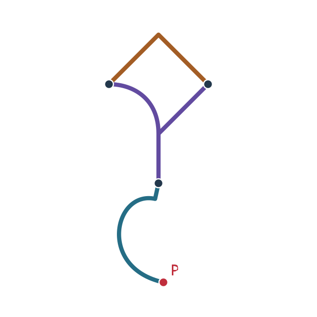

## Registro geométrico

La escala física se declara en O.2; la figura representa una proyección. T: azul, R: ocre, N: violeta. Los puntos oscuros son uniones declaradas; los rojos, extremos libres.

| Pieza | a | b | tₓ | tᵧ | Capa de cruce |
|---|---:|---:|---:|---:|---:|
| N₁ | 0 | -1 | 0 | 2 | 0 |
| R₁ | 0 | 1 | 0 | 0 | 1 |
| T₁ | -424/2473 | 1946/2473 | -2968/12365 | 50717/12365 | 2 |

Transformación: \(x_g=ax-by+t_x,\ y_g=bx+ay+t_y\). Las fracciones son los valores canónicos, no redondeos de calibración física.

Uniones: R₁.b ↔ N₁.2; R₁.a ↔ N₁.3; N₁.1 ↔ T₁.a.

3 piezas; 1 componente(s) conexa(s); 1 ciclo(s) independiente(s); 1 extremo(s) libre(s). Caja del eje: 2.000000 × 5.000000 u, sin espesor de trazo.

## Puertos y terminales

| Puerto | Extremo | Intercambio | Función |
|---|---|---|---|
| P | T₁.b | Preparacion, energia y control | Puerto bidireccional |

Los puertos mixtos se descomponen en subcanales tipados. La región de aplicación y los intercambios distribuidos forman parte del montaje aunque no sean extremos de la plantilla.

## Contrato dinámico de referencia

- Estados: E_preparada, estado.
- Entradas: potencia de preparación, plantilla, habilitación.
- Salidas: disponibilidad, estado preparado.
- Dominio: 0<=E<=E_prep; disponible tras E=E_prep y asentamiento.

`dE/dt=P_in-P_hold-P_write`

Primera preparación: acoplamiento no derivado; operación ordinaria desde Semilla asentada.

Grupos de parámetros: `seed` en `datos/parametros.json`. El contrato reducido no constituye una realización microscópica demostrada.

## Activación y funcionamiento

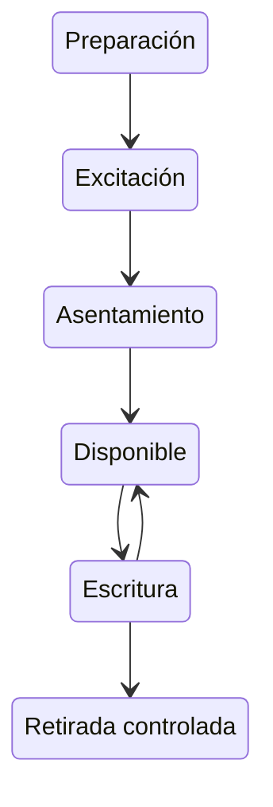
```mermaid
stateDiagram-v2
    Preparacion: Preparación
    Excitacion: Excitación
    Retirada: Retirada controlada
    Preparacion --> Excitacion
    Excitacion --> Asentamiento
    Asentamiento --> Disponible
    Disponible --> Escritura
    Escritura --> Disponible
    Escritura --> Retirada
```

La excitación inicial aporta energía a la figura preparada. Nexo acopla sus recorridos; Repliegue establece el retorno; Tránsito comunica con el exterior. La configuración se considera asentada cuando presenta una respuesta reproducible y las perturbaciones pequeñas se amortiguan dentro de su régimen de operación.

El cierre geométrico es una condición de montaje. La estabilidad requiere además un estado dinámico compatible: amplitudes, fases, alimentación, pérdidas y acoplamientos adecuados. No toda figura cerrada ni toda combinación T–R–N realiza una Semilla funcional.

En el uso ordinario puede prepararse una nueva Semilla a partir de otra ya operativa. La estructura de origen transmite una excitación y un patrón compatibles; la creación de la nueva estructura consume recursos físicos. Para la primera Semilla, el sistema adopta un procedimiento de preparación accesible mediante cuerpo y entorno, inicialmente con carga rúnica neta nula. R1 fija un presupuesto objetivo de 5 J, 2 W de entrada y 0.05 W de servicio; el protocolo microscópico que lo alcance no está derivado.

Una figura de tinta es una plantilla. Escribir directamente en el aire requiere una preparación activa del campo. La luz que permite ver el recorrido es una señal opcional, con su propio gasto energético.

## Posición y persistencia

La estabilidad interna conserva una configuración, no una posición absoluta. Para acompañar la mano o permanecer respecto del suelo necesita un vínculo con esa referencia y el correspondiente intercambio de momento. En una instalación, Anclaje puede proporcionar esa función.

La Semilla puede reutilizarse mientras conserve un estado operativo adecuado. El coste de construirla no tiene que repetirse íntegramente en cada uso; se contabilizan mantenimiento, corrección y trabajo adicional. Una Semilla pequeña puede iniciar una red mayor cuando esa red recibe la energía, la información y los recursos necesarios.

## Comprobación y diagnóstico

| Observación | Interpretación y acción |
|---|---|
| Respuesta repetible ante una señal de prueba | Indicio operativo de una preparación utilizable. |
| Una unión está abierta | El montaje no coincide con P-01; completar y volver a comprobar. |
| Hay una unión adicional | Ha cambiado la conectividad; restaurar el montaje de referencia. |
| La respuesta decae | Revisar suministro, pérdidas y estado de preparación. |
| Aparecen oscilaciones crecientes | Se ha abandonado el régimen estable; reducir la excitación y revisar el ajuste. |
| La figura se desplaza | Revisar su referencia espacial; el movimiento no implica por sí solo pérdida de estabilidad interna. |

El brillo por sí solo no demuestra que funcione. La comprobación útil consiste en que reciba una señal compatible y prepare un tramo de prueba cuya respuesta pueda verificarse.

## Ejemplo de uso

Una Semilla ya asentada recibe el trazado de un tramo corto y aporta la preparación para establecerlo. Se verifica la respuesta del tramo antes de conectar un Captador solar o ampliar la red. El patrón recibido y la energía aportada se contabilizan; la nueva estructura no estaba contenida de forma ilimitada en el dibujo.

## Modelo operacional y balance de recursos

Para una realización localizada y aproximadamente estacionaria:

\[
\frac{dE_s}{dt}=P_{\mathrm{entrada}}-P_{\mathrm{entregada}}-P_{\mathrm{pérdidas}}.
\]

E_s representa la energía del subsistema, incluida la que sostiene su configuración; P_entregada es la potencia transferida de forma útil a otras estructuras; P_pérdidas contabiliza energía que sale hacia el entorno por vías no aprovechadas. Al mantener constante E_s, la entrada debe compensar lo entregado y las pérdidas.

El Sol sigue siendo la fuente principal de la instalación mediante Captador solar. El arranque también puede recibir energía de una reserva o del trabajo de preparación. Un suministro insuficiente impide el asentamiento o reduce la persistencia; la Semilla no obtiene energía del significado de su dibujo.

## Correspondencia microscópica

Preparación paramétrica y selección de modos.

**Estado físico:** Phi, chi, fluctuaciones iniciales y fuente.

**Coeficientes:** Tasa de Floquet, solapamiento de excitación y tiempo de saturación.

**Comportamiento resultante:** Un modo crece al superar pérdidas; el control selecciona el estado y verifica su respuesta.

**Comprobación disponible:** Umbral lineal de bombeo. Véase MM.13; M2.5.

**Requisito de realización:** Derivar modulación manual, saturación, forma y autonomía.

## Aceptación

Comprobar geometría y puertos, respuesta a baja potencia, balance de recursos y transición de retirada. El montaje debe satisfacer las magnitudes del contrato y el dominio de su receta. La precisión del SVG no demuestra estabilidad ni rendimiento del estado físico.

---

# P-02 · Anclaje

**Estado M2: realización completa no demostrada.** No hay perfil material con retroaccion que derive fuerza, rigidez y reaccion del anclaje. La función y los valores siguientes son objetivos revisables. Véanse las secciones 13.3; 15.6.

Anclaje mantiene una relación de posición u orientación con una referencia física identificada y transmite esfuerzos entre esa referencia y una estructura. Puede vincular una runa a la mano, distribuir el apoyo de una carga sobre el suelo o mantener alineados módulos de una instalación. El vínculo admite elasticidad, amortiguamiento y seguimiento; no introduce un punto inmóvil absoluto.

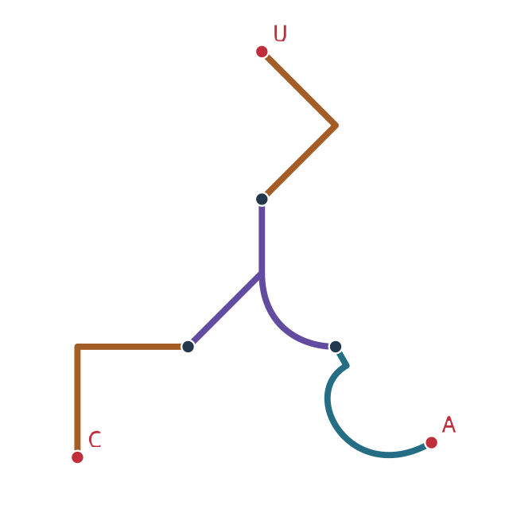

## Registro geométrico

La escala física se declara en O.2; la figura representa una proyección. T: azul, R: ocre, N: violeta. Los puntos oscuros son uniones declaradas; los rojos, extremos libres.

| Pieza | a | b | tₓ | tᵧ | Capa de cruce |
|---|---:|---:|---:|---:|---:|
| N₁ | 0 | 1 | 0 | 0 | 0 |
| R₁ | 3/4 | 3/4 | -5/2 | 1 | 1 |
| T₁ | 910/2473 | 1586/2473 | 3747/2473 | 23467/12365 | 2 |
| R₂ | -1 | 0 | 1 | -2 | 3 |

Transformación: \(x_g=ax-by+t_x,\ y_g=bx+ay+t_y\). Las fracciones son los valores canónicos, no redondeos de calibración física.

Uniones: N₁.1 ↔ R₂.a; N₁.2 ↔ T₁.a; N₁.3 ↔ R₁.a.

4 piezas; 1 componente(s) conexa(s); 0 ciclo(s) independiente(s); 3 extremo(s) libre(s). Caja del eje: 4.800000 × 5.500000 u, sin espesor de trazo.

## Puertos y terminales

| Puerto | Extremo | Intercambio | Función |
|---|---|---|---|
| C | R₁.b | Mecánico | Enlace con la estructura sostenida. |
| A | T₁.b | Mecánico | Enlace con la referencia que recibe la reacción. |
| U | R₂.b | Control y alimentación | Consigna de posición, orientación y respuesta del soporte. |

Los puertos mixtos se descomponen en subcanales tipados. La región de aplicación y los intercambios distribuidos forman parte del montaje aunque no sean extremos de la plantilla.

## Contrato dinámico de referencia

- Estados: x, v, energía elástica.
- Entradas: posición objetivo, carga, referencia.
- Salidas: fuerza, reacción, error.
- Dominio: Deformación <=0.1; |F|<=Y*A*0.1; referencia con capacidad de reacción.

`m*x_ddot=F-m*g; F=sat(m*g+Kp*(x_ref-x)-Kd*v); k=Y*A/L`

Precompensar extensión; mantener control local y transferir carga al retirar.

Grupos de parámetros: `mechanical` en `datos/parametros.json`. El contrato reducido no constituye una realización microscópica demostrada.

## Activación y funcionamiento

1. **Reconocimiento.** Identificar físicamente la referencia y la región de carga; obtener sus posiciones y velocidades mediante contacto o señales.
2. **Acoplamiento.** Establecer el enlace con una respuesta inicial pequeña y comprobar dónde se transmite la reacción.
3. **Sujeción.** Aumentar la rigidez efectiva y el amortiguamiento hasta el régimen previsto, incluyendo orientación si se necesita.
4. **Transferencia o retirada.** Pasar la carga a otro apoyo o reducirla antes de retirar el enlace; recuperar la energía elástica compatible.

## Modelo operacional y balance de recursos

En un régimen lineal de desplazamientos pequeños se puede especificar

\[
\mathbf F=-K\,\Delta\mathbf x-\Gamma\,\Delta\mathbf v,
\qquad E_{\mathrm{el}}=\tfrac12\Delta\mathbf x^{\mathsf T}K\Delta\mathbf x.
\]

K es una matriz de rigidez y Γ una respuesta disipativa compatible con estabilidad. Son parámetros de una realización, no constantes universales. Una ley semejante relaciona torque y desalineación angular. La suma de los cambios de momento de carga, campo y referencia es cero cuando no hay fuerzas externas sobre ese conjunto; también se conserva su momento angular.

El apoyo inmóvil no exige trabajo mecánico continuo sobre la carga, pero conserva tensiones y energía estructural. Mover los puntos de apoyo, corregir perturbaciones y amortiguar oscilaciones sí implica intercambios. Los cambios de esfuerzo se propagan causalmente; el soporte no es perfectamente rígido.

## Posición y persistencia

La referencia se sigue mediante un vínculo local o una red de canales. Una referencia móvil arrastra el marco de seguimiento con su propia dinámica. Aumentar el área de apoyo y repartir enlaces permite sostener fuerzas mayores sin concentrarlas en la piel ni en un único punto del terreno.

## Comprobación y diagnóstico

| Observación | Interpretación y acción |
|---|---|
| La carga deriva respecto de la referencia | Revisar el seguimiento y la rigidez efectiva; comprobar si se mueve también la referencia. |
| Aparecen oscilaciones crecientes | Revisar retardo, amortiguamiento y signo de la corrección. |
| El apoyo cede o deforma el suelo | Extender la región de reacción o transferir parte de la carga a otros apoyos. |
| La posición se mantiene pero gira | Completar el control de orientación y el balance de torque. |

## Ejemplo de uso

Un Anclaje sostiene una herramienta respecto de una mesa mientras otro mantiene el dibujo junto a la mano. La mesa y el cuerpo son referencias diferentes; sus movimientos deben medirse o transmitirse, no confundirse con reposo absoluto.

## Correspondencia microscópica

Gradiente de portal con referencia y realimentación.

**Estado físico:** Perfil de campo, materia y actuadores de corrección.

**Coeficientes:** F=-mc^2 grad A; ganancia de lazo y retardo.

**Comportamiento resultante:** La fuerza relativa corregida mantiene posición; campo y referencia reciben reacción.

**Comprobación disponible:** Fuerza como derivada de energía; controlador R1 reducido. Véase MM.8.

**Requisito de realización:** Resolver perfil con retroacción y límites de fuerza; el fluido homogéneo no es un sólido.

## Aceptación

Comprobar geometría y puertos, respuesta a baja potencia, balance de recursos y transición de retirada. El montaje debe satisfacer las magnitudes del contrato y el dominio de su receta. La precisión del SVG no demuestra estabilidad ni rendimiento del estado físico.

---

# P-03 · Recinto

**Estado M2: realización completa no demostrada.** La curva no fija barreras de cada especie, presion soportada ni tasas de fuga. La función y los valores siguientes son objetivos revisables. Véanse las secciones 13.7; 15.6.

Recinto establece una superficie o volumen de trabajo con condiciones de paso definidas. Puede retener un fluido, separar regiones de una instalación o regular qué perturbaciones cruzan una frontera. La frontera se especifica por su respuesta a materia, ondas o señales; no se supone opaca a toda interacción posible.

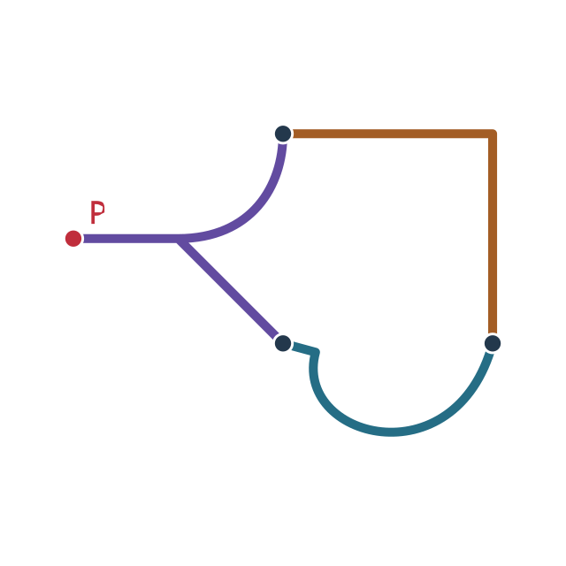

## Registro geométrico

La escala física se declara en O.2; la figura representa una proyección. T: azul, R: ocre, N: violeta. Los puntos oscuros son uniones declaradas; los rojos, extremos libres.

| Pieza | a | b | tₓ | tᵧ | Capa de cruce |
|---|---:|---:|---:|---:|---:|
| N₁ | 1 | 0 | 0 | 0 | 0 |
| R₁ | -1 | 1 | 3 | -1 | 1 |
| T₁ | 1920/2473 | 520/2473 | 5161/2473 | 3201/2473 | 2 |

Transformación: \(x_g=ax-by+t_x,\ y_g=bx+ay+t_y\). Las fracciones son los valores canónicos, no redondeos de calibración física.

Uniones: N₁.2 ↔ R₁.b; N₁.3 ↔ T₁.a; R₁.a ↔ T₁.b.

3 piezas; 1 componente(s) conexa(s); 1 ciclo(s) independiente(s); 1 extremo(s) libre(s). Caja del eje: 4.000000 × 2.847592 u, sin espesor de trazo.

## Puertos y terminales

| Puerto | Extremo | Intercambio | Función |
|---|---|---|---|
| P | N₁.1 | Control y alimentación | Definición del recinto, condiciones de paso y lectura de su estado. |

| Región funcional | Localización | Intercambio |
|---|---|---|
| Σ | Superficie desplegada | Intercambia esfuerzos y flujos con el medio. Su extensión se describe en el estado preparado y no queda igualada al área de tinta. |

Los puertos mixtos se descomponen en subcanales tipados. La región de aplicación y los intercambios distribuidos forman parte del montaje aunque no sean extremos de la plantilla.

## Contrato dinámico de referencia

- Estados: inventario n_i, volumen, presión.
- Entradas: frontera, permeabilidad_i, presión exterior.
- Salidas: flujo_i, esfuerzo sobre apoyo.
- Dominio: Frontera y especie declaradas; cargas dentro de capacidad del soporte.

`dn_i/dt=-integral(J_i-v_borde*c_i)·n dA; F=Delta_p*A; c_i es densidad local`

La retención material no implica aislamiento térmico ni óptico.

Grupos de parámetros: `mechanical` en `datos/parametros.json`. El contrato reducido no constituye una realización microscópica demostrada.

## Activación y funcionamiento

1. **Definición.** Establecer la región y la propiedad que debe retenerse o transmitirse.
2. **Despliegue.** Preparar la frontera por sectores y comprobar su continuidad física.
3. **Ajuste.** Aumentar gradualmente la diferencia entre interior y exterior, verificando flujos y esfuerzos.
4. **Apertura.** Igualar condiciones o conducir el contenido hacia un destino antes de desmontar la frontera.

## Modelo operacional y balance de recursos

Para una cantidad material conservada, la variación del contenido incluye el flujo a través de la frontera:

\[
\frac{dN_V}{dt}=-\int_{\Sigma}\mathbf J_N\cdot\hat{\mathbf n}\,dA.
\]

La expresión supone una frontera fija y ausencia de fuentes internas de esa cantidad. En una frontera móvil se usa el flujo relativo a su movimiento. La respuesta de paso debe especificarse por especie, frecuencia y condiciones, según la tarea.

Una porción plana de frontera sometida a una diferencia uniforme de presión recibe una fuerza aproximada F = Δp A. Reflejar partículas o radiación también transfiere momento. Desplazar la frontera contra esa carga requiere trabajo; sostenerla quieta conserva tensiones. La energía absorbida se almacena temporalmente, se recupera o se evacua por un destino definido.

## Posición y persistencia

La forma se mantiene respecto de una referencia mediante Anclaje o seguimiento distribuido. Recinto puede dividirse en sectores coordinados; el mando pequeño describe esa red. Un sector desconectado conserva únicamente el comportamiento que permita su estado y suministro local.

## Comprobación y diagnóstico

| Observación | Interpretación y acción |
|---|---|
| El contenido cruza un punto concreto | Comprobar continuidad del sector y conexión con los vecinos. |
| La frontera se desplaza completa | Revisar apoyo y reacción, además de su estabilidad interna. |
| Retiene materia pero deja pasar calor o luz | Contrastar la respuesta con las propiedades realmente configuradas. |
| Crece la presión interior | Modificar el proceso, ampliar volumen o abrir una transferencia controlada. |

## Ejemplo de uso

Contener temporalmente agua en una forma elevada exige una frontera que soporte su presión y una ruta de reacción hacia un apoyo. Una vez transferida a un recipiente, Recinto puede retirarse sin conservar una estructura material adicional.

## Correspondencia microscópica

Barrera y superficie controlada.

**Estado físico:** Perfil espacial, especies y flujos.

**Coeficientes:** Barrera DeltaV_i, transmisión, presión y esfuerzo superficial.

**Comportamiento resultante:** El paso se reduce según energía, colisiones y respuesta de cada especie.

**Comprobación disponible:** Balances y mecanismo de barrera. Véase MM.8; MM.12.

**Requisito de realización:** Calcular perfiles de frontera, tasas de fuga y estabilidad ante presión.

## Aceptación

Comprobar geometría y puertos, respuesta a baja potencia, balance de recursos y transición de retirada. El montaje debe satisfacer las magnitudes del contrato y el dominio de su receta. La precisión del SVG no demuestra estabilidad ni rendimiento del estado físico.

---

# P-04 · Canal

**Estado M2: tubo libre refutado por inestabilidad.** El Q-tubo libre de dos campos tiene una banda longitudinal creciente; el extremo fisico no se ha derivado. La función y los valores siguientes son objetivos revisables. Véanse las secciones 18; 16.1; 20.6; 21.1.

Canal enlaza dos regiones para conducir energía o señales mediante una excitación guiada. Su cometido es el transporte con una respuesta conocida. El flujo de materia requiere además un proceso físico apropiado de guiado o una corriente material; una señal que describe un objeto no transporta por ello sus átomos.

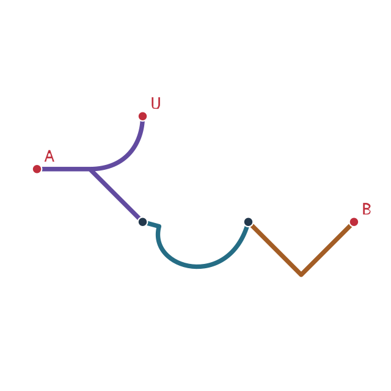

## Registro geométrico

La escala física se declara en O.2; la figura representa una proyección. T: azul, R: ocre, N: violeta. Los puntos oscuros son uniones declaradas; los rojos, extremos libres.

| Pieza | a | b | tₓ | tᵧ | Capa de cruce |
|---|---:|---:|---:|---:|---:|
| N₁ | 1 | 0 | 0 | 0 | 0 |
| T₁ | 1920/2473 | 520/2473 | 5161/2473 | 3201/2473 | 1 |
| R₁ | 0 | -1 | 4 | 2 | 2 |

Transformación: \(x_g=ax-by+t_x,\ y_g=bx+ay+t_y\). Las fracciones son los valores canónicos, no redondeos de calibración física.

Uniones: N₁.3 ↔ T₁.a; T₁.b ↔ R₁.a.

3 piezas; 1 componente(s) conexa(s); 0 ciclo(s) independiente(s); 3 extremo(s) libre(s). Caja del eje: 6.000000 × 3.000000 u, sin espesor de trazo.

## Puertos y terminales

| Puerto | Extremo | Intercambio | Función |
|---|---|---|---|
| A | N₁.1 | Intercambio principal | Primer extremo del enlace. |
| B | R₁.b | Intercambio principal | Segundo extremo; puede recibir o entregar según la operación. |
| U | N₁.2 | Control y prueba | Adaptación del enlace, señal de comprobación y alimentación auxiliar si se utiliza. |

Los puertos mixtos se descomponen en subcanales tipados. La región de aplicación y los intercambios distribuidos forman parte del montaje aunque no sean extremos de la plantilla.

## Contrato dinámico de referencia

- Estados: campo guiado q(x,t), energía en tránsito.
- Entradas: potencia, señal, ruta.
- Salidas: potencia retrasada, señal recibida.
- Dominio: Banda y sección R1; vaciado >=L/v.

`P_out(t)=exp(-alpha*L)*P_in(t-L/v); P_max=j_max*A`

El transporte de materia necesita un flujo material adicional.

Grupos de parámetros: `power_channel` en `datos/parametros.json`. El contrato reducido no constituye una realización microscópica demostrada.

## Activación y funcionamiento

1. **Tendido.** Preparar una ruta hasta una región físicamente alcanzable.
2. **Adaptación.** Comprobar la respuesta de los extremos y reducir reflexiones no deseadas.
3. **Transporte.** Enviar un flujo dentro del régimen de propagación y disipación caracterizado.
4. **Vaciado.** Detener la alimentación y conducir la energía que todavía ocupa la ruta hasta su destino.

## Modelo operacional y balance de recursos

Para una descripción unidimensional, uℓ es energía por unidad de longitud y P la potencia transportada:

\[
\partial_t u_{\ell}+\partial_s P=-p_{\mathrm{pérdida}}+p_{\mathrm{aporte}}.
\]

Los dos términos de la derecha se expresan en W/m. Para el camino físico de longitud L, el frente de una señal nueva no puede llegar antes de L/c. Dispersión, retardo y atenuación se caracterizan para la banda utilizada.

La amplificación compensa pérdidas con energía local. Compartir la ruta entre órdenes y potencia requiere separar y decodificar físicamente los canales de señal; la capacidad y el ruido se incluyen en el presupuesto de la instalación. La anchura dibujada no determina por sí sola la sección activa del campo.

## Posición y persistencia

Puede quedar asociado a una referencia o seguir extremos móviles. Cambiar el recorrido exige preparar su nuevo estado y atender la energía y el momento que ya contiene. Rutas en paralelo, amplificación alimentada y terminales más amplios permiten elevar la potencia.

## Comprobación y diagnóstico

| Observación | Interpretación y acción |
|---|---|
| Parte de la señal regresa | Comprobar reflexión y adaptación en la terminación. |
| La respuesta pierde intensidad con la distancia | Medir pérdidas y aportes a lo largo del recorrido. |
| Los pulsos se deforman | Revisar dispersión y banda de operación. |
| Aparece energía al cerrar la entrada | Contabilizar la que seguía almacenada en tránsito. |

## Ejemplo de uso

Un enlace de diez metros tiene un tiempo de frente mínimo de unos 33,4 ns; su respuesta real puede ser mucho más lenta. Ese cálculo fija causalidad y no promete la velocidad concreta de una realización.

## Correspondencia microscópica

Modo transversal ligado y propagación longitudinal.

**Estado físico:** Fluctuaciones de Phi/chi sobre fondo preparado.

**Coeficientes:** Espectro transversal; M_l, K_l, gamma_l por integración.

**Comportamiento resultante:** Una banda ligada transporta señal y energía; dispersión fija retardo y pérdidas.

**Comprobación disponible:** Q-tubo libre de dos campos con perfil y espectro convergentes; se encuentra inestabilidad longitudinal. Respuesta del grafo sigue condicionada.. Véase 18; 16.1; MM.6–MM.7.

**Requisito de realización:** La realizacion libre ensayada se rechaza como guia estable; no hay terminal completo ni trazado 3D operacional derivados.

## Aceptación

Comprobar geometría y puertos, respuesta a baja potencia, balance de recursos y transición de retirada. El montaje debe satisfacer las magnitudes del contrato y el dominio de su receta. La precisión del SVG no demuestra estabilidad ni rendimiento del estado físico.

---

# P-05 · Captador solar

**Estado M2: realización completa no demostrada.** El ciclo de tres niveles usa niveles y tasas no derivados; el benchmark desacoplado no absorbe potencia runica de luz. La función y los valores siguientes son objetivos revisables. Véanse las secciones 13.2; 16.3.

Captador solar intercepta radiación del Sol y la convierte en suministro compatible con la red. La figura configura una superficie o volumen de captación; esa región puede ser mayor que el glifo. Una misma porción de radiación no se cuenta como alimento de dos colectores a la vez.

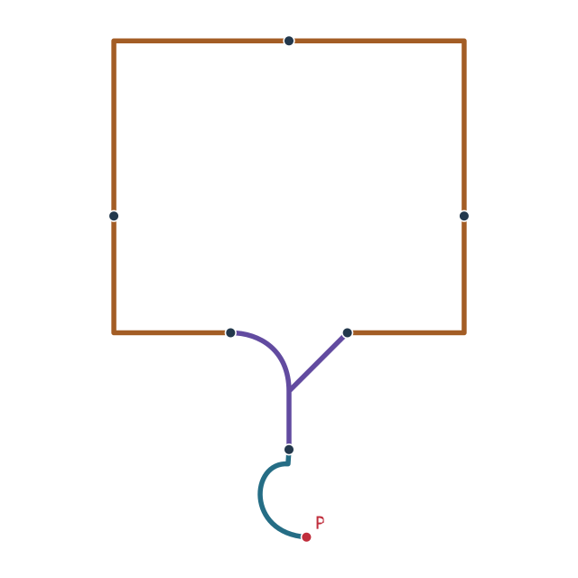

## Registro geométrico

La escala física se declara en O.2; la figura representa una proyección. T: azul, R: ocre, N: violeta. Los puntos oscuros son uniones declaradas; los rojos, extremos libres.

| Pieza | a | b | tₓ | tᵧ | Capa de cruce |
|---|---:|---:|---:|---:|---:|
| N₁ | 0 | -1 | 0 | 0 | 0 |
| R₁ | 1 | -1 | -3 | -1 | 1 |
| R₂ | 3/2 | 3/2 | -3 | -6 | 2 |
| R₃ | -3/2 | 3/2 | 3 | -6 | 3 |
| R₄ | -1 | -1 | 3 | -1 | 4 |
| T₁ | -102/2473 | 1518/2473 | -714/12365 | 22991/12365 | 5 |

Transformación: \(x_g=ax-by+t_x,\ y_g=bx+ay+t_y\). Las fracciones son los valores canónicos, no redondeos de calibración física.

Uniones: N₁.1 ↔ T₁.a; N₁.2 ↔ R₁.b; N₁.3 ↔ R₄.a; R₁.a ↔ R₂.b; R₂.a ↔ R₃.b; R₃.a ↔ R₄.b.

6 piezas; 1 componente(s) conexa(s); 1 ciclo(s) independiente(s); 1 extremo(s) libre(s). Caja del eje: 6.000000 × 8.500000 u, sin espesor de trazo.

## Puertos y terminales

| Puerto | Extremo | Intercambio | Función |
|---|---|---|---|
| P | T₁.b | Energía y control | Entrega útil y mensajes de ajuste mediante canales físicamente distinguibles. |

| Región funcional | Localización | Intercambio |
|---|---|---|
| Aₑ | Región captadora | Intercepta radiación y convierte una parte de su energía. |
| H | Intercambio residual | Transfiere calor y otras pérdidas a destinos especificados; no es un trazo añadido. |

Los puertos mixtos se descomponen en subcanales tipados. La región de aplicación y los intercambios distribuidos forman parte del montaje aunque no sean extremos de la plantilla.

## Contrato dinámico de referencia

- Estados: área preparada, temperatura.
- Entradas: irradiancia, orientación, sumidero.
- Salidas: potencia bus, calor.
- Dominio: I>=0; no salida negativa: servicio desde respaldo o retirada.

`P_bus=(eta*I-p_A)*A; Qdot=(1-eta)*I*A+p_A*A`

80% es rendimiento adoptado, pendiente de realización espectral.

Grupos de parámetros: `solar`, `thermal` en `datos/parametros.json`. El contrato reducido no constituye una realización microscópica demostrada.

## Activación y funcionamiento

1. **Preparación.** Usar una Semilla o suministro previo para establecer el estado captador inicial.
2. **Orientación.** Determinar la iluminación efectiva y el área que puede interceptarse.
3. **Conversión.** Conectar un consumo o Reserva y el destino del calor; ajustar el régimen de conversión.
4. **Reducción.** Disminuir captación o derivar la entrega cuando cae el consumo o cambia la iluminación.

## Modelo operacional y balance de recursos

Con irradiancia efectiva I y rendimiento total η, la potencia útil es

\[
P_{\mathrm{útil}}=\eta\int_{A_e}I(\mathbf x)\,dA,
\qquad P_{\mathrm{útil}}=\eta I A_e\ \text{si I es uniforme}.
\]

El área y la irradiancia se definen con la orientación correspondiente. El balance incluye radiación transmitida o reflejada, energía útil, calor y cambio de energía del campo. La conversión también debe respetar el balance de entropía de la radiación y los receptores.

La radiación transporta momento: un haz absorbido entrega un flujo de momento Pabs/c en su dirección; la reflexión cambia ese balance según el ángulo. El rendimiento avanzado del 80 % permanece como objetivo de diseño bajo condiciones favorables, no como rendimiento de cualquier captador inicial.

## Posición y persistencia

La región captadora puede desplegarse sobre una zona iluminada y alimentar una marca pequeña. Su seguimiento conserva el intercambio de momento. Ampliar captación y conexiones permite aumentar potencia; Reserva separa el momento de captación del de uso.

## Comprobación y diagnóstico

| Observación | Interpretación y acción |
|---|---|
| La entrega baja sin cambiar la orden | Medir irradiancia, sombra y orientación efectiva. |
| El captador recibe luz pero casi no entrega | Comprobar adaptación del puerto y capacidad del consumidor. |
| La temperatura del receptor aumenta | Ampliar evacuación o ajustar la conversión. |
| Dos captadores rinden menos al superponerse | Recalcular la radiación que realmente intercepta cada uno. |

## Ejemplo de uso

Bajo la hipótesis I = 1000 W/m² y η = 0,8, una región de 20 m² entrega 16 kW. El área es la región desplegada, aunque el dibujo de mando quepa en la mano.

## Correspondencia microscópica

Transducción radiativa y motor de trabajo.

**Estado físico:** Modos luminosos, receptor, centro de ciclo y sumidero.

**Coeficientes:** Solapamiento g, densidad de estados, tasas y cociente de niveles.

**Comportamiento resultante:** Se absorbe o transfiere energía y el desequilibrio térmico alimenta trabajo.

**Comprobación disponible:** Convertidor resonante; ciclo de tres niveles. Véase MM.9; M2.6.

**Requisito de realización:** Obtener niveles y tasas de M2; integrar todo el espectro, ángulos y pérdidas.

## Aceptación

Comprobar geometría y puertos, respuesta a baja potencia, balance de recursos y transición de retirada. El montaje debe satisfacer las magnitudes del contrato y el dominio de su receta. La precisión del SVG no demuestra estabilidad ni rendimiento del estado físico.

---

# P-06 · Reserva

**Estado M2: realización completa no demostrada.** La Q-ball almacena energia, pero no se ha realizado la geometria de Reserva ni carga/descarga, eficiencia o capacidad R1. La función y los valores siguientes son objetivos revisables. Véanse las secciones 14.1; 15.5; 20.5.

Reserva conserva energía recuperable en estados del campo y permite cargarla y descargarla con una respuesta definida. Se distingue la energía que sostiene la configuración de la que puede entregarse mediante un ciclo permitido. Su figura abierta no necesita convertirse en un círculo: el confinamiento es una propiedad del estado tridimensional preparado.

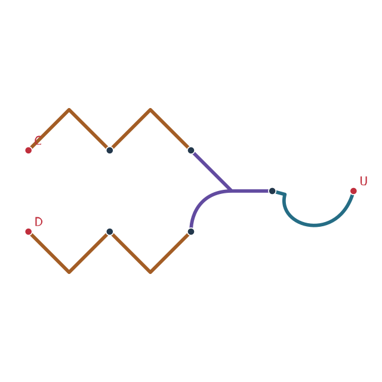

## Registro geométrico

La escala física se declara en O.2; la figura representa una proyección. T: azul, R: ocre, N: violeta. Los puntos oscuros son uniones declaradas; los rojos, extremos libres.

| Pieza | a | b | tₓ | tᵧ | Capa de cruce |
|---|---:|---:|---:|---:|---:|
| N₁ | -1 | 0 | 0 | 0 | 0 |
| R₁ | 0 | 1 | -2 | -2 | 1 |
| R₂ | 0 | 1 | -4 | -2 | 2 |
| R₃ | 0 | -1 | -2 | 2 | 3 |
| R₄ | 0 | -1 | -4 | 2 | 4 |
| T₁ | 1920/2473 | 520/2473 | 5161/2473 | 728/2473 | 5 |

Transformación: \(x_g=ax-by+t_x,\ y_g=bx+ay+t_y\). Las fracciones son los valores canónicos, no redondeos de calibración física.

Uniones: N₁.1 ↔ T₁.a; N₁.2 ↔ R₃.b; N₁.3 ↔ R₁.a; R₁.b ↔ R₂.a; R₃.a ↔ R₄.b.

6 piezas; 1 componente(s) conexa(s); 0 ciclo(s) independiente(s); 3 extremo(s) libre(s). Caja del eje: 8.000000 × 4.000000 u, sin espesor de trazo.

## Puertos y terminales

| Puerto | Extremo | Intercambio | Función |
|---|---|---|---|
| C | R₂.b | Energía | Carga de referencia; admite retorno si el régimen lo permite. |
| D | R₄.a | Energía | Entrega de referencia hacia el consumo. |
| U | T₁.b | Control | Estado de reserva, preparación y coordinación del ciclo. |

Los puertos mixtos se descomponen en subcanales tipados. La región de aplicación y los intercambios distribuidos forman parte del montaje aunque no sean extremos de la plantilla.

## Contrato dinámico de referencia

- Estados: E útil, E estructural, temperatura.
- Entradas: P_charge, P_discharge.
- Salidas: energía disponible, calor.
- Dominio: 0<=E<=rho*V; P_c*P_d=0; cada P<=rho_P*V.

`dE/dt=eta_c*P_c-P_d/eta_d-k*E-P0`

Cero útil obliga a respaldo de servicio o retirada; no usar E estructural como carga útil.

Grupos de parámetros: `reserve` en `datos/parametros.json`. El contrato reducido no constituye una realización microscópica demostrada.

## Activación y funcionamiento

1. **Preparación.** Establecer una rama de almacenamiento y su estado final descargado admisible.
2. **Carga.** Aportar energía conservando carga rúnica y comprobando estabilidad de la distribución.
3. **Retención y entrega.** Mantener el estado y abrir la transferencia según la capacidad de sus terminales.
4. **Reposo o desmontaje.** Conservar el estado mínimo necesario o transferir energía y carga hacia otros estados compatibles.

## Modelo operacional y balance de recursos

El balance de energía del depósito es

\[
\dot E=P_C-P_D-P_{\mathrm{fuga}}.
\]

La energía de una configuración se expresa como E(Qr, ξ), donde ξ reúne volumen, distribución y otras variables del estado. Una rama estabilizada por Qr no puede descargarse eliminando esa carga. Su ciclo debe terminar en otro estado que respete el balance completo.

La exergía B mide el trabajo útil máximo respecto de un entorno y restricciones especificados; en una descarga sin otro aporte de exergía, Wútil ≤ Bi − Bf. El calor almacenado y la energía estructural no se cuentan automáticamente como trabajo disponible. La capacidad, la potencia máxima, la fuga y la duración son propiedades diferentes.

## Posición y persistencia

El depósito ocupa un volumen físico del campo y contribuye a energía, inercia y gravitación del conjunto. Puede acompañar una referencia mediante Anclaje o repartirse en celdas. Mayor capacidad se obtiene con estados adecuados, más volumen o más depósitos; mayor descarga exige también terminales y canales capaces.

## Comprobación y diagnóstico

| Observación | Interpretación y acción |
|---|---|
| La carga indicada no coincide con lo recuperado | Revisar energía estructural, exergía, fugas y estado final del ciclo. |
| Dispone de energía pero la entrega cae | Comprobar capacidad de terminales y canales. |
| Una celda pierde estabilidad | Redistribuir carga y energía por rutas previamente compatibles. |
| Aparece calor durante la retención | Cuantificar fugas y su destino, sin contarlas como descarga útil. |

## Ejemplo de uso

Si una instalación almacena efectivamente 16 kW durante un minuto, añade 960 kJ. Entregarlos en un segundo exige terminales capaces de unos 960 kW medios; el cálculo no concede automáticamente esa potencia a cualquier depósito.

## Correspondencia microscópica

Estado fuera de equilibrio y descarga permitida.

**Estado físico:** Ocupaciones, energía estructural, carga y reservorios.

**Coeficientes:** E(Q), exergía restringida, acoplamientos de descarga.

**Comportamiento resultante:** Conserva trabajo accesible y lo entrega por una ruta que conserva cargas.

**Comprobación disponible:** Familia radial y dE/dQ; balance R1. Véase MM.4–MM.5; MM.9.

**Requisito de realización:** Demostrar densidad útil y ciclo de descarga; no equiparar energía ligada y energía utilizable.

## Aceptación

Comprobar geometría y puertos, respuesta a baja potencia, balance de recursos y transición de retirada. El montaje debe satisfacer las magnitudes del contrato y el dominio de su receta. La precisión del SVG no demuestra estabilidad ni rendimiento del estado físico.

---

# P-07 · Compuerta

**Estado M2: realización completa no demostrada.** No se ha obtenido de M2 un estado de compuerta con contraste, trabajo de control y ruido calculados. La función y los valores siguientes son objetivos revisables. Véanse las secciones 15.6.

Compuerta abre, cierra o gradúa un recorrido conforme a una señal física. Se aplica a intercambios para los que su acoplamiento haya sido preparado. La regulación de una temperatura u otra variable se obtiene al conectarla con medida y comparación; la Compuerta no conoce por sí sola el resultado deseado.

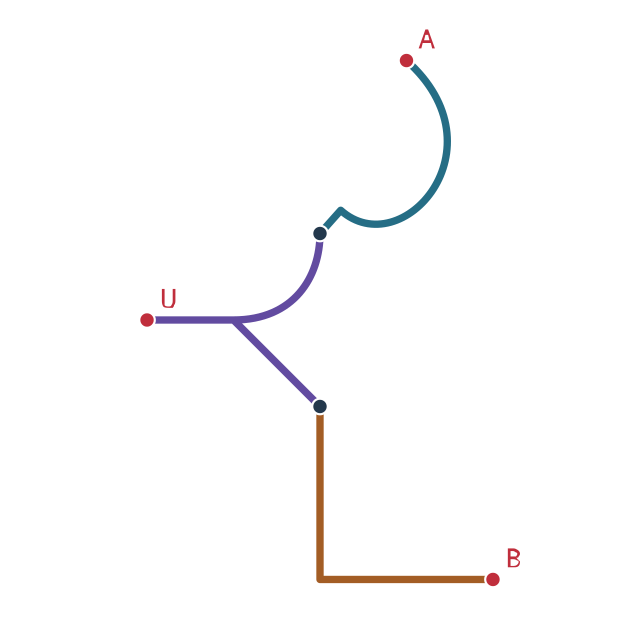

## Registro geométrico

La escala física se declara en O.2; la figura representa una proyección. T: azul, R: ocre, N: violeta. Los puntos oscuros son uniones declaradas; los rojos, extremos libres.

| Pieza | a | b | tₓ | tᵧ | Capa de cruce |
|---|---:|---:|---:|---:|---:|
| N₁ | 1 | 0 | 0 | 0 | 0 |
| T₁ | 1480/2473 | -1660/2473 | 4545/2473 | -4797/2473 | 1 |
| R₁ | 1 | -1 | 1 | 3 | 2 |

Transformación: \(x_g=ax-by+t_x,\ y_g=bx+ay+t_y\). Las fracciones son los valores canónicos, no redondeos de calibración física.

Uniones: N₁.2 ↔ T₁.a; N₁.3 ↔ R₁.a.

3 piezas; 1 componente(s) conexa(s); 0 ciclo(s) independiente(s); 3 extremo(s) libre(s). Caja del eje: 4.000000 × 6.000000 u, sin espesor de trazo.

## Puertos y terminales

| Puerto | Extremo | Intercambio | Función |
|---|---|---|---|
| A | T₁.b | Intercambio principal | Primer lado del paso. |
| B | R₁.b | Intercambio principal | Segundo lado del paso. |
| U | N₁.1 | Control y alimentación | Orden de apertura y suministro de actuación cuando se requiere. |

Los puertos mixtos se descomponen en subcanales tipados. La región de aplicación y los intercambios distribuidos forman parte del montaje aunque no sean extremos de la plantilla.

## Contrato dinámico de referencia

- Estados: apertura q, estado lógico.
- Entradas: orden, flujo incidente.
- Salidas: flujo transmitido.
- Dominio: Apertura con alimentación y potencia de modulación contabilizada.

`tau*dq/dt=u-q; 0<=q<=1; P_out=q*P_in`

No confundir una válvula pasiva con un amplificador.

Grupos de parámetros: `logic`, `power_channel` en `datos/parametros.json`. El contrato reducido no constituye una realización microscópica demostrada.

## Activación y funcionamiento

1. **Reposo definido.** Preparar el estado de referencia, que en el ejercicio básico tiene el paso reducido.
2. **Caracterización.** Aplicar una orden pequeña y medir la transmisión y la energía reflejada o absorbida.
3. **Modulación.** Ajustar el paso dentro de una respuesta conocida, con el retardo físico correspondiente.
4. **Cierre.** Reducir la transferencia y atender lo que todavía circula o se encuentra almacenado.

## Modelo operacional y balance de recursos

En un régimen pasivo de transmisión de potencia,

\[
P_{B}=\mathcal T(u)P_A,\qquad 0\leq\mathcal T\leq1.
\]

La fracción restante se refleja, se almacena transitoriamente o se disipa; el balance incluye la alimentación del mando. Una etapa con ganancia utiliza energía adicional y debe declararse como tal. El parámetro u es una señal de control, no una intención interpretada sin interacción.

Cerrar un recorrido no destruye su contenido. La energía y el momento restantes se conducen, recuperan o reciben en la instalación. Cambiar rápidamente la apertura puede producir ondas y esfuerzos; la transición se ajusta a los terminales y al medio.

## Posición y persistencia

La Compuerta se mantiene junto a los tramos que enlaza o comunica con terminales remotos. El estado ante pérdida del mando se define para la instalación: puede mantener un paso, reducirlo o transferirlo a otra ruta según sus necesidades físicas.

## Comprobación y diagnóstico

| Observación | Interpretación y acción |
|---|---|
| La apertura no sigue la orden | Comprobar señal recibida, alimentación y estado inicial. |
| La salida oscila alrededor de la consigna | Revisar el lazo externo de regulación y sus retardos. |
| Aparece un pulso al cerrar | Comprobar la energía que había en tránsito y la rapidez de cierre. |
| Pasa flujo con orden de cierre | Medir transmisión residual y adecuación al tipo de intercambio. |

## Ejemplo de uso

Una medición de temperatura llega a Comparador; su salida ajusta Compuerta, que cambia el suministro a Intercambio térmico. Cada módulo conserva una responsabilidad: medir, comparar, permitir el paso y transferir calor.

## Correspondencia microscópica

Desintonía o barrera modulada.

**Estado físico:** Modos de entrada/salida y coordenada de control.

**Coeficientes:** S(omega;q), susceptibilidad y trabajo parcial_H/parcial_q.

**Comportamiento resultante:** El control cambia transmisión y enruta el flujo con saturación y pérdidas.

**Comprobación disponible:** Grafo ideal y mecanismo de umbral modal. Véase MM.6–MM.7; MM.11.

**Requisito de realización:** Calcular modulación y margen de cierre para el glifo real.

## Aceptación

Comprobar geometría y puertos, respuesta a baja potencia, balance de recursos y transición de retirada. El montaje debe satisfacer las magnitudes del contrato y el dominio de su receta. La precisión del SVG no demuestra estabilidad ni rendimiento del estado físico.

---

# P-08 · Distribuidor

**Estado M2: realización completa no demostrada.** La matriz de grafo presupone modos transversales e impedancias; no hay solucion M2 de la union. La función y los valores siguientes son objetivos revisables. Véanse las secciones 16.1.

Distribuidor reparte un intercambio entre dos ramas y permite construir redes de reparto mayores. Puede combinar flujos compatibles al invertir el régimen de trabajo. Repartir energía no la multiplica; distribuir copias de datos clásicos requiere señales legibles y la alimentación de sus receptores.

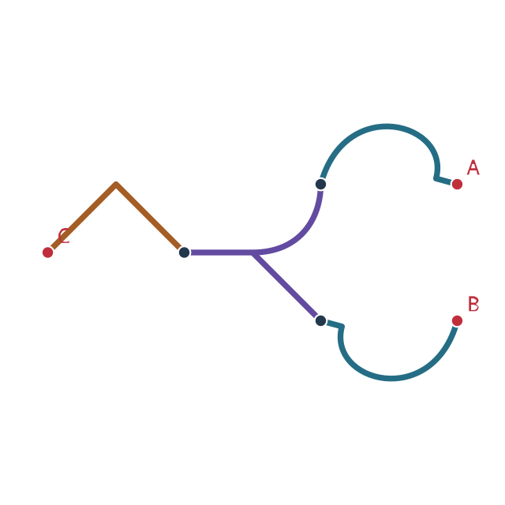

## Registro geométrico

La escala física se declara en O.2; la figura representa una proyección. T: azul, R: ocre, N: violeta. Los puntos oscuros son uniones declaradas; los rojos, extremos libres.

| Pieza | a | b | tₓ | tᵧ | Capa de cruce |
|---|---:|---:|---:|---:|---:|
| N₁ | 1 | 0 | 0 | 0 | 0 |
| T₁ | -1920/2473 | -520/2473 | 4731/2473 | -3201/2473 | 1 |
| T₂ | 1920/2473 | 520/2473 | 5161/2473 | 3201/2473 | 2 |
| R₁ | 0 | 1 | -2 | -1 | 3 |

Transformación: \(x_g=ax-by+t_x,\ y_g=bx+ay+t_y\). Las fracciones son los valores canónicos, no redondeos de calibración física.

Uniones: N₁.1 ↔ R₁.a; N₁.2 ↔ T₁.b; N₁.3 ↔ T₂.a.

4 piezas; 1 componente(s) conexa(s); 0 ciclo(s) independiente(s); 3 extremo(s) libre(s). Caja del eje: 6.000000 × 3.695184 u, sin espesor de trazo.

## Puertos y terminales

| Puerto | Extremo | Intercambio | Función |
|---|---|---|---|
| C | R₁.b | Intercambio común | Suministro de referencia y mando de reparto mediante señal distinguible. |
| A | T₁.a | Rama | Primera salida o entrada en el régimen inverso. |
| B | T₂.b | Rama | Segunda salida o entrada en el régimen inverso. |

Los puertos mixtos se descomponen en subcanales tipados. La región de aplicación y los intercambios distribuidos forman parte del montaje aunque no sean extremos de la plantilla.

## Contrato dinámico de referencia

- Estados: reparto w_i, energía de nodo.
- Entradas: potencia, pesos normalizados.
- Salidas: potencias de ramas.
- Dominio: w_i>=0; capacidades de ramas respetadas.

`P_i=eta*w_i*P_in; sum(w_i)=1; dH=P_in-sum(P_i)-Qdot`

El reparto puede ser dinámico; no duplica potencia.

Grupos de parámetros: `power_channel` en `datos/parametros.json`. El contrato reducido no constituye una realización microscópica demostrada.

## Activación y funcionamiento

1. **Conexión.** Identificar el suministro y las condiciones de cada rama.
2. **Asignación.** Preparar proporciones o una regla física de reparto y comprobar la respuesta de los receptores.
3. **Reparto.** Ajustar el flujo respetando capacidad, pérdidas y energía transitoria del encuentro.
4. **Reasignación.** Redistribuir o reducir el aporte si una rama cambia de carga o deja de recibir.

## Modelo operacional y balance de recursos

En régimen estacionario sin otra fuente ni consumo auxiliar dentro del balance,

\[
P_C=P_A+P_B+P_{\mathrm{pérdida}}.
\]

Puede definirse PA = αA PC y PB = αB PC, con αA + αB ≤ 1 en el régimen pasivo. Si intervienen ondas coherentes, se caracterizan amplitudes, fases y una matriz de dispersión: dos ondas no se suman siempre como potencias independientes en cada salida.

Las corrientes materiales conservan por separado la masa o cantidad de cada especie. Las señales de mando y las respuestas de las ramas ocupan ancho de banda y llegan con retardo.

## Posición y persistencia

El encuentro se fija o sigue a sus terminales. Conectar varios Distribuidores permite árboles o redes; cada nivel añade su respuesta y sus pérdidas. Los suministros y controles locales evitan que todo el ajuste dependa de un solo punto.

## Comprobación y diagnóstico

| Observación | Interpretación y acción |
|---|---|
| Una rama recibe menos de lo indicado | Comprobar su carga, adaptación y pérdidas. |
| Cambiar una rama altera demasiado la otra | Caracterizar el acoplamiento entre terminales y ajustar el control. |
| El balance aparente excede la entrada | Buscar alimentación auxiliar o descarga transitoria no contabilizada. |
| Aparecen pulsos al desconectar una salida | Preparar el destino del flujo antes de cambiar la conexión. |

## Ejemplo de uso

Con 100 W netos disponibles en un caso ideal sin pérdidas, un reparto 3:1 entrega 75 W y 25 W. Si una rama deja de recibir, sus 25 W deben reducirse, reasignarse o recogerse; no desaparecen.

## Correspondencia microscópica

Dispersión de unión adaptada.

**Estado físico:** Modos incidentes y salientes.

**Coeficientes:** Matriz S e impedancias de ramas.

**Comportamiento resultante:** Divide potencia según |S_ij|^2; adaptación determina reflexión.

**Comprobación disponible:** Nexo: reflexión 1/9 y salidas 4/9; grafo P-08. Véase MM.7.

**Requisito de realización:** Realizar la adaptación física y su banda.

## Aceptación

Comprobar geometría y puertos, respuesta a baja potencia, balance de recursos y transición de retirada. El montaje debe satisfacer las magnitudes del contrato y el dominio de su receta. La precisión del SVG no demuestra estabilidad ni rendimiento del estado físico.

---

# P-09 · Sensor

**Estado M2: realización completa no demostrada.** Ganancia, retroaccion y correlaciones de ruido no estan determinadas por el trazo. La función y los valores siguientes son objetivos revisables. Véanse las secciones 15.6.

Sensor convierte una interacción física en una señal utilizable por la red. Cada preparación especifica qué observable mide, mediante qué acoplamiento y con qué referencia. Puede detectar luz, movimiento, temperatura u otra respuesta accesible mediante ese acoplamiento; una figura genérica no reconoce automáticamente cualquier sustancia ni cualquier historia.

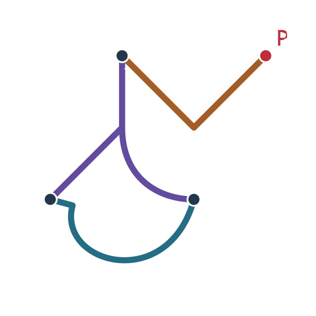

## Registro geométrico

La escala física se declara en O.2; la figura representa una proyección. T: azul, R: ocre, N: violeta. Los puntos oscuros son uniones declaradas; los rojos, extremos libres.

| Pieza | a | b | tₓ | tᵧ | Capa de cruce |
|---|---:|---:|---:|---:|---:|
| N₁ | 0 | 1 | 0 | 0 | 0 |
| T₁ | 1920/2473 | 520/2473 | 215/2473 | 3201/2473 | 1 |
| R₁ | 0 | -1 | 1 | 0 | 2 |

Transformación: \(x_g=ax-by+t_x,\ y_g=bx+ay+t_y\). Las fracciones son los valores canónicos, no redondeos de calibración física.

Uniones: N₁.1 ↔ R₁.a; N₁.2 ↔ T₁.b; N₁.3 ↔ T₁.a.

3 piezas; 1 componente(s) conexa(s); 1 ciclo(s) independiente(s); 1 extremo(s) libre(s). Caja del eje: 3.000000 × 2.847592 u, sin espesor de trazo.

## Puertos y terminales

| Puerto | Extremo | Intercambio | Función |
|---|---|---|---|
| P | R₁.b | Señales y alimentación | Recibe preparación o interrogación y entrega una medida con su estado de validez. |

| Región funcional | Localización | Intercambio |
|---|---|---|
| S | Región sensible | Interacciona con el observable elegido. Una medida remota requiere propagación desde el objetivo o un terminal físicamente situado allí. |

Los puertos mixtos se descomponen en subcanales tipados. La región de aplicación y los intercambios distribuidos forman parte del montaje aunque no sean extremos de la plantilla.

## Contrato dinámico de referencia

- Estados: estimación z, estado del transductor.
- Entradas: observable físico, reloj.
- Salidas: dato, incertidumbre, validez.
- Dominio: Modalidad declarada; termometría del caso: tau_s=0.01 s, incertidumbre 0.05 K.

`tau_s*dz/dt=h(x)-z; y=z+n`

No se infiere información que no pueda llegar al terminal.

Grupos de parámetros: `logic`, `thermal` en `datos/parametros.json`. El contrato reducido no constituye una realización microscópica demostrada.

## Activación y funcionamiento

1. **Elección.** Definir observable, región sensible, referencia y unidades de la señal.
2. **Calibración.** Comparar respuestas con estados conocidos y estimar fondo y ruido.
3. **Lectura.** Realizar una interacción de intensidad y duración adecuadas; transmitir dato, tiempo e incertidumbre.
4. **Comprobación.** Repetir una referencia o retirar la excitación de prueba y observar si cambia el fondo.

## Modelo operacional y balance de recursos

Un modelo de respuesta clásica es

\[
z(t)=h[x(t-\tau)]+n(t).
\]

h representa la transducción calibrada, τ el retardo correspondiente y n el ruido. En una realización real también puede intervenir memoria temporal de la respuesta. La medida incluye resolución, banda y perturbación del objetivo; no equivale a leer sin interacción su estado microscópico completo.

Si N lecturas tienen ruido independiente de varianza finita e idéntica, la desviación típica de su promedio disminuye como 1/√N. Deriva, correlaciones y cambios del objetivo deben tratarse aparte. Un registro antiguo conserva su tiempo de adquisición: recibirlo ahora no lo convierte en una observación actual.

## Posición y persistencia

La región sensible puede permanecer junto al glifo o desplegarse mediante un enlace. Sensores distribuidos permiten reconstrucciones más ricas; cada terminal aporta señales y consume recursos de medida y transmisión. El brillo de la inscripción es un indicador opcional, no la medida misma.

## Comprobación y diagnóstico

| Observación | Interpretación y acción |
|---|---|
| La misma referencia produce valores distintos | Medir deriva y condiciones de calibración. |
| La lectura cambia al aumentar la excitación | Estimar perturbación del objetivo y respuesta no lineal. |
| Promediar no mejora la precisión | Comprobar ruido correlacionado, sesgo o variación real del objetivo. |
| Aparece un valor sin conexión con el objetivo | Revisar si procede de una memoria, una interferencia o un terminal diferente. |

## Ejemplo de uso

Para comparar dos recipientes, se observa primero una referencia común y después cada recipiente bajo condiciones equivalentes. Una diferencia menor que la incertidumbre combinada no permite afirmar con certeza cuál está más caliente.

## Correspondencia microscópica

Acoplamiento de observable a modo de lectura.

**Estado físico:** Observable O, transductor q y baño.

**Coeficientes:** H_int=-g q O; susceptibilidad y correladores de ruido.

**Comportamiento resultante:** La perturbación modifica una señal medible con retroacción y error.

**Comprobación disponible:** Contrato de medida y relación respuesta–ruido. Véase MM.10–MM.11.

**Requisito de realización:** Derivar modalidad concreta, sensibilidad y calibración espacial.

## Aceptación

Comprobar geometría y puertos, respuesta a baja potencia, balance de recursos y transición de retirada. El montaje debe satisfacer las magnitudes del contrato y el dominio de su receta. La precisión del SVG no demuestra estabilidad ni rendimiento del estado físico.

---

# P-10 · Selector

**Estado M2: realización completa no demostrada.** El selector necesita un acoplamiento material que distinga objetivos y cuantifique falsos positivos. La función y los valores siguientes son objetivos revisables. Véanse las secciones 13.2; 15.6.

Selector establece qué objetivo accesible recibirá una operación. Compara observaciones con una referencia o conserva un vínculo previamente identificado. Seleccionar un objeto no lo mueve, no separa sus componentes y no descubre detalles que las señales recibidas no distinguen.

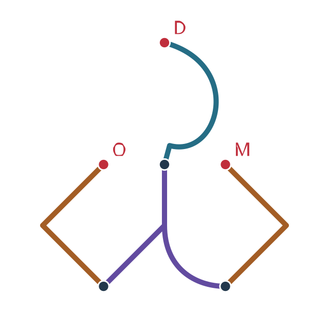

## Registro geométrico

La escala física se declara en O.2; la figura representa una proyección. T: azul, R: ocre, N: violeta. Los puntos oscuros son uniones declaradas; los rojos, extremos libres.

| Pieza | a | b | tₓ | tᵧ | Capa de cruce |
|---|---:|---:|---:|---:|---:|
| N₁ | 0 | 1 | 0 | 0 | 0 |
| R₁ | 1 | 0 | -2 | 0 | 1 |
| R₂ | -1 | 0 | 2 | 0 | 2 |
| T₁ | 520/2473 | -1920/2473 | 728/2473 | -5161/2473 | 3 |

Transformación: \(x_g=ax-by+t_x,\ y_g=bx+ay+t_y\). Las fracciones son los valores canónicos, no redondeos de calibración física.

Uniones: N₁.1 ↔ T₁.a; N₁.2 ↔ R₂.a; N₁.3 ↔ R₁.b.

4 piezas; 1 componente(s) conexa(s); 0 ciclo(s) independiente(s); 3 extremo(s) libre(s). Caja del eje: 4.000000 × 4.000000 u, sin espesor de trazo.

## Puertos y terminales

| Puerto | Extremo | Intercambio | Función |
|---|---|---|---|
| O | R₁.a | Información | Observaciones procedentes de Sensor o de un vínculo directo. |
| M | R₂.b | Información | Muestra, criterio o referencia de comparación. |
| D | T₁.b | Referencia y control | Entrega la identificación accesible y su grado de validez; recibe seguimiento y alimentación. |

Los puertos mixtos se descomponen en subcanales tipados. La región de aplicación y los intercambios distribuidos forman parte del montaje aunque no sean extremos de la plantilla.

## Contrato dinámico de referencia

- Estados: objetivo identificado, estimación de estado, confianza.
- Entradas: observaciones, referencia de objetivo, criterio y caducidad.
- Salidas: identificador de objetivo, región accesible, validez.
- Dominio: Métrica, umbral, margen entre candidatos y edad máxima declarados; ambigüedad produce salida inválida.

`objetivo=argmin_i d(observacion_i,referencia) sólo si distancia<umbral y margen suficiente; actualizar vínculo con medida causal`

Selecciona un objetivo; no lo mueve ni separa sus sustancias. No identifica detalles no observados.

Grupos de parámetros: `logic` en `datos/parametros.json`. El contrato reducido no constituye una realización microscópica demostrada.

## Activación y funcionamiento

1. **Referencia.** Recibir el criterio de identificación y las condiciones en que se considera válido.
2. **Comparación.** Contrastar las observaciones disponibles; conservar candidatos si la información no distingue uno solo.
3. **Vinculación.** Entregar una referencia al objetivo y actualizarla con señales nuevas.
4. **Pérdida o cambio.** Declarar ambigüedad o pérdida de seguimiento; reasignar únicamente según una regla explícita.

## Modelo operacional y balance de recursos

Una realización sencilla puede comparar características mediante

\[
d^2=(\mathbf z-\mathbf z_*)^{\mathsf T}W(\mathbf z-\mathbf z_*),
\qquad d\leq\varepsilon.
\]

W es una ponderación positiva semidefinida que incluye escalas y unidades; ε es un umbral de identificación. Esta prueba es un ejemplo de regla física implementable, no una definición universal de identidad. Dos objetos con observaciones indistinguibles pueden superar el mismo criterio.

El vínculo resultante incluye región, tiempo y confianza. Transmitir una referencia no despliega instantáneamente el canal de actuación; el módulo receptor debe poder alcanzar el objetivo y conservar la actualización causal de esa referencia.

## Posición y persistencia

El seguimiento puede usar un marco local o una red de observación. Para objetivos móviles se actualizan posición y velocidad con incertidumbre. Una marca pequeña puede seleccionar un objeto grande sin describir cada átomo cuando la tarea solo requiere su contorno o comportamiento macroscópico.

## Comprobación y diagnóstico

| Observación | Interpretación y acción |
|---|---|
| Selecciona varios objetos semejantes | Añadir una característica accesible o mantener explícita la ambigüedad. |
| Pierde el objetivo al moverse | Aumentar la frecuencia de observación o revisar el modelo de seguimiento. |
| El objetivo elegido no puede recibir la operación | Comprobar alcance e interfaces del actuador. |
| Conserva una identificación después de perder señales | Comprobar la antigüedad y la validez declarada del registro. |

## Ejemplo de uso

Se toca una de dos piedras iguales para establecer una referencia inicial. Mientras llegan observaciones suficientes de su movimiento, puede conservarse ese vínculo. Si ambas quedan ocultas y se intercambian sin dejar señales distinguibles, la figura no puede decidir con certeza cuál era la elegida.

## Correspondencia microscópica

Identificación a partir de medidas y memoria.

**Estado físico:** Datos, referencia, estimador y decisión.

**Coeficientes:** Distancia estadística, umbral, margen y caducidad.

**Comportamiento resultante:** Entrega un objetivo identificable; la decisión es cálculo físico sobre señales.

**Comprobación disponible:** Contrato de identificación; base modal lógica condicional. Véase MM.11.

**Requisito de realización:** Implementar cálculo completo y tasa de identificación errónea.

## Aceptación

Comprobar geometría y puertos, respuesta a baja potencia, balance de recursos y transición de retirada. El montaje debe satisfacer las magnitudes del contrato y el dominio de su receta. La precisión del SVG no demuestra estabilidad ni rendimiento del estado físico.

---

# P-11 · Memoria

**Estado M2: realización completa no demostrada.** La fase U(1) tiene barrera cero; Kerr, disipacion y escritura del ensayo anterior no fueron derivados de esta geometria. La función y los valores siguientes son objetivos revisables. Véanse las secciones 16.2.

Memoria conserva datos y patrones en estados distinguibles del campo. Permite escribir, leer, verificar y actualizar registros. Puede guardar una receta, una referencia o información personal previamente medida; el contenido procede de una fuente física, y los detalles nunca registrados no aparecen al consultar la figura.

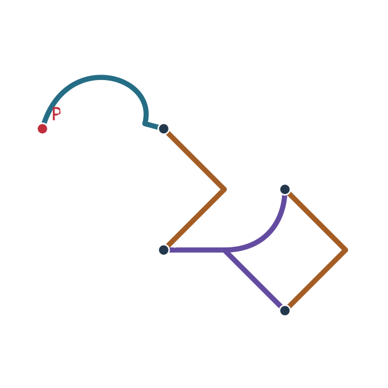

## Registro geométrico

La escala física se declara en O.2; la figura representa una proyección. T: azul, R: ocre, N: violeta. Los puntos oscuros son uniones declaradas; los rojos, extremos libres.

| Pieza | a | b | tₓ | tᵧ | Capa de cruce |
|---|---:|---:|---:|---:|---:|
| N₁ | 1 | 0 | 0 | 0 | 0 |
| R₁ | -1 | 0 | 2 | 0 | 1 |
| R₂ | -1 | 0 | 0 | -1 | 2 |
| T₁ | -1920/2473 | -520/2473 | -5161/2473 | -5674/2473 | 3 |

Transformación: \(x_g=ax-by+t_x,\ y_g=bx+ay+t_y\). Las fracciones son los valores canónicos, no redondeos de calibración física.

Uniones: N₁.1 ↔ R₂.a; N₁.2 ↔ R₁.b; N₁.3 ↔ R₁.a; R₂.b ↔ T₁.a.

4 piezas; 1 componente(s) conexa(s); 1 ciclo(s) independiente(s); 1 extremo(s) libre(s). Caja del eje: 5.000000 × 3.847592 u, sin espesor de trazo.

## Puertos y terminales

| Puerto | Extremo | Intercambio | Función |
|---|---|---|---|
| P | T₁.b | Datos, control y alimentación | Interfaz compartida con operaciones físicamente distinguibles de lectura, escritura y mantenimiento. |

Los puertos mixtos se descomponen en subcanales tipados. La región de aplicación y los intercambios distribuidos forman parte del montaje aunque no sean extremos de la plantilla.

## Contrato dinámico de referencia

- Estados: palabras, síndrome ECC, energía de barrera.
- Entradas: dato, dirección, lectura o escritura.
- Salidas: palabra, validez.
- Dominio: Capacidad, barrera, temperatura y tasa de errores del perfil.

`tau_flip=tau0*exp(DeltaF/(kB*T)); P_switch=E_switch*f_switch`

Código (7,4) corrige un error; errores comunes requieren otra redundancia.

Grupos de parámetros: `logic` en `datos/parametros.json`. El contrato reducido no constituye una realización microscópica demostrada.

## Activación y funcionamiento

1. **Inicialización.** Preparar estados distinguibles y un formato de registro.
2. **Escritura.** Recibir los datos y modificar el estado; verificar la copia con una lectura.
3. **Retención y lectura.** Mantener las condiciones de persistencia y corregir errores utilizando redundancia disponible.
4. **Actualización.** Reescribir o borrar de forma controlada; conservar versiones cuando la operación lo requiera.

## Modelo operacional y balance de recursos

Un soporte con Ω estados operativamente distinguibles admite como máximo log₂ Ω bits clásicos en esa codificación ideal. La capacidad útil disminuye al reservar estados para comprobación y corrección.

\[
Q_{\mathrm{borrado}}\geq k_B T\ln2
\]

es el límite reversible ideal para borrar irreversiblemente un bit inicialmente equiprobable en las condiciones térmicas correspondientes; no es un coste obligatorio de cada lectura u operación. [Bennett: principio de Landauer](https://arxiv.org/abs/physics/0210005).

Una descripción comprimida puede generar regularidades de un plano. Los detalles individuales requieren registros o nuevas observaciones. La ficha define memoria clásica; no atribuye copia perfecta de un estado cuántico arbitrario desconocido. Escribir deprisa, retener durante mucho tiempo y leer con poco ruido son prestaciones que deben caracterizarse por separado.

## Posición y persistencia

El registro puede acompañar al usuario o existir en una red distribuida. Un puerto pequeño puede acceder a una biblioteca extensa con dirección, latencia y ancho de banda definidos. El desplazamiento y la comunicación de las copias conservan los balances físicos.

## Comprobación y diagnóstico

| Observación | Interpretación y acción |
|---|---|
| La lectura difiere de lo escrito | Comprobar errores de estado, sincronización y formato. |
| Una copia repite siempre el mismo error | Revisar el registro original y la corrección; repetir no elimina un sesgo. |
| La retención se reduce al apagar el suministro | Caracterizar qué parte del estado depende de mantenimiento. |
| Se invoca una plantilla que no existe | Declarar ausencia de datos y recibir una referencia válida. |

## Ejemplo de uso

Un registro que describe una cuadrícula de cien posiciones puede guardarse como una regla y sus medidas. Cien valores distintos observados en esas posiciones necesitan además su contenido particular; la regla de la cuadrícula no los determina.

## Correspondencia microscópica

Biestabilidad alimentada o barrera pasiva.

**Estado físico:** Amplitud de cavidad o estados metastables.

**Coeficientes:** K desde derivadas modales; atractores y ruido de escape.

**Comportamiento resultante:** Dos estados distinguibles codifican un bit y pulsos cambian de estado.

**Comprobación disponible:** Dos atractores, autovalores y escritura/borrado numéricos. Véase MM.6; MM.11.

**Requisito de realización:** Derivar K y pérdidas del glifo; calcular fallos bajo ruido. Las dos realizaciones no se mezclan.

## Aceptación

Comprobar geometría y puertos, respuesta a baja potencia, balance de recursos y transición de retirada. El montaje debe satisfacer las magnitudes del contrato y el dominio de su receta. La precisión del SVG no demuestra estabilidad ni rendimiento del estado físico.

---

# P-12 · Comparador

**Estado M2: realización completa no demostrada.** No se ha derivado el umbral de decision, su transductor ni su distribucion de error. La función y los valores siguientes son objetivos revisables. Véanse las secciones 15.6.

Comparador contrasta dos valores o señales expresados en escalas compatibles y produce una respuesta utilizable por otros módulos. Decide según una relación preparada: diferencia, orden o coincidencia dentro de un margen. No identifica por sí solo el origen de las señales ni realiza el cambio que se ordenará después.

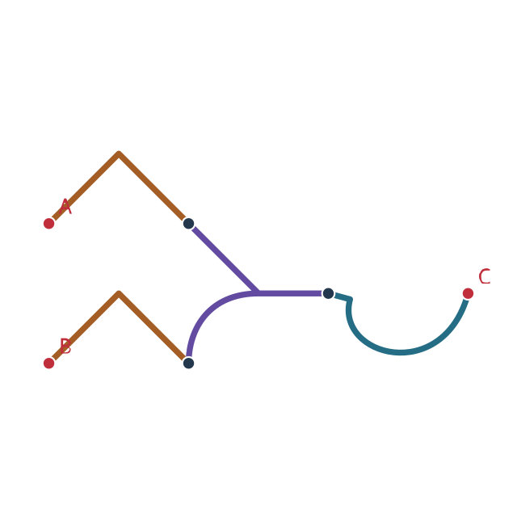

## Registro geométrico

La escala física se declara en O.2; la figura representa una proyección. T: azul, R: ocre, N: violeta. Los puntos oscuros son uniones declaradas; los rojos, extremos libres.

| Pieza | a | b | tₓ | tᵧ | Capa de cruce |
|---|---:|---:|---:|---:|---:|
| N₁ | -1 | 0 | 0 | 0 | 0 |
| R₁ | 0 | 1 | -2 | -2 | 1 |
| R₂ | 0 | 1 | -2 | 0 | 2 |
| T₁ | 1920/2473 | 520/2473 | 5161/2473 | 728/2473 | 3 |

Transformación: \(x_g=ax-by+t_x,\ y_g=bx+ay+t_y\). Las fracciones son los valores canónicos, no redondeos de calibración física.

Uniones: N₁.1 ↔ T₁.a; N₁.2 ↔ R₂.a; N₁.3 ↔ R₁.a.

4 piezas; 1 componente(s) conexa(s); 0 ciclo(s) independiente(s); 3 extremo(s) libre(s). Caja del eje: 6.000000 × 3.000000 u, sin espesor de trazo.

## Puertos y terminales

| Puerto | Extremo | Intercambio | Función |
|---|---|---|---|
| A | R₁.b | Señal | Valor observado. |
| B | R₂.b | Señal | Segundo valor o consigna. |
| C | T₁.b | Resultado y control | Diferencia o clasificación, con indicación de validez. |

Los puertos mixtos se descomponen en subcanales tipados. La región de aplicación y los intercambios distribuidos forman parte del montaje aunque no sean extremos de la plantilla.

## Contrato dinámico de referencia

- Estados: salida binaria, estado previo.
- Entradas: valor, referencia, banda de histéresis.
- Salidas: mayor o menor, validez.
- Dominio: h>=0; unidades iguales; entrada inválida produce estado inválido.

`y=1 si x-r>h; y=0 si x-r<-h; conserva y en otro caso`

La salida se regenera con alimentación; no interpretar dato inválido como cero.

Grupos de parámetros: `logic` en `datos/parametros.json`. El contrato reducido no constituye una realización microscópica demostrada.

## Activación y funcionamiento

1. **Escala.** Comprobar unidades, origen y tiempos de ambas señales.
2. **Umbral.** Definir margen de comparación y, si conviene, histéresis.
3. **Respuesta.** Entregar diferencia o estado de comparación al actuador o a una memoria.
4. **Revisión.** Señalar entrada ausente o fuera de rango en vez de tratarla como un cero válido.

## Modelo operacional y balance de recursos

Una respuesta de tres estados puede definirse mediante

\[
d=a-b,\qquad
y=\begin{cases}
-1,&d<-\varepsilon,\\
0,&|d|\leq\varepsilon,\\
+1,&d>\varepsilon.
\end{cases}
\]

El estado central indica coincidencia dentro del margen, no igualdad matemática exacta de magnitudes continuas. Si se desea evitar cambios rápidos por ruido, se especifican umbrales de entrada y salida diferentes y el estado previo correspondiente.

La evaluación consume tiempo y recursos de señal. Una función lógica no exige disipar un valor fijo de energía en cada paso; la implementación y los cambios irreversibles de registro determinan el balance.

## Posición y persistencia

Puede situarse cerca del sensor o del actuador. Comparar medidas tomadas en instantes diferentes exige conservar sus marcas temporales o un modelo de evolución. Muchos comparadores locales permiten control distribuido sin enviar cada decisión a una figura central.

## Comprobación y diagnóstico

| Observación | Interpretación y acción |
|---|---|
| Cambia de estado continuamente cerca del objetivo | Revisar ruido, margen e histéresis. |
| Indica coincidencia con una entrada desconectada | Añadir o comprobar el estado de validez. |
| La corrección aleja el resultado de la consigna | Revisar el signo de comparación y la conexión con el actuador. |
| Compara correctamente en reposo pero falla en movimiento | Alinear tiempos o incluir el retardo de las señales. |

## Ejemplo de uso

Para mantener una lectura alrededor de una consigna, Comparador entrega tres respuestas: por debajo, dentro del margen o por encima. Compuerta recibe esa respuesta y modifica el paso según la regla de la instalación.

## Correspondencia microscópica

No linealidad regenerativa con entradas diferenciales.

**Estado físico:** Dos señales, umbral y alimentación.

**Coeficientes:** Ganancia diferencial, histéresis y separación de atractores.

**Comportamiento resultante:** La diferencia de entradas determina una salida distinguible.

**Comprobación disponible:** Biestabilidad modal como mecanismo. Véase MM.11.

**Requisito de realización:** Resolver suma diferencial, fan-out y margen de ruido.

## Aceptación

Comprobar geometría y puertos, respuesta a baja potencia, balance de recursos y transición de retirada. El montaje debe satisfacer las magnitudes del contrato y el dominio de su receta. La precisión del SVG no demuestra estabilidad ni rendimiento del estado físico.

---

# P-13 · Retardo

**Estado M2: realización completa no demostrada.** El retardo depende de dispersion y resonancias; longitud/v no demuestra ruido, ancho de banda ni perdidas M2. La función y los valores siguientes son objetivos revisables. Véanse las secciones 16.1.

Retardo entrega una señal después de un intervalo preparado. Puede realizarse mediante propagación guiada o mediante registro y reproducción. La operación conserva el orden y la información necesarios dentro de su banda; no detiene el tiempo del entorno ni aplaza sin recursos el movimiento de la materia.

## Registro geométrico

La escala física se declara en O.2; la figura representa una proyección. T: azul, R: ocre, N: violeta. Los puntos oscuros son uniones declaradas; los rojos, extremos libres.

| Pieza | a | b | tₓ | tᵧ | Capa de cruce |
|---|---:|---:|---:|---:|---:|
| N₁ | 1 | 0 | 0 | 0 | 0 |
| R₁ | -1 | 0 | 2 | -2 | 1 |
| T₁ | -520/2473 | 1920/2473 | 1745/2473 | 5161/2473 | 2 |
| R₂ | 0 | -2 | 3 | 5 | 3 |
| T₂ | 520/2473 | -1920/2473 | 13093/2473 | 4731/2473 | 4 |

Transformación: \(x_g=ax-by+t_x,\ y_g=bx+ay+t_y\). Las fracciones son los valores canónicos, no redondeos de calibración física.

Uniones: N₁.2 ↔ R₁.a; N₁.3 ↔ T₁.a; T₁.b ↔ R₂.a; R₂.b ↔ T₂.a.

5 piezas; 1 componente(s) conexa(s); 0 ciclo(s) independiente(s); 3 extremo(s) libre(s). Caja del eje: 6.847592 × 8.000000 u, sin espesor de trazo.

## Puertos y terminales

| Puerto | Extremo | Intercambio | Función |
|---|---|---|---|
| I | R₁.b | Señal | Entrada que debe demorarse. |
| O | T₂.b | Señal | Entrega posterior. |
| U | N₁.1 | Control y alimentación | Tiempo solicitado, sincronización y estado de ocupación. |

Los puertos mixtos se descomponen en subcanales tipados. La región de aplicación y los intercambios distribuidos forman parte del montaje aunque no sean extremos de la plantilla.

## Contrato dinámico de referencia

- Estados: cola temporal.
- Entradas: dato con sello temporal, retardo.
- Salidas: dato diferido.
- Dominio: tau_d>=0; almacenamiento >= tasa_datos*tau_d.

`y(t)=x(t-tau_d)`

Descartar datos caducados según contrato; no anticipar la entrada.

Grupos de parámetros: `logic` en `datos/parametros.json`. El contrato reducido no constituye una realización microscópica demostrada.

## Activación y funcionamiento

1. **Asignación.** Definir qué señal se demora, durante cuánto tiempo y con qué fidelidad.
2. **Recepción.** Aceptar la señal solo en el régimen para el que existe capacidad disponible.
3. **Retención o tránsito.** Mantener la propagación o el registro temporal y la referencia del intervalo.
4. **Entrega.** Reproducir la señal y confirmar qué contenido continúa pendiente antes de reiniciar o desmontar.

## Modelo operacional y balance de recursos

La respuesta ideal de un retardo sobre una banda especificada es

\[
y(t)=g\,x(t-\tau),\qquad \tau\geq0.
\]

g incluye la amplitud o ganancia declarada. La ganancia activa recibe energía adicional. Una demora basada en un recorrido de longitud L respeta su tiempo causal; una basada en almacenamiento incluye escritura, conservación, lectura y control temporal.

Un flujo digital no comprimido de Rb bits/s retenido durante τ segundos ocupa al menos Rb τ bits de datos, además de control y redundancia. Cambiar el retardo mientras hay información pendiente exige una regla explícita para su entrega; no debe eliminarla silenciosamente.

## Posición y persistencia

La ruta o el registro pueden extenderse fuera del dibujo de mando. Una red de Retardos permite alinear señales que llegan por caminos distintos, manteniendo el tiempo de adquisición de cada una.

## Comprobación y diagnóstico

| Observación | Interpretación y acción |
|---|---|
| La salida aparece con intervalos variables | Revisar la referencia temporal y el ruido de sincronización. |
| Los pulsos se deforman | Caracterizar banda, dispersión y lectura del registro. |
| Se pierden señales al aumentar el flujo | Revisar capacidad temporal y política de recepción. |
| Cambiar τ duplica o omite datos | Vaciar o migrar el contenido con una secuencia definida. |

## Ejemplo de uso

Demorar un flujo de 1000 bits/s durante dos segundos requiere conservar al menos 2000 bits de datos en el caso de almacenamiento digital sin compresión; los registros auxiliares se suman aparte.

## Correspondencia microscópica

Propagación dispersiva o registro y reproducción.

**Estado físico:** Modo de línea o cola de memoria.

**Coeficientes:** Retardo de grupo d arg S/d omega y capacidad almacenada.

**Comportamiento resultante:** La salida conserva orden y aparece tras propagación o lectura temporizada.

**Comprobación disponible:** Fase de grafo y contrato causal. Véase MM.7; MM.11.

**Requisito de realización:** Calcular ancho de banda, distorsión y error temporal.

## Aceptación

Comprobar geometría y puertos, respuesta a baja potencia, balance de recursos y transición de retirada. El montaje debe satisfacer las magnitudes del contrato y el dominio de su receta. La precisión del SVG no demuestra estabilidad ni rendimiento del estado físico.

---

# P-14 · Reloj

**Estado M2: realización completa no demostrada.** Una frecuencia modal no demuestra un reloj alimentado con estabilidad, arranque y difusion de fase calculados. La función y los valores siguientes son objetivos revisables. Véanse las secciones 14.5; 15.6.

Reloj produce pulsos o una fase periódica que otros módulos utilizan como referencia de tiempo. La periodicidad procede de la dinámica de una configuración preparada, no de que todo lazo dibujado oscile. Puede coordinar repeticiones, muestreos o secuencias sin decidir su contenido.

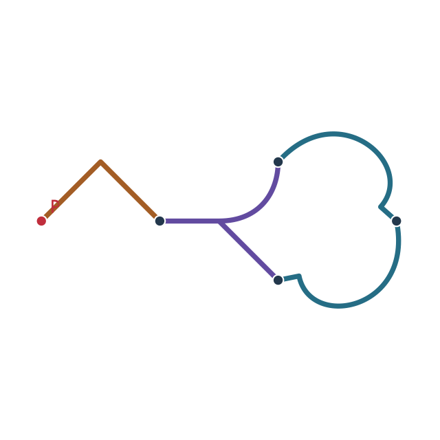

## Registro geométrico

La escala física se declara en O.2; la figura representa una proyección. T: azul, R: ocre, N: violeta. Los puntos oscuros son uniones declaradas; los rojos, extremos libres.

| Pieza | a | b | tₓ | tᵧ | Capa de cruce |
|---|---:|---:|---:|---:|---:|
| N₁ | 1 | 0 | 0 | 0 | 0 |
| T₁ | -1660/2473 | -1480/2473 | 5095/2473 | -2072/2473 | 1 |
| T₂ | 2180/2473 | -440/2473 | 5525/2473 | 1857/2473 | 2 |
| R₁ | 0 | 1 | -2 | -1 | 3 |

Transformación: \(x_g=ax-by+t_x,\ y_g=bx+ay+t_y\). Las fracciones son los valores canónicos, no redondeos de calibración física.

Uniones: N₁.1 ↔ R₁.a; N₁.2 ↔ T₁.b; N₁.3 ↔ T₂.a; T₁.a ↔ T₂.b.

4 piezas; 1 componente(s) conexa(s); 1 ciclo(s) independiente(s); 1 extremo(s) libre(s). Caja del eje: 6.034808 × 2.909167 u, sin espesor de trazo.

## Puertos y terminales

| Puerto | Extremo | Intercambio | Función |
|---|---|---|---|
| P | R₁.b | Referencia, control y alimentación | Pulsos salientes, ajuste entrante y suministro mediante señales distinguibles. |

Los puertos mixtos se descomponen en subcanales tipados. La región de aplicación y los intercambios distribuidos forman parte del montaje aunque no sean extremos de la plantilla.

## Contrato dinámico de referencia

- Estados: fase, contador.
- Entradas: alimentación, sincronización.
- Salidas: pulsos, tiempo local.
- Dominio: f0=1 MHz local; sincronización remota con retardo medido.

`dphi/dtau_propia=2*pi*f0+ruido`

El tiempo propio y una coordenada temporal global no son intercambiables.

Grupos de parámetros: `logic` en `datos/parametros.json`. El contrato reducido no constituye una realización microscópica demostrada.

## Activación y funcionamiento

1. **Preparación.** Elegir una familia oscilante y su frecuencia operativa.
2. **Asentamiento.** Aportar la energía inicial y ajustar amplitud y reposición de pérdidas.
3. **Referencia.** Entregar pulsos y, si se requiere, comparar fase con un patrón externo.
4. **Detención.** Avisar a los receptores y reducir la oscilación atendiendo su energía remanente.

## Modelo operacional y balance de recursos

Una descripción de fase local es

\[
\frac{d\varphi}{dt}=2\pi f_0+\delta\omega(t),
\qquad T_0=\frac1{f_0}.
\]

Cada cruce de una fase elegida genera una marca temporal. δω reúne fluctuaciones y deriva. En la descripción del montaje local, t corresponde al tiempo del marco usado; relojes móviles o situados en potenciales gravitatorios distintos requieren el tratamiento relativista pertinente.

Mantener amplitud constante exige compensar las pérdidas del oscilador. Enviar pulsos a muchos receptores también demanda energía de señal. La sincronización de una red incluye retardos y no convierte una orden nueva en una acción instantánea a distancia.

## Posición y persistencia

Puede funcionar como referencia cercana a un grupo de módulos o intercambiar correcciones con otros relojes. Las redes extensas conservan referencias locales y ajustan sus relaciones de fase con señales causales.

## Comprobación y diagnóstico

| Observación | Interpretación y acción |
|---|---|
| La frecuencia deriva | Revisar estado, alimentación y condiciones ambientales. |
| Los pulsos se vuelven irregulares | Medir ruido de fase y perturbaciones del acoplamiento. |
| Dos receptores actúan a destiempo | Comparar retardos de transmisión y criterios de sincronización. |
| La oscilación crece en amplitud | Revisar la reposición de pérdidas y la respuesta no lineal. |

## Ejemplo de uso

Un reloj preparado a 10 Hz entrega una referencia cada 0,1 s. Secuenciador puede contar esos pulsos para decidir cuándo actuar; el número por sí solo no define la precisión del intervalo.

## Correspondencia microscópica

Oscilación sostenida con saturación.

**Estado físico:** Modo oscilante, fuente y baño.

**Coeficientes:** Balance de ganancia/pérdida, ciclo límite y difusión de fase.

**Comportamiento resultante:** La fase local produce pulsos; alimentación repone pérdidas.

**Comprobación disponible:** Mecanismo formulado; no ciclo límite específico calculado. Véase MM.10–MM.11.

**Requisito de realización:** Derivar ganancia, saturación y ruido del glifo.

## Aceptación

Comprobar geometría y puertos, respuesta a baja potencia, balance de recursos y transición de retirada. El montaje debe satisfacer las magnitudes del contrato y el dominio de su receta. La precisión del SVG no demuestra estabilidad ni rendimiento del estado físico.

---

# P-15 · Secuenciador

**Estado M2: realización completa no demostrada.** La maquina de estados operacional no especifica estados microscopicos ni tasas de transicion. La función y los valores siguientes son objetivos revisables. Véanse las secciones 13.1; 15.6.

Secuenciador ejecuta un procedimiento expresado como estados y condiciones de paso. Decide qué etapa comienza, qué respuesta espera y cuál sigue después. Puede recibir un programa de Memoria; no convierte una petición vaga en un plan que nunca se le haya proporcionado.

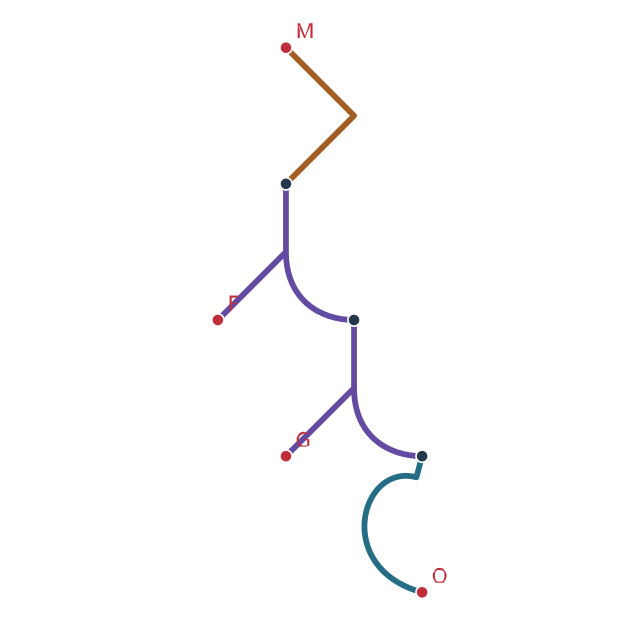

## Registro geométrico

La escala física se declara en O.2; la figura representa una proyección. T: azul, R: ocre, N: violeta. Los puntos oscuros son uniones declaradas; los rojos, extremos libres.

| Pieza | a | b | tₓ | tᵧ | Capa de cruce |
|---|---:|---:|---:|---:|---:|
| N₁ | 0 | 1 | 0 | 0 | 0 |
| N₂ | 0 | 1 | 1 | 2 | 1 |
| R₁ | -1 | 0 | 1 | -2 | 2 |
| T₁ | -520/2473 | 1920/2473 | 4218/2473 | 10107/2473 | 3 |

Transformación: \(x_g=ax-by+t_x,\ y_g=bx+ay+t_y\). Las fracciones son los valores canónicos, no redondeos de calibración física.

Uniones: N₁.1 ↔ R₁.a; N₁.2 ↔ N₂.1; N₂.2 ↔ T₁.a.

4 piezas; 1 componente(s) conexa(s); 0 ciclo(s) independiente(s); 4 extremo(s) libre(s). Caja del eje: 3.000000 × 8.000000 u, sin espesor de trazo.

## Puertos y terminales

| Puerto | Extremo | Intercambio | Función |
|---|---|---|---|
| M | R₁.b | Programa y alimentación | Recibe la secuencia y su estado inicial. |
| O | T₁.b | Órdenes | Entrega acciones identificadas al módulo correspondiente. |
| F | N₁.3 | Respuesta | Recibe confirmaciones y observaciones de la etapa. |
| G | N₂.3 | Disparo y tiempo | Recibe inicio, pausa o referencia temporal. |

Los puertos mixtos se descomponen en subcanales tipados. La región de aplicación y los intercambios distribuidos forman parte del montaje aunque no sean extremos de la plantilla.

## Contrato dinámico de referencia

- Estados: estado FSM, temporizadores, concesión.
- Entradas: eventos, medidas, receta.
- Salidas: órdenes limitadas, estado de ejecución.
- Dominio: Transiciones deterministas y caducidad; lazo local de servicio a 1 ms.

`estado_nuevo=delta(estado,eventos) sólo si guarda válida`

En pérdida de comunicación ejecutar transición de la receta, no una regla universal.

Grupos de parámetros: `logic` en `datos/parametros.json`. El contrato reducido no constituye una realización microscópica demostrada.

## Activación y funcionamiento

1. **Carga.** Recibir estados, transiciones y condiciones de terminación; comprobar que las referencias existen.
2. **Inicio.** Entrar en el estado inicial tras una señal válida.
3. **Ejecución.** Emitir una orden y avanzar según las observaciones o el intervalo establecido.
4. **Pausa o término.** Conservar qué acciones siguen pendientes y completar la retirada prevista.

## Modelo operacional y balance de recursos

Un modelo discreto de control es

\[
q_{k+1}=\delta(q_k,s_k),\qquad u_k=\lambda(q_k,s_k).
\]

q representa el estado, s las señales recibidas y u la orden emitida. δ y λ forman parte del procedimiento físicamente codificado. El índice k cuenta evaluaciones; cada una ocupa tiempo real y recibe información con latencia.

Las dependencias causales se conservan. Etapas independientes pueden ejecutarse en paralelo si existen módulos y recursos; una etapa que necesita el resultado anterior debe esperar una señal suficiente. Reintentar exige saber si la acción previa terminó, para no repetir inadvertidamente un trabajo material.

## Posición y persistencia

El controlador puede estar cerca del operador mientras los actuadores se distribuyen. Las funciones que necesitan respuesta rápida pueden delegarse a otros Secuenciadores ya preparados; esa delegación añade estados y comunicación físicos.

## Comprobación y diagnóstico

| Observación | Interpretación y acción |
|---|---|
| Una etapa nunca termina | Comprobar la condición esperada, el sensor y el enlace de confirmación. |
| Se repite una acción ya realizada | Añadir o revisar la identificación de etapas y confirmaciones. |
| Las órdenes salen en un orden incorrecto | Revisar estado inicial, transiciones y programa recibido. |
| Una pausa deja un proceso incompleto | Definir qué mantiene y cómo termina cada operación pendiente. |

## Ejemplo de uso

Un procedimiento puede abrir Compuerta, esperar una medida suficiente, cerrarla y activar Luz como señal de término. Reloj aporta intervalos si hacen falta; Sensor informa del resultado y Secuenciador decide el orden.

## Correspondencia microscópica

Red física de estados lógicos.

**Estado físico:** Memorias, comparadores, reloj y programa.

**Coeficientes:** Reglas de transición sobre señales válidas y energía de conmutación.

**Comportamiento resultante:** Las salidas activan etapas según medidas y estado almacenado.

**Comprobación disponible:** Máquinas de estados R1; soporte modal parcial. Véase MM.11.

**Requisito de realización:** Construir la red física completa y probar tiempos, ruido y recuperación.

## Aceptación

Comprobar geometría y puertos, respuesta a baja potencia, balance de recursos y transición de retirada. El montaje debe satisfacer las magnitudes del contrato y el dominio de su receta. La precisión del SVG no demuestra estabilidad ni rendimiento del estado físico.

---

# P-16 · Puente

**Estado M2: realización completa no demostrada.** Dos componentes desconectados del grafo no prueban diafonia nula en los campos 3D. La función y los valores siguientes son objetivos revisables. Véanse las secciones 13.7; 15.6.

Puente permite que dos rutas se crucen en la representación sin mezclar sus intercambios principales. Se realiza mediante separación espacial del campo, canales modales distinguibles o una combinación caracterizada de ambos. Su función consiste en mantener ese aislamiento cuando las rutas comparten una zona cercana.

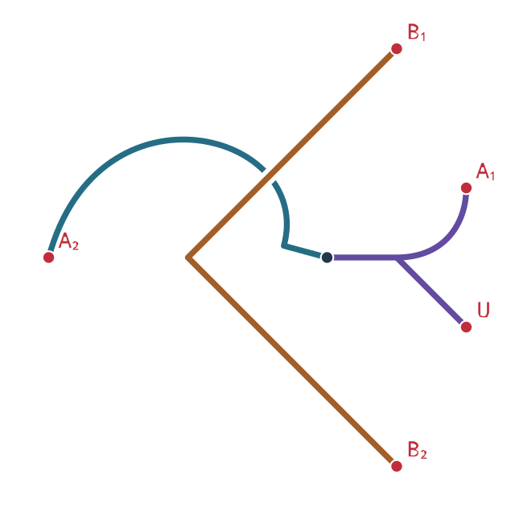

## Registro geométrico

La escala física se declara en O.2; la figura representa una proyección. T: azul, R: ocre, N: violeta. Los puntos oscuros son uniones declaradas; los rojos, extremos libres.

| Pieza | a | b | tₓ | tᵧ | Capa de cruce |
|---|---:|---:|---:|---:|---:|
| N₁ | 1 | 0 | 0 | 0 | 0 |
| T₁ | -3840/2473 | -1040/2473 | -7849/2473 | -1456/2473 | 1 |
| R₁ | 3 | 0 | -3 | 0 | 2 |

Transformación: \(x_g=ax-by+t_x,\ y_g=bx+ay+t_y\). Las fracciones son los valores canónicos, no redondeos de calibración física.

Uniones: N₁.1 ↔ T₁.a.

3 piezas; 2 componente(s) conexa(s); 0 ciclo(s) independiente(s); 5 extremo(s) libre(s). Caja del eje: 6.000000 × 6.000000 u, sin espesor de trazo.

## Puertos y terminales

| Puerto | Extremo | Intercambio | Función |
|---|---|---|---|
| A₁ | N₁.2 | Ruta A | Primer extremo de la primera ruta. |
| A₂ | T₁.b | Ruta A | Segundo extremo de la primera ruta. |
| B₁ | R₁.a | Ruta B | Primer extremo de la segunda ruta. |
| B₂ | R₁.b | Ruta B | Segundo extremo de la segunda ruta. |
| U | N₁.3 | Control y alimentación | Preparación y mantenimiento del aislamiento. |

| Región funcional | Localización | Intercambio |
|---|---|---|
| X | Zona de cruce | Los trazados se conservan sin unión de tráfico. Los campos pueden interactuar para sostener el conjunto, con diafonía residual caracterizada. |

Los puertos mixtos se descomponen en subcanales tipados. La región de aplicación y los intercambios distribuidos forman parte del montaje aunque no sean extremos de la plantilla.

## Contrato dinámico de referencia

- Estados: estado de aislamiento, energía de mantenimiento.
- Entradas: señales A1 y B1, configuración de capas.
- Salidas: señales A2 y B2, diafonía.
- Dominio: Banda, cargas y amplitudes R1; dos componentes de tráfico independientes.

`b(omega)=S(omega)*a(omega); S†S<=I en régimen pasivo; |S_ruta_ajena|^2<=1e-6`

Cruce aislado de dos rutas: no es un transductor entre dominios ni conecta sus tráficos. Su geometría tiene dos componentes conexas.

Grupos de parámetros: `power_channel` en `datos/parametros.json`. El contrato reducido no constituye una realización microscópica demostrada.

## Activación y funcionamiento

1. **Asignación.** Identificar los dos pares de terminales y la separación espacial o modal prevista.
2. **Preparación.** Establecer el estado conjunto y su suministro de mantenimiento si corresponde.
3. **Aislamiento.** Enviar señales distinguibles por cada ruta y medir transmisión y diafonía.
4. **Servicio o retirada.** Usar el cruce dentro de su régimen; reducir ambos flujos antes de modificar su disposición.

## Modelo operacional y balance de recursos

Para pequeñas señales de onda, puede describirse mediante

\[
\mathbf b(\omega)=S(\omega)\mathbf a(\omega).
\]

Las amplitudes se normalizan a potencia. Los términos deseados conectan A₁ con A₂ y B₁ con B₂; los términos que cruzan de una ruta a otra cuantifican diafonía. En el régimen pasivo, una matriz compatible con conservación satisface S†S ≤ I para los puertos de señal incluidos.

El modelo lineal tiene una banda y una amplitud de validez. El aporte que sostiene la configuración se contabiliza aparte, y cualquier amplificación se declara con su fuente. Se busca una diafonía tan baja como requiera el uso, sin atribuir aislamiento perfecto bajo cualquier perturbación.

## Posición y persistencia

La zona de cruce conserva geometría y referencias de las dos rutas. Puente resulta útil en redes densas; dos recorridos que ya están suficientemente separados pueden no necesitar este módulo. Mover una ruta exige mantener o volver a preparar su aislamiento respecto de la otra.

## Comprobación y diagnóstico

| Observación | Interpretación y acción |
|---|---|
| Una señal aparece en la ruta equivocada | Medir diafonía y revisar separación o selección modal. |
| El aislamiento empeora al aumentar potencia | Comprobar efectos no lineales y ajuste del campo conjunto. |
| R₁ pierde persistencia | Revisar el acoplamiento que sostiene el cruce, sin unir sus tráficos. |
| Una corrección de posición altera ambas rutas | Recalibrar el estado después del movimiento. |

## Ejemplo de uso

Dos enlaces llevan pulsos identificados hacia destinos distintos. Se comprueba que cada destino recibe su secuencia y se cuantifica cualquier señal de la otra ruta antes de usar ambos a la potencia de trabajo.

## Correspondencia microscópica

Dos familias modales con solapamiento pequeño.

**Estado físico:** Dos rutas y estado de aislamiento.

**Coeficientes:** Integral de acoplamiento cruzado y matriz S.

**Comportamiento resultante:** Las rutas transmiten por canales distinguibles; cruces gráficos no fusionan puertos.

**Comprobación disponible:** Dos componentes en grafo ideal. Véase MM.7.

**Requisito de realización:** Calcular acoplamiento real 3D; el cero topológico no prueba diafonía cero.

## Aceptación

Comprobar geometría y puertos, respuesta a baja potencia, balance de recursos y transición de retirada. El montaje debe satisfacer las magnitudes del contrato y el dominio de su receta. La precisión del SVG no demuestra estabilidad ni rendimiento del estado físico.

---

# P-17 · Luz

**Estado M2: realización completa no demostrada.** Falta el acoplamiento modal que convierta energia en fotones; b=0 implica conversion directa nula. La función y los valores siguientes son objetivos revisables. Véanse las secciones 13.2; 15.6.

Luz transforma energía suministrada en radiación electromagnética con espectro, dirección y modulación preparados. Su uso básico es una emisión visible estable. Redes de emisores pueden producir imágenes y campos luminosos complejos cuando reciben la información y las referencias de fase necesarias.

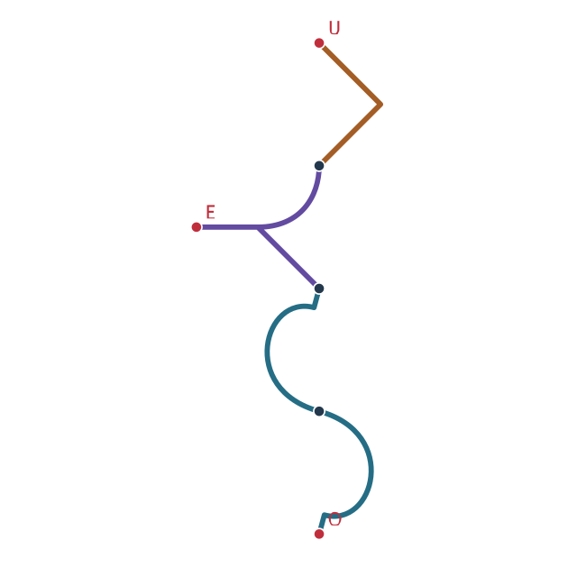

## Registro geométrico

La escala física se declara en O.2; la figura representa una proyección. T: azul, R: ocre, N: violeta. Los puntos oscuros son uniones declaradas; los rojos, extremos libres.

| Pieza | a | b | tₓ | tᵧ | Capa de cruce |
|---|---:|---:|---:|---:|---:|
| N₁ | 1 | 0 | 0 | 0 | 0 |
| R₁ | -1 | 0 | 2 | -2 | 1 |
| T₁ | -520/2473 | 1920/2473 | 1745/2473 | 5161/2473 | 2 |
| T₂ | 520/2473 | -1920/2473 | 3201/2473 | 9677/2473 | 3 |

Transformación: \(x_g=ax-by+t_x,\ y_g=bx+ay+t_y\). Las fracciones son los valores canónicos, no redondeos de calibración física.

Uniones: N₁.2 ↔ R₁.a; N₁.3 ↔ T₁.a; T₁.b ↔ T₂.b.

4 piezas; 1 componente(s) conexa(s); 0 ciclo(s) independiente(s); 3 extremo(s) libre(s). Caja del eje: 3.000000 × 8.000000 u, sin espesor de trazo.

## Puertos y terminales

| Puerto | Extremo | Intercambio | Función |
|---|---|---|---|
| E | N₁.1 | Energía | Suministro de referencia. |
| U | R₁.b | Control | Espectro, intensidad, dirección y modulación. |
| O | T₂.a | Acoplamiento óptico | Terminal que alimenta la región emisora del campo. |

| Región funcional | Localización | Intercambio |
|---|---|---|
| Aₒ | Apertura emisora | Región desde la que se emiten fotones. Puede desplegarse más allá del contorno del glifo con recursos y referencias locales. |

Los puertos mixtos se descomponen en subcanales tipados. La región de aplicación y los intercambios distribuidos forman parte del montaje aunque no sean extremos de la plantilla.

## Contrato dinámico de referencia

- Estados: amplitud, espectro, dirección.
- Entradas: potencia bus, patrón óptico.
- Salidas: radiancia, calor.
- Dominio: Banda, apertura y dominio angular especificados.

`P_opt=eta_L*P_bus; theta_dif=1.22*lambda/D`

La apariencia para un observador no equivale a ocultamiento universal.

Grupos de parámetros: `optical`, `thermal` en `datos/parametros.json`. El contrato reducido no constituye una realización microscópica demostrada.

## Activación y funcionamiento

1. **Preparación.** Definir espectro y región emisora; disponer suministro y destino del calor residual.
2. **Emisión inicial.** Comprobar una respuesta luminosa pequeña y el acoplamiento con el mando.
3. **Ajuste.** Establecer intensidad, distribución angular y modulación dentro del régimen caracterizado.
4. **Retirada.** Reducir el suministro y evacuar la energía remanente en el emisor.

## Modelo operacional y balance de recursos

En un régimen estacionario de conversión,

\[
P_{\gamma}=\eta_{\mathrm{opt}}P_{\mathrm{entrada}},\qquad
E_{\gamma}=h\nu.
\]

La fracción no emitida de forma útil y la alimentación auxiliar se incluyen en pérdidas y otros flujos. Un haz dirigido transporta momento; su emisión produce la reacción correspondiente en campo, apoyo y entorno.

Para una apertura circular ideal uniformemente iluminada, con diámetro D mucho mayor que λ y observación lejana, el primer mínimo de difracción aparece aproximadamente en θ = 1,22 λ/D. Esa relación no convierte el tamaño del glifo en el diámetro de toda la apertura desplegada. [OpenStax: apertura y difracción](https://openstax.org/books/university-physics-volume-3/pages/4-5-circular-apertures-and-resolution).

Una imagen multivista necesita información espacial, angular, espectral y temporal suficiente. La emisión de un punto luminoso y la reconstrucción de una escena completa son operaciones de complejidad diferente.

## Posición y persistencia

El emisor puede mantenerse cerca de la mano, situarse en una superficie o desplegarse mediante terminales. Una fuente extensa y coordinada mejora el control angular; una instalación intensa dirige el calor residual fuera del cuerpo.

## Comprobación y diagnóstico

| Observación | Interpretación y acción |
|---|---|
| La luz cambia de color con la potencia | Revisar respuesta espectral, estado y condiciones térmicas. |
| El haz se abre más de lo esperado | Comprobar apertura efectiva, fase y difracción. |
| La intensidad parpadea | Revisar suministro, señal y estabilidad de emisión. |
| El objeto iluminado se calienta | Contabilizar la absorción en el objetivo, además de las pérdidas del emisor. |

## Ejemplo de uso

Si una realización recibe 10 W y convierte el 60 % en la banda óptica útil definida, entrega 6 W en esa banda. Los otros 4 W deben contabilizarse como calor u otros flujos. Es un ejemplo de balance, no un rendimiento universal.

## Correspondencia microscópica

Transferencia de energía a modos radiativos.

**Estado físico:** Modo alimentado, terminal y modos EM.

**Coeficientes:** Integral de acoplamiento, tasa de emisión, apertura y espectro.

**Comportamiento resultante:** El modo entrega cuantos al campo electromagnético y evacua pérdidas.

**Comprobación disponible:** Conversión de dos modos reversible bajo condiciones. Véase MM.9.

**Requisito de realización:** Derivar terminal, niveles y eficiencia espectral.

## Aceptación

Comprobar geometría y puertos, respuesta a baja potencia, balance de recursos y transición de retirada. El montaje debe satisfacer las magnitudes del contrato y el dominio de su receta. La precisión del SVG no demuestra estabilidad ni rendimiento del estado físico.

---

# P-18 · Intercambio térmico

**Estado M2: realización completa no demostrada.** No estan definidos los acoplamientos y correlaciones de ambos contactos; se cuantifica el contraste de canales termicos. La función y los valores siguientes son objetivos revisables. Véanse las secciones 16.3.

Intercambio térmico lleva calor entre regiones. Puede aprovechar un paso espontáneo de caliente a frío o aportar trabajo para llevarlo en sentido contrario. La misma primordial sirve para calentar y enfriar según sus terminales y el régimen elegido; cada región conserva un balance de energía y temperatura.

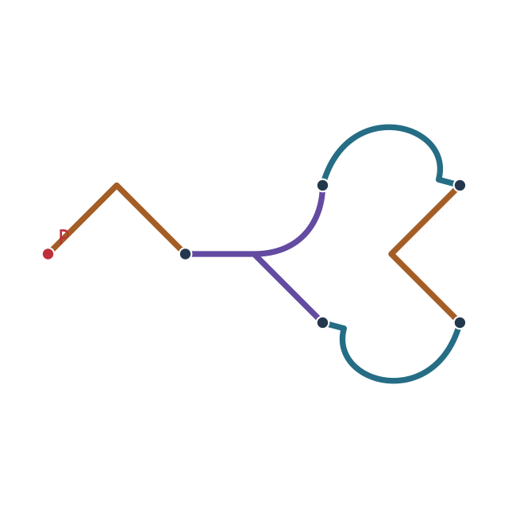

## Registro geométrico

La escala física se declara en O.2; la figura representa una proyección. T: azul, R: ocre, N: violeta. Los puntos oscuros son uniones declaradas; los rojos, extremos libres.

| Pieza | a | b | tₓ | tᵧ | Capa de cruce |
|---|---:|---:|---:|---:|---:|
| N₁ | 1 | 0 | 0 | 0 | 0 |
| T₁ | -1920/2473 | -520/2473 | 4731/2473 | -3201/2473 | 1 |
| T₂ | 1920/2473 | 520/2473 | 5161/2473 | 3201/2473 | 2 |
| R₁ | 1 | 0 | 2 | 0 | 3 |
| R₂ | 0 | 1 | -2 | -1 | 4 |

Transformación: \(x_g=ax-by+t_x,\ y_g=bx+ay+t_y\). Las fracciones son los valores canónicos, no redondeos de calibración física.

Uniones: N₁.1 ↔ R₂.a; N₁.2 ↔ T₁.b; N₁.3 ↔ T₂.a; T₁.a ↔ R₁.a; T₂.b ↔ R₁.b.

5 piezas; 1 componente(s) conexa(s); 1 ciclo(s) independiente(s); 1 extremo(s) libre(s). Caja del eje: 6.000000 × 3.695184 u, sin espesor de trazo.

## Puertos y terminales

| Puerto | Extremo | Intercambio | Función |
|---|---|---|---|
| P | R₂.b | Trabajo y control | Alimentación, consigna y datos del ciclo. |

| Región funcional | Localización | Intercambio |
|---|---|---|
| H₁ | Interfaz de T₁ | Primer cuerpo o región térmica acoplada. |
| H₂ | Interfaz de T₂ | Segundo cuerpo o región térmica acoplada. Los papeles caliente/frío dependen de la operación. |

Los puertos mixtos se descomponen en subcanales tipados. La región de aplicación y los intercambios distribuidos forman parte del montaje aunque no sean extremos de la plantilla.

## Contrato dinámico de referencia

- Estados: T_c, T_h, energía interna.
- Entradas: consigna, fuente de trabajo, terminales.
- Salidas: Q_c, Q_h, trabajo.
- Dominio: T_h>T_c>0; conductancias y disipación finitas.

`Wdot=Qdot_c/COP; Qdot_h=Qdot_c+Wdot; COP=eta_C*T_c/(T_h-T_c)`

El terminal de rechazo debe existir y soportar su carga.

Grupos de parámetros: `thermal` en `datos/parametros.json`. El contrato reducido no constituye una realización microscópica demostrada.

## Activación y funcionamiento

1. **Referencia.** Medir temperaturas y definir la región que se trata y la que recibe el calor.
2. **Acoplamiento.** Preparar ambas interfaces y comprobar su capacidad de intercambio.
3. **Transferencia.** Establecer el paso directo o el ciclo alimentado, observando temperatura, caudal y respuesta del material.
4. **Retirada.** Reducir el intercambio y completar la evacuación de energía remanente.

## Modelo operacional y balance de recursos

Para refrigeración estacionaria entre dos depósitos constantes a Th > Tc, con trabajo PW y sin otros flujos sin contabilizar,

\[
P_h=P_c+P_W,\qquad
\frac{P_c}{P_W}\leq\frac{T_c}{T_h-T_c}.
\]

Las temperaturas se expresan en kelvin. La igualdad corresponde al límite reversible; un ciclo real tiene producción de entropía. [OpenStax: refrigeración de Carnot](https://openstax.org/books/university-physics-volume-2/pages/4-5-the-carnot-cycle).

Si cambia la temperatura de un depósito finito, se calcula su evolución; en una sustancia sin cambio de fase puede usarse dQ = m cp dT en el régimen apropiado. Los cambios de fase añaden el calor latente. En interfaces distribuidas, ampliar área y disminuir diferencias locales permite aumentar la transferencia con menor irreversibilidad, manteniendo un receptor para el flujo total.

## Posición y persistencia

Las interfaces pueden estar alejadas entre sí mediante canales preparados. El calor retirado de un objetivo se entrega en otro lugar, de modo que el usuario no tenga que absorberlo con el cuerpo. La red incluye masa, temperatura y capacidad de evacuación de los receptores.

## Comprobación y diagnóstico

| Observación | Interpretación y acción |
|---|---|
| Enfría al principio y luego pierde efecto | Comprobar el calentamiento del receptor y el cambio de condiciones. |
| El objeto se enfría de forma desigual | Ampliar o redistribuir interfaces y observar transferencia interna. |
| La energía aparente desaparece | Medir el receptor caliente, trabajo aportado y energía del campo. |
| El material se agrieta o deforma | Ajustar gradientes, velocidad térmica y restricciones mecánicas. |

## Ejemplo de uso

Retirar 500 W de un depósito a 278 K y entregarlos a otro a 298 K exige al menos unos 36 W de trabajo en el límite reversible. El lado caliente recibe unos 536 W en ese límite; una realización menos eficiente necesita más trabajo.

## Correspondencia microscópica

Máquina térmica de modos y baños.

**Estado físico:** Modos, baños térmicos y trabajo.

**Coeficientes:** Tasas con balance detallado; corrientes de energía y entropía.

**Comportamiento resultante:** Transporta calor; el bombeo inverso requiere trabajo y rechazo.

**Comprobación disponible:** Motor de tres niveles y balances R1. Véase MM.10; M2.6.

**Requisito de realización:** Realizar ciclo refrigerador específico y conductancias desde M2.

## Aceptación

Comprobar geometría y puertos, respuesta a baja potencia, balance de recursos y transición de retirada. El montaje debe satisfacer las magnitudes del contrato y el dominio de su receta. La precisión del SVG no demuestra estabilidad ni rendimiento del estado físico.

---

# P-19 · Impulso

**Estado M2: realización completa no demostrada.** No hay solucion campo-materia que derive impulso, potencia, reaccion y saturacion. La función y los valores siguientes son objetivos revisables. Véanse las secciones 13.3; 15.6.

Impulso aplica una fuerza o torque durante un intervalo y transfiere momento a un objetivo. Puede levantar, frenar, orientar o acelerar objetos. Se distingue de Anclaje, que mantiene una relación con una referencia, y de Vibración, cuya función es producir una oscilación mecánica preparada.

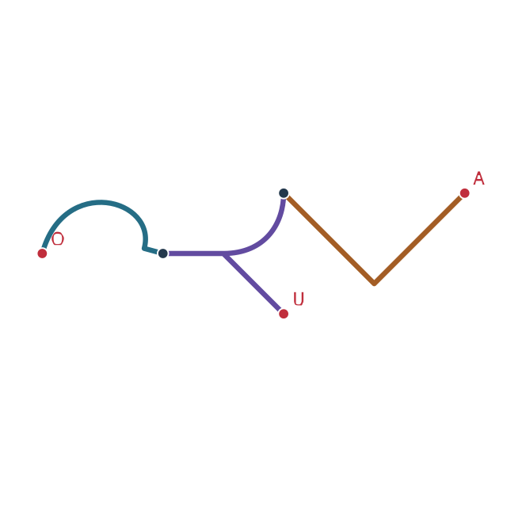

## Registro geométrico

La escala física se declara en O.2; la figura representa una proyección. T: azul, R: ocre, N: violeta. Los puntos oscuros son uniones declaradas; los rojos, extremos libres.

| Pieza | a | b | tₓ | tᵧ | Capa de cruce |
|---|---:|---:|---:|---:|---:|
| N₁ | 1 | 0 | 0 | 0 | 0 |
| R₁ | 0 | -3/2 | 5/2 | 1/2 | 1 |
| T₁ | -1920/2473 | -520/2473 | -5161/2473 | -728/2473 | 2 |

Transformación: \(x_g=ax-by+t_x,\ y_g=bx+ay+t_y\). Las fracciones son los valores canónicos, no redondeos de calibración física.

Uniones: N₁.1 ↔ T₁.a; N₁.2 ↔ R₁.a.

3 piezas; 1 componente(s) conexa(s); 0 ciclo(s) independiente(s); 3 extremo(s) libre(s). Caja del eje: 7.000000 × 2.000000 u, sin espesor de trazo.

## Puertos y terminales

| Puerto | Extremo | Intercambio | Función |
|---|---|---|---|
| O | T₁.b | Mecánico | Objetivo y región donde se aplica la fuerza. |
| A | R₁.b | Mecánico | Apoyo o medio que recibe la reacción. |
| U | N₁.3 | Energía y control | Perfil de fuerza, dirección, duración y realimentación. |

Los puertos mixtos se descomponen en subcanales tipados. La región de aplicación y los intercambios distribuidos forman parte del montaje aunque no sean extremos de la plantilla.

## Contrato dinámico de referencia

- Estados: x, p, energía del actuador.
- Entradas: fuerza objetivo, referencia de reacción.
- Salidas: fuerza, velocidad, reacción.
- Dominio: F y velocidad limitadas; reacción y torque contabilizados.

`dp/dt=F; Wdot=F·v; J_mec=integral F dt`

Impulso designa el módulo; J_mec designa la integral de fuerza.

Grupos de parámetros: `mechanical` en `datos/parametros.json`. El contrato reducido no constituye una realización microscópica demostrada.

## Activación y funcionamiento

1. **Selección.** Identificar objetivo, masa pertinente, distribución de carga y destino de reacción.
2. **Acoplamiento.** Preparar zonas de actuación suficientemente distribuidas.
3. **Acción.** Aplicar un perfil de fuerza o torque con energía y potencia disponibles.
4. **Frenado o término.** Retirar la fuerza y, cuando convenga, recuperar energía de un frenado compatible.

## Modelo operacional y balance de recursos

Para un conjunto aislado durante la interacción,

\[
\Delta\mathbf p_O+\Delta\mathbf p_{\Phi}+\Delta\mathbf p_A=0,
\qquad \mathbf J_O=\int\mathbf F_O\,dt.
\]

También se conserva el momento angular total. La potencia mecánica aplicada a un cuerpo rígido es P = F·v + τ·ω para las variables de su movimiento. Se suman los trabajos en el apoyo, las deformaciones, las pérdidas y el cambio de energía del campo.

Una fuerza elevada sobre una carga quieta puede tener potencia mecánica pequeña, aunque exija tensiones altas. Al acelerar la carga aumenta el trabajo. La reacción puede viajar por una red y quedar temporalmente en el campo; no llega instantáneamente a un apoyo distante.

## Posición y persistencia

La región de actuación puede abarcar un objeto entero y repartir esfuerzos para reducir deformaciones. Redes de apoyos y actuadores permiten fuerzas grandes. En vuelo se especifica cómo cambia el vínculo con terreno, aire u otra masa de reacción durante el movimiento.

## Comprobación y diagnóstico

| Observación | Interpretación y acción |
|---|---|
| El objeto gira al empujarlo | Revisar distribución de fuerzas y punto de aplicación respecto de su masa. |
| La carga se deforma | Distribuir la actuación y comprobar su resistencia. |
| El apoyo retrocede o cede | Recalcular la reacción y ampliar o cambiar su destino. |
| La velocidad deja de aumentar al crecer la carga | Comprobar potencia disponible y trabajos adicionales, no solo fuerza nominal. |

## Ejemplo de uso

Acelerar desde reposo una masa de 0,1 kg hasta 1 m/s cambia su momento en 0,1 kg·m/s y su energía cinética en 0,05 J. Se contabilizan además el apoyo, las pérdidas y la energía de preparar el campo.

## Correspondencia microscópica

Gradiente de energía modulado.

**Estado físico:** Materia, campo y ruta de reacción.

**Coeficientes:** F=-grad V y J=int F dt.

**Comportamiento resultante:** La fuerza cambia momento; su integral produce el impulso mecánico.

**Comprobación disponible:** Derivada analítica frente a numérica. Véase MM.8.

**Requisito de realización:** Resolver actuación y reacción simultáneas bajo carga.

## Aceptación

Comprobar geometría y puertos, respuesta a baja potencia, balance de recursos y transición de retirada. El montaje debe satisfacer las magnitudes del contrato y el dominio de su receta. La precisión del SVG no demuestra estabilidad ni rendimiento del estado físico.

---

# P-20 · Polarización

**Estado M2: realización completa no demostrada.** B escalar uniforme no introduce birrefringencia local; una respuesta anisotropa por geometria exige resolver Maxwell y materia. La función y los valores siguientes son objetivos revisables. Véanse las secciones 17.3.

Polarización prepara una distribución de cargas y una diferencia de potencial entre regiones. Puede inducir polarización en materia, separar cargas disponibles o mantener un campo eléctrico mediante un suministro adecuado. La carga eléctrica y la carga rúnica son magnitudes distintas; conservar una no autoriza crear gratuitamente la otra.

## Registro geométrico

La escala física se declara en O.2; la figura representa una proyección. T: azul, R: ocre, N: violeta. Los puntos oscuros son uniones declaradas; los rojos, extremos libres.

| Pieza | a | b | tₓ | tᵧ | Capa de cruce |
|---|---:|---:|---:|---:|---:|
| N₁ | 0 | 1 | 0 | 0 | 0 |
| N₂ | 0 | -1 | 4 | -2 | 1 |
| R₁ | 0 | -2 | 2 | 1 | 2 |
| T₁ | 1920/2473 | 520/2473 | 215/2473 | 3201/2473 | 3 |
| R₂ | 0 | 1 | 4 | -4 | 4 |

Transformación: \(x_g=ax-by+t_x,\ y_g=bx+ay+t_y\). Las fracciones son los valores canónicos, no redondeos de calibración física.

Uniones: N₁.1 ↔ R₁.a; N₁.2 ↔ T₁.b; N₁.3 ↔ T₁.a; N₂.1 ↔ R₁.b; N₂.2 ↔ R₂.b; N₂.3 ↔ R₂.a.

5 piezas; 1 componente(s) conexa(s); 2 ciclo(s) independiente(s); 0 extremo(s) libre(s). Caja del eje: 6.000000 × 5.847592 u, sin espesor de trazo.

**Corrección de esta edición:** R₂ se reorienta para eliminar la coincidencia de un tramo con N₂; se conservan las cinco piezas y los dos ciclos.

## Puertos y terminales

No hay extremos libres asignados a puertos. La alimentación, el control y la interacción usan terminales del estado desplegado; su localización debe declararse en el montaje.

| Región funcional | Localización | Intercambio |
|---|---|---|
| Z₊ | Primer lóbulo, junto a N₁–T₁ | Interfaz eléctrica de referencia positiva. |
| Z₋ | Segundo lóbulo, junto a N₂–R₂ | Interfaz eléctrica de referencia negativa. |
| D | Zona de enlace R₁ | Interfaz distribuida de excitación, alimentación y lectura, por acoplamiento con una estructura próxima. |

Los puertos mixtos se descomponen en subcanales tipados. La región de aplicación y los intercambios distribuidos forman parte del montaje aunque no sean extremos de la plantilla.

## Contrato dinámico de referencia

- Estados: carga, corriente, campos EM.
- Entradas: modalidad, consigna, terminales.
- Salidas: respuesta electromagnética.
- Dominio: Constitutivas de medio declaradas; cálculo de pérdidas e inducción.

`div(B)=0; curl(E)=-dB/dt; u_EM=(epsilon*E^2+B^2/mu)/2 en medio lineal simple`

Nombre de catálogo amplio; especificar si es polarización material, carga o corriente.

Grupos de parámetros: `power_channel` en `datos/parametros.json`. El contrato reducido no constituye una realización microscópica demostrada.

## Activación y funcionamiento

1. **Medio.** Identificar regiones, conductividad y ruta de redistribución de carga.
2. **Excitación.** Preparar el estado relativo de los lóbulos mediante D y establecer una diferencia inicial pequeña.
3. **Polarización.** Ajustar el potencial o el campo observado, incluyendo corrientes y carga de los cuerpos conectados.
4. **Relajación.** Recuperar o transferir la energía eléctrica y llevar la distribución a un estado final especificado.

## Modelo operacional y balance de recursos

En una aproximación electrostática de dos terminales con respuesta lineal,

\[
Q=C_{\mathrm{ef}}V,\qquad E_{\mathrm{el}}=\tfrac12 C_{\mathrm{ef}}V^2.
\]

Q es la carga separada en ese modelo, V la diferencia de potencial y Cef una capacidad efectiva determinada por el conjunto. Una forma más general contabiliza campos, materiales y su respuesta. La conservación eléctrica se expresa mediante ∂tρe + ∇·J = 0 para la carga y corriente totales pertinentes.

Mantener un potencial con corriente I intercambia una potencia VI. Polarizar un medio puede producir fuerzas, calentamiento y reacciones en interfaces; esos efectos se incluyen o se utilizan deliberadamente. La ionización, la ruptura dieléctrica y la radiación de cargas aceleradas son regímenes físicos que requieren su propio tratamiento.

## Posición y persistencia

Las regiones activas pueden ser mayores que los lóbulos de la marca y seguir referencias separadas. Los esfuerzos electromagnéticos se transmiten al medio y a los apoyos. La excitación de D tiene una geometría, distancia y banda caracterizadas; no constituye alimentación a distancia sin enlace.

## Comprobación y diagnóstico

| Observación | Interpretación y acción |
|---|---|
| El potencial cae al conectar una carga | Comprobar corriente, suministro y capacidad de mantener la separación. |
| La polaridad medida cambia | Revisar referencias y estado relativo de los lóbulos. |
| Aparece corriente por el entorno | Caracterizar conductividad, fugas e interfaces. |
| El campo ioniza el medio | Ajustar la geometría o tratar explícitamente el régimen de plasma. |

## Ejemplo de uso

Una realización que se comporte como una capacidad de 1 µF a 10 V conserva 50 µJ de energía eléctrica en ese modelo. La cifra describe un ejemplo equivalente; no fija la capacidad ni el potencial máximo de esta primordial.

## Correspondencia microscópica

Distribución de carga y respuesta electromagnética.

**Estado físico:** Cargas ordinarias, campos y regiones D/Z.

**Coeficientes:** Maxwell con B(s), constitutivas materiales y energía EM.

**Comportamiento resultante:** Las fuentes existentes generan potenciales y campos con retorno y pérdidas.

**Comprobación disponible:** Relación epsilon, mu, impedancia y química. Véase MM.9; MM.12.

**Requisito de realización:** Resolver terminales reales y estados de materia; los lazos no fijan una tensión.

## Aceptación

Comprobar geometría y puertos, respuesta a baja potencia, balance de recursos y transición de retirada. El montaje debe satisfacer las magnitudes del contrato y el dominio de su receta. La precisión del SVG no demuestra estabilidad ni rendimiento del estado físico.

---

# P-21 · Vibración

**Estado M2: realización completa no demostrada.** El modo cuadrupolar calculado no es un actuador material; falta acoplamiento, amortiguamiento y esfuerzo maximo. La función y los valores siguientes son objetivos revisables. Véanse las secciones 14.5; 15.3; 20.6.

Vibración produce una oscilación mecánica con frecuencia, amplitud y fase preparadas. Puede generar sonido, agitar un fluido, ensayar la respuesta de un material o accionar una herramienta. Su efecto depende del medio: una presión sonora no se propaga por un vacío material como si fuera aire.

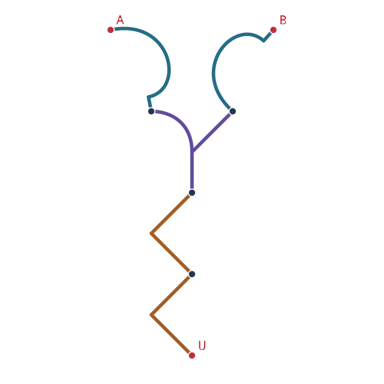

## Registro geométrico

La escala física se declara en O.2; la figura representa una proyección. T: azul, R: ocre, N: violeta. Los puntos oscuros son uniones declaradas; los rojos, extremos libres.

| Pieza | a | b | tₓ | tᵧ | Capa de cruce |
|---|---:|---:|---:|---:|---:|
| N₁ | 0 | -1 | 0 | 0 | 0 |
| T₁ | -440/2473 | -2180/2473 | -3089/2473 | -5525/2473 | 1 |
| T₂ | -1480/2473 | 1660/2473 | 2874/2473 | -5095/2473 | 2 |
| R₁ | 1 | 0 | -1 | 2 | 3 |
| R₂ | 1 | 0 | -1 | 4 | 4 |

Transformación: \(x_g=ax-by+t_x,\ y_g=bx+ay+t_y\). Las fracciones son los valores canónicos, no redondeos de calibración física.

Uniones: N₁.1 ↔ R₁.a; N₁.2 ↔ T₁.a; N₁.3 ↔ T₂.b; R₁.b ↔ R₂.a.

5 piezas; 1 componente(s) conexa(s); 0 ciclo(s) independiente(s); 3 extremo(s) libre(s). Caja del eje: 4.000000 × 8.034808 u, sin espesor de trazo.

## Puertos y terminales

| Puerto | Extremo | Intercambio | Función |
|---|---|---|---|
| A | T₁.b | Mecánico | Región principal que se hace oscilar. |
| B | T₂.a | Mecánico | Segunda región o apoyo que recibe la respuesta. |
| U | R₂.b | Energía y control | Frecuencia, fase, amplitud y forma temporal. |

Los puertos mixtos se descomponen en subcanales tipados. La región de aplicación y los intercambios distribuidos forman parte del montaje aunque no sean extremos de la plantilla.

## Contrato dinámico de referencia

- Estados: desplazamiento modal, velocidad.
- Entradas: frecuencia, amplitud, carga acústica.
- Salidas: onda, calor.
- Dominio: Modo lineal: m=0.01 kg, f0=100 Hz, zeta=0.05; amplitud <=0.1 mm en el caso.

`m*x_ddot+b*x_dot+k*x=F(t); P_loss=b*<x_dot^2>`

La propagación necesita medio; la intensidad y reflexión fijan energía y reacción.

Grupos de parámetros: `mechanical` en `datos/parametros.json`. El contrato reducido no constituye una realización microscópica demostrada.

## Activación y funcionamiento

1. **Respuesta del medio.** Identificar el cuerpo, apoyo y modo de oscilación buscado.
2. **Excitación pequeña.** Aplicar una señal de prueba y observar resonancias y pérdidas.
3. **Régimen.** Ajustar amplitud y fase, aportando la energía que se disipa o se emite.
4. **Amortiguación.** Reducir gradualmente la excitación y recoger o disipar la energía mecánica restante.

## Modelo operacional y balance de recursos

Una fuerza sinusoidal y una respuesta lineal pueden escribirse como

\[
F(t)=F_0\cos(\omega t+\varphi),\qquad
x(\omega)=\chi(\omega)F(\omega).
\]

χ es la respuesta mecánica del conjunto. La potencia instantánea se obtiene de Fv y la energía puede almacenarse temporalmente como deformación y movimiento. Cerca de una resonancia, una aportación pequeña por ciclo puede mantener una amplitud grande; la acumulación, las pérdidas y la respuesta no lineal deben contabilizarse.

Generar una onda para controlar ruido requiere observar y actuar con la geometría y fase adecuadas. La energía acústica se absorbe, se redirige o se transforma; una única señal opuesta no cancela cualquier sonido en todo el espacio.

## Posición y persistencia

Las interfaces se distribuyen sobre el medio según el modo buscado. Redes de emisores coordinados permiten orientar ondas y controlar regiones más amplias. Reloj puede aportar una referencia, pero no sustituye la energía ni las fuerzas que mueven el medio.

## Comprobación y diagnóstico

| Observación | Interpretación y acción |
|---|---|
| La amplitud crece más de lo previsto | Revisar resonancia, realimentación y pérdidas. |
| La frecuencia de salida no coincide con la orden | Comprobar respuesta no lineal y modos del medio. |
| El apoyo vibra de forma no deseada | Redistribuir la reacción o preparar amortiguamiento. |
| Una zona se silencia pero otra se vuelve más ruidosa | Medir el campo acústico y sus reflexiones, no solo un punto. |

## Ejemplo de uso

Una membrana puede mantenerse vibrando con una pequeña reposición de energía en cada ciclo una vez alcanzado su régimen. La energía inicial que la puso en movimiento y la que transmite al aire siguen formando parte del balance.

## Correspondencia microscópica

Actuación periódica sobre un modo mecánico.

**Estado físico:** Oscilador y medio.

**Coeficientes:** Masa modal, rigidez, amortiguamiento y susceptibilidad.

**Comportamiento resultante:** La fuerza alterna excita movimiento y ondas; radiación y fricción gastan energía.

**Comprobación disponible:** Mecanismo de fuerza y oscilador reducido. Véase MM.8; MM.10.

**Requisito de realización:** Derivar acoplamiento acústico, carga y amplitud estable.

## Aceptación

Comprobar geometría y puertos, respuesta a baja potencia, balance de recursos y transición de retirada. El montaje debe satisfacer las magnitudes del contrato y el dominio de su receta. La precisión del SVG no demuestra estabilidad ni rendimiento del estado físico.

---

# P-22 · Separación

**Estado M2: realización completa no demostrada.** Evaluada: faltan Hamiltoniano material, potenciales quimicos de especies y transporte; el benchmark desacoplado no produce separacion runica. La función y los valores siguientes son objetivos revisables. Véanse las secciones 17.4; 21.3.

Separación dirige componentes de una mezcla hacia corrientes diferentes aprovechando respuestas distinguibles. Puede concentrar una sustancia, purificar un flujo o retirar partículas. La identidad buscada procede de referencias o medidas; separar una mezcla no cambia por sí solo la naturaleza química de sus componentes.

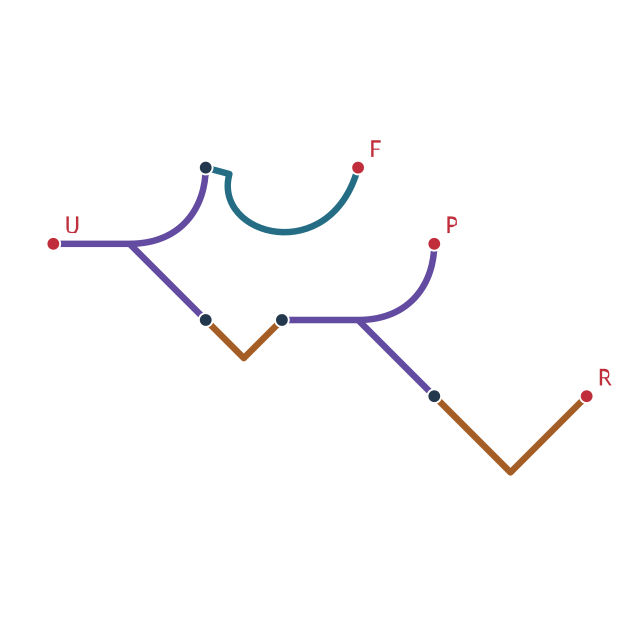

## Registro geométrico

La escala física se declara en O.2; la figura representa una proyección. T: azul, R: ocre, N: violeta. Los puntos oscuros son uniones declaradas; los rojos, extremos libres.

| Pieza | a | b | tₓ | tᵧ | Capa de cruce |
|---|---:|---:|---:|---:|---:|
| N₁ | 1 | 0 | 0 | 0 | 0 |
| N₂ | 1 | 0 | 3 | 1 | 1 |
| R₁ | 0 | -1/2 | 3/2 | 3/2 | 2 |
| T₁ | 1920/2473 | 520/2473 | 5161/2473 | -1745/2473 | 3 |
| R₂ | 0 | -1 | 5 | 3 | 4 |

Transformación: \(x_g=ax-by+t_x,\ y_g=bx+ay+t_y\). Las fracciones son los valores canónicos, no redondeos de calibración física.

Uniones: N₁.2 ↔ T₁.a; N₁.3 ↔ R₁.a; N₂.1 ↔ R₁.b; N₂.3 ↔ R₂.a.

5 piezas; 1 componente(s) conexa(s); 0 ciclo(s) independiente(s); 4 extremo(s) libre(s). Caja del eje: 7.000000 × 4.000000 u, sin espesor de trazo.

## Puertos y terminales

| Puerto | Extremo | Intercambio | Función |
|---|---|---|---|
| F | T₁.b | Materia | Alimentación de mezcla. |
| P | N₂.2 | Materia | Corriente enriquecida en el componente elegido. |
| R | R₂.b | Materia | Resto de la mezcla y componentes no recuperados. |
| U | N₁.1 | Energía e información | Criterio selectivo, suministro y control de proceso. |

Los puertos mixtos se descomponen en subcanales tipados. La región de aplicación y los intercambios distribuidos forman parte del montaje aunque no sean extremos de la plantilla.

## Contrato dinámico de referencia

- Estados: n_i por compartimento, T, presión.
- Entradas: mezcla, criterio, trabajo.
- Salidas: corrientes enriquecidas, residuo.
- Dominio: Balance por especie; pureza y recuperación son distintas.

`dn_i/dt=sum flujos_i; W_min=DeltaG_mezcla para proceso isotermo isobaro`

No destruye impurezas; separar una mezcla diluida requiere transporte y trabajo.

Grupos de parámetros: `thermal` en `datos/parametros.json`. El contrato reducido no constituye una realización microscópica demostrada.

## Activación y funcionamiento

1. **Caracterización.** Identificar mezcla, concentración, propiedad selectiva y composición deseada.
2. **Preparación.** Disponer entradas y destinos, caudales e interfaces de separación.
3. **Separación.** Aplicar el proceso y medir pureza, recuperación y balance de componentes.
4. **Recirculación o término.** Reprocesar una fracción si conviene y retirar el contenido que queda en la zona activa.

## Modelo operacional y balance de recursos

Para cada componente i sin reacción química,

\[
\dot n_{i,F}=\dot n_{i,P}+\dot n_{i,R}+\frac{d n_{i,\mathrm{retenido}}}{dt}.
\]

En condiciones isotermas e isobáricas apropiadas, el trabajo reversible mínimo de separar corrientes se obtiene del cambio total de energía libre de Gibbs, incluyendo todas las corrientes y su composición. Para una especie ideal diluida, RT ln(1/x) aparece como escala de cambio de potencial químico al extraer una cantidad pequeña hacia un estado puro; no sustituye el balance de una separación completa.

La selectividad, la recuperación y la pureza se distinguen. Etapas en serie y reciclado permiten gran pureza sin exigir discriminación perfecta en una sola interacción. Difusión, transferencia de masa y electroneutralidad se incluyen cuando intervienen soluciones o especies cargadas.

## Posición y persistencia

La región de tratamiento puede ampliarse fuera del dibujo. Captación continua, depósitos previos y muchos módulos paralelos permiten procesar grandes cantidades. Una sustancia muy diluida exige procesar mucho medio aunque la energía por unidad capturada sea manejable.

## Comprobación y diagnóstico

| Observación | Interpretación y acción |
|---|---|
| El producto conserva demasiada mezcla | Revisar selectividad, condiciones y número de etapas. |
| El producto es puro pero se recupera poco | Medir cuánto componente queda en la corriente de resto. |
| El balance de materia no cierra | Buscar retención interna, fugas o reacciones no incluidas. |
| La separación se vuelve lenta | Comprobar concentración local y transporte hacia la zona activa. |

## Ejemplo de uso

Una mezcla de 1 kg contiene 10 g de una sustancia elegida. Si la corriente de producto recupera 8 g de esa sustancia, la recuperación es del 80 %. La pureza depende además de cuánta materia acompañante sale con esos 8 g.

## Correspondencia microscópica

Diferencias microscópicas de transporte.

**Estado físico:** Mezcla, potenciales selectivos y colectores.

**Coeficientes:** Movilidades, energías libres, tasas y difusión.

**Comportamiento resultante:** Las especies se distribuyen entre corrientes según respuestas distintas.

**Comprobación disponible:** Balance detallado de dos estados abstractos. Véase MM.12.

**Requisito de realización:** Calcular selectividad y recuperación de una mezcla concreta.

## Aceptación

Comprobar geometría y puertos, respuesta a baja potencia, balance de recursos y transición de retirada. El montaje debe satisfacer las magnitudes del contrato y el dominio de su receta. La precisión del SVG no demuestra estabilidad ni rendimiento del estado físico.

---

# P-23 · Reacción

**Estado M2: realización completa no demostrada.** Evaluada: faltan superficies de energia, contactos y tasas derivadas de un Hamiltoniano quimico comun. La función y los valores siguientes son objetivos revisables. Véanse las secciones 17.4; 21.3.

Reacción prepara condiciones para convertir reactivos en productos mediante rutas químicas permitidas. Puede orientar encuentros, modificar campos locales, aportar trabajo o favorecer rutas catalíticas. Su contrato básico es químico; cambiar núcleos pertenece a instalaciones nucleares que deben describir sus propias rutas físicas.

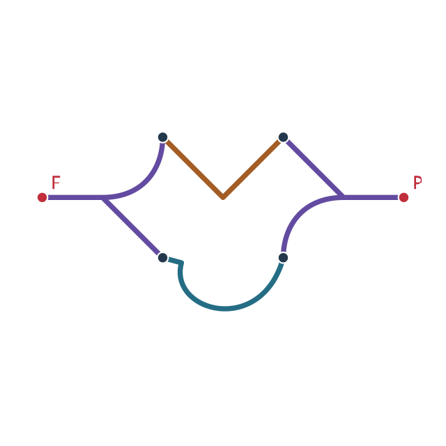

## Registro geométrico

La escala física se declara en O.2; la figura representa una proyección. T: azul, R: ocre, N: violeta. Los puntos oscuros son uniones declaradas; los rojos, extremos libres.

| Pieza | a | b | tₓ | tᵧ | Capa de cruce |
|---|---:|---:|---:|---:|---:|
| N₁ | 1 | 0 | 0 | 0 | 0 |
| N₂ | -1 | 0 | 4 | 0 | 1 |
| R₁ | 0 | -1 | 2 | 0 | 2 |
| T₁ | 1920/2473 | 520/2473 | 5161/2473 | 3201/2473 | 3 |

Transformación: \(x_g=ax-by+t_x,\ y_g=bx+ay+t_y\). Las fracciones son los valores canónicos, no redondeos de calibración física.

Uniones: N₁.2 ↔ R₁.a; N₁.3 ↔ T₁.a; N₂.2 ↔ T₁.b; N₂.3 ↔ R₁.b.

4 piezas; 1 componente(s) conexa(s); 1 ciclo(s) independiente(s); 2 extremo(s) libre(s). Caja del eje: 6.000000 × 2.847592 u, sin espesor de trazo.

## Puertos y terminales

| Puerto | Extremo | Intercambio | Función |
|---|---|---|---|
| F | N₁.1 | Reactivos, control y alimentación | Acceso de preparación y alimentación; señales y materia usan intercambios físicamente distinguidos. |
| P | N₂.1 | Productos y respuesta | Entrega de la corriente transformada y datos de resultado. |

| Región funcional | Localización | Intercambio |
|---|---|---|
| Vᵣ | Región de reacción | Volumen activo asociado al lazo; intercambia calor y trabajo por interfaces preparadas. |

Los puertos mixtos se descomponen en subcanales tipados. La región de aplicación y los intercambios distribuidos forman parte del montaje aunque no sean extremos de la plantilla.

## Contrato dinámico de referencia

- Estados: n_i, T, avance de reacción.
- Entradas: reactivos, ruta, energía.
- Salidas: productos, calor, composición.
- Dominio: Ruta y cinética específicas; v*Delta_rG<=0 si no hay trabajo externo acoplado.

`dn/dt=N*v+f; A*N=0; Delta_rG=sum nu_i*mu_i`

La catálisis altera tasas, no el balance neto de energía libre.

Grupos de parámetros: `thermal` en `datos/parametros.json`. El contrato reducido no constituye una realización microscópica demostrada.

## Activación y funcionamiento

1. **Ruta.** Definir reactivos, productos, proporciones y condiciones que permiten la transformación.
2. **Preparación.** Establecer mezcla, temperatura, presión, estado eléctrico y transporte pertinentes.
3. **Transformación.** Mantener la ruta y observar conversión, calor, productos y especies secundarias.
4. **Término.** Detener alimentación o cambiar condiciones y atender las reacciones que sigan ocurriendo en la materia.

## Modelo operacional y balance de recursos

Para una ruta con coeficientes estequiométricos νi y avance ξ,

\[
\frac{dn_i}{dt}=\nu_i\dot\xi+\dot n_{i,\mathrm{entrada}}-\dot n_{i,\mathrm{salida}},
\qquad \Delta_r G=\sum_i\nu_i\mu_i.
\]

Las rutas múltiples se suman. Los potenciales químicos incorporan composición y condiciones; pH, redox y equilibrio electroquímico se incluyen cuando son pertinentes. El balance energético contempla reactivos, productos y trabajo del campo.

La catálisis acelera rutas sin cambiar por sí sola el equilibrio de una reacción con estados inicial y final fijados. Si el campo modifica esos estados o impulsa una transformación desfavorable, su trabajo y su ciclo se contabilizan. [OpenStax: catálisis](https://openstax.org/books/chemistry-2e/pages/12-7-catalysis).

Una ruta favorable no garantiza una velocidad útil. La cinética, los encuentros, la transferencia de masa y la evacuación de calor determinan la producción. Separación puede retirar productos y reciclar reactivos dentro de un proceso mayor.

## Posición y persistencia

La región activa puede dividirse en muchas zonas pequeñas alimentadas y controladas en paralelo. Al aumentar producción también se amplían transporte y gestión térmica. Apagar el campo no detiene una reacción ordinaria que ya continúa por sí misma; su final se prepara en el proceso.

## Comprobación y diagnóstico

| Observación | Interpretación y acción |
|---|---|
| La conversión es baja pese a un balance favorable | Revisar cinética, contacto, tiempo y retirada de productos. |
| Se forman sustancias no previstas | Caracterizar rutas secundarias y estados del medio. |
| La temperatura sigue aumentando al reducir el mando | Comprobar calor de reacción y procesos que continúan sin el campo. |
| Cambiar concentración invierte el resultado | Recalcular potenciales químicos y condiciones de equilibrio. |

## Ejemplo de uso

La hidrólisis de sacarosa consume sacarosa y agua y produce glucosa y fructosa. Reacción prepara la transformación; Separación puede después apartar componentes si la tarea lo requiere. Dar forma al producto es una operación adicional de Ensamblaje.

## Correspondencia microscópica

Modificación de superficies y barreras químicas.

**Estado físico:** Electrones, núcleos, campo y baños.

**Coeficientes:** Hamiltoniano molecular; DeltaG y DeltaG de activación.

**Comportamiento resultante:** El campo cambia condiciones y tasas de rutas permitidas; conserva elementos y carga.

**Comprobación disponible:** Relación entre portales y escalas atómicas; balance detallado. Véase MM.12.

**Requisito de realización:** Resolver una reacción real con su cinética y selectividad.

## Aceptación

Comprobar geometría y puertos, respuesta a baja potencia, balance de recursos y transición de retirada. El montaje debe satisfacer las magnitudes del contrato y el dominio de su receta. La precisión del SVG no demuestra estabilidad ni rendimiento del estado físico.

---

# P-24 · Ensamblaje

**Estado M2: realización completa no demostrada.** Evaluada: faltan seleccion de estructura, cinetica y propagacion de errores; depende del mismo contacto material de P-22 y P-23. La función y los valores siguientes son objetivos revisables. Véanse las secciones 17.4; 21.3.

Ensamblaje coloca, orienta y une componentes conforme a una descripción suficiente. Puede fabricar piezas, reparar estructuras o colaborar en reconstrucción biológica cuando dispone de materia e información funcional. Aprovecha el autoensamblaje donde existe una tendencia física adecuada y actúa directamente donde hace falta control adicional.

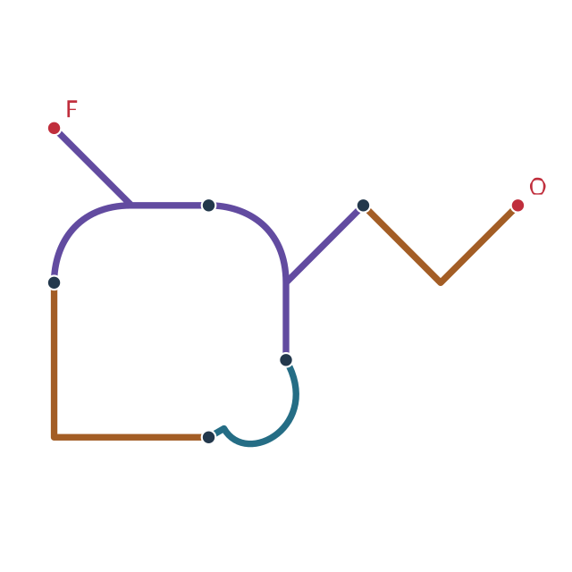

## Registro geométrico

La escala física se declara en O.2; la figura representa una proyección. T: azul, R: ocre, N: violeta. Los puntos oscuros son uniones declaradas; los rojos, extremos libres.

| Pieza | a | b | tₓ | tᵧ | Capa de cruce |
|---|---:|---:|---:|---:|---:|
| N₁ | 0 | -1 | 0 | 0 | 0 |
| N₂ | -1 | 0 | -2 | -1 | 1 |
| R₁ | 1 | -1 | -3 | 2 | 2 |
| T₁ | 1220/2473 | -700/2473 | -765/2473 | 3966/2473 | 3 |
| R₂ | 0 | -1 | 2 | 0 | 4 |

Transformación: \(x_g=ax-by+t_x,\ y_g=bx+ay+t_y\). Las fracciones son los valores canónicos, no redondeos de calibración física.

Uniones: N₁.1 ↔ T₁.b; N₁.2 ↔ N₂.1; N₁.3 ↔ R₂.a; N₂.2 ↔ R₁.a; R₁.b ↔ T₁.a.

5 piezas; 1 componente(s) conexa(s); 1 ciclo(s) independiente(s); 2 extremo(s) libre(s). Caja del eje: 6.000000 × 4.085291 u, sin espesor de trazo.

## Puertos y terminales

| Puerto | Extremo | Intercambio | Función |
|---|---|---|---|
| F | N₂.3 | Materia, información y energía | Componentes y descripción recibidos por intercambios físicamente distinguidos. |
| O | R₂.b | Actuación y verificación | Región donde se colocan y unen los componentes; retorno de observaciones. |

Los puertos mixtos se descomponen en subcanales tipados. La región de aplicación y los intercambios distribuidos forman parte del montaje aunque no sean extremos de la plantilla.

## Contrato dinámico de referencia

- Estados: geometría de producto, composición, defectos.
- Entradas: material, plano, actuadores, medidas.
- Salidas: producto, residuo, informe.
- Dominio: Tolerancias de proceso y estabilidad del producto tras retirada.

`dm_producto/dt=mdot_in-mdot_residuo; tiempo>=max(m/caudal,datos/tasa) con dependencias`

Un plano no contiene materia y una forma sostenida no implica producto permanente.

Grupos de parámetros: `mechanical`, `thermal`, `logic` en `datos/parametros.json`. El contrato reducido no constituye una realización microscópica demostrada.

## Activación y funcionamiento

1. **Descripción.** Definir geometría, composición y propiedades funcionales, con las tolerancias que la tarea necesita.
2. **Preparación.** Reunir componentes, referencia espacial, zonas de trabajo y destino de calor y residuos.
3. **Construcción.** Posicionar, orientar, unir, verificar y corregir; realizar etapas independientes en paralelo cuando convenga.
4. **Liberación.** Comprobar la pieza y retirar apoyos temporales o conservar los que forman parte de su funcionamiento.

## Modelo operacional y balance de recursos

La tarea combina restricciones materiales, geométricas y funcionales. Una medida geométrica parcial puede ser

\[
\epsilon_r=\sqrt{\frac1N\sum_{i=1}^{N}\lVert\mathbf r_i-\mathbf r_i^*\rVert^2}.
\]

Los puntos pueden representar módulos, fibras, granos u otros elementos de la resolución elegida; no hace falta enumerar todos los átomos para describir una pieza regular. Cumplir esta medida no garantiza composición, resistencia ni función: esas propiedades requieren sus propias comprobaciones.

Las entradas suministran la masa y las especies pertinentes; la energía incluye transporte, deformación, enlaces y trabajo del campo. El calor, los residuos y las piezas rechazadas tienen destino. Una forma aparente correcta puede contener defectos, tensiones residuales o uniones débiles; el plano define también la microestructura necesaria.

Para tejidos se requieren estado celular y funcional, perfusión, compatibilidad y conexiones apropiadas. Los detalles individuales, incluidos los de memoria biológica, deben proceder de huellas accesibles o registros suficientes. Un patrón genérico no los determina.

## Posición y persistencia

La referencia espacial se establece mediante Anclaje y observaciones. Cabezales o zonas de trabajo distribuidos permiten fabricación extensa desde un mando pequeño. Las propiedades que dependen del campo exigen conservarlo; una unión material estable puede permanecer después de retirarlo.

## Comprobación y diagnóstico

| Observación | Interpretación y acción |
|---|---|
| La forma es correcta pero la pieza falla | Comprobar microestructura, composición, defectos y uniones. |
| Las partes se desplazan al unirlas | Revisar referencia, fuerzas y contracciones de proceso. |
| La pieza pierde su forma al apagar el campo | Distinguir soporte temporal de estabilidad material propia. |
| La reconstrucción funcional queda incompleta | Revisar información del plano y comprobaciones, no solo similitud externa. |

## Ejemplo de uso

Para fabricar una cuchara, una descripción de contorno, espesor y material puede ser compacta. La realización debe aportar la materia y controlar sus uniones y propiedades. Copiar una marca de desgaste particular exige observarla o disponer de su registro.

## Correspondencia microscópica

Control de transporte, colocación y unión.

**Estado físico:** Materia, potenciales, medidas y plano.

**Coeficientes:** Fuerzas, movilidad, tasas de enlace y defecto.

**Comportamiento resultante:** Sitúa componentes y estabiliza un producto cuya permanencia se verifica tras retirar campo.

**Comprobación disponible:** Cadena física formulada y balances de material. Véase MM.8; MM.12.

**Requisito de realización:** Calcular proceso material específico y errores; el plano no garantiza fabricación.

## Aceptación

Comprobar geometría y puertos, respuesta a baja potencia, balance de recursos y transición de retirada. El montaje debe satisfacer las magnitudes del contrato y el dominio de su receta. La precisión del SVG no demuestra estabilidad ni rendimiento del estado físico.
