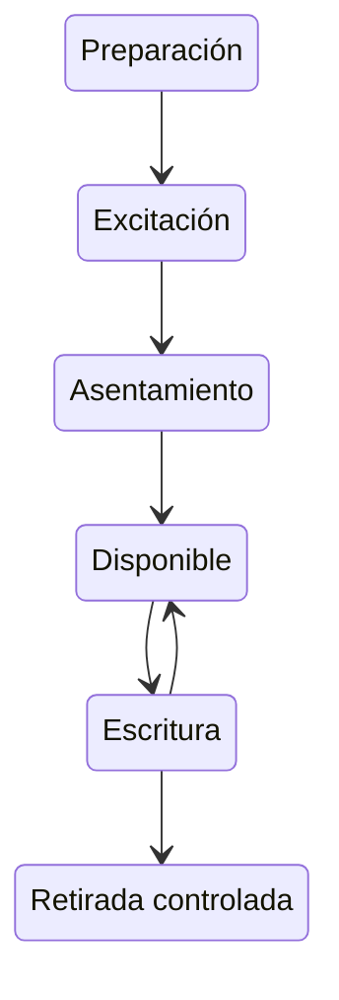

# P-01 · Semilla

**Estado M2: realización completa no demostrada.** El cero clasico es invariante; el bombeo neutro no crea carga neta aislada. La función y los valores siguientes son objetivos revisables. Véanse las secciones 13.8; 16.4.

La Semilla establece el estado inicial desde el que se pueden preparar nuevos tramos y componentes. La información de lo que se quiere construir debe proceder de un trazado, una señal o una plantilla disponible. Su composición no contiene automáticamente el catálogo completo de runas.

La conservación de energía utilizable corresponde a Reserva; el almacenamiento general de datos, a Memoria; y la fijación respecto de una referencia, a Anclaje. Semilla aporta la preparación del campo necesaria para iniciar esas estructuras.

## Registro geométrico

La escala física se declara en O.2; la figura representa una proyección. T: azul, R: ocre, N: violeta. Los puntos oscuros son uniones declaradas; los rojos, extremos libres.

| Pieza | a | b | tₓ | tᵧ | Capa de cruce |
|---|---:|---:|---:|---:|---:|
| N₁ | 0 | -1 | 0 | 2 | 0 |
| R₁ | 0 | 1 | 0 | 0 | 1 |
| T₁ | -424/2473 | 1946/2473 | -2968/12365 | 50717/12365 | 2 |

Transformación: \(x_g=ax-by+t_x,\ y_g=bx+ay+t_y\). Las fracciones son los valores canónicos, no redondeos de calibración física.

Uniones: R₁.b ↔ N₁.2; R₁.a ↔ N₁.3; N₁.1 ↔ T₁.a.

3 piezas; 1 componente(s) conexa(s); 1 ciclo(s) independiente(s); 1 extremo(s) libre(s). Caja del eje: 2.000000 × 5.000000 u, sin espesor de trazo.

## Puertos y terminales

| Puerto | Extremo | Intercambio | Función |
|---|---|---|---|
| P | T₁.b | Preparacion, energia y control | Puerto bidireccional |

Los puertos mixtos se descomponen en subcanales tipados. La región de aplicación y los intercambios distribuidos forman parte del montaje aunque no sean extremos de la plantilla.

## Contrato dinámico de referencia

- Estados: E_preparada, estado.
- Entradas: potencia de preparación, plantilla, habilitación.
- Salidas: disponibilidad, estado preparado.
- Dominio: 0<=E<=E_prep; disponible tras E=E_prep y asentamiento.

`dE/dt=P_in-P_hold-P_write`

Primera preparación: acoplamiento no derivado; operación ordinaria desde Semilla asentada.

Grupos de parámetros: `seed` en `datos/parametros.json`. El contrato reducido no constituye una realización microscópica demostrada.

## Activación y funcionamiento

La excitación inicial aporta energía a la figura preparada. Nexo acopla sus recorridos; Repliegue establece el retorno; Tránsito comunica con el exterior. La configuración se considera asentada cuando presenta una respuesta reproducible y las perturbaciones pequeñas se amortiguan dentro de su régimen de operación.

El cierre geométrico es una condición de montaje. La estabilidad requiere además un estado dinámico compatible: amplitudes, fases, alimentación, pérdidas y acoplamientos adecuados. No toda figura cerrada ni toda combinación T–R–N realiza una Semilla funcional.

En el uso ordinario puede prepararse una nueva Semilla a partir de otra ya operativa. La estructura de origen transmite una excitación y un patrón compatibles; la creación de la nueva estructura consume recursos físicos. Para la primera Semilla, el sistema adopta un procedimiento de preparación accesible mediante cuerpo y entorno, inicialmente con carga rúnica neta nula. R1 fija un presupuesto objetivo de 5 J, 2 W de entrada y 0.05 W de servicio; el protocolo microscópico que lo alcance no está derivado.

Una figura de tinta es una plantilla. Escribir directamente en el aire requiere una preparación activa del campo. La luz que permite ver el recorrido es una señal opcional, con su propio gasto energético.

## Posición y persistencia

La estabilidad interna conserva una configuración, no una posición absoluta. Para acompañar la mano o permanecer respecto del suelo necesita un vínculo con esa referencia y el correspondiente intercambio de momento. En una instalación, Anclaje puede proporcionar esa función.

La Semilla puede reutilizarse mientras conserve un estado operativo adecuado. El coste de construirla no tiene que repetirse íntegramente en cada uso; se contabilizan mantenimiento, corrección y trabajo adicional. Una Semilla pequeña puede iniciar una red mayor cuando esa red recibe la energía, la información y los recursos necesarios.

## Comprobación y diagnóstico

| Observación | Interpretación y acción |
|---|---|
| Respuesta repetible ante una señal de prueba | Indicio operativo de una preparación utilizable. |
| Una unión está abierta | El montaje no coincide con P-01; completar y volver a comprobar. |
| Hay una unión adicional | Ha cambiado la conectividad; restaurar el montaje de referencia. |
| La respuesta decae | Revisar suministro, pérdidas y estado de preparación. |
| Aparecen oscilaciones crecientes | Se ha abandonado el régimen estable; reducir la excitación y revisar el ajuste. |
| La figura se desplaza | Revisar su referencia espacial; el movimiento no implica por sí solo pérdida de estabilidad interna. |

El brillo por sí solo no demuestra que funcione. La comprobación útil consiste en que reciba una señal compatible y prepare un tramo de prueba cuya respuesta pueda verificarse.

## Ejemplo de uso

Una Semilla ya asentada recibe el trazado de un tramo corto y aporta la preparación para establecerlo. Se verifica la respuesta del tramo antes de conectar un Captador solar o ampliar la red. El patrón recibido y la energía aportada se contabilizan; la nueva estructura no estaba contenida de forma ilimitada en el dibujo.

## Modelo operacional y balance de recursos

Para una realización localizada y aproximadamente estacionaria:

\[
\frac{dE_s}{dt}=P_{\mathrm{entrada}}-P_{\mathrm{entregada}}-P_{\mathrm{pérdidas}}.
\]

E_s representa la energía del subsistema, incluida la que sostiene su configuración; P_entregada es la potencia transferida de forma útil a otras estructuras; P_pérdidas contabiliza energía que sale hacia el entorno por vías no aprovechadas. Al mantener constante E_s, la entrada debe compensar lo entregado y las pérdidas.

El Sol sigue siendo la fuente principal de la instalación mediante Captador solar. El arranque también puede recibir energía de una reserva o del trabajo de preparación. Un suministro insuficiente impide el asentamiento o reduce la persistencia; la Semilla no obtiene energía del significado de su dibujo.

## Correspondencia microscópica

Preparación paramétrica y selección de modos.

**Estado físico:** Phi, chi, fluctuaciones iniciales y fuente.

**Coeficientes:** Tasa de Floquet, solapamiento de excitación y tiempo de saturación.

**Comportamiento resultante:** Un modo crece al superar pérdidas; el control selecciona el estado y verifica su respuesta.

**Comprobación disponible:** Umbral lineal de bombeo. Véase MM.13; M2.5.

**Requisito de realización:** Derivar modulación manual, saturación, forma y autonomía.

## Aceptación

Comprobar geometría y puertos, respuesta a baja potencia, balance de recursos y transición de retirada. El montaje debe satisfacer las magnitudes del contrato y el dominio de su receta. La precisión del SVG no demuestra estabilidad ni rendimiento del estado físico.
