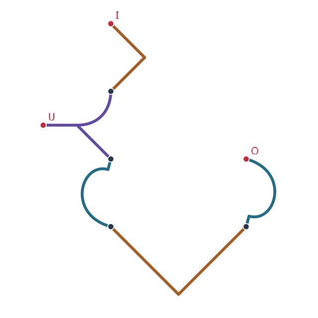

# P-13 · Retardo

**Estado M2: realización completa no demostrada.** El retardo depende de dispersion y resonancias; longitud/v no demuestra ruido, ancho de banda ni perdidas M2. La función y los valores siguientes son objetivos revisables. Véanse las secciones 16.1.

Retardo entrega una señal después de un intervalo preparado. Puede realizarse mediante propagación guiada o mediante registro y reproducción. La operación conserva el orden y la información necesarios dentro de su banda; no detiene el tiempo del entorno ni aplaza sin recursos el movimiento de la materia.

## Registro geométrico

La escala física se declara en O.2; la figura representa una proyección. T: azul, R: ocre, N: violeta. Los puntos oscuros son uniones declaradas; los rojos, extremos libres.

| Pieza | a | b | tₓ | tᵧ | Capa de cruce |
|---|---:|---:|---:|---:|---:|
| N₁ | 1 | 0 | 0 | 0 | 0 |
| R₁ | -1 | 0 | 2 | -2 | 1 |
| T₁ | -520/2473 | 1920/2473 | 1745/2473 | 5161/2473 | 2 |
| R₂ | 0 | -2 | 3 | 5 | 3 |
| T₂ | 520/2473 | -1920/2473 | 13093/2473 | 4731/2473 | 4 |

Transformación: \(x_g=ax-by+t_x,\ y_g=bx+ay+t_y\). Las fracciones son los valores canónicos, no redondeos de calibración física.

Uniones: N₁.2 ↔ R₁.a; N₁.3 ↔ T₁.a; T₁.b ↔ R₂.a; R₂.b ↔ T₂.a.

5 piezas; 1 componente(s) conexa(s); 0 ciclo(s) independiente(s); 3 extremo(s) libre(s). Caja del eje: 6.847592 × 8.000000 u, sin espesor de trazo.

## Puertos y terminales

| Puerto | Extremo | Intercambio | Función |
|---|---|---|---|
| I | R₁.b | Señal | Entrada que debe demorarse. |
| O | T₂.b | Señal | Entrega posterior. |
| U | N₁.1 | Control y alimentación | Tiempo solicitado, sincronización y estado de ocupación. |

Los puertos mixtos se descomponen en subcanales tipados. La región de aplicación y los intercambios distribuidos forman parte del montaje aunque no sean extremos de la plantilla.

## Contrato dinámico de referencia

- Estados: cola temporal.
- Entradas: dato con sello temporal, retardo.
- Salidas: dato diferido.
- Dominio: tau_d>=0; almacenamiento >= tasa_datos*tau_d.

`y(t)=x(t-tau_d)`

Descartar datos caducados según contrato; no anticipar la entrada.

Grupos de parámetros: `logic` en `datos/parametros.json`. El contrato reducido no constituye una realización microscópica demostrada.

## Activación y funcionamiento

1. **Asignación.** Definir qué señal se demora, durante cuánto tiempo y con qué fidelidad.
2. **Recepción.** Aceptar la señal solo en el régimen para el que existe capacidad disponible.
3. **Retención o tránsito.** Mantener la propagación o el registro temporal y la referencia del intervalo.
4. **Entrega.** Reproducir la señal y confirmar qué contenido continúa pendiente antes de reiniciar o desmontar.

## Modelo operacional y balance de recursos

La respuesta ideal de un retardo sobre una banda especificada es

\[
y(t)=g\,x(t-\tau),\qquad \tau\geq0.
\]

g incluye la amplitud o ganancia declarada. La ganancia activa recibe energía adicional. Una demora basada en un recorrido de longitud L respeta su tiempo causal; una basada en almacenamiento incluye escritura, conservación, lectura y control temporal.

Un flujo digital no comprimido de Rb bits/s retenido durante τ segundos ocupa al menos Rb τ bits de datos, además de control y redundancia. Cambiar el retardo mientras hay información pendiente exige una regla explícita para su entrega; no debe eliminarla silenciosamente.

## Posición y persistencia

La ruta o el registro pueden extenderse fuera del dibujo de mando. Una red de Retardos permite alinear señales que llegan por caminos distintos, manteniendo el tiempo de adquisición de cada una.

## Comprobación y diagnóstico

| Observación | Interpretación y acción |
|---|---|
| La salida aparece con intervalos variables | Revisar la referencia temporal y el ruido de sincronización. |
| Los pulsos se deforman | Caracterizar banda, dispersión y lectura del registro. |
| Se pierden señales al aumentar el flujo | Revisar capacidad temporal y política de recepción. |
| Cambiar τ duplica o omite datos | Vaciar o migrar el contenido con una secuencia definida. |

## Ejemplo de uso

Demorar un flujo de 1000 bits/s durante dos segundos requiere conservar al menos 2000 bits de datos en el caso de almacenamiento digital sin compresión; los registros auxiliares se suman aparte.

## Correspondencia microscópica

Propagación dispersiva o registro y reproducción.

**Estado físico:** Modo de línea o cola de memoria.

**Coeficientes:** Retardo de grupo d arg S/d omega y capacidad almacenada.

**Comportamiento resultante:** La salida conserva orden y aparece tras propagación o lectura temporizada.

**Comprobación disponible:** Fase de grafo y contrato causal. Véase MM.7; MM.11.

**Requisito de realización:** Calcular ancho de banda, distorsión y error temporal.

## Aceptación

Comprobar geometría y puertos, respuesta a baja potencia, balance de recursos y transición de retirada. El montaje debe satisfacer las magnitudes del contrato y el dominio de su receta. La precisión del SVG no demuestra estabilidad ni rendimiento del estado físico.
