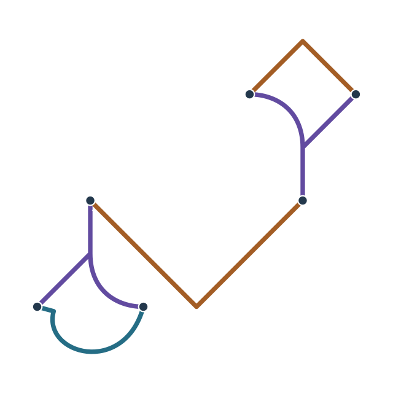

# P-20 · Polarización

**Estado M2: realización completa no demostrada.** B escalar uniforme no introduce birrefringencia local; una respuesta anisotropa por geometria exige resolver Maxwell y materia. La función y los valores siguientes son objetivos revisables. Véanse las secciones 17.3.

Polarización prepara una distribución de cargas y una diferencia de potencial entre regiones. Puede inducir polarización en materia, separar cargas disponibles o mantener un campo eléctrico mediante un suministro adecuado. La carga eléctrica y la carga rúnica son magnitudes distintas; conservar una no autoriza crear gratuitamente la otra.

## Registro geométrico

La escala física se declara en O.2; la figura representa una proyección. T: azul, R: ocre, N: violeta. Los puntos oscuros son uniones declaradas; los rojos, extremos libres.

| Pieza | a | b | tₓ | tᵧ | Capa de cruce |
|---|---:|---:|---:|---:|---:|
| N₁ | 0 | 1 | 0 | 0 | 0 |
| N₂ | 0 | -1 | 4 | -2 | 1 |
| R₁ | 0 | -2 | 2 | 1 | 2 |
| T₁ | 1920/2473 | 520/2473 | 215/2473 | 3201/2473 | 3 |
| R₂ | 0 | 1 | 4 | -4 | 4 |

Transformación: \(x_g=ax-by+t_x,\ y_g=bx+ay+t_y\). Las fracciones son los valores canónicos, no redondeos de calibración física.

Uniones: N₁.1 ↔ R₁.a; N₁.2 ↔ T₁.b; N₁.3 ↔ T₁.a; N₂.1 ↔ R₁.b; N₂.2 ↔ R₂.b; N₂.3 ↔ R₂.a.

5 piezas; 1 componente(s) conexa(s); 2 ciclo(s) independiente(s); 0 extremo(s) libre(s). Caja del eje: 6.000000 × 5.847592 u, sin espesor de trazo.

**Corrección de esta edición:** R₂ se reorienta para eliminar la coincidencia de un tramo con N₂; se conservan las cinco piezas y los dos ciclos.

## Puertos y terminales

No hay extremos libres asignados a puertos. La alimentación, el control y la interacción usan terminales del estado desplegado; su localización debe declararse en el montaje.

| Región funcional | Localización | Intercambio |
|---|---|---|
| Z₊ | Primer lóbulo, junto a N₁–T₁ | Interfaz eléctrica de referencia positiva. |
| Z₋ | Segundo lóbulo, junto a N₂–R₂ | Interfaz eléctrica de referencia negativa. |
| D | Zona de enlace R₁ | Interfaz distribuida de excitación, alimentación y lectura, por acoplamiento con una estructura próxima. |

Los puertos mixtos se descomponen en subcanales tipados. La región de aplicación y los intercambios distribuidos forman parte del montaje aunque no sean extremos de la plantilla.

## Contrato dinámico de referencia

- Estados: carga, corriente, campos EM.
- Entradas: modalidad, consigna, terminales.
- Salidas: respuesta electromagnética.
- Dominio: Constitutivas de medio declaradas; cálculo de pérdidas e inducción.

`div(B)=0; curl(E)=-dB/dt; u_EM=(epsilon*E^2+B^2/mu)/2 en medio lineal simple`

Nombre de catálogo amplio; especificar si es polarización material, carga o corriente.

Grupos de parámetros: `power_channel` en `datos/parametros.json`. El contrato reducido no constituye una realización microscópica demostrada.

## Activación y funcionamiento

1. **Medio.** Identificar regiones, conductividad y ruta de redistribución de carga.
2. **Excitación.** Preparar el estado relativo de los lóbulos mediante D y establecer una diferencia inicial pequeña.
3. **Polarización.** Ajustar el potencial o el campo observado, incluyendo corrientes y carga de los cuerpos conectados.
4. **Relajación.** Recuperar o transferir la energía eléctrica y llevar la distribución a un estado final especificado.

## Modelo operacional y balance de recursos

En una aproximación electrostática de dos terminales con respuesta lineal,

\[
Q=C_{\mathrm{ef}}V,\qquad E_{\mathrm{el}}=\tfrac12 C_{\mathrm{ef}}V^2.
\]

Q es la carga separada en ese modelo, V la diferencia de potencial y Cef una capacidad efectiva determinada por el conjunto. Una forma más general contabiliza campos, materiales y su respuesta. La conservación eléctrica se expresa mediante ∂tρe + ∇·J = 0 para la carga y corriente totales pertinentes.

Mantener un potencial con corriente I intercambia una potencia VI. Polarizar un medio puede producir fuerzas, calentamiento y reacciones en interfaces; esos efectos se incluyen o se utilizan deliberadamente. La ionización, la ruptura dieléctrica y la radiación de cargas aceleradas son regímenes físicos que requieren su propio tratamiento.

## Posición y persistencia

Las regiones activas pueden ser mayores que los lóbulos de la marca y seguir referencias separadas. Los esfuerzos electromagnéticos se transmiten al medio y a los apoyos. La excitación de D tiene una geometría, distancia y banda caracterizadas; no constituye alimentación a distancia sin enlace.

## Comprobación y diagnóstico

| Observación | Interpretación y acción |
|---|---|
| El potencial cae al conectar una carga | Comprobar corriente, suministro y capacidad de mantener la separación. |
| La polaridad medida cambia | Revisar referencias y estado relativo de los lóbulos. |
| Aparece corriente por el entorno | Caracterizar conductividad, fugas e interfaces. |
| El campo ioniza el medio | Ajustar la geometría o tratar explícitamente el régimen de plasma. |

## Ejemplo de uso

Una realización que se comporte como una capacidad de 1 µF a 10 V conserva 50 µJ de energía eléctrica en ese modelo. La cifra describe un ejemplo equivalente; no fija la capacidad ni el potencial máximo de esta primordial.

## Correspondencia microscópica

Distribución de carga y respuesta electromagnética.

**Estado físico:** Cargas ordinarias, campos y regiones D/Z.

**Coeficientes:** Maxwell con B(s), constitutivas materiales y energía EM.

**Comportamiento resultante:** Las fuentes existentes generan potenciales y campos con retorno y pérdidas.

**Comprobación disponible:** Relación epsilon, mu, impedancia y química. Véase MM.9; MM.12.

**Requisito de realización:** Resolver terminales reales y estados de materia; los lazos no fijan una tensión.

## Aceptación

Comprobar geometría y puertos, respuesta a baja potencia, balance de recursos y transición de retirada. El montaje debe satisfacer las magnitudes del contrato y el dominio de su receta. La precisión del SVG no demuestra estabilidad ni rendimiento del estado físico.
