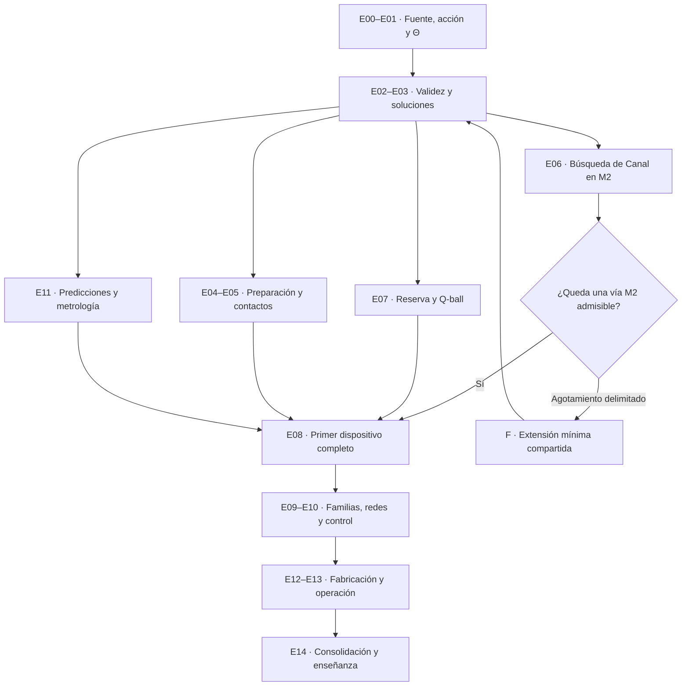
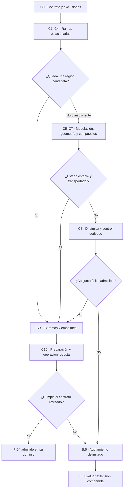
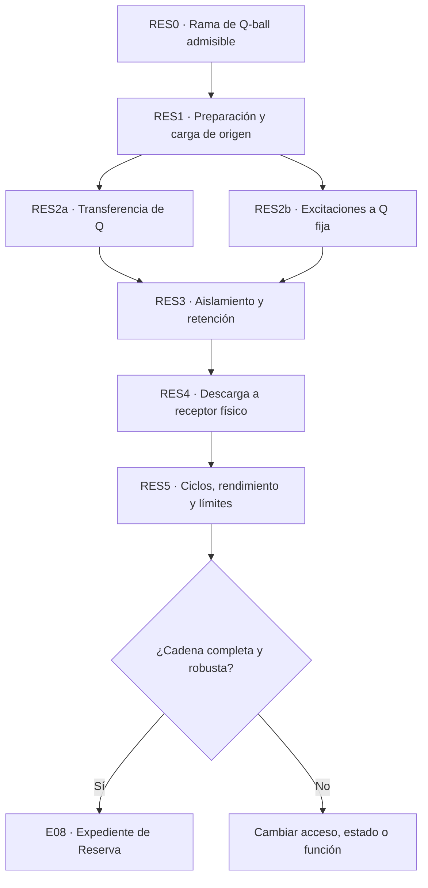

# Hoja de ruta científica e ingenieril de la Rúnica

**Base:** Proyecto_Runas_M2_4_1.zip · edición 4.1.0 · revisión del 27 de septiembre de 2026.  
**Naturaleza de esta entrega:** programa de investigación y criterios de decisión. No contiene una nueva versión de M2, resultados físicos nuevos ni cambios al proyecto de origen.

El siguiente avance decisivo debe ser un sistema que pueda prepararse, operar y apagarse con todos sus intercambios contabilizados. Para conseguirlo conviene mantener dos líneas principales: buscar una realización estable de **P-04 Canal** y convertir la **Q-ball en un candidato de P-06 Reserva**. Ambas utilizarán la misma teoría, parámetros y herramientas de aceptación. Reserva puede avanzar sin esperar a una guía larga, mediante contactos locales que también deberán derivarse.

La prioridad de Canal no implica conservar el tubo libre, el dibujo actual, sus terminales ideales ni las prestaciones históricas. Una realización que fracase se abandona con su resultado documentado. La física determina qué funciones sobreviven y qué prestaciones admiten. R1 se revisa después de calcularlas.

## Cómo utilizar la guía

1. Leer el estado de partida y las reglas de aceptación.
2. Usar **A** para organizar el programa y sus dependencias.
3. Ejecutar las ramas de **B** para Canal; aplicar a cada candidato las 22 comprobaciones comunes.
4. Desarrollar **D** para Reserva en paralelo. **E** ordena las demás primordiales.
5. Consultar **F–H** para extensión teórica, ingeniería y consolidación documental.
6. Utilizar **C**, al final, como lista priorizada de las próximas diez investigaciones.

Los identificadores E, C y RES designan etapas generales, ramas de Canal y etapas de Reserva. No son nuevas primordiales. Todas las rutas de archivos que se citan pertenecen al proyecto original, salvo las marcadas **nueva propuesta**. Su actualización se prescribe para investigaciones futuras; no se ha ejecutado aquí.

## Estado de partida y alcance de la revisión

Se inventariaron los **221 archivos** del ZIP: 55 Markdown, 31 JSON, 60 SVG, 22 scripts Python, 18 CSV, 33 registros, un archivo de dependencias y un ZIP antecedente. Se comprobaron los **220 hashes** del manifiesto, la integridad CRC, el análisis de los JSON, la sintaxis Python, el XML de los SVG y la finitud de todos los datos CSV. También se verificó el manifiesto del antecedente 4.0, de 156 archivos. La revisión documental y del código identificó fuentes, vistas generadas, supuestos, resultados y dependencias.

Se examinaron los informes ya incluidos de reproducción y sus alcances. Sus 194 comprobaciones generales, 38 de M2 y 52 capilares figuran como correctas. **No se han vuelto a ejecutar los solucionadores ni los generadores**: hacerlo regeneraría archivos y corresponderá a E00. Esta revisión no constituye una reproducción numérica independiente ni una certificación matemática de todas las derivaciones. Los gráficos se comprobaron estructuralmente; no se atribuye a este trabajo una nueva validación visual o física de cada figura.

Identidad de la fuente:

```text
Proyecto_Runas_M2_4_1.zip
SHA256 f4ebb3095dddb79cf36b8b9be13e93b7553abf01a1905ccdbda93e02bd155595
```

La autoridad de estado procede de `DIRECTRICES_DESARROLLO.md`, `M2_RESULTADO.md`, `datos/theta_comun.json`, `datos/estado_evidencia.json`, `datos/aceptacion_m2.json` y los capítulos 13–22. Los capítulos anteriores y las fichas conservan hipótesis y contratos útiles, subordinados a ese estado. El integrado es una vista, no una segunda teoría.

| Resultado vigente | Evidencia y alcance | Consecuencia para el programa |
|---|---|---|
| Acción escalar M2 y parámetros comunes de ensayo | Hipótesis explícita; sector clásico aislado | Mantenerla como base de comparación; no atribuirle confirmación experimental |
| Vacío coercivo, Cauchy e hiperbolicidad | Argumentos analíticos condicionados, cap. 13 | Auditar sus hipótesis; no trasladarlos automáticamente a materia, control o correcciones cuánticas |
| Q-ball a frecuencia adimensional 0.9 | Perfiles convergentes; energía 2525.6589099 y carga 2745.7739207 | Candidato de almacenamiento; todavía no es una batería |
| Estabilidad de la Q-ball | Hessiano restringido positivo numéricamente; identidades angulares condicionadas; espectro seleccionado | Faltan certificación del continuo, robustez de rama y estabilidad no lineal general |
| Dinámica conservativa radial | Perturbación prescrita de 0.001 durante 24 unidades de tiempo | No establece preparación, duración macroscópica ni retención ambiental |
| Interfaz de ambos campos | Tensión adimensional 0.1265742605132; cotas variacionales | Coeficiente micro→macro disponible, sin ajuste por primordial |
| Límite capilar | Diez fondos, radios de norma 8–128, dimensiones 2 y 3; 40 cálculos espectrales principales | Aproximación contrastada para observables concretos; no espectro completo |
| Modos grandes | A radio de norma 128: desviaciones capilares de aproximadamente 0.154 % en frecuencia esférica y 0.678 % en crecimiento tubular | Reutilizar para orientación y control de errores, no como ley exacta a cualquier escala |
| Tubo libre sin nodos | Prueba de inestabilidad longitudinal y cálculo convergente | Realización rechazada como guía larga estable dentro de esa clase |
| Corriente axial uniforme | No elimina la banda larga en las ramas con respuesta longitudinal negativa analizadas | No repetir el mismo mecanismo como supuesta solución; delimitar otras clases |
| Terminal | Mapa exterior de vacío derivado; extremo completo sin resolver | No imponer Neumann como sustituto de una terminación física |
| Materia y electromagnetismo | Benchmark con A=B=1 | Conversión rúnica directa nula en ese benchmark; contactos pendientes |
| Preparación y memoria | Cero clásico invariante; carga neta conservada; barrera entre fases globales nula | Excluir esas propuestas concretas; investigar mecanismos diferentes con balances |
| Catálogo | 24 funciones evaluadas; **0 realizaciones completas** | Investigar por dependencias, sin preservar artificialmente el número 24 |

### Precisiones que deben atenderse primero

**Convención relativista.** El capítulo 13 declara signatura (−+++), mientras 20.3 escribe X=∂θ·∂θ y después utiliza X=μ² para una fase temporal. Con esa signatura debe definirse X=−∂θ·∂θ si se quiere X=μ², y revisar conjuntamente corriente y tensor. Es una inconsistencia de convención que debe auditarse y corregirse documentalmente en E01; no demuestra que sean erróneos los perfiles calculados con las ecuaciones explícitas.

**Barrido fundamental.** `herramientas/m2_comun.py` lee dos razones y reconstruye G y H; en particular H=M²/(RATIO+1). Eso implementa correctamente la familia de benchmark, pero no un barrido independiente de los cinco parámetros fundamentales. E01 debe separar las coordenadas independientes de las restricciones voluntarias del benchmark antes de afirmar robustez en Θ.

**Cobertura espectral.** El generador de la Q-ball busca 18 autovalores alrededor de un desplazamiento; el contraste capilar selecciona modos. Un residuo pequeño sólo acredita el problema discretizado que se ha resuelto. No excluye autovalores fuera de esa búsqueda ni certifica el continuo. `guia_m2.py` emplea además un desplazamiento fijo para localizar autovalores bajos: antes de ampliar parámetros habrá que justificar la cota inferior para cada estado, como ya hace el análisis capilar.

**Automatización y evidencia.** `--solo-verificar` también escribe informes y registros. Debe ejecutarse en una copia de trabajo, no sobre la fuente archivada. Los valores `passed=true` comprueban criterios enumerados; los `complete_device_derived=false` significan ausencia de cierre, salvo el resultado negativo específico expresamente identificado. Los esquemas históricos 2.0/3.0/4.0 no invalidan un resultado, pero necesitan una migración trazable cuando cambie su significado.

## Reglas comunes de investigación

### Estados de evidencia

| Etiqueta | Uso exigido |
|---|---|
| Demostrado | Proposición y prueba con hipótesis, espacio funcional y alcance explícitos |
| Derivado | Observable obtenido desde premisas identificadas; indicar si el método es analítico o numérico |
| Simulado | Resultado de ecuaciones, condiciones y algoritmo publicados, con error y duración |
| Aproximado | Reducción con parámetros pequeños, observables y error contrastado |
| Plausible | Mecanismo compatible en principio; aún sin prueba de existencia o funcionamiento |
| Provisional | Elección revisable de arquitectura, contrato, clasificación o método |
| No estudiado | No se ha realizado el análisis concreto |
| Refutado dentro del modelo | Contradicción o inestabilidad demostrada para una clase definida; conservar sus hipótesis |
| Problema abierto | Pregunta delimitada cuya respuesta falta; especificar qué evidencia la resolvería |

Una afirmación puede ser «derivada, aproximada y contrastada numéricamente». Ninguna combinación significa «observada experimentalmente» sin un experimento. La falta de convergencia de Newton tampoco significa inexistencia.

### Un mismo Θ, estados distintos y coeficientes derivados

En unidades naturales, la referencia es

\[
\mathcal L_{M2}=-\partial_\mu\Phi^*\partial^\mu\Phi
-\tfrac12\partial_\mu\chi\partial^\mu\chi-V,
\qquad
V=m^2s+\lambda_0s^2+\tfrac12M^2\chi^2+g\chi s+\tfrac12h\chi^2s,
\quad s=|\Phi|^2.
\]

\[
\Theta_s=(m,M,\lambda_0,g,h),\qquad
\lambda=g^2/(2M^2)-\lambda_0.
\]

Las dimensiones de masa son [Φ]=[χ]=1, [m]=[M]=[g]=1 y [λ₀]=[h]=0. λ es derivada. Un programa común debe distinguir:

| Clase | Qué puede variar | Condición |
|---|---|---|
| Parámetros fundamentales | Sólo al comparar teorías o benchmarks globales | Cada cambio obliga a recalcular todos los resultados afectados; prohibido un Θ por primordial |
| Estado | Q, momento, momento angular, frecuencia del fondo, ocupaciones, temperatura del entorno | La frecuencia puede ser multiplicador de una restricción; no contar variables dependientes como controles independientes |
| Configuración | Tamaños, composición, contactos, fuentes, geometría, protocolo | Deben entrar en ecuaciones y balances; una pared prescrita no es una solución emergente |
| Parámetro material | Propiedad derivada o medida de una composición y estado identificados | Procedencia común, incertidumbre y reutilización; no ajuste retrospectivo para alcanzar una prestación |
| Coeficiente efectivo | Dispersión, rigidez, pérdidas, ruido, barreras y tasas | Resultado del problema completo y de su reducción, no entrada fundamental encubierta |
| Parámetro numérico | Malla, dominio, tolerancia, orden y semilla computacional | Convergencia independiente; no modifica la física |
| Objetivo R1 | Velocidad, potencia, duración, rendimiento y forma | Contrastar con predicciones; registrar revisión o abandono |

### Puerta general de aceptación

Una primordial se acepta **dentro de un dominio declarado** sólo cuando existe una cadena trazable

\[
\mathcal A_d=\text{acción}+\Theta+\text{configuración física}
\Rightarrow\text{estado accesible}\Rightarrow\text{estabilidad}
\Rightarrow\text{respuesta y coeficientes}\Rightarrow\text{ciclo operativo y función}.
\]

La flecha exige cálculos, no correspondencias verbales. El expediente debe contener solución, errores, preparación, lectura, actuación, terminales, pérdidas, ruido, conservación, límites y fallos. Se registrarán por separado tres niveles: **cierre matemático condicionado**, **dispositivo numérico completo** y **dispositivo experimental contrastado**. El segundo es un hito legítimo, pero no habilita fabricar u operar hardware como si el tercero existiera.

La estabilidad se evaluará en una **región** de parámetros de estado y configuración. Los ceros de fase o traslación se separan de los modos físicos; no se exige un margen espectral positivo contra una simetría exacta. Para el resto, se buscará coercividad restringida o control equivalente y un margen mayor que la incertidumbre. Una malla de puntos estables es evidencia de región, no una prueba entre puntos: añadir continuación, sensibilidad y, donde sea viable, cotas validadas.

Antes de simular se fijarán tolerancias por observable y misión. Como regla metodológica propuesta, el error numérico y de reducción debe consumir una fracción pequeña —por ejemplo, como máximo una décima parte— del margen funcional o de estabilidad que se pretende declarar. Ese factor es un presupuesto de verificación revisable, no una constante física. Conservar mallas fallidas, estados inestables y resultados nulos.

## A. Mapa general de etapas



Los números son identificadores, no una obligación de ejecución completamente serial. E11 comienza como diseño de contrastes al arrancar E02; la experimentación espera una interacción y medidas físicamente definidas. E04 y la evaluación de contactos avanzan con ambas líneas. M3 no se introduce como rescate de Canal antes de cerrar la puerta de agotamiento descrita en B.

| Etapa | Hito de salida | Dependencia principal | Dificultad |
|---|---|---|---|
| E00 | Base reproducible y mapa de afirmaciones | ZIP 4.1 | Media |
| E01 | Acción, convenciones y Θ sin ambigüedad | E00 | Alta |
| E02 | Dominio de validez y límites cuantificables | E01 | Muy alta |
| E03 | Herramientas de existencia, espectro y dinámica verificadas | E01; E02 en paralelo | Muy alta |
| E04 | Preparación y apagado con fuente contabilizada | E03 | Muy alta |
| E05 | Contactos y entorno derivados de un modelo común | E01–E03 | Muy alta |
| E06 | Canal admisible o agotamiento delimitado de M2 | E02–E05 y B | Muy alta |
| E07 | Ciclo de Reserva reproducible | E02–E05 y D | Muy alta |
| E08 | Primer dispositivo con cadena completa | E04–E07; E11 según nivel | Muy alta |
| E09 | Familias admitidas por dependencias | E08 y recursos demostrados | Alta/muy alta |
| E10 | Integración y control robustos | Componentes admitidos | Muy alta |
| E11 | Parámetros identificables y contraste empírico | Comienza en E02; necesita E05 para medir | Muy alta |
| E12 | Proceso físico repetible y calibrable | E08, E11 | Muy alta |
| E13 | Operación, retirada y seguridad justificadas | E10–E12 | Muy alta |
| E14 | Núcleo consolidado y corpus técnico | Puertas de congelación, H | Alta |

### E00 — Congelar la fuente y establecer una reproducción independiente

**Objetivo y pregunta.** Determinar qué resultados se reproducen y qué afirmación respalda realmente cada archivo. La revisión de integridad presente es el punto de partida, no sustituye esta investigación.

**Teoría y derivaciones.** Grafo de procedencia: acción → parámetros → script → datos → observable → afirmación. Identificar fuentes únicas y vistas generadas; separar M1, M2, contratos R1 y ejemplos auxiliares.

**Simulaciones.** Reproducir en copia aislada los 19 pasos registrados, con dependencias fijadas. Recalcular con implementación independiente al menos energía/carga, tensión y un autovalor estable e inestable. No contar dos programas que importan el mismo operador como dos derivaciones independientes.

**Observables.** Diferencias de datos, balances, tiempos, error de discretización y discrepancias entre ecuaciones y código; cobertura de cada verificador.

**Aceptación y puerta.** Si coinciden dentro de errores justificados y cada afirmación tiene respaldo identificable, avanzar a E01/E03. La comparación no exige igualdad binaria entre entornos.

**Resultado negativo y cambio.** Ante discrepancia, localizar si es convención, algoritmo, transcripción o física. Suspender sólo las afirmaciones dependientes; no borrar resultados negativos ni cambiar tolerancias para aprobar.

**Documentación y datos.** Actualizar en el futuro `datos/estado_evidencia.json`, `tratado/22_evidencia_y_metodologia.md`, `requirements.txt`, `herramientas/reproducir.py`. Producir **nueva propuesta** `validacion/reproduccion_independiente/`: tablas de diferencias, versiones, registros y gráfica de convergencia.

**Dificultad y dependencias.** Media; depende de la entrega 4.1. Debe preceder a afirmaciones nuevas de cierre.

### E01 — Fijar la formulación matemática y el espacio fundamental

**Objetivo y pregunta.** Establecer exactamente qué teoría se está investigando y qué variaciones preservan esa teoría.

**Teoría y derivaciones.** Auditar acción, dimensiones, signo métrico, corriente de Noether, tensor de tensiones, condiciones de contorno y ensembles de Q, momento y momento angular. Resolver la convención de X señalada arriba. Expresar las cinco coordenadas independientes y las restricciones del benchmark por separado. Auditar las pruebas de coercividad, Cauchy y cono característico; especificar regularidad y fronteras admisibles.

**Simulaciones.** Comprobar equivalencia de formulaciones dimensional/adimensional y de los Jacobianos con derivadas independientes. En una futura refactorización, reproducir exactamente el benchmark antes de permitir g y h independientes.

**Observables.** Residuos de Euler–Lagrange/Noether, dimensiones, invariantes y sensibilidad a cada coordenada independiente de Θ.

**Aceptación y puerta.** Una única definición alimenta todos los cálculos; las hipótesis de cada teorema están explícitas. Avanzar a barridos globales y soluciones nuevas.

**Resultado negativo y cambio.** Si un teorema pierde sus hipótesis fuera del benchmark, limitar la región admitida o demostrar una versión nueva. No promover una identidad del benchmark a ley de todo Θ.

**Documentación y datos.** `datos/theta_comun.json`, `herramientas/m2_comun.py`, capítulos 13, 15 y 20; **nueva propuesta** `datos/convenciones.json` y `validacion/identidades/`. Producir tabla dimensional, mapa de parámetros independientes y resultados de equivalencia.

**Dificultad y dependencias.** Alta; E00. La generalización del código es un trabajo propuesto, no realizado en esta guía.

### E02 — Determinar dominios de validez, incertidumbre y escalas

**Objetivo y pregunta.** Precisar para qué amplitudes, frecuencias, tamaños, energías, tiempos y entornos cada descripción tiene error controlado.

**Teoría y derivaciones.** Separar teoría clásica exacta, mediador eliminado, expansión séxtica, hidrodinámica, capilaridad, reducción modal y EFT cuántica. Identificar modos pesados, parámetros de expansión, operadores permitidos por simetría y contraterminos. El potencial clásico no queda automáticamente cerrado bajo renormalización: examinar, entre otros, términos del mediador permitidos por las simetrías. Determinar el significado físico de un corte y las ocupaciones que justifican el régimen clásico.

**Simulaciones.** Barrer parámetros independientes en una región registrada antes de evaluar R1; contrastar reducciones con ambos campos, curvaturas, amplitudes y frecuencias. Propagar incertidumbre y error acumulado de fase. Preparar predicciones de laboratorio con E11 sin declarar detectabilidad todavía.

**Observables.** Error por observable, separación de escalas, rango de Θ compatible con vacío y localización, energía por volumen, parámetros de lazo, tiempo hasta exceder el error admisible.

**Aceptación y puerta.** Publicar una carta de validez con límites y zonas indeterminadas; habilitar únicamente los cálculos dentro de ella. Un dominio clásico condicionado puede avanzar aunque la validación empírica siga abierta.

**Resultado negativo y cambio.** Si la aproximación falla, volver a M2 completo. Si falla el sector clásico o la EFT controlada no existe en la región útil, reducir prestaciones o activar revisión teórica con el alcance correspondiente; no introducir un corte arbitrario.

**Documentación y datos.** Capítulo 15, `datos/theta_comun.json`, `datos/ensayo_capilaridad.json`; **nueva propuesta** `datos/dominios_validez.json`, `validacion/validez/`. Mapas de error, diagramas de fase, covarianzas y límites temporales.

**Dificultad y dependencias.** Muy alta; E01 y herramientas E03. La identificación cuántica/empírica puede requerir un programa independiente de larga duración.

### E03 — Consolidar soluciones, espectro completo y dinámica

**Objetivo y pregunta.** Separar soluciones existentes de artefactos y estabilidad física de estabilidad del algoritmo.

**Teoría y derivaciones.** Usar continuación por norma/carga y pseudoarco para pliegues; derivar cada Hessiano y generador desde la misma acción. Analizar restricciones, modos de simetría, índice de Morse, espectro esencial, umbrales y posibles cadenas de Jordan. Emplear coercividad/estabilidad orbital donde sus hipótesis puedan demostrarse, no sólo la pendiente dQ/dω.

**Simulaciones.** Refinar independientemente fondo, malla espectral, dominio y tiempo. Comparar al menos dos discretizaciones relevantes. Explorar perturbaciones radiales, no radiales, asimétricas y finitas en 3D. Contar raíces inestables mediante métodos de contorno/Evans o cotas equivalentes cuando resulten viables; controlar sectores de alta frecuencia y alto índice con estimaciones analíticas. Para estados periódicos usar Bloch/Floquet.

**Observables.** Ramas E(Q), autovalores y firmas energéticas, espectro continuo, normas orbitales, radiación y flujos E,Q,P,J; error de truncar sectores.

**Aceptación y puerta.** Fondo convergente y ausencia justificada de crecimiento en toda la clase de perturbaciones declarada. Una certificación rigurosa y evidencia numérica de alta confianza se etiquetan por separado. Avanzar a acceso y funcionalidad sólo si la estabilidad necesaria queda respaldada.

**Resultado negativo y cambio.** Un modo creciente convergente descarta estabilidad de ese estado. Crecimiento que desaparece con malla exige revisar simetrías; no se elimina del informe. Una simulación corta sin fallo no prueba estabilidad orbital.

**Documentación y datos.** Capítulo 14, `herramientas/cierre_m2.py`, `herramientas/dinamica_m2.py`, `herramientas/guia_m2.py`; **nueva propuesta** `validacion/espectro_completo/`. Diagramas espectrales, mapas de crecimiento, trayectorias 3D y presupuesto de error.

**Dificultad y dependencias.** Muy alta; E01, con E02 en paralelo. Los dos campos introducen escalas rígidas que deben resolverse o eliminarse con error probado.

### E04 — Preparación común, Semilla y apagado

**Objetivo y pregunta.** ¿Puede una fuente físicamente especificada llevar un estado inicial accesible a una región operacional sin violar cargas ni ocultar recursos?

**Teoría y derivaciones.** Definir estado inicial de todos los sectores, puerto de carga, trabajo, momento e información de la preparación. Separar transferencia desde un reservorio rúnico existente, producción de pares compensados y eventual preparación cuántica desde vacío. La primera ruta no resuelve el origen de la primera Semilla. Una fuente clásica externa lineal debe incluir el sistema que entrega su carga; no es una excepción gratuita a U(1).

**Simulaciones.** Transitorio completo de inyección/captura, radiación de asentamiento, saturación y retirada. Estudiar conjuntos de datos iniciales y errores de fuente, no sólo el perfil final impuesto. Si se usan fluctuaciones, justificar su distribución y la aproximación clásica o cuántica correspondiente.

**Observables.** Probabilidad o cuenca determinista de captura, Q y energía entregadas, tiempo, fidelidad del estado, energía radiada, coste de control y estado final de la fuente.

**Aceptación y puerta.** Preparación reproducible con márgenes y apagado que deja destinos definidos para energía y carga; habilitar componente condicionado al origen declarado de sus recursos. P-01 completo exige cerrar también su fuente inicial.

**Resultado negativo y cambio.** Cero clásico invariante o carga sin compensación descartan el protocolo. Si sólo hay captura desde un recurso previo, registrarla como tal y mantener abierto el arranque primario.

**Documentación y datos.** Capítulos 13.8 y 16.4, `datos/correspondencia.json`, entrada P-01 de `datos/modulos.json`; **nueva propuesta** `validacion/preparacion_M2/`. Balances temporales, mapas de captura y curvas de asentamiento/apagado.

**Dificultad y dependencias.** Muy alta; E03. Para fuente material o cuántica se necesita E05 y un régimen admisible de E02.

### E05 — Contactos, materia, energía y entorno comunes

**Objetivo y pregunta.** Determinar cómo entra, se mide y se recupera energía del sector rúnico; y si un mismo acoplamiento permite varias funciones.

**Teoría y derivaciones.** Primero estudiar contactos entre soluciones de Φ,χ ya existentes. Para materia/EM, evaluar los portales A(s), B(s) ya escritos, un Hamiltoniano material explícito y su retroacción. Activarlos crea un benchmark interactuante nuevo que debe verificarse; no es evidencia del benchmark A=B=1. Separar esta evaluación general de introducir M3 para salvar Canal. Derivar respuesta retardada, transferencia modal, entorno y ruido.

**Simulaciones.** Dispersión entre estado, contacto y reservorio finito; una realización material mínima y dos observables diferentes con el mismo Θ. Comparar dinámica completa con reducción de baño, incluyendo memoria y recalentamiento del reservorio.

**Observables.** Matriz de respuesta, corrientes de energía y carga, fuerza/reacción, emisión, calor, ruido, impedancia y capacidad del contacto.

**Aceptación y puerta.** Conservación global, respuesta causal, estabilidad y tasas calculadas; al menos dos fenómenos explicados sin constantes especiales. Permite E08 y familias materiales. Si sólo existe contacto rúnico interno, habilita únicamente ese nivel.

**Resultado negativo y cambio.** Conversión nula, incompatibilidad empírica o coste que elimina la utilidad obligan a revisar la realización o el portal común. No asignar una eficiencia para suplir el acoplamiento faltante.

**Documentación y datos.** Capítulos 08, 13.2, 15.6 y 21; `datos/interfaces.json`, `datos/theta_comun.json`; **nueva propuesta** `tratado/contactos_comunes.md`, `validacion/contactos/`. Espectros, curvas de transferencia, mapas de calor y balances con incertidumbre.

**Dificultad y dependencias.** Muy alta; E01–E03. La decisión M3 específica de Canal sigue sujeta a B. No se presume que los portales candidatos sean suficientes.

### E06 — Resolver la decisión física de Canal

**Objetivo y pregunta.** Encontrar una región de realizaciones estables que conduzca energía o señales, o delimitar por qué las clases razonables de M2 no cumplen esa función.

**Teoría y derivaciones.** Ejecutar B: exclusiones analíticas, ramas estacionarias, corrientes, rotación, estados no uniformes y compuestos, geometrías alternativas y control físicamente derivado.

**Simulaciones.** Escalera desde problemas transversales hasta conjuntos 3D con extremos, uniones y fuentes; no resolver primero los 24 glifos.

**Observables.** Los 22 requisitos de B.2, robustez, coste por longitud, banda útil y comparación explícita con R1.

**Aceptación y puerta.** Si un candidato supera todas las puertas, pasar a E08 y después P-08/P-13/P-16. Si todos los candidatos admisibles quedan agotados según B.5, evaluar F.

**Resultado negativo y cambio.** Abandonar la realización fallida; si sólo hay transporte corto, transitorio o por relevos, revisar el contrato y no llamarlo guía larga estable.

**Documentación y datos.** Capítulos 16.1, 18, 20–22; P-04 en `datos/modelos.json`, `datos/aceptacion_m2.json`, `datos/geometria.json` sólo si cambia la realización; **nueva propuesta** `validacion/P04/`. Mapas de ramas, espectros, dispersión, transmisión y estados finales.

**Dificultad y dependencias.** Muy alta; E02–E05 según candidato. Es la línea principal de infraestructura, sin bloquear E07.

### E07 — Convertir la Q-ball en Reserva

**Objetivo y pregunta.** ¿Puede el estado localizado completar un ciclo útil, con acceso y recuperación, dentro de una región estable?

**Teoría y derivaciones.** Ejecutar D y distinguir energía total, mínimo a carga fija, excitación recuperable y exergía relativa a reservorios.

**Simulaciones.** Familia estable, preparación, carga, aislamiento, descarga y ciclos con contactos locales; reservar modelos reducidos para regímenes contrastados.

**Observables.** Capacidad accesible, potencia, fuga, rendimiento de ciclo, degradación, carga remanente, costes de preparación/control y energía del receptor.

**Aceptación y puerta.** Un ciclo completo reproducible permite aspirar al primer dispositivo numérico de E08. La energía ligada por sí sola no basta. El hito experimental requiere E11.

**Resultado negativo y cambio.** Si no hay energía extraíble sin destruir el depósito o consumir recursos ocultos, cambiar el modo de almacenamiento o rechazar esa realización de P-06.

**Documentación y datos.** Capítulos 14, 15.5, 20.5 y 21; P-06 en los JSON de módulos, modelos y aceptación; **nueva propuesta** `validacion/P06/`. Curvas E(Q), ciclos y mapas de potencia/retención.

**Dificultad y dependencias.** Muy alta; E02–E05. No presupone Canal ni la geometría gráfica vigente de Reserva.

### E08 — Primera demostración de dispositivo de extremo a extremo

**Objetivo y pregunta.** Establecer una realización cerrada en un dominio, sin completar eslabones mediante objetivos R1.

**Teoría y derivaciones.** Un expediente debe contener acción, Θ, geometría física, estados de fuentes/receptores, preparación, estabilidad, reducción, operación, ruido, fallos y apagado. El estado final debe permitir repetir el procedimiento con recursos declarados.

**Simulaciones.** Ejecutar el ciclo sin reinicializar artificialmente fases, carga, temperatura ni energía entre pasos. Hacer ensayos fuera del punto usado para diseñarlo, perturbaciones adversas y reproducción independiente. Si no cabe resolver todas las escalas a la vez, verificar solapamientos entre modelos y transferir su incertidumbre.

**Observables.** Función medida en la simulación, márgenes, coste neto, error, estado residual, rango de operación y trazabilidad del modelo reducido.

**Aceptación y puerta.** Todos los eslabones deben ser cuantitativos. Registrar «dispositivo numérico completo bajo M2» únicamente si procede; «experimental» exige evidencia externa. Abrir E09/E10 sobre recursos concretos admitidos.

**Resultado negativo y cambio.** Una falla de preparación, contacto, ruido o repetibilidad impide aceptación aunque el estado aislado sea estable. Volver al eslabón responsable, no añadir una primordial que oculte su función.

**Documentación y datos.** `datos/aceptacion_m2.json`, `datos/estado_evidencia.json`, capítulos 16–17, `M2_RESULTADO.md`; **nueva propuesta** expediente de dispositivo con scripts, resultados crudos y gráfica de flujo energético del ciclo.

**Dificultad y dependencias.** Muy alta; E04/E05 y E06 o E07. E11 fija el nivel de correspondencia con materia real.

### E09 — Ampliar el repertorio mediante recursos físicos compartidos

**Objetivo y pregunta.** Identificar qué funciones adicionales se derivan sin cambiar las leyes por dispositivo.

**Teoría y derivaciones.** Aplicar la matriz de dependencias E. Distinguir resonador, sensor, memoria, actuador y transductor. Comparar fusiones o sustituciones por equivalencia de función, estado, preparación y lectura, no sólo por semejanza geométrica.

**Simulaciones.** Una realización mínima por familia, seguida de variación de estado/configuración con Θ fijo. Ensayos de control y fallo para cada función; reutilizar componentes ya aceptados.

**Observables.** Respuesta funcional, coeficientes derivados, recursos compartidos, prestaciones incompatibles y coste de adaptación entre funciones.

**Aceptación y puerta.** Admitir cada función únicamente al completar su expediente; entonces integrarla. El catálogo puede aumentar, reducirse o reorganizarse conservando trazabilidad de sus identificadores.

**Resultado negativo y cambio.** Mecanismo repetido con igual obstrucción se archiva; contratos sin observable o con barrera/tasa impuesta permanecen provisionales.

**Documentación y datos.** `datos/modulos.json`, `datos/modelos.json`, `datos/correspondencia.json`, `datos/aceptacion_m2.json`, capítulo 17; **nueva propuesta** `datos/dependencias_fisicas.json`. Matrices de dependencia y mapas comparativos de respuesta/error.

**Dificultad y dependencias.** Alta a muy alta; E08 y recursos especificados en E. No requiere resolver simultáneamente todas las familias.

### E10 — Integración, redes y control

**Objetivo y pregunta.** ¿Conserva una combinación de componentes sus márgenes al intercambiar energía, señales y errores?

**Teoría y derivaciones.** Derivar modelos con puertos, restricciones y retardos desde los componentes; demostrar compatibilidad de potencia, referencias y unidades. Analizar pasividad cuando corresponda, estabilidad de lazos, observabilidad y controlabilidad. Un controlador convencional externo es admisible si se identifica como tal; no demuestra P-15 rúnico.

**Simulaciones.** Dos componentes, luego una unión y finalmente una red pequeña. Comparar reducción con campos en uniones; inyectar errores de medida, ruido correlacionado, carga variable, corte de un enlace, pérdida de referencia y retardos. Probar saturación y recuperación sin control ideal de ancho de banda infinito.

**Observables.** Modos colectivos, latencia, diafonía, amplificación transitoria, márgenes de lazo, consumo de servicio y reservas de apagado.

**Aceptación y puerta.** Región de operación conjunta y fallos cubiertos especificados; avanzar a escala/fabricación. La estabilidad de cada pieza aislada no basta.

**Resultado negativo y cambio.** Si conectar piezas crea una inestabilidad, modificar interfaces, topología o consigna antes de retocar leyes fundamentales. Si el controlador depende de una medida no realizable, rechazar esa implementación.

**Documentación y datos.** `datos/interfaces.json`, `datos/recetas.json`, capítulos 03–04; **nueva propuesta** `validacion/redes/`, modelos de control y catálogo de fallos. Diagramas de respuesta, presupuestos por puerto y mapas de estabilidad de red.

**Dificultad y dependencias.** Muy alta; componentes de E08/E09 y contactos E05. Puede empezar con electrónica ordinaria declarada.

### E11 — Identificación, metrología y contraste experimental

**Objetivo y pregunta.** ¿Es el sector propuesto observable, identificable y compatible con mediciones independientes?

**Teoría y derivaciones.** Traducir varios observables independientes a Θ y parámetros de material; estudiar degeneraciones de identificación. Formular predicciones frente a una referencia sin efecto rúnico, fondos ordinarios y controles nulos. Comparar portales con observaciones pertinentes; no suponer que A(0)=B(0)=1 los hace invisibles.

**Simulaciones.** Experimentos sintéticos con ruido y sesgos, análisis de sensibilidad e inferencia conjunta. Después, y sólo con medios físicos definidos, ensayos de detección y réplica con protocolos registrados. Separar datos para identificación de datos para predicción.

**Observables.** Incertidumbre y correlación de Θ, límites superiores cuando no hay señal, sensibilidad, discriminación de mecanismos y predicciones de al menos dos funciones no usadas para ajustar.

**Aceptación y puerta.** Un conjunto común explica mediciones independientes dentro de errores y produce predicciones nuevas comprobables. Sin señal o sin acceso, conservar el nivel matemático/numérico; no declarar ingeniería físicamente validada.

**Resultado negativo y cambio.** Un resultado nulo descarta la región accesible con sensibilidad publicada, no todo M2. Incompatibilidad robusta entre observables obliga a revisar el modelo común, no a permitir constantes por dispositivo.

**Documentación y datos.** `datos/theta_comun.json`, `datos/estado_evidencia.json`, capítulo 12; **nueva propuesta** `metrologia/` con protocolo, datos, calibraciones, covarianzas y comparación predicción–medida. Usar el marco GUM/VIM con versión declarada [S7].

**Dificultad y dependencias.** Muy alta; diseño desde E02, ejecución física después de E05. Es una puerta real hacia ingeniería madura.

### E12 — Fabricación, tolerancias y mantenimiento

**Objetivo y pregunta.** ¿Puede producirse y conservarse la configuración física con variación admisible entre unidades y ciclos?

**Teoría y derivaciones.** Traducir geometría y estado a proceso material o protocolo de preparación. Derivar sensibilidad a dimensiones, defectos, composición, temperatura y alineación. No deducir fabricabilidad de la precisión racional de un SVG.

**Simulaciones.** Distribuciones de tolerancias con correlaciones, peores casos, deriva, daño y reparaciones; ensayos reales de lotes cuando existan. Para estructuras puramente de campo, sustituir «fabricar» por preparar/repreparar y verificar fuentes; conservar todos los costes.

**Observables.** Rendimiento de unidades conformes, incertidumbre de calibración, degradación por ciclo, tiempo de reparación, recursos de repuesto y cambios de dominio.

**Aceptación y puerta.** Proceso repetible, inspección independiente y recalibración que restituye prestaciones sin ocultar deterioro. Pasar a operación sostenida sólo con intervalos de mantenimiento respaldados.

**Resultado negativo y cambio.** Tolerancias más estrechas que capacidad de preparación/medida obligan a rediseñar la geometría, reducir prestaciones o abandonar el dispositivo.

**Documentación y datos.** `datos/geometria.json`, `datos/modelos.json`, capítulo 04; **nueva propuesta** `ingenieria/fabricacion/`, planes de calibración y mantenimiento. Mapas de tolerancias, distribución de prestaciones y curvas de degradación.

**Dificultad y dependencias.** Muy alta; E08/E11; integración E10 según producto. No se fijan plazos industriales antes de disponer del mecanismo.

### E13 — Operación, interfaz y seguridad

**Objetivo y pregunta.** Permitir una orden sencilla cuya ejecución permanezca dentro de estados caracterizados, incluso ante fallos definidos.

**Teoría y derivaciones.** Identificar peligros derivados de energía, carga, presión, radiación, temperatura, momento y productos materiales; diseñar retirada y estado seguro. La desconexión de alimentación no implica desaparición de una Q-ball. Analizar interbloqueos y reservas locales independientes del fallo que deben cubrir.

**Simulaciones.** Escenarios de fallo y uso erróneo, órdenes incompatibles, sensor inválido, pérdida de energía, recipiente/terminal roto y apagado bajo carga. Evaluar operador con interfaces prototipo después de fijar restricciones físicas.

**Observables.** Energía residual, máxima exposición/temperatura/esfuerzo según realización, tiempo de aislamiento, probabilidad de fallo con incertidumbre y capacidad de diagnóstico.

**Aceptación y puerta.** Expediente de riesgos, límites y fallos cubiertos; procedimientos verificados y revisión de normas aplicables según dispositivo y jurisdicción. La interfaz rechaza tareas sin realización admitida.

**Resultado negativo y cambio.** Si el estado seguro exige una función aún no demostrada o no sobrevive a pérdida de control, no habilitar la aplicación. Reconfigurar, limitar energía o revisar arquitectura.

**Documentación y datos.** `datos/recetas.json`, `datos/interfaces.json`, capítulos 03–04; **nueva propuesta** `normas/`, `manuales/`, `validacion/fallos/`. Árboles de fallo, secuencias temporales, mapas de límites y registros de pruebas de usuario.

**Dificultad y dependencias.** Muy alta; diseño temprano con E04/E05, aceptación final con E10–E12. Referencias de metodología, no certificaciones: ISO 12100 e IEC 61508 cuando sean aplicables [S8–S9].

### E14 — Consolidar teoría, ingeniería y formación

**Objetivo y pregunta.** Determinar cuándo el trabajo debe centrarse en reproducir, normalizar y enseñar un núcleo estable, en vez de modificarlo para cada aplicación.

**Teoría y derivaciones.** Aplicar las puertas de congelación de H. Distinguir versión de teoría, benchmark, realización y manual. Mantener apéndices abiertos sin presentar conjeturas como resultados.

**Simulaciones.** Regresiones científicas ante cambios, reproducción externa y ejercicios verificables en diferentes niveles; no crear nuevos supuestos físicos para simplificar la enseñanza.

**Observables.** Estabilidad de predicciones entre versiones, cobertura de evidencia, contradicciones documentales, reproducibilidad y comprensión de procedimientos.

**Aceptación y puerta.** Corpus con autoridad única y dominios bien delimitados. Publicar manual operativo sólo de una realización aceptada; libros conceptuales pueden aparecer antes con estados de evidencia claros.

**Resultado negativo y cambio.** Una anomalía reproducida que afecta al núcleo abre revisión formal y marca los manuales dependientes. Una mejora de geometría o control no reabre automáticamente la física fundamental.

**Documentación y datos.** `DIRECTRICES_DESARROLLO.md`, `LEEME.md`, fuentes del tratado y generador; **nueva propuesta** estructura editorial de H, versiones y matriz de dependencias. Índices de trazabilidad, mapas didácticos y ejemplos reproducibles.

**Dificultad y dependencias.** Alta; puertas H. Consolidar no significa proclamar que ya no quedan preguntas científicas.

## B. Ruta detallada para P-04 Canal

### B.1. Qué se busca y qué ya está descartado

La función mínima es **transferir una excitación identificada entre dos regiones con localización transversal o encaminamiento físico, respuesta reproducible y balance de recursos**. Especificar desde el inicio si transporta señal, energía, carga rúnica o varias de ellas. Que una perturbación lleve energía no implica que transporte una carga neta utilizable. El transporte de materia exige otra realización.

Proponer un contrato P-04 de investigación con banda, longitud, tasa/potencia, distorsión, retorno, ruido y misión explícitos. Compararlo separadamente con las metas históricas: velocidad 10⁷ m/s, atenuación de potencia 10⁻⁴ m⁻¹, sección 10⁻⁴ m², flujo máximo 10⁹ W/m², energía estructural 1 J/m, mantenimiento 0.01 W/m y banda de datos 1 MHz. Ninguna de estas cifras es un coeficiente microscópico conocido.

Mantener tres clases de resultado distintas:

| Clase | Qué puede aceptarse | Qué no se debe afirmar |
|---|---|---|
| Guía estable | Estado con estabilidad respaldada y transporte durante la misión | Que un punto estable representa toda una banda o cualquier longitud |
| Enlace de vida limitada | Transferencia antes del fallo, con vida, riesgo, reposición y coste calculados | Que desapareció la inestabilidad |
| Transporte alternativo | Relevos, resonadores, superficie o radiación dirigida con contrato propio | Que realiza sin cambios una guía recta continua |

Los dos últimos pueden justificar revisar P-04, si son útiles. Deben conservar sus diferencias funcionales. En particular, acortar una guía hasta que un modo largo no quepa no demuestra que existan ni sean estables sus extremos.



Las flechas de fallo resumen una decisión; antes de declarar agotamiento hay que cerrar todas las clases prometedoras registradas, incluidas las que queden pendientes de otra rama. Un fallo de terminal no descarta automáticamente todos los cuerpos de guía.

### B.2. Los 22 requisitos obligatorios de cada candidato

Cada expediente de C1–C8 incorporará esta matriz. Puede detenerse al primer fallo concluyente; las pruebas posteriores se marcan **no estudiadas por rechazo previo**, nunca aprobadas. C9 y C10 completan los candidatos supervivientes. «No aplicable» necesita una razón física y una prueba equivalente: una geometría sin eje usa perturbaciones 3D, no queda exenta de estabilidad longitudinal o azimutal.

| Nº | Requisito | Prueba y observable exigidos | Condición de rechazo o avance |
|---:|---|---|---|
| 1 | Derivación desde la acción | Ecuaciones del fondo, perturbaciones y fronteras; fuente de cada fuerza | Rechazar paredes, tensiones o amortiguamiento añadidos sin origen |
| 2 | Existencia | Rama no trivial, regularidad, asintóticos, carga y energía total o por celda/longitud | Newton fallido deja pregunta abierta; una obstrucción analítica sí excluye su clase |
| 3 | Convergencia | Fondo, espectro, cuadraturas, caja y tiempo refinados de forma independiente | Observable debe converger con margen respecto de la decisión |
| 4 | Estabilidad radial | Segunda variación restringida y generador con ambos campos | Un modo radial creciente convergente rechaza el estado |
| 5 | Estabilidad longitudinal | Todo k relevante, incluidos k→0, subarmónicos y dispositivo finito | No basta estabilizar el k elegido para transportar |
| 6 | Estabilidad azimutal | Todos los índices relevantes, acoplamientos de bandas y cota para índices altos | Incluir flexión, división, desplazamiento y ruptura no axisimétrica |
| 7 | Espectro de perturbaciones | Puntual, esencial, modos de simetría, resonancias y posibles bloques de Jordan | No confundir estabilidad del Hessiano restringido, espectral, orbital y asintótica |
| 8 | Conservación | E,Q,P,J y cargas adicionales si existen; flujos y fuentes | El conjunto completo cierra balances dentro del error |
| 9 | Rango de estado | Región en Q, frecuencia, corriente, J, longitud, radio, entorno y tolerancias | No aceptar un único punto; excluir vecindades de bifurcación no controladas |
| 10 | Modos guiados | Perfil transversal, fracción de energía localizada y separación del continuo | Distinguir modo ligado, resonancia con fuga y dispersión de vacío |
| 11 | Dispersión | Ωₙ(k) de la acción linealizada; acoplamiento modal en estructuras no uniformes | La dispersión de un grafo supuesto no realiza su guía |
| 12 | Velocidad de grupo | dΩ/dk o fórmula biortogonal; contrastar propagación de paquetes | Separar velocidad de grupo, energía y frente causal |
| 13 | Flujo de energía | Integral de T⁰ᶻ, normalización modal, signo energético y flujo de carga | Calcular energía transportada además de amplitud; auditar mezcla de bandas laterales |
| 14 | Reflexión/transmisión | Matriz S con canales normalizados por flujo y fuentes incluidas | Un balance unitario sólo vale con sus hipótesis; toda ganancia requiere fuente o descarga del fondo |
| 15 | Pérdidas/radiación | Escape a continuo, conversión, defectos, curvatura y contacto; correlaciones de ruido | Separar pérdida numérica de física; ni γ ni ruido se ajustan a R1 |
| 16 | Respuesta no lineal | Dependencia de dispersión y S con amplitud, armónicos, intermodulación y deformación del fondo | Identificar saturación, choque, colapso o fragmentación si aparecen |
| 17 | Amplitud/potencia | Mapa de amplitud, potencia pico/media, ciclo de trabajo y duración | Límite operativo anterior al fallo, con margen y error conocidos |
| 18 | Terminación física | Fondo axial completo, fuente/receptor, exterior saliente y reacción | Una condición Neumann o absorbente de cálculo no constituye un terminal |
| 19 | Empalmes | Cambio de sección, curva, unión, contacto y proximidad de otros enlaces | Resolver modos atrapados, reflexión, diafonía e inestabilidades de unión |
| 20 | Preparación/apagado | Transitorio desde fuente identificada, asentamiento, vaciado y destino de carga | No inicializar el estado final ni borrar campos al terminar |
| 21 | Balance energético completo | Construcción, mantenimiento, bombeo, señal, retorno, radiación, carga y retirada | Publicar eficiencia neta y recursos del entorno; no doble contabilidad |
| 22 | Función P-04/R1 | Predicción o medida con incertidumbre frente a contrato previamente declarado | Admitir, revisar prestación/geometría o rechazar; conservar la comparación original |

En un sector conservativo, un espectro puramente imaginario no implica amortiguamiento. En sistemas abiertos o no normales también hay que calcular amplificación transitoria, respuesta forzada y ruido, aunque los autovalores no crezcan.

Para transporte lineal simple, cuando sea aplicable, se contrastará

\[
v_g=\frac{d\Omega_r}{dk},\qquad
P=\int_\Sigma T^{0z}\,dA,\qquad
v_E=\frac{P}{\mathcal E_\ell},\qquad
\alpha_P=\frac{2\gamma}{v_g},
\]

con Ω=Ωᵣ−iγ. La última relación presupone un paquete débilmente amortiguado de un modo y una dirección de propagación bien definidos. Para canales acoplados, bandas de energía indefinida o umbrales, calcular el problema completo; no aplicar estas expresiones fuera de sus hipótesis.

### B.3. Cómo utilizar la capilaridad sin convertirla en un supuesto

M2 4.1 obtiene, en coexistencia, τ≈0.1265742605132 y entalpía volumétrica w≈0.7544049079630. La inercia del flujo lento es w/c² en SI. Para los regímenes descritos en el capítulo 20:

\[
p\simeq\frac{(d-1)\tau}{R},\quad
\Omega_\ell^2\simeq\frac{\tau}{wR^3}\ell(\ell-1)(\ell+2),\quad \ell\ge2,
\]

\[
\sigma^2\simeq\frac{\tau}{wR^3}\,x(1-x^2)\frac{I_1(x)}{I_0(x)},\qquad x=kR.
\]

Estas expresiones sugieren qué cambio físico necesita una guía: una contribución **derivada** que impida redistribuir carga y deformar la sección de la manera inestable. Añadir simplemente una tensión positiva conserva el mecanismo de fragmentación; la tensión ya explica el problema. La literatura primaria sobre Q-strings ofrece un contraste metodológico en otro modelo, no una validación numérica de este M2 [S1].

Definir el espesor δ desde el perfil, por ejemplo mediante el intervalo 10–90 % de s, declarando esa convención. Registrar δ/R, kδ, velocidad/cₛ, amplitud geométrica y razón entre frecuencia y escala acústica apropiada. Para los modos de gotas y tubos contrastados, comprobar también |Ω|R/cₛ≪1; en geometrías nuevas identificar primero la longitud del flujo. Cerca de un umbral o de una rama de compresibilidad pequeña, usar M2 completo.

Se propone construir mapas de error de 1 %, 5 % y 10 % **por observable**, como objetivos de comparación, no como dominios ya demostrados. Contrastar esquinas y fronteras de cada región con las ecuaciones de ambos campos. Medir correcciones de curvatura, diferencias entre radio equimolar y de tensión, compresibilidad y contribución del mediador. No extrapolar la precisión de ℓ=2 a todos los ℓ ni la muestra kR=0.6 a toda una banda. Las ramas con flujo, vórtices o capas necesitan sus propias tensiones y respuestas efectivas.

### C0 — Delimitar el problema antes de gastar simulación

**Objetivo y pregunta.** Identificar qué requisitos mínimos justifican llamar Canal a una solución y qué clases están excluidas por resultados existentes.

**Teoría y derivaciones.** Auditar el argumento de dilatación y Schur del capítulo 18, la identidad de corriente del 21 y las condiciones de localización. Separar invariancia axial, ausencia de nodos, simetría angular, longitud infinita, cinética canónica y ausencia de soporte. Registrar exactamente qué hipótesis cambia cada propuesta.

**Simulaciones.** Reproducción independiente de una tasa creciente y del límite largo; comprobación de continuo/caja. No barrer ciegamente una clase cubierta por un teorema auditado.

**Observables.** Mapa de hipótesis, banda inestable y relación entre longitud de misión, tiempo de propagación y tiempo de crecimiento.

**Aceptación y puerta.** Contrato cuantitativo y matriz de clases definida. Pasar a C1–C4 sólo para preguntas no resueltas, o para validar los límites de un teorema.

**Resultado negativo y cambio.** Si una propuesta conserva todas las hipótesis de exclusión, archivarla sin una campaña 3D. Si el teorema tiene una laguna, resolverla antes de utilizarlo para abandonar una familia.

**Documentación y datos.** Capítulos 18 y 21, entrada P-04 de aceptación; **nueva propuesta** `datos/P04_busqueda.json`. Tabla de clases, supuestos, estado de evidencia y criterio de parada.

**Dificultad y dependencias.** Alta; E00–E01. Es la primera investigación específica de Canal.

### C1 — Otras ramas tubulares y perfiles radiales

**Objetivo y pregunta.** ¿Existe alguna rama transversal distinta que cambie las hipótesis de la inestabilidad, en vez de mover el mismo tubo a otra frecuencia?

**Teoría y derivaciones.** Clasificar soluciones sin nodos, excitadas y posibles ramas desconectadas. Para la familia localizada usual, investigar el intervalo permitido por el potencial, entre coexistencia y masa de vacío, sin suponer existencia o estabilidad de cada punto. El teorema del capítulo 18 excluye la clase libre sin nodos cubierta por sus hipótesis, no sólo ω=0.9.

**Simulaciones.** Continuación en carga/norma y pseudoarco; inicializadores de diferentes anchuras y número de nodos. Usar métodos independientes para distinguir ramas, y analizar índice de Morse antes de la dinámica costosa.

**Observables.** E(q), ω(q), radio, nodos, espectro radial, mínimo del Hessiano y bandas longitudinales.

**Aceptación y puerta.** Sólo pasa una rama con una razón física explícita por la que no le aplica la exclusión, y con región espectral admisible. Entonces exigir B.2 y C9.

**Resultado negativo y cambio.** Si todas las nuevas ramas conservan un modo creciente, cerrar C1 en el dominio explorado. Las ramas excitadas no heredan criterios de estabilidad de la fundamental [S2].

**Documentación y datos.** `herramientas/guia_m2.py`, capítulo 18; **nueva propuesta** `validacion/P04/ramas_radiales/`. Diagramas de bifurcación con ramas fallidas y mapas de índices negativos.

**Dificultad y dependencias.** Alta; C0, E03. Prioridad analítica alta; prioridad baja para repetir barridos de la clase ya excluida.

### C2 — Carga temporal, corriente y gradiente axial

**Objetivo y pregunta.** ¿Puede una corriente distinta de la uniforme aportar un mecanismo de soporte sin introducir una fuerza externa oculta?

**Teoría y derivaciones.** Partir de Φ=f(ρ)exp[i(ωt−Kz)] y μ²=ω²−K². La identidad transversal vigente excluye perfiles no triviales de esa clase con μ²≤0 por positividad de V. Con μ²>0 hay marco de reposo; en ramas con cL²<0 el capítulo 21 mantiene crecimiento temporal de onda larga. Para flujos no uniformes derivar continuidad, presión y retroacción: q(z), velocidad y sección no pueden elegirse independientemente.

**Simulaciones.** Sólo si queda pregunta útil, analizar estabilidad absoluta/convectiva mediante dispersión compleja y respuesta a impulsos; luego segmento finito con fuentes y receptores físicos. Continuar perfiles de flujo inhomogéneo compatibles con los balances.

**Observables.** Crecimiento temporal/espacial, ganancia de perturbaciones entre extremos, flujo Q/E, cambios del fondo y potencia de la fuente.

**Aceptación y puerta.** Pasar a C9 si hay estado y región del conjunto con respuesta acotada. Una inestabilidad convectiva tolerable sólo habilita un contrato finito explícito; no establece estabilidad del tubo infinito.

**Resultado negativo y cambio.** Reducir la tasa por un boost no elimina la banda. Si la ganancia amplifica ruido por encima del límite o requiere reposición inviable, abandonar esa realización.

**Documentación y datos.** Capítulo 21; **nueva propuesta** `validacion/P04/corrientes/`. Diagramas de dispersión compleja, funciones de Green y presupuesto de ganancia/ruido.

**Dificultad y dependencias.** Muy alta; C0/C1, E03. El caso uniforme resuelto no necesita volver a proponerse como estabilización.

### C3 — Vorticidad, arrollamiento y momento angular

**Objetivo y pregunta.** ¿Aporta el momento angular una región estable o desplaza la inestabilidad hacia otro sector?

**Teoría y derivaciones.** Derivar desde la acción el ansatz Φ=f(ρ)exp[iωt−iKz+inφ], n entero, con f∼ρ^|n| en el eje y decaimiento exterior. Calcular Q,Pz,Jz y sus relaciones en este ansatz, sin considerar n,Q,J controles independientes si están ligados. Examinar primero si el argumento de dilatación conserva una dirección negativa incluso en el sector axisimétrico con arrollamiento. No asumir que n protege topológicamente la configuración: el vacío exterior Φ=0 requiere analizar el espacio de configuraciones y las rutas de desenrollamiento.

**Simulaciones.** Continuación inicial n=1 y n=2, luego otros n sólo por evidencia de una ventana nueva o argumento asintótico. Resolver perturbaciones acopladas de índices n±m, k longitudinal y deformaciones de división/flexión. Estudiar estados rotantes no rígidos si el ansatz estacionario resulta insuficiente.

**Observables.** Espectro completo por sector, energía a Q/J fijos, umbrales de fisión y pérdida de momento angular por radiación.

**Aceptación y puerta.** Región estable con carga angular accesible y tiempo operativo respaldado; pasar a C9. Las soluciones rotantes de otros potenciales sólo orientan métodos [S3].

**Resultado negativo y cambio.** Si una extensión rigurosa del teorema excluye la clase entera, cerrar esa clase. Si fallan n pequeños, no declarar excluidos todos los n sin análisis adicional; documentar el límite de recursos o el argumento asintótico.

**Documentación y datos.** Capítulos 18/21; **nueva propuesta** `herramientas/P04_vorticidad.py`, `validacion/P04/vorticidad/`. Mapas (Q,n,K), espectros m/k y películas de ruptura.

**Dificultad y dependencias.** Muy alta; C0, E03. Merece cribado temprano, no una presunción de éxito.

### C4 — Tubos huecos, capas y soporte del mediador existente

**Objetivo y pregunta.** ¿Puede una interfaz adicional o una distribución de χ producir confinamiento estable con los mismos grados de libertad?

**Teoría y derivaciones.** Buscar perfiles anulares/multicapa de ambos campos y justificar interfaces interior/exterior. Estudiar el problema elíptico (−∇²+M²+h|Φ|²)χ=−g|Φ|² con sus condiciones: χ no es una pared independiente elegible a voluntad. Auditar si perfiles sin nodos, aunque huecos, siguen bajo C0; si hay nodos, analizar sus modos negativos. Una capa hueca no equivale a añadir una nueva fase material.

**Simulaciones.** Continuación desde inicializadores anulares y de dos escalas, con restricciones físicas declaradas. Calcular fluctuaciones de radio, espesor, centro, excentricidad y transferencia entre capas.

**Observables.** Tensiones de ambas interfaces, equilibrio de presión, Hessiano de espesor, acoplamiento de modos y energía de colapso/llenado.

**Aceptación y puerta.** Capas que satisfacen ambas ecuaciones sin potencial externo impuesto y región sin modos crecientes; pasar a C9. Para χ dinámico, transferir a C8.

**Resultado negativo y cambio.** Si la capa se rellena, colapsa o sigue la exclusión longitudinal, abandonar su uso como guía. Un inicializador que converge al tubo conocido no descubre una rama nueva.

**Documentación y datos.** Capítulos 13/18/20; **nueva propuesta** `validacion/P04/capas/`. Perfiles, balances de interfaz y mapas de crecimiento de espesor.

**Dificultad y dependencias.** Alta/muy alta; C0/C1 y E03. Analizar antes de añadir otro campo escalar.

### C5 — Tubos no uniformes y configuraciones periódicas

**Objetivo y pregunta.** ¿Existe un estado modulado estable que sustituya al cilindro uniforme y siga transportando?

**Teoría y derivaciones.** Formular fondos f(ρ,z),χ(ρ,z) con periodo a y carga por celda; incluir fase espacial si corresponde. Derivar ecuaciones 2D y condiciones periódicas. El estado modulado debe ser solución, no un radio ondulado prescrito. Analizar bifurcaciones desde modos del tubo y posibles estados desconectados.

**Simulaciones.** Continuación en a y Qcelda; todo cuasimomento Bloch en [−π/a,π/a], varios índices azimutales y cotas para sectores restantes. Superceldas y evolución 3D para detectar coalescencia, subarmónicos y transporte entre máximos.

**Observables.** Bandas, rigidez longitudinal efectiva, corrientes, movilidad de defectos, crecimiento de longitud de modulación y localización modal.

**Aceptación y puerta.** Región estable frente a cambios de varias celdas y una banda útil no plana; pasar a C9. Estabilidad sólo ante perturbaciones del mismo periodo es insuficiente.

**Resultado negativo y cambio.** Si la modulación termina en gotas separadas o coalescencia progresiva, cerrar «tubo periódico» y evaluar C7 como mecanismo distinto, sin atribuirle transporte aún.

**Documentación y datos.** Capítulos 18/20/21; **nueva propuesta** `validacion/P04/periodicos/`. Fondos 2D, diagramas Bloch, superceldas y curvas de transferencia.

**Dificultad y dependencias.** Muy alta; C0, E03, orientación capilar validada. Es una de las alternativas prioritarias después del cribado analítico.

### C6 — Geometrías finitas, curvas, anillos y superficies

**Objetivo y pregunta.** ¿Puede una geometría distinta evitar los modos destructivos sin perder función ni necesitar apoyos ficticios?

**Teoría y derivaciones.** Examinar segmentos cortos con extremos completos, gotas alargadas, lazos/toroides con momento angular y transporte sobre interfaces de objetos localizados. Derivar equilibrio de curvatura y tensiones, incluyendo contracción del lazo y movimiento de extremos. La periodicidad matemática de una caja no equivale a un anillo físico curvo.

**Simulaciones.** Fondos 2D/3D con carga y momento pertinentes; espectro del objeto entero y paquetes sobre sus modos. En lazos, incluir cambios de radio y ruptura no axisimétrica; en gotas, discriminar oscilación estacionaria de transporte entre contactos.

**Observables.** Estabilidad frente a deformación, distancia útil, retardo, confinamiento, pérdidas por curvatura y coste de sostener posición/orientación.

**Aceptación y puerta.** Geometría física estable y utilidad medida. Si sólo permite una distancia corta, aceptar únicamente ese contrato y estudiar composición posterior; pasar a C9.

**Resultado negativo y cambio.** Acortar por debajo de π/kc bajo Neumann ideal no acredita el segmento. Si toda forma se relaja a una gota sin ruta útil, mover el recurso a resonadores/Reserva, no mantener la etiqueta Canal.

**Documentación y datos.** `datos/geometria.json` después de seleccionar realización; **nueva propuesta** `validacion/P04/geometrias_3D/`. Formas, espectros, mapas de intensidad/flujo y pérdidas de curvas.

**Dificultad y dependencias.** Muy alta; E03, C0. C9 debe resolverse durante esta rama porque el cuerpo finito depende de los extremos.

### C7 — Estructuras compuestas y confinamiento emergente

**Objetivo y pregunta.** ¿Pueden soluciones localizadas formar un enlace o una red de relevos que se mantenga por interacciones de M2?

**Teoría y derivaciones.** Obtener interacción entre dos Q-balls, modos o interfaces desde la energía y la respuesta de ambos campos; calcular fuerzas, transferencia de carga, dependencia de fase y posible radiación. Las posiciones de una cadena no se fijan con resortes añadidos. Distinguir mínimo a restricciones físicas de equilibrio mantenido por fuentes.

**Simulaciones.** Dos objetos, tres objetos y cadena corta; después límite periódico con perturbaciones de posición, fase y carga. Calcular señales transferidas, fusión, deriva de fase, flexión y expulsión lateral. Las simulaciones deben conservar reacción y movimiento de los elementos.

**Observables.** Energía de interacción, rigidez longitudinal/transversal, tasas de acoplamiento modal, distancia, banda y eficiencia por salto.

**Aceptación y puerta.** Confinamiento y encaminamiento emergen del estado completo en una región; entonces desarrollar terminales. Si se necesita apoyo material, registrar dependencia E05/F en vez de llamar autosostenida a la cadena.

**Resultado negativo y cambio.** Atracción sin mínimo, transferencia que vacía unos nodos, bandas planas o fusión invalidan la realización pasiva. Una transferencia puntual durante una colisión no demuestra un enlace repetible.

**Documentación y datos.** Capítulos 14/20/21; **nueva propuesta** `validacion/P04/compuestos/`. Potenciales efectivos contrastados, diagramas de fase/carga, mapas de dispersión y balance por salto.

**Dificultad y dependencias.** Muy alta; E03 y estabilidad de Q-ball de D/RES0. Puede producir recursos útiles para información aunque no una línea de potencia.

### C8 — Estados dinámicos y control con recursos reales

**Objetivo y pregunta.** ¿Pueden oscilaciones o fuentes de los grados existentes estabilizar un enlace con coste y ruido aceptables?

**Teoría y derivaciones.** Distinguir estado periódico autónomo, estado mantenido por ondas entrantes M2 y realimentación. Derivar fuente, acoplamiento, medición y acción del controlador; incluir χ dinámico si se usa. Un término −γq̇ o una rigidez temporal prescrita es un modelo condicionado hasta derivar su origen. La aproximación de promedio rápido requiere separación de escalas y contraste con el sistema completo.

**Simulaciones.** Resolver órbita periódica, multiplicadores de Floquet para k/m o perturbaciones 3D, inestabilidades paramétricas y ruido. Añadir fuente finita, pérdida de sincronización, saturación y fallo de control. Si el actuador es material, la rama no pertenece al benchmark escalar aislado.

**Observables.** Margen de estabilidad del conjunto, potencia de sostén, radiación, ruido añadido, tiempo de reacción y energía residual al fallo.

**Aceptación y puerta.** Región estable o duración útil declarada del sistema fuente–guía–control, dentro de E02, con apagado factible; pasar a C9/C10.

**Resultado negativo y cambio.** Requerir medición instantánea, potencia ilimitada o física no derivada cierra la propuesta. El enfriamiento numérico usado para hallar un estado no es un estabilizador físico.

**Documentación y datos.** Capítulos 15.6/21, `datos/interfaces.json`; **nueva propuesta** `validacion/P04/dinamicos/`. Multiplicadores Floquet, espectros de ruido, balances de potencia y ensayos de fallo.

**Dificultad y dependencias.** Muy alta; E03–E05. Se explora tras las opciones estructurales razonables, salvo una derivación temprana particularmente favorable.

### C9 — Terminación, fuente, receptor y empalmes físicos

**Objetivo y pregunta.** ¿Sigue funcionando el candidato al acabar, doblarse o conectarse a otro componente?

**Teoría y derivaciones.** Resolver el fondo de la transición axial y el dispositivo finito con fuente/receptor. Empalmar al exterior retardado del capítulo 18 sólo donde la linealización sea válida. Una condición absorbente o PML elimina reflexiones computacionales; la energía que cruza representa radiación, no energía recuperada automáticamente. Derivar la impedancia y la matriz S multimodal; analizar bandas ω±Ω y mediador.

**Simulaciones.** Extremo aislado, dos extremos, cambio de sección y curva; después unión de tres ramas y cruce. Calcular espectro de todo el conjunto y transmisión con paquetes. Variar carga del receptor y posición de la frontera numérica.

**Observables.** Perfil de capuchón/transición, modos localizados en terminal, R/T por canal, fase, trabajo/carga entregados, radiación y fuerzas.

**Aceptación y puerta.** Terminal estable con transferencia verificable en banda y tolerancias; luego C10. Una coincidencia Neumann en una frecuencia sólo admite esa aproximación local si se cuantifica su ancho de banda.

**Resultado negativo y cambio.** Si el extremo destruye el fondo, rediseñar terminación o contrato; volver a otra rama si no hay terminaciones admisibles. No conservar una guía «aceptada» con terminal pendiente.

**Documentación y datos.** Capítulos 16.1/18; `datos/interfaces.json`; **nueva propuesta** `validacion/P04/terminales/`. Mapas de campos, matrices S, cierres de flujo y pérdidas por empalme.

**Dificultad y dependencias.** Muy alta; candidato de C1–C8 y E05. En C6 es parte del problema de existencia, no un añadido posterior.

### C10 — Preparación, potencia, robustez y decisión final

**Objetivo y pregunta.** ¿Puede el enlace completo cumplir una misión repetible en una región abierta de estados y tolerancias?

**Teoría y derivaciones.** Integrar E04, el balance de fuentes y un criterio de error de señal/energía. Fijar antes del ensayo banda, misión y margen; separar energía de estructura, señal, control y recuperación. Derivar límites no lineales y condición de retirada.

**Simulaciones.** Preparar, cargar señal, transmitir a diferentes potencias, variar receptor, introducir perturbaciones, vaciar y apagar. Repetir ciclos con estados finales reales. Barrer longitudes, amplitudes, temperaturas si hay baño, defectos, fluctuaciones y velocidades de cambio de consigna.

**Observables.** Región operacional, potencia máxima estable, BER/fidelidad según codificación, radiación, eficiencia neta, consumo por longitud, tiempos y probabilidad de fallo si existe modelo estocástico.

**Aceptación y puerta.** Completar los 22 requisitos y comparación con el R1 histórico y revisado. Admitir una realización concreta y pasar a E08/E10; el título «Canal» no sustituye el expediente.

**Resultado negativo y cambio.** Si la ventana se reduce a un punto, cambia al refinar o no permite preparación/retirada, no aceptar. Si existe función útil con prestaciones menores, versionar el contrato y conservar ambas comparaciones.

**Documentación y datos.** `datos/aceptacion_m2.json`, `datos/modelos.json`, `datos/parametros.json`, `datos/recetas.json`, `M2_RESULTADO.md`; **nueva propuesta** `validacion/P04/operacion/`. Envolventes operativas, ciclos, curvas potencia–error y expediente de decisión.

**Dificultad y dependencias.** Muy alta; C9, E02–E05. Este es el final de una derivación de P-04, no la mera solución del tubo.

### B.4. Robustez y búsqueda con recursos finitos

La búsqueda se registra por clases, regiones y razones de prioridad. Mantener el benchmark 4.1 como referencia inmutable; cualquier barrido de Θ genera un benchmark global candidato y comprueba a la vez vacío, Q-ball e interfaz. La primera comparación no puede consistir en elegir Θ para Canal y luego llamarlo universal.

Para cada clase: realizar cribado analítico, exploración gruesa de estados, continuación de las ramas prometedoras, refinamiento adaptativo cerca de fronteras y ensayos fuera de los puntos de diseño. Registrar semillas iniciales, ramas fallidas, dominios no cubiertos y motivo de detenerse. La prioridad se decide por mecanismo diferenciador, evidencia y coste de la siguiente prueba; no por la facilidad de producir una imagen estable.

Una región operacional se describirá mediante desigualdades de márgenes, por ejemplo, para cada observable O y tolerancia εO:

\[
\sup_{p\in\mathcal D}|O_{\rm completo}(p)-O_{\rm reducido}(p)|\le\epsilon_O,
\qquad
\mathcal D=\mathcal D_{\rm existencia}\cap\mathcal D_{\rm estabilidad}
\cap\mathcal D_{\rm acceso}\cap\mathcal D_{\rm funcion}\cap\mathcal D_{\rm validez}.
\]

La desigualdad sólo se declara demostrada si hay una cota; si se evalúa por muestreo se publica como estimación de cobertura. Añadir sensibilidad a Θ, geometría y estado, separando incertidumbre de conocimiento y tolerancia de fabricación. Cerca de modos neutros usar magnitudes orbitales y respuestas físicas; no un umbral arbitrario de parte real que «perdone» inestabilidades pequeñas.

Para enlaces de vida limitada, comparar crecimiento y ruido con el tiempo de servicio mediante una estimación como t_fallo≈γ⁻¹ ln(A_límite/A_inicial), cuando la etapa lineal sea válida, y verificar la dinámica posterior. Una vida insuficiente para un viaje de señal o para un ciclo de preparación es razón de abandono funcional aunque la solución matemática exista.

### B.5. Puerta de agotamiento de M2 para Canal

No existe un procedimiento numérico finito que descarte todas las configuraciones posibles de una teoría de campos. Sí puede cerrarse un **programa de búsqueda delimitado**. Se declarará «M2 agotado para la función y dominio investigados» sólo cuando se cumplan conjuntamente:

1. Contrato funcional, recursos permitidos y dominio de parámetros registrados antes de la conclusión; no redefinirlos después para eliminar un candidato incómodo.
2. C0 auditado y clases C1–C8 examinadas mediante pruebas aplicables o campañas convergentes con varias estrategias de continuación/inicialización.
3. Para cada clase, estado explícito: excluida por teorema, inestable numéricamente en región, insuficiente funcionalmente, o abierta por falta de prueba. Esta última no cuenta como refutada.
4. Todo candidato que mostró una región prometedora ha pasado por terminales y preparación, o tiene una obstrucción precisa que impide seguir; no dejar un superviviente sin estudiar y proclamar agotamiento.
5. Las clases grandes —muchos arrollamientos, periodos extremos, energía/carga grande— tienen control asintótico o límites de validez/recursos que justifican el corte. «No probamos n>2» por sí solo no cierra la clase rotante.
6. Se registra qué ampliación del dominio podría reabrir el resultado y se realiza revisión independiente del razonamiento negativo.

**Puerta:** si queda una variante plausible con una prueba discriminante asequible, ejecutarla. Si las clases útiles registradas fallan y las restantes sólo quedan fuera del dominio o sin mecanismo respaldado, autorizar la evaluación comparativa de extensiones y etiquetar el agotamiento como operacional, no como teorema universal. Si una clase relevante queda abierta por dificultad computacional, registrar esa limitación y mantener pendientes tanto el cierre de esa clase como la activación de M3 para Canal; continuar Reserva y la caracterización de los contactos comunes ya formulados.

Esta última distinción impide que una limitación de recursos se convierta en una conclusión física. La decisión preferida para introducir M3 como solución de Canal sigue siendo cerrar razonablemente las vías de M2; un expediente de incertidumbre no cuenta como demostración de necesidad.

## D. P-06 Reserva como primera primordial completamente derivada

**Evaluación:** es el candidato más próximo a un componente estable dentro del benchmark, porque ya existe una solución localizada con evidencia fuerte de estabilidad y una relación E(Q). No está demostrado que sea el primer dispositivo viable: podría fracasar por inaccesibilidad, extracción insuficiente o incompatibilidad de los contactos. Su estudio es valioso incluso si Canal no encuentra realización en M2.

Conviene investigar dos formas de almacenar, sin mezclarlas:

| Ruta | Variable almacenada | Dificultad decisiva |
|---|---|---|
| Q variable | Energía y carga que se transfieren entre depósitos | Toda carga extraída necesita un destino; calcular también el cambio energético del receptor/reservorio |
| Q fija | Excitaciones recuperables sobre un fondo cargado | Preparar y recuperar modos sin radiarlos, desestabilizar el fondo o consumir más trabajo auxiliar que el útil |

Una Q-ball que minimiza energía a Q fija no proporciona automáticamente trabajo a operaciones que conservan Q y la devuelven al mismo estado. Para el dispositivo y sus reservorios habrá que usar

\[
\frac{dE_{\rm eq}}{dQ}=\omega,
\qquad
E_{\rm exc}=E-E_{\min}(Q),
\]

sin identificar Eexc automáticamente con trabajo recuperable. Si se cambia Q, la diferencia E(Qalto)−E(Qbajo) es energía cedida por el depósito, pero el trabajo neto depende del coste de colocar esa carga en el destino y de todos los auxiliares. La exergía debe incluir el potencial químico del reservorio de carga cuando exista:

\[
\mathcal B=E-T_0S+p_0V-\mu_{Q,0}Q-\sum_i\mu_{i,0}N_i-\text{referencia},
\qquad W_{\rm útil}\le-\Delta\mathcal B_{\rm conjunto}
\]

para un proceso sin otros aportes de exergía, con las condiciones ambientales y restricciones declaradas. En el problema clásico aislado sin baño, no se introduce una temperatura o entropía de dispositivo sin definir la descripción estadística y su resolución.



### RES0 — Rama estable y energía accesible

**Objetivo y pregunta.** Identificar un intervalo de estados de Reserva con estabilidad y una variable de carga utilizable.

**Teoría y derivaciones.** Extender E(Q), espectro restringido y condiciones de estabilidad a una rama. Comparar con cuantos libres, fragmentaciones, estados con otras distribuciones de Q y momentos. E/Q<m excluye una desintegración concreta, no toda fisión. Auditar ceros de simetría y estabilidad orbital.

**Simulaciones.** Continuación en Q desde el benchmark, espectro completo, perturbaciones no radiales y finitas; usar capilaridad sólo donde E02 la valide. Evaluar excitaciones ligadas y su acoplamiento al continuo.

**Observables.** Qmín/Qmáx de la región estudiada, E(Q), radio, frecuencia, márgenes espectrales, energía de excitación admisible y canales de decaimiento.

**Aceptación y puerta.** Región robusta y ruta candidata de intercambio de Q o energía modal; avanzar a RES1/RES2.

**Resultado negativo y cambio.** Si sólo queda un estado inaccesible o inestable, volver a otra rama. Si el fondo es estable pero no tiene almacenamiento útil por encima de él, conservarlo como soporte/resonador y no declarar Reserva.

**Documentación y datos.** Capítulos 14/20, `validacion/cierre_m2.json`; **nueva propuesta** `validacion/P06/rama/`. Diagramas E(Q), umbrales de fragmentación y espectros frente a Q.

**Dificultad y dependencias.** Alta/muy alta; E01–E03. Es la primera tarea de Reserva.

### RES1 — Preparar el depósito sin circularidad

**Objetivo y pregunta.** Producir el estado cargado desde datos iniciales físicamente justificados y especificar de dónde procede la primera carga.

**Teoría y derivaciones.** Aplicar E04 a tres rutas separadas: captura de paquetes cargados ya disponibles, transferencia de otro depósito, o producción compensada de cargas mediante interacción derivada. Las dos primeras prueban preparación condicionada, no arranque desde materia sin infraestructura. Derivar el recurso de Semilla que se utiliza.

**Simulaciones.** Focalización/captura y relajación radiativa con diferentes perfiles, fases, energías y momentos. Para creación de pares, especificar fuente y estado cuántico si procede, formación, separación y destino de la carga opuesta.

**Observables.** Fracción capturada, trabajo de fuente, Q total y local, radiación, tiempo de asentamiento y cuenca de captura.

**Aceptación y puerta.** Protocolo que alcanza la región RES0 con error acotado y origen trazable. Avanzar al ciclo condicionado; reservar la etiqueta P-01 completo para la cadena de arranque realmente cerrada.

**Resultado negativo y cambio.** Si se requieren las condiciones finales como entrada, no se ha preparado nada. Si no se justifica la fuente primaria, mantener esa dependencia abierta y no ocultarla con una «Semilla previa» ilimitada.

**Documentación y datos.** Capítulos 13.8/16.4, registros P-01/P-06; **nueva propuesta** `validacion/P06/preparacion/`. Series de Q/E, perfiles iniciales-finales y mapa de éxito/fallo.

**Dificultad y dependencias.** Muy alta; RES0/E04 y E05 para producción material. Puede comenzar con transferencia interna claramente condicionada.

### RES2 — Derivar carga y acceso al estado

**Objetivo y pregunta.** Determinar si puede aumentarse energía recuperable mediante un contacto cuya acción y coste sean conocidos.

**Teoría y derivaciones.** Para Q variable, resolver dos depósitos o depósito/reservorio con su diferencia de potencial químico y transferencia; para Q fija, derivar excitación resonante de modos desde una onda o actuador existente. Obtener acoplamientos por solapamiento/acción, incluyendo selección de modos y reacción. No usar P-07 como interruptor ideal aún no realizado.

**Simulaciones.** Pulsos de carga, resonancia, contacto encendido/apagado, redistribución interna y calentamiento del entorno. Comprobar que la carga no lleva al estado fuera de RES0 ni consume irreversiblemente el contacto.

**Observables.** Potencia absorbida y reflejada, incremento de energía accesible, Q transferida, saturación, trabajo de actuación y energía almacenada en el propio contacto.

**Aceptación y puerta.** Una de las dos rutas funciona en banda/amplitud y rango de estado; avanzar a RES3. La otra puede rechazarse sin invalidar ambas.

**Resultado negativo y cambio.** Si la carga sólo excita radiación que escapa o fusiona los depósitos, cambiar contacto/estado. Un máximo de energía temporal no basta como almacenamiento.

**Documentación y datos.** Capítulos 15.6/21, P-06 en modelos/interfaces; **nueva propuesta** `validacion/P06/carga/`. Matrices de respuesta, curvas potencia–ocupación y balances por pulso.

**Dificultad y dependencias.** Muy alta; RES0/RES1, E05. No requiere Canal largo.

### RES3 — Aislamiento, retención, pérdidas y ruido

**Objetivo y pregunta.** Medir cuánto tiempo permanece accesible la energía después de retirar la fuente.

**Teoría y derivaciones.** Identificar fugas por radiación, contactos residuales, entorno, mezcla modal y errores de control. El sistema clásico cerrado no tiene ruido térmico por decreto. Si hay baño, derivar disipación y correlaciones conjuntamente; si domina física cuántica, comprobar E02.

**Simulaciones.** Evolución abierta con flujos medidos, ensayos a diferentes tamaños de caja y tiempos; excitaciones simultáneas y perturbaciones ambientales. Para tiempos muy largos, emplear reducción/teoría de tasas contrastada y estimación de errores, no extrapolar el ensayo actual de 24 unidades de tiempo.

**Observables.** Energía recuperable frente a espera, carga residual, tasa de escape, difusión de fase, espectro de ruido y coste de aislamiento.

**Aceptación y puerta.** Ventana de retención con incertidumbre y modelo de fallo declarado; pasar a RES4. Un caso ideal sin pérdidas es sólo un límite de referencia.

**Resultado negativo y cambio.** Si la fuga o el mantenimiento superan la energía útil durante la misión, reducir duración, cambiar forma de carga o rechazar el almacenamiento práctico.

**Documentación y datos.** Capítulos 14.6/15.5–15.6, P-06 en aceptación; **nueva propuesta** `validacion/P06/retencion/`. Curvas de supervivencia, energía recuperable y espectros de pérdidas/ruido.

**Dificultad y dependencias.** Muy alta; RES2/E02/E05. La extrapolación temporal debe ser parte de la prueba, no una suposición.

### RES4 — Descargar, recuperar y medir el rendimiento neto

**Objetivo y pregunta.** Transferir energía a un receptor utilizable, conservar Q y terminar en un estado admisible.

**Teoría y derivaciones.** Definir carga receptora, energía útil y coste de preparar ese receptor. Calcular el acoplamiento, trabajo de conmutación y destino de Q. Para descarga a Q fija, recuperar modos hasta un estado de referencia; para Q variable, incluir cambio de energía de todos los depósitos y reservorios.

**Simulaciones.** Descarga con diferentes impedancias/cargas, ritmos y estados iniciales; medir reacción, radiación y energía remanente. Una onda saliente cuenta como energía exportada; sólo es trabajo útil del sistema si se especifica y verifica su recepción/aprovechamiento.

**Observables.** Energía útil recibida, potencia pico/sostenida, espectro, Q entregada, energía residual, calor y coste auxiliar.

**Aceptación y puerta.** Balance y función reproducibles con receptor físico; pasar a RES5. Publicar rendimiento bruto y neto con la misma frontera contable.

**Resultado negativo y cambio.** Si extraer la carga cuesta más que el trabajo recuperado, o el apagado destruye el soporte fuera del dominio, modificar la ruta. No contabilizar la destrucción de una estructura como ciclo repetible.

**Documentación y datos.** P-06 en módulos/modelos, capítulo 16 y **nueva propuesta** `validacion/P06/descarga/`. Curvas potencia–estado, energía de receptor y diagrama de balance.

**Dificultad y dependencias.** Muy alta; RES2/RES3/E05. Es la prueba que separa una solución ligada de una Reserva útil.

### RES5 — Ciclos repetidos y límites de operación

**Objetivo y pregunta.** Demostrar repetibilidad y fijar capacidad, potencia, retención, tolerancias y fallos del dispositivo entero.

**Teoría y derivaciones.** Definir un ciclo con mismo estado de referencia y consumo explícito de fuentes. Un balance práctico es Eentrada,total=Eútil,salida+Erechazada+ΔEalmacenada, contabilizando todos los auxiliares. Para ciclos cerrados, ΔEalmacenada=0 dentro del error. Separar energía de puesta en marcha de energía recurrente y amortizarla sólo sobre una vida justificada.

**Simulaciones.** Ciclos de carga–espera–descarga sin reinicialización; perturbaciones de fuente, contacto y consigna, intentos de sobrecarga, pérdida de lectura y retirada de emergencia. Determinar cuántos ciclos se simulan directamente y cómo se estima cualquier extensión.

**Observables.** Rendimiento ηciclo=Eútil,salida/Eentrada,total para una frontera sin aportes ocultos, degradación por ciclo, vida, calor y reservas para apagado. Reportar también energía y carga de los estados de referencia.

**Aceptación y puerta.** Ventana robusta, repetibilidad y todos los eslabones E08; comparar con el objetivo histórico de densidad útil 10⁹ J/m³ y eficiencias 0.98 sin adoptarlos como datos. Puede aceptarse un contrato más modesto si sigue siendo útil.

**Resultado negativo y cambio.** Deriva acumulada, carga atrapada o mantenimiento creciente obligan a limitar ciclos o cambiar realización. Si sólo funciona una descarga inicial, describirla como operación de un solo uso.

**Documentación y datos.** `datos/parametros.json`, `datos/aceptacion_m2.json`, `datos/recetas.json`, `M2_RESULTADO.md`; **nueva propuesta** `validacion/P06/ciclos/`. Envolvente capacidad–potencia–retención, ciclos y curvas de degradación.

**Dificultad y dependencias.** Muy alta; RES0–RES4. La aceptación numérica puede preceder al contraste empírico, nunca sustituirlo.

## E. Progresión de las demás primordiales

Cada fila es una familia de investigación de E09 y hereda íntegramente su expediente y la puerta E08. La columna «prueba decisiva» concreta qué derivar, simular y medir primero; los resultados se guardarán en **nueva propuesta** `validacion/familias/<familia>/`, y se actualizarán sus entradas de `datos/correspondencia.json`, `datos/modelos.json` y `datos/aceptacion_m2.json`. Los gráficos deben mostrar respuesta y límites, además de geometría. No se habilita una familia por terminar su documentación.

| Orden/dependencia | Funciones | Primera prueba decisiva y teoría | Puerta de avance / resultado negativo |
|---|---|---|---|
| Base común | P-01 Semilla | Fuente, preparación y copia de un estado con balances de Q/E/P; E04 y RES1 | Protocolo accesible con retirada / mantener abierto el primer arranque si sólo hay transferencia desde infraestructura previa |
| Primera realización candidata | P-06 Reserva | Rama estable y ciclo RES0–RES5; energía restringida y exergía | Recuperación repetible / conservar Q-ball como objeto científico si el acceso falla |
| Infraestructura prioritaria | P-04 Canal | B completo; modos, flujo y terminales | Enlace en región robusta / revisar función o decidir agotamiento delimitado |
| Transporte compuesto, tras P-04 o sustituto aceptado | P-08 Distribuidor, P-13 Retardo, P-16 Puente | Uniones 3D, S(Ω), derivada de fase y acoplamiento entre rutas; simular dos señales y cargas variables | División, retardo y aislamiento en banda / no inferir adaptación del grafo ni diafonía nula de su desconexión |
| Medida temprana, con un contacto | P-09 Sensor | Elegir una modalidad: desplazamiento de un modo, carga del depósito o temperatura del contacto; respuesta, retroacción y ruido derivados | Sensibilidad y calibración frente a una referencia / variable interna calculada sin transductor no es una medida |
| Regulación, tras lectura/actuación | P-07 Compuerta | Dependencia de S o transferencia con un control físico, trabajo y saturación; simular cierre bajo carga | Contraste y velocidad suficientes con fallo seguro / no añadir un interruptor ideal para cerrar Reserva |
| Información, tras estados y contactos | P-11 Memoria, P-12 Comparador | Estados distinguibles a partir de modos/ocupaciones/estructuras; barrera o atractores, lectura/escritura, tasas de error y coste | Retención y decisiones con ruido derivado / descartar memoria de dos fases globales U(1) sin barrera |
| Tiempo y secuencias, tras información | P-14 Reloj, P-15 Secuenciador, P-10 Selector | Oscilación/referencia con ruido de fase; red de estados y decisión estadística sobre medidas. Selector necesita una característica física, no el significado del objeto | Tiempo, error y consumo verificados / una frecuencia propia no demuestra reloj; una máquina de estados dibujada no demuestra hardware |
| Confinamiento y mecánica, tras contacto material | P-02 Anclaje, P-03 Recinto, P-19 Impulso, P-21 Vibración | Tensor de tensiones, reacción y respuesta material; barreras por especie; masa/rigidez/amortiguamiento modales. Simular una carga y su referencia conjuntamente | Fuerza, fuga, presión y vibración con límites / el fluido escalar no recibe módulo cortante o de Young por asignación |
| Térmica, tras contactos y entorno | P-18 Intercambio térmico | Primero conducción pasiva de dos contactos; después refrigeración activa. Transmisiones o Kubo, balance detallado, entropía y potencia de control | Conductancia/COP y ruido derivados / conductancia cero del benchmark aislado no se sustituye por un número R1 |
| Luz y EM, tras portal y receptor | P-17 Luz, P-20 Polarización, P-05 Captador solar | Primero conversión monocromática reversible y fuentes EM; luego emisión/absorción, polarización geométrica y espectro solar angular con sumidero | Flujo EM, trabajo y calor medidos / B escalar uniforme no garantiza birrefringencia ni absorción; un motor de tasas elegidas no realiza captación |
| Materia selectiva, tras transporte/materiales | P-22 Separación | Dos especies identificadas, potenciales electroquímicos, difusión y movilidad; calcular selectividad, caudal, pureza y recuperación | Balance por especie y consumo coherentes / una barrera idéntica para ambas especies no separa selectivamente |
| Química, tras separación y térmica | P-23 Reacción | Un sistema químico concreto: Hamiltoniano electrónico/nuclear, superficies y barreras, cinética, productos y residuos | Tasas y selectividad reproducibles con conservación elemental/carga / cambiar barrera no altera por sí solo ΔG de reacción ni produce elementos |
| Ensamblaje, tras control/materiales | P-24 Ensamblaje | Colocación/unión de unidades identificadas, medición de defectos y estabilidad tras retirar el campo | Producto persistente con tolerancia y rendimiento / forma sostenida temporalmente no equivale a pieza fabricada |
| Posterior y condicional | Interacción biológica, sin nueva P obligatoria | Primero acoplamiento medido en materia no viva; después modelos de tejido, transporte, daño, selectividad y función | Programa preclínico/ético específico si existe fundamento; no habilitar aplicaciones por analogía con ensamblaje |

La dificultad de las cuatro primeras filas es alta/muy alta; las de contacto material, química y biología son muy altas y dependen de evidencia nueva. La investigación química se puede formular documentalmente ahora, pero sus simulaciones de dispositivo esperan un Hamiltoniano material y un acoplamiento contrastable. No queda excluida del catálogo ni se ejecuta prematuramente.

Un orden práctico tras el primer dispositivo es **contacto/medida → regulación → segundo recurso físico independiente → integración mínima**. Elegir ese segundo recurso por evidencia, no necesariamente por el número de primordial. Un modo ligado de la gota puede ayudar a Sensor/Retardo/Reloj, pero cada función necesita excitación, lectura y ruido propios. No fusionar Reserva con Memoria, Recinto con Anclaje ni Canal con Retardo sin demostrar equivalencia completa de requisitos.

Las primeras aplicaciones de ingeniería deben ser pequeñas y medibles: depósito con descarga a un receptor identificado; enlace entre fuente y receptor; o transductor que excite y mida un modo. La lámpara y los casos macroscópicos ya escritos en R1 se mantienen como ejercicios condicionales hasta que existan sus piezas. No comenzar por vuelo, fabricación general o reparación biológica.

## F. Cuándo y cómo evaluar una extensión M3

### F.1. Separar completar M2 de cambiar la teoría

**M2 escalar aislado** es el benchmark comprobado. **M2 con interacciones** incluye portales A(s),B(s) ya formulados, pero pendientes de parámetros, Hamiltoniano material y verificación. **M3** cambia la estructura de la teoría: grados de libertad, simetrías, cinética o interacciones que no estaban especificadas.

La decisión de B.5 debe decir cuál de esos dominios se ha agotado. El fracaso de los tubos de Φ,χ en vacío no demuestra que todos los M2 con materia hayan fallado. Antes de introducir campos nuevos para Canal, evaluar si completar los portales existentes con materia ordinaria y constantes comunes basta para una plataforma útil. Este paso también atiende Reserva, sensores, fuerza, luz y térmica; no es un acoplamiento inventado exclusivamente para P-04.

La evaluación de contactos en E05 puede empezar como investigación del marco existente. Su empleo para estabilizar Canal se estudia después del cribado razonable de las alternativas autosostenidas. La adopción de M3 necesita el expediente de agotamiento correspondiente, un problema general independiente y una ventaja frente a completar M2.

### F.2. Comparación de extensiones, sin elegir todavía una

| Vía a evaluar | Formulación que debe proporcionarse | Utilidad compartida posible | Prueba que decide / motivo de abandono |
|---|---|---|---|
| Portales EM existentes | −B(s)F²/4, ecuaciones de Maxwell, fuentes y reacción; A(s) y materia cuando proceda | Transducción de Reserva, Sensor, Luz, Captador y posible soporte | Conversión y espectro realmente no nulos; compatibilidad empírica, estabilidad y energía. Impedancia variable no prueba guiado ni absorción |
| Materia y medio estructurado | Hamiltoniano de electrones/núcleos o continuo material derivado/identificado independientemente, con acoplamiento de M2 | Contactos, guías, anclajes, recintos, calor y química | Material ejerce reacción y conserva energía; propiedades bajo campo. Descartar si los acoplamientos necesarios destruyen el medio o contradicen datos |
| Interfaces físicas | Solución conjunta campo–material con tensiones, adhesión, presión y movimiento de frontera | Confinamiento, intercambio, captación y fabricación | Perfiles y condiciones de salto derivadas; no usar pared rígida sin coste y rango |
| Campo gauge nuevo | Sustituir derivadas por Dμ, añadir energía cinética gauge, cargas, restricciones de Gauss y fuentes | Corrientes, interacción, transducción y estructuras distintas | Volver a demostrar vacío, hiperbolicidad y espectro. Los criterios de Q-ball global no se trasladan automáticamente al caso gauge [S4] |
| Grado de libertad/corriente adicionales | Acción común para campo adicional, potencial e interacciones permitidas; Noether de cada carga | Almacenamiento multicomponente, estados distinguibles y transporte | Demostrar que el recurso nuevo resuelve más de una carencia, sin constantes por función; analizar modos de fase relativos y segregación |
| Mecanismo topológico | Espacio de vacíos, grupo pertinente, energía finita, sector topológico y preparación/cambio de sector | Defectos resistentes, memoria y confinamiento | Un dibujo con arrollamiento no basta. El vacío Φ=0 del benchmark no acredita el defecto propuesto; cambiarlo obliga a revisar toda la teoría |
| Entorno disipativo | Acción/Hamiltoniano total sistema–baño, espectro y estado del baño; ecuación reducida retardada | Asentamiento, lectura, memoria alimentada y control térmico | Fricción y ruido derivados, conservación total y segunda ley. Descartar disipación ajustada que oculte una inestabilidad o genere energía |
| Control activo | Planta, sensor, actuador y fuente físicos, con dinámica y retardos | Preparación, estabilización, regulación y protección de varias funciones | Controlabilidad/observabilidad y margen con saturación, ruido y fallo. Un controlador ordinario no es una ley nueva ni prueba de P-15 |

No todas las filas son M3: algunas completan el sector interactuante o la ingeniería. Se debe escoger la intervención mínima que tenga evidencia y utilidad general. Por ejemplo, acoplar un campo gauge no crea automáticamente un defecto de flujo: hacen falta el vacío, las condiciones y la solución que lo sostengan. Añadir topología suele exigir cambios estructurales que deben declararse.

### F.3. Expediente obligatorio de cualquier extensión

**Objetivo y pregunta.** Resolver una carencia compartida identificada —contacto, confinamiento, corriente independiente, barrera o relajación— conservando predicciones ya respaldadas en su dominio.

**Teoría y derivaciones.** Presentar una acción explícita Sextendida=S_M2+Ssector+Sint, o una dinámica abierta derivada de un conjunto explícito. Enumerar dimensiones, simetrías, restricciones, parámetros universales, operadores omitidos y corte. Derivar balances, vacío, Hamiltoniano, signo cinético, símbolo principal, propagación causal y termodinámica. Estudiar estabilidad clásica y consistencia cuántica al nivel reclamado; no declarar UV completa una EFT.

**Simulaciones.** Recuperar el límite desacoplado de M2 y sus benchmarks cuando corresponda. Recalcular regiones de estabilidad de al menos dos clases de objeto y dos fenómenos funcionales independientes. Probar sensibilidad, respuesta, ruido, preparación y consistencia con E11.

**Observables.** Corrección a E(Q), tensión y espectros; nueva respuesta de contacto, tasa/flujo/fuerza; coste en parámetros y rango empírico admisible.

**Aceptación y puerta.** Elegir una extensión sólo si ofrece predicciones comprobables, región robusta y ventaja compartida con el menor cambio necesario. Congelar un Θ candidato común antes de diseñar los dispositivos; volver a E02–E08. No saltar desde una acción atractiva al catálogo completo.

**Resultado negativo y cambio.** Fantasmas, vacío inestable en el régimen necesario, problema de Cauchy mal puesto, balances incompatibles o sólo un punto ajustado para Canal obligan a rechazar o reformular. Menos términos escritos no siempre significa menor complejidad física; contar también fuentes, estados, control e infraestructura.

**Documentación y datos.** Conservar M2 intacto como referencia; **nueva propuesta** `tratado/M3_candidato.md`, `datos/theta_M3_comun.json`, `validacion/M3/` y registro comparativo. Gráficos de límites desacoplados, regiones admisibles y comparación de dos o más funciones.

**Dificultad y dependencias.** Muy alta; B.5 para activar M3 como vía de Canal, E01/E02/E05/E11 para cualquier candidato. Las fuentes de parámetros no pueden ser metas de una sola primordial.

## G. Criterios cuantitativos transversales y operación madura

### G.1. Carta de operación por realización

Cada realización aceptada debe publicar una tabla de dominio con extremos, incertidumbre, estado de evidencia y prueba que fija cada límite. No existe aún una tabla SI global válida para toda la Rúnica.

| Eje | Qué determinar | Cómo encontrar el límite |
|---|---|---|
| Amplitud de campos y señal | Fondo permitido, perturbación lineal y señal no lineal | Comparar ecuaciones completas/reducción; bifurcaciones, deformación y saturación |
| Frecuencia y banda | Ω del estado, perturbaciones, bandas laterales y ancho de banda útil | Brechas, continuo, polos, mezcla modal y error de fase |
| Tamaño y geometría | Espesor, radio, longitud, curvatura, separación y tamaño de contacto | Localización, capilaridad, modos globales y diafonía |
| Tiempo | Preparación, asentamiento, misión, retención, ciclo, apagado y vida | Crecimiento, fuga, error secular, difusión y degradación |
| Energía y carga | E mínima/máxima, Q y energía recuperable | Estabilidad restringida, fuente/destino de carga, contacto y exergía |
| Potencia | Pico, media, flujo por área y ciclo de trabajo | Retroacción, receptor, calentamiento, radiación y control |
| Entorno | Temperatura, presión, material, radiación, composición | Hamiltoniano y límites constitutivos; pruebas ambientales |
| Tolerancias/ruido | Defectos, alineación, incertidumbre, fluctuaciones y fallos | Sensibilidad, covarianzas, perturbaciones adversas y ensayos |

Los límites existentes del capítulo 15 se conservarán con su significado: s adimensional ≤100/99 sólo controla a 1 % el error relativo del término séxtico; no la fuerza ni el espectro. La omisión de cinética inducida tiene otra condición y falla el 1 % en el centro de la Q-ball ensayada. La condición Ω²+k²≤0.01(M²+hs₀) controla una respuesta incremental adiabática del mediador, no la validez completa del dispositivo. El mediador de masa 100m no determina por sí solo el corte UV.

Para la aproximación de fase, el error acumulado exige |δΩ|t≤φmáx cuando domina un desajuste de frecuencia constante; ruido y deriva añaden otras contribuciones. Un resultado espectral muy preciso a corto tiempo no prueba una retención de años. En el ejemplo SI de M2, 24t₀≈1.58×10⁻¹⁴ s y la energía de la Q-ball de referencia es aproximadamente 4.05×10⁻¹³ J. Estas cifras ilustran la distancia entre ensayo y misión macroscópica; no son medidas del sistema.

### G.2. Balances, ruido y control

Para un volumen de trabajo, utilizar balances locales de las ecuaciones completas antes de reducir:

\[
\frac{dE_V}{dt}=P_{\rm fuentes}-\oint_{\partial V}\mathbf S_E\cdot\mathbf n\,dA,
\qquad
\frac{dQ_V}{dt}=-\oint_{\partial V}\mathbf j_Q\cdot\mathbf n\,dA
\]

cuando la fuente de energía no aporta carga; si la aporta, incluirla como corriente o sistema adicional. Añadir momento, momento angular y especies según la realización. En un conjunto cerrado, los términos de fuente desaparecen al incorporar sus grados de libertad y energía.

Para un entorno térmico y una reducción admisible, pérdidas y ruido deben respetar la relación de fluctuación–disipación con la convención espectral declarada. Fuera del equilibrio, calcular correlaciones del estado real del entorno. No atribuir temperatura a una señal coherente ni convertir energía térmica en trabajo sin balance de entropía. Las referencias sobre ruido y transducción ayudan a elegir métodos; sus coeficientes no pertenecen automáticamente a M2 [S5–S6].

Un control admisible necesita función de observación, actuador, energía, latencia y saturación. Simular detección tardía, fallo común de fuente y sensor, deriva de calibración y pérdida de comunicaciones. Para tasas de fallo muy pequeñas, declarar el método estadístico y su incertidumbre: cero fallos en N ensayos no significa probabilidad cero. Usar aceleración de eventos raros únicamente con justificación y contraste.

### G.3. De componentes a normas e interfaz

El dossier de ingeniería de cada realización contendrá plano 3D o protocolo de preparación, materiales/fuentes, modelo validado, parámetros de calibración, puertos y referencias, márgenes, pruebas de recepción y procedimientos de puesta en servicio, operación, emergencia, mantenimiento y retirada. La calibración identifica configuración y deriva; no reajusta las constantes fundamentales para ocultar discrepancias.

Una red deberá contar la energía y capacidad compartidas una sola vez. Incluir térmica común, acoplamientos de proximidad, retorno de señales, recuperación de energía en apagado y control local ante pérdida de enlace. Un conjunto de contratos compatibles en JSON no basta para demostrar estabilidad física de la red.

La interfaz final puede limitarse a **tarea, región, consigna y confirmación de estado**. Internamente debe seleccionar sólo realizaciones caracterizadas, verificar energía/carga/calor, reservar recursos, preparar, medir, ejecutar, vigilar y retirar. Debe mostrar resultado medido e incertidumbre relevante, límites de tarea y diagnóstico accionable. Los parámetros microscópicos y mallas permanecen en herramientas de ingeniería; el operador no necesita resolverlos. La simplicidad se obtiene por automatización de capacidades comprobadas.

La estandarización se organiza en cuatro capas: vocabulario/unidades, ensayos de componentes, compatibilidad de interfaces y procedimientos de operación/seguridad. Usar GUM/VIM para medición [S7]; valorar ISO 12100 para evaluación de riesgos de maquinaria y IEC 61508 para funciones de seguridad eléctricas/electrónicas/programables cuando correspondan [S8–S9]. Son referencias metodológicas: su aplicabilidad y edición deben revisarse al fijar el dispositivo y la jurisdicción; no existe aquí una certificación rúnica reconocida.

Las normas específicas de exposición, equipos eléctricos, radiación óptica, presión, materiales o biología se seleccionarán por peligros reales del diseño. No inventar umbrales universales de seguridad a partir de estabilidad matemática. El margen seguro requiere conocer tanto la energía liberable como el receptor humano/material y las condiciones de fallo.

## H. Momento de consolidar los seis cuerpos documentales

### H.1. Congelación por niveles

**Congelación de referencia, ahora:** preservar M2 4.1 y sus resultados positivos y negativos. Permite comparar alternativas sin alterar la base. No equivale a aceptación física.

**Congelación científica condicionada:** acción, Θ candidato, convenciones y dominio coherentes; soluciones y estabilidad con evidencia suficiente; una cadena completa de dispositivo numérico y un segundo fenómeno independiente explicado sin reajuste de constantes. Quedan etiquetadas incertidumbres cuánticas/materiales. Desde aquí, la ingeniería debe intentar geometría, estado y control antes de modificar leyes.

**Congelación para ingeniería física:** identificación común y predicciones independientes contrastadas, contactos/preparación reales, al menos un dispositivo reproducido, tolerancias y límites medidos. La operación de cada producto exige además E12/E13; no basta que otro producto de la misma teoría funcione.

**Regla de reapertura:** una anomalía reproducida, contradicción interna o fenómeno requerido fuera del dominio desencadena revisión formal. Un R1 ambicioso que no se cumple, una interfaz poco cómoda o una eficiencia menor no bastan por sí solos para introducir nuevos campos. Se permite mantener M2 válido en su dominio y desarrollar una teoría más amplia sin invalidarlo retrospectivamente.

### H.2. Orden y contenido editorial

| Cuerpo | Cuándo consolidarlo | Contenido y autoridad |
|---|---|---|
| 1. Tratado de Runodinámica | Tras congelación científica condicionada; edición experimental después de contraste | Acción, simetrías, parámetros, soluciones, estabilidad, micro→macro, validez, evidencia y problemas abiertos |
| 2. Ingeniería Rúnica | Tras primer dispositivo completo e interfaces contrastadas | Reducciones, diseño, contactos, tolerancias, control, redes, térmica, fabricación y pruebas |
| 3. Manuales de primordiales | Uno por realización aceptada, sin esperar las 24 | Función, implementación, puertos, preparación, operación, fallos, límites y estado de validación |
| 4. Manuales técnicos | Tras integración y pruebas de recepción de una plataforma | Montaje, calibración, puesta en marcha, diagnóstico, mantenimiento y retirada; versión de hardware/modelo |
| 5. Normas y procedimientos | Borradores desde ahora; consolidación con ensayos y experiencia reproducibles | Vocabulario, trazabilidad, interfaces, métodos de prueba, seguridad y control de cambios; no autodeclarar reconocimiento externo |
| 6. Libros educativos | Introducción conceptual antes; textos profesionales después de consolidación | Niveles de operador, técnico, grado e investigación; ejercicios reproducibles y distinción entre hipótesis y evidencia |

Los seis deben compartir las mismas definiciones y registros de evidencia. Markdown contiene las fuentes narrativas, JSON los parámetros/contratos/ensayos y SVG las figuras; scripts y datos crudos sostienen la reproducción. Las fichas, tablas e integrado se regeneran desde esas fuentes. No crear una copia independiente de cada constante o conclusión en cada libro.

**Entregable de cada investigación futura:** hipótesis y pregunta registradas, configuración/Θ exactos, método, datos crudos, errores, resultado positivo o negativo, puerta resuelta, actualización de evidencia y efecto en documentos dependientes. Esta regla es más importante que el número de capítulos o de comprobaciones automáticas.

## Referencias y uso de fuentes externas

La fuente de verdad sobre el estado del proyecto es el ZIP 4.1. Las referencias externas siguientes sirven para métodos, comparaciones y metrología; **ninguna certifica M2 ni una primordial**. Los planes de esta guía son propuestas de investigación. No se presentan como resultados obtenidos de esos artículos.

| ID | Fuente primaria consultada | Uso delimitado |
|---|---|---|
| S1 | Q. Chen, [Hydrodynamic and Rayleigh–Plateau instabilities of Q-strings](https://arxiv.org/abs/2412.09815), y [texto](https://arxiv.org/html/2412.09815v2) | Antecedente de inestabilidad longitudinal y límite capilar en otro potencial |
| S2 | Q. Chen, L. Andersson y L. Li, [Stability analysis for Q-balls with spectral method](https://arxiv.org/abs/2509.18656) | Métodos espectrales y diferencia entre ramas fundamentales y excitadas |
| S3 | Y. Almumin, J. Heeck, A. Rajaraman y C. B. Verhaaren, [Slowly rotating Q-balls](https://arxiv.org/abs/2302.11589) | Rotación/metastabilidad como pregunta investigable; no estabilidad de tubos M2 |
| S4 | A. G. Panin y M. N. Smolyakov, [Problem with classical stability of U(1) gauged Q-balls](https://arxiv.org/abs/1612.00737) | Precaución al trasladar criterios del caso global al gauge |
| S5 | A. A. Clerk et al., [Introduction to Quantum Noise, Measurement and Amplification](https://arxiv.org/abs/0810.4729) | Respuesta, ruido, retroacción y amplificación |
| S6 | M. Aspelmeyer, T. J. Kippenberg y F. Marquardt, [Cavity Optomechanics](https://arxiv.org/abs/1303.0733) | Métodos de transducción y modos acoplados |
| S7 | BIPM/JCGM, [Publicaciones GUM y VIM](https://www.bipm.org/en/committees/jc/jcgm/publications) | Modelos de medición, incertidumbre y terminología; seleccionar versión pertinente al ensayo |
| S8 | ISO, [ISO 12100:2010](https://www.iso.org/standard/51528.html) | Metodología de evaluación y reducción de riesgos de maquinaria cuando corresponda |
| S9 | IEC, [IEC 61508-1:2010](https://webstore.iec.ch/en/publication/5515) | Marco de seguridad funcional E/E/PE cuando corresponda |
| S10 | A. Azatov, Q. T. Ho y M. M. Khalil, [Q-ball perturbations with more details: linear analysis vs lattice](https://arxiv.org/abs/2412.13885) | Contraste entre perturbaciones y dinámica completa; útil para pruebas de acceso/descarga |
| S11 | J. Heeck, A. Rajaraman, R. Riley y C. B. Verhaaren, [Understanding Q-Balls Beyond the Thin-Wall Limit](https://arxiv.org/abs/2009.08462) | Separar pared delgada y perfiles completos |

Consultadas el 27 de septiembre de 2026. La fecha y edición de cualquier norma deberán verificarse de nuevo al adoptar un procedimiento: esta guía no fija cumplimiento regulatorio futuro. El catálogo del proyecto conserva otras fuentes; su mera presencia no amplía la evidencia física.

## C. Las próximas diez investigaciones concretas, por prioridad

El orden expresa valor para resolver bloqueos, no diez tareas totalmente seriales. Con la base de la primera, las líneas indicadas como paralelas pueden avanzar. Cada investigación hereda los campos, archivos y criterios de las etapas enlazadas; aquí se fija la pregunta discriminante y la primera ejecución concreta. No incluye resolver las 24 funciones.

### 1. Reproducir el núcleo de M2 4.1 y auditar sus convenciones

**Pregunta:** ¿los resultados de referencia proceden inequívocamente de la acción y del Θ declarados?

**Ejecución concreta:** reproducir el paquete en una copia; recalcular independientemente tensión de interfaz y tasas/modos representativos; resolver la convención de X/corriente/tensor; especificar las cinco coordenadas independientes frente a las restricciones del benchmark. Revisar qué autovalores selecciona cada algoritmo.

**Salida y decisión:** informe de diferencias con presupuesto de error y fuente única de parámetros. Si falla, corregir el eslabón afectado antes de ampliar su análisis; si pasa, habilitar 2–4.

**Por qué primero:** evita dedicar meses a una rama apoyada en una convención o una parametrización equivocada. No pretende repetir todas las simulaciones después de cada cambio menor. Etapas E00/E01.

### 2. Auditar y ampliar, cuando sea posible, los teoremas de exclusión tubular

**Pregunta:** ¿qué propuestas son realmente diferentes del tubo libre inestable?

**Ejecución concreta:** comprobar hipótesis del argumento de dilatación/Schur; analizar su posible extensión al sector axisimétrico con arrollamiento y a perfiles huecos sin nodos; precisar corriente temporal/espacial uniforme, casos μ²≤0 y la relación entre estabilidad temporal, convectiva y finita. Identificar explícitamente las clases que el argumento no decide.

**Salida y decisión:** tabla de exclusiones y lagunas con pruebas, contraejemplos o problemas abiertos. Las clases excluidas salen de la cola de simulación; las demás alimentan 5–7.

**Por qué segundo:** es la vía más directa para priorizar Canal sin repetir mecanismos que conservan la misma obstrucción. Etapas C0–C4.

### 3. Delimitar una rama robusta de Q-balls para Reserva

**Pregunta:** ¿existe un intervalo de Q con estabilidad suficiente y estados de carga/descarga candidatos?

**Ejecución concreta:** continuar desde ω=0.9, obtener E(Q), márgenes del Hessiano restringido y espectro; comprobar modos no radiales, colas y fisión pertinente. Identificar modos ligados que puedan almacenar excitación a Q fija. Añadir perturbaciones 3D de amplitud finita y diferenciar evidencia numérica de prueba orbital.

**Salida y decisión:** mapa estable/abierto/inestable y estados candidatos. Si no hay región, investigar otra rama antes de diseñar contactos; si existe, habilitar 7–9.

**Por qué tercero:** abre una primera realización independiente de Canal y aporta constituyentes para guías compuestas. Puede ejecutarse en paralelo con 2. Etapas E03/RES0.

### 4. Construir la carta de validez capilar y su sensibilidad fundamental

**Pregunta:** ¿dónde predice el modelo capilar con precisión suficiente y qué cambia al salir del benchmark restringido?

**Ejecución concreta:** variar radios, kR e índices angulares, incluyendo compresibilidad radial fuera de la fórmula ℓ≥2; contrastar con ambos campos. Medir espesor y correcciones de curvatura. Hacer un primer barrido independiente y registrado de razones fundamentales, verificando vacío/coexistencia antes de cada estado; mantener separado el efecto de cambiar Q.

**Salida y decisión:** mapas de error por observable y regiones admisibles de Θ. Si la reducción falla en una rama, usar M2 completo; si la región fundamental pierde estabilidad, descartarla globalmente.

**Por qué cuarto:** proporciona un filtro cuantitativo de búsqueda y evita extrapolar cuatro radios y un kR a todas las configuraciones. Etapas E02/E03/B.3.

### 5. Resolver el primer candidato tubular con arrollamiento que sobreviva al análisis

**Pregunta:** ¿una carga angular cambia la estabilidad completa o sólo añade otra forma de ruptura?

**Ejecución concreta:** si 2 no lo excluye, construir n=1 y n=2 con la misma acción, continuar estados y calcular sectores longitudinales/azimutales acoplados. Emplear perfiles huecos como inicializadores cuando corresponda, sin contar el mismo estado dos veces. Si 2 excluye toda esta clase, sustituir esta tarea por la primera clase estacionaria realmente no cubierta.

**Salida y decisión:** región candidata o resultado negativo convergente con alcance explícito; un superviviente pasa a C9, sin esperar a completar todas las demás ramas.

**Por qué quinto:** prueba un mecanismo concreto dentro de los grados de libertad actuales con un coste menor que una búsqueda 3D general. No se investiga por la sola apariencia de protección topológica. Etapas C3/C4.

### 6. Continuar una rama axialmente modulada y someterla a perturbaciones Bloch

**Pregunta:** ¿la deformación longitudinal puede desembocar en un medio periódico estable que transporte?

**Ejecución concreta:** buscar rama desde el umbral de modulación y usar inicializadores alternativos; resolver f(ρ,z),χ(ρ,z) a Q por celda. Explorar cuasimomento completo, sectores azimutales y superceldas. Comparar con fragmentación/coalescencia y comprobar existencia de una banda transmisora.

**Salida y decisión:** mapa en periodo/carga, bandas y dinámica de defecto. Si sólo produce gotas separadas, trasladar el recurso a 7 sin llamarlo tubo estabilizado.

**Por qué sexto:** cambia una hipótesis estructural de la exclusión y permite aprovechar capilaridad y soluciones existentes. Etapa C5.

### 7. Calcular la interacción y transferencia entre dos Q-balls y una cadena mínima

**Pregunta:** ¿los objetos localizados permiten contactos de Reserva o una estructura de transporte emergente?

**Ejecución concreta:** dos Q-balls con separación, fase relativa y cargas controladas; derivar/medir fuerza, intercambio de Q y transferencia modal. Después tres objetos para detectar que el acoplamiento no se reduce a pares independientes. Permitir desplazamiento y deformación; no fijarlos con potenciales externos inexistentes.

**Salida y decisión:** interacción efectiva contrastada y mapa de fusión, separación o transferencia útil. Si no hay equilibrio, rechazar cadena pasiva; los resultados aún pueden servir a contactos temporales de Reserva.

**Por qué séptimo:** resuelve dos bloqueos comunes con el mismo cálculo, acceso y posible encaminamiento. Depende de 3; comparte herramientas con 6. Etapas C7/RES2.

### 8. Demostrar preparación por captura y cerrar su contabilidad de origen

**Pregunta:** ¿puede un conjunto de datos iniciales alcanzables generar una Q-ball operacional y qué recurso requiere la primera Semilla?

**Ejecución concreta:** capturar paquetes o transferir carga desde un reservorio identificado; variar errores de fuente y medir radiación de asentamiento. En un expediente separado, determinar si el origen de esos paquetes/reservorio puede derivarse de los portales existentes con carga compensatoria o preparación cuántica. No atribuir al primer ensayo lo que sólo resolvería el segundo.

**Salida y decisión:** protocolo condicionado con cuenca de captura y listado exacto de dependencias del arranque primario. Si la fuente no es realizable, el ciclo sigue condicionado y no se acepta P-01.

**Por qué octavo:** prepara físicamente el estado, en vez de continuar usando el perfil final como entrada. Puede comenzar antes en paralelo una vez fijados los candidatos de 3. Etapas E04/RES1.

### 9. Ejecutar un ciclo mínimo de carga–retención–descarga de Reserva

**Pregunta:** ¿qué fracción de la energía añadida puede recuperarse en un receptor y repetirse?

**Ejecución concreta:** elegir la mejor ruta de RES2 —transferencia de Q o excitación a Q fija— a partir de 3/7/8; derivar contacto, cargar, esperar, descargar y repetir sin reinicialización. Contabilizar receptor, fuente, carga residual, trabajo de conmutación y radiación. Contrastar teoría lineal con dinámica completa, según el tipo de ensayo [S10].

**Salida y decisión:** primer ciclo cuantitativo o bloqueo de acceso/extracción. Si funciona, extender a región/ciclos RES5 y E08; si no, conservar el resultado negativo y cambiar modalidad de almacenamiento.

**Por qué noveno:** es el intento más directo de demostrar la cadena micro→macro de un dispositivo completo. Su éxito no depende de que Canal tenga ya una guía larga. Etapas RES2–RES5.

### 10. Identificar un contacto común con materia/EM y dos predicciones contrastables

**Pregunta:** ¿los portales ya formulados permiten preparar, leer o recuperar energía con materia ordinaria dentro de un mismo dominio coherente?

**Ejecución concreta:** elegir un sistema material o electromagnético mínimo con Hamiltoniano explícito; derivar dos observables distintos —por ejemplo, transferencia a un modo EM y desplazamiento/lectura de un modo material— con un único Θ interactuante candidato. Incluir fuentes, retroacción, pérdidas y ruido. Estudiar identificabilidad y sensibilidad experimental antes de asignar valores operativos. No seleccionar constantes para reproducir dos metas R1.

**Salida y decisión:** contacto calculable y predicciones de prueba, o región de portales descartada. Si los portales existentes bastan, completar M2 interactuante; si no, la decisión M3 sigue requiriendo F y el agotamiento pertinente de B.

**Por qué décimo:** abre la transición desde dispositivos internos de campo a ingeniería medible y sirve a Reserva, Semilla, Sensor, Luz y térmica. Su análisis de viabilidad puede empezar temprano; su aceptación no se presume. Etapas E05/E11/F.1.

**Regla de reordenación:** en cuanto 5, 6 o 7 produzca un candidato de Canal con región estable, el siguiente trabajo específico de esa línea pasa a ser **C9: extremo físico y receptor**, seguido de C10. No seguir acumulando variantes mientras quede sin comprobar el terminal del primer candidato viable. Si ninguna sobrevive, completar C6/C8 y B.5 antes de activar M3. Si Reserva cierra antes, utilizar su expediente y herramientas para elevar el rigor del resto del programa, sin presentar su éxito como prueba de otras primordiales.
