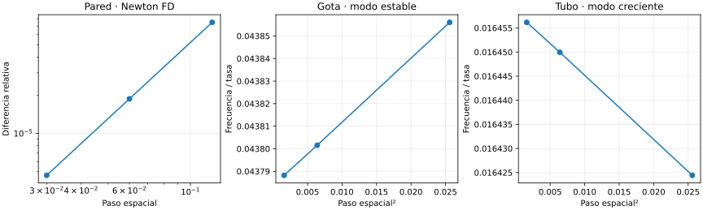

# Entrega 01 · Reproducción independiente de M2 4.1

**Pregunta:** ¿se reproducen los resultados fundamentales y está identificada la evidencia que respalda cada afirmación?

**Puerta:** E00 COMPLETADA. Se habilita E01. No hay aceptación de dispositivos.

Se inventariaron los 221 archivos del proyecto y los 8 del plan, con lectura estructural de JSON, CSV, Python y SVG. Los 220 y 7 hashes respectivos coinciden. La revisión se centra científicamente en las fuentes vigentes 13–22 y sus operadores; los capítulos y contratos anteriores conservan su alcance condicionado. El inventario no equivale a certificar cada derivación histórica ni a inspección visual de cada glifo.

## Métodos y reproducción

Se ejecutaron los 19 pasos originales en una copia aislada con Python 3.12.14, NumPy 2.3.5, SciPy 1.17.0 y Matplotlib 3.10.8. Los 18 CSV son numéricamente idénticos. Se conservan registros de cada paso y sus tiempos.

`herramientas/reproduccion_independiente.py` no importa código del proyecto. Recalcula E,Q mediante cuadratura Gauss sobre interpolantes Hermite de los perfiles incluidos. Usa el potencial completado al cuadrado. Resuelve la pared mediante Newton de diferencias finitas, fijando sólo la traslación y publicando el residuo de la ecuación reemplazada. Calcula ambos modos mediante elementos finitos P1 con masa consistente en las amplitudes radiales originales, frente a diferencias/volúmenes finitos del código histórico. Los fondos de los espectros se comparten como datos, no como operadores independientes.

## Resultados y errores

| Observable | Diferencia relativa | Criterio previo |
|---|---:|---:|
| sphere_E_relative | 6.89e-14 | 1e-08 |
| sphere_Q_relative | 1.28e-13 | 1e-08 |
| tube_E_relative | 2.48e-13 | 1e-08 |
| tube_Q_relative | 1.76e-13 | 1e-08 |
| wall_relative | 5.29e-10 | 2e-07 |
| wall_domain_relative | 4.66e-08 | 2e-07 |
| sphere_mode_relative | 5.62e-07 | 2e-05 |
| tube_growth_relative | 9.02e-07 | 2e-05 |

Las secuencias espectrales muestran segundo orden y estabilidad al ampliar la caja. Los límites se fijaron en el script antes de ejecutarlo. La comparación espectral utiliza extrapolación en h²; son estimaciones, no cotas certificadas. E,Q no verifican independientemente la existencia del perfil: verifican su contabilidad.

## Negativos y límites

Se reproduce el modo creciente tubular; no se salva Canal. Se identifica la discrepancia covariante de X, corriente y tensor en 20.3: E01 debe corregirla, preservando el original. No se ha resuelto preparación, contacto ni estabilidad orbital. Las simulaciones no son experimentos.

## Archivos y continuidad

Se añaden estado y progreso, enmiendas, versiones, linaje de afirmaciones, script independiente, registros, datos de pared y figura. Se conserva el ZIP 4.1 íntegro y el plan original. El checkpoint CP01 es autocontenido; la física de referencia no se ha cambiado.

**Siguiente acción:** E01, acción y convenciones, coordenadas fundamentales independientes y regresiones afectadas. E00 sólo se reabre por contradicción, error o cambio de dependencia que invalide su puerta.
