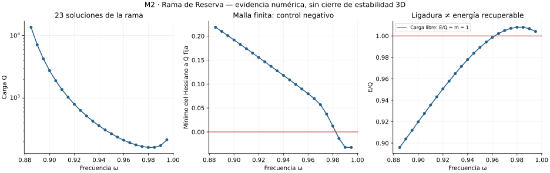
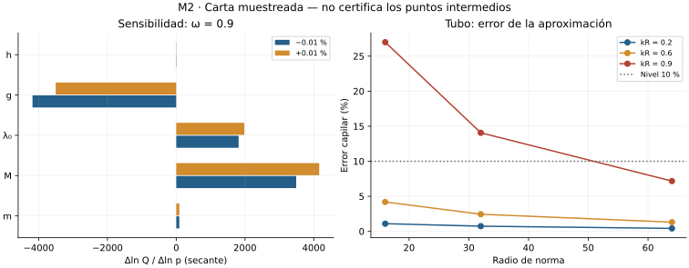

# Entrega 03 · Recuperación y verificación tras CP02

**Pregunta:** ¿qué parte de Canal queda excluida y qué resultados pendientes de validez y Reserva se pueden conservar como evidencia?

**Decisión:** C0 COMPLETADA; E02, E03 y RES0 PARCIALES. E00/E01 permanecen cerradas y no se han repetido. No hay dispositivo completo, agotamiento de M2 ni autorización científica para M3.

## Recuperación y métodos

El estado general aún señalaba CP02, aunque las campañas posteriores ya habían dejado resultados. Se conservó esa instantánea y se registraron sus hashes en `trazabilidad/reanudacion_CP02/`. La recuperación del punto M+0.01 % había terminado. Se verificó su resultado guardado, sin volver a ejecutar la campaña. El último script de preparación todavía no tenía resultados y se identifica como siguiente cálculo.

Para Canal se revisó la extensión de la dilatación transversal y el complemento de Schur a arrollamiento rígido y fondos positivos periódicos. Es una derivación propia condicionada, sin revisión científica externa. El contrato y las 22 comprobaciones se conservan literalmente por candidato. Los perfiles nodales, fases axiales distintas, geometrías finitas y control real permanecen abiertos; no se confunde una familia refutada con una etapa entera agotada.

Para E02 se completaron las diez variaciones fundamentales y 18 puntos capilares. Para E03/RES0 se conservaron 23 perfiles, espectros y refinamientos. La verificación nueva integra los perfiles crudos, contrasta primera ley, mallas, controles negativos y preservación de datos. Sus diez comprobaciones pasan.

## Resultados, errores y negativos

| Resultado | Evidencia y alcance |
|---|---|
| Onda larga tubular | σ/k≈0.1505389; discrepancia 3.54×10⁻⁵ frente a susceptibilidad. Sigue inestable |
| Sensibilidad independiente | Diez puntos; error de refinamiento E,Q≤2.98×10⁻¹¹. Sensibilidades muy grandes en M,g,λ₀; sin región continua certificada |
| Capilaridad | Error tubular hasta 26.99 % en la muestra kR=0.9, radio de norma 16. Se conserva el rechazo |
| Rama de Reserva | 23 perfiles; nueva cuadratura E,Q≤2.25×10⁻¹³ relativa; primera ley≤1.46×10⁻⁶ absoluta |
| Control de estabilidad | Hessiano restringido negativo desde la muestra 0.985; giro estimado cerca de 0.9823, sin certificación |
| Energía útil | Liberar toda la carga de referencia como ondas libres exige al menos 220.11501 unidades externas |
| Dominio cuántico | Faltan operadores de renormalización; no se inventa corte ni extensión |

Los intentos fallidos por exceso de nodos y la ejecución interrumpida se conservan con sus motivos originales. No prueban inexistencia. Los JSON `passed` describen criterios de cada campaña, no la puerta completa de la etapa.

## Puertas y continuidad

C0 cumple su contrato y matriz de clases. E02 necesita completar la carta de reducciones, error temporal y región conjunta. E03 necesita cobertura espectral y dinámica no lineal suficiente; RES0 necesita cerrar esa estabilidad y la accesibilidad energética. Las etapas funcionales generales siguen bloqueadas por esas puertas. Se permite un ensayo exploratorio radial, etiquetado como tal, desde un paquete cargado previamente existente; no supera E04/RES1.

Cambios: capítulos 24–25; carta JSON; matriz P04; scripts y datos de las tres campañas; verificador CP03; figuras; evidencia, continuidad, versiones y este informe. El plan original y los resultados negativos anteriores permanecen intactos.

**Siguiente acción exacta:** ejecutar `captura_radial_m2.py` para el paquete de anchura 8, resolver balances y refinamiento antes de estudiar perturbaciones del dato inicial. Guardar estados reiniciables. Mantener E04/RES1 incompletas incluso si la relajación radial funciona.
